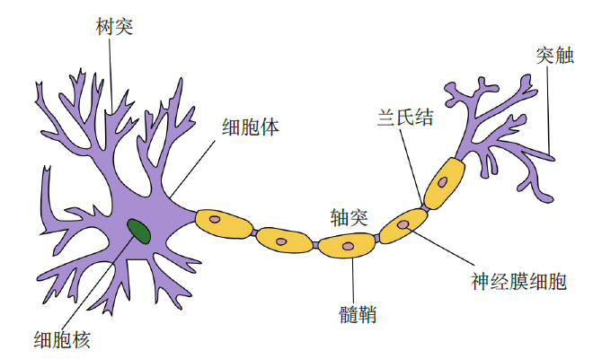
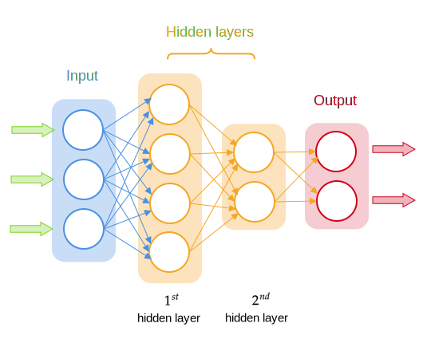
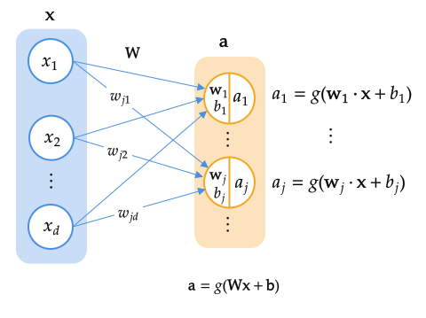
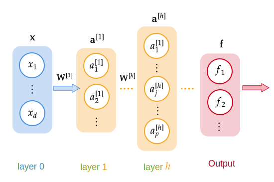
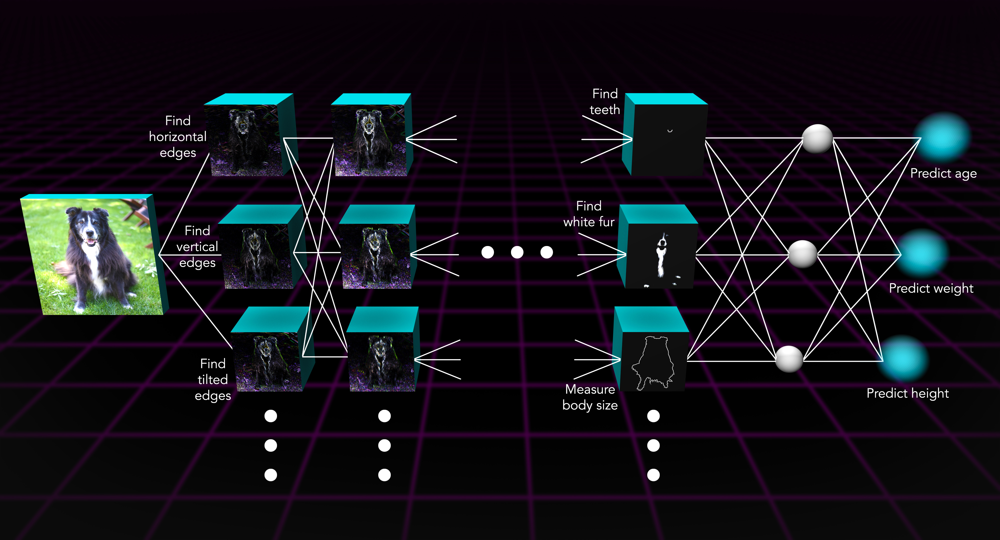
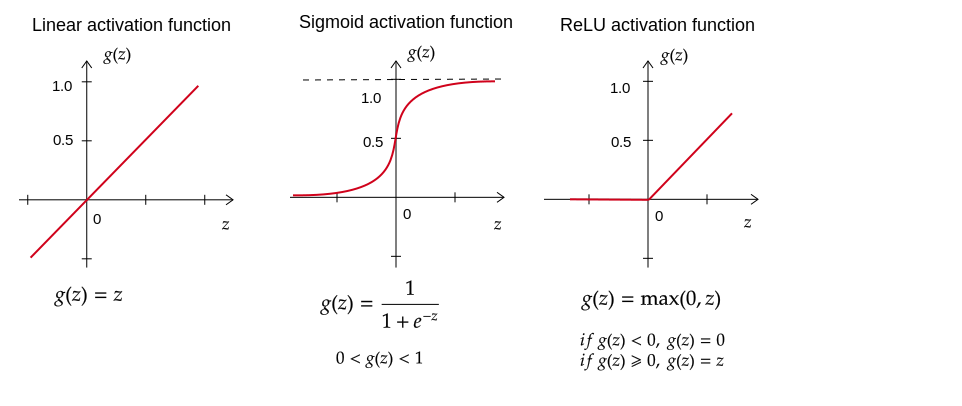
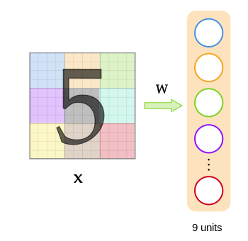
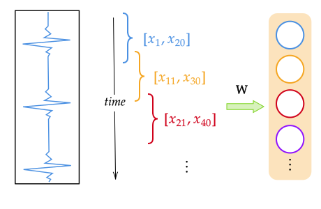

# 神经网络

ANN简介
人工神经网络（Artificial Neural Networks, ANN）是模仿生物神经网络（如大脑）的结构和功能的数学模型或计算模型，用于估计或逼近那些无法用传统算法精确表示的复杂函数关系。ANN是由大量互联互通的人工神经元组成，通过学习过程调整神经元间的连接权重，以实现特定的信号处理或行为模式。

应用场景
ANN在多个领域展现出强大的应用潜力和实际效果。其主要应用场景包括：

图像处理与计算机视觉：如图像识别、物体检测、图像分割等。
自然语言处理：包括语言翻译、情感分析、文本生成等。
语音识别与生成：例如智能助手中的语音交互系统。
金融领域：如股市预测、风险评估、算法交易等。
医疗诊断：辅助诊断、病理图像分析、基因数据分析等。
游戏和娱乐：游戏AI的开发、内容生成等。
自动驾驶技术：车辆环境感知、决策制定等。
ANN的广泛应用归功于其强大的学习能力和适应性，能够处理和分析大量复杂的数据，从而在上述领域发挥重要作用。
Neural Networks

inference (prediction)

神经网络：刚开始是尝试模拟人脑的算法。广泛应用于语音识别、图像识别、NLP等

## Neural Networks

之前，我们用 $f(x)$ 作为算法的输出，为了建立一个神经网络，我们稍微改变下术语，用 $a$ 表示算法的输出a(activation) 为神经科学术语，表示激活的意思。单个神经元(Neuron)所作的是先接收数字 (input) ，带入激活函数，然后输出一个或几个数字 $a$ 。逻辑回归算法可以看作单个神经元简化模型。

要建立一个神经网络，只需要把一堆神经元连接起来，或者把他们放在一起。

- 组合在一起的神经元称为一层 (layer)。一层神经元输入相同或相似的特征，然后一起输出数字
- 最后一层神经元的输出就是整个神经网络的预测输出，称为输出层 (output layer)。中间层称为隐藏层(hidden layer)
- 神经元向下游其他神经元的输出称为激活 (activations)，输出值称为激活值 (activation value)
- 多层神经网络也称为多层感知器 (MLP, Multilayer Perceptron)

## Neural network model

Neuron with Sigmoid activation
$$
 f_{\mathbf{w},b}(x^{(i)}) = g(\mathbf{w}x^{(i)} + b)
$$
where 
$$
g(x) = sigmoid(x)
$$
符号约定：

假设第 $h$ 层有 $p$ 个神经元
$$
a_j^{[h]}=g(\mathbf w_j^{[h]}\cdot \mathbf a^{[h-1]}+b_j^{[h]})
$$
其中权重向量 $\mathbf w_j^{[h]}=(w_{j1}^{[h]},w_{j2}^{[h]},\cdots,w_{jp}^{[h]})^T$

矩阵方程写为
$$
\mathbf a^{[h]}=g(\mathbf W^{[h]}\mathbf a^{[h-1]}+\mathbf b^{[h]})
$$
其中 $\mathbf W^{[h]}=(\mathbf w_1^{[h]},\mathbf w_2^{[h]},\cdots,\mathbf w_p^{[h]})^T$

## Inference: making predictions

- 前向传播算法(forward propagation)：按照神经网络从左到右前进的方向计算。

## artificial general intelligence (AGI)

AI

- ANI (artificial narrow intelligence, 弱人工智能) E.g., smart speaker, self-driving car, web search, AI in farming and factories
- AGI (artificial general intelligence, 强人工智能) Do anything a human can do

## loss function

损失函数：BinaryCrossentropy 二元分类交叉熵 （和逻辑损失函数一样）
$$
\text{loss}(f(\mathbf{x}), y)=-y\log f(\mathbf{x})-(1-y)\log(1-f(\mathbf{x}))
$$
Cost Function
$$
J(\mathbf{W},\mathbf{B}) = \frac{1}{m} \sum\limits_{i = 1}^m\text{loss}(f(\mathbf{x}^{(i)}), y^{(i)})
$$

# Activation Functions

## Activation Functions

常见的激活函数

- Linear activation function: $g(z)=z$
- Sigmoid: $g(z)=\cfrac{1}{1+e^{-z}}$
- ReLU (Rectified Linear Unit): $g(z)=\max(0,z)$

## Choosing activation functions

Output Layer: 激活函数的选择通常取决于标签 y 的取值

- Binary classification: Sigmoid y=0/1
- Regression: Linear activation function 
- Regression: ReLU y>=0

Hidden Layer: ReLU 激活函数是目前许多从业者训练神经网络中最常见的选择，而很少使用 Sigmoid。原因是 ReLU收敛的更快。

还有其他的激活函数，譬如 tanh 活化函数，LeakyReLU激活函数、swish激活函数

## Why do we need activation functions?

假设对所有隐藏层使用线性激活函数，对输出层使用sigmoid 函数。由于一个线性函数的线性函数本身也是一个线性函，隐藏层可以化简为 $\mathbf{w\cdot x}+b$。所以多层神经网络并不能提升计算复杂特征的能力，也不能学习任何比线性函数更复杂的东西，多层神经网络等价于逻辑回归。所以有个常见的经验法则是，不要在隐藏层中使用线性激活函数，建议使用 ReLU 激活函数。

# 自编码器

自编码器（Autoencoder）是一类用于无监督学习的神经网络，主要用于降维、特征提取和数据生成。自编码器通过将输入数据编码为低维表示，然后再解码为原始数据，来学习数据的有效表示。本文将详细介绍自编码器的原理、数学基础、常见变种及其实现步骤，并通过代码示例展示其具体实现。

算法原理

自编码器由两部分组成：编码器(encoder)和解码器(decoder)

编码器：将输入数据 $x$ 转换为低维表示 $z$
$$
z=f(x;W_e,b_e)
$$
其中 $f$ 是编码器的非线性映射函数，$W_e,b_e$ 是编码器的权重和偏置

解码器：将低维表示 $z$ 转换为原始数据 $\hat x$
$$
\hat x=g(z;W_d,b_d)
$$
其中 $g$ 是编码器的非线性映射函数，$W_d,b_d$ 是编码器的权重和偏置

自编码器的目标是最小化输入数据和重建数据之间的重建误差，通常使用均方误差作为损失函数
$$
L(x,\hat x)=\|x-\hat x\|^2
$$
常见变种
去噪自编码器（Denoising Autoencoder, DAE）
在输入数据上添加噪声，通过去噪训练自编码器，使其更具鲁棒性。

稀疏自编码器（Sparse Autoencoder, SAE）
在编码器中添加稀疏性约束，鼓励模型学习稀疏表示。

变分自编码器（Variational Autoencoder, VAE）
基于概率模型的自编码器，通过学习数据的潜在分布生成新数据。

2.6.4 实现步骤
数据准备：加载并标准化数据。
模型构建：定义编码器和解码器的结构。
模型训练：使用反向传播算法最小化重建误差，训练自编码器。
数据重建：使用训练好的自编码器对数据进行重建和降维。
# Convolutional Neural Networks

之前接触的都是全连接层(dense layer)，其中这一层是前一层每个激活值的函数。

卷积层(Convolutional Layer)：每个神经元仅能看到前一层的部分激活值。why?

- 能加快计算速度
- 它需要的训练数据更少，也更不容易过拟合

心电图(EKG)实例

