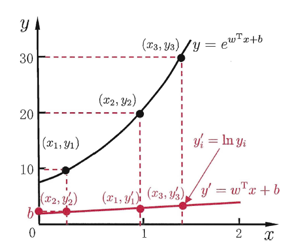
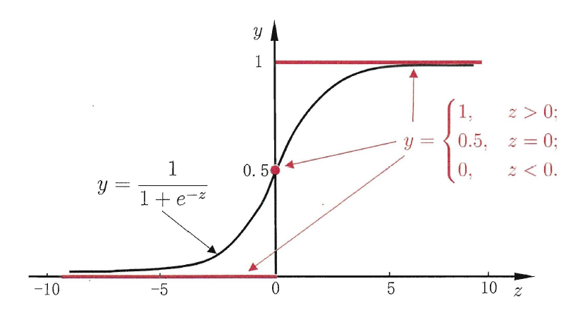
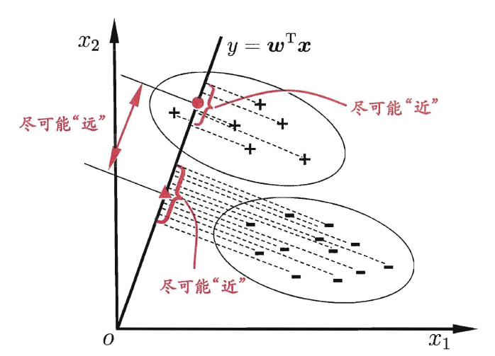

# 绪论

变量可归结为名义型、有序型或连续型变量。

根据训练数据是否拥有标记信息，学习任务可大致划分为两大类"监督学习" (supervised learning) 和"无监督学习" (unsupervised learning) ，分类和回归是前者的代表，而聚类则是后者的代表.

需注意的是，机器学习的目标是使学得的模型能很好地适用于"新样本"，.学得模型适用于
新样本的能力，称为"泛化" (generalization) 能力

通常假设样本空间中全
体样本服从A个未知"分布" (distribution) Ð ， 我们获得的每个样本都是独立
地从这个分布上采样获得的，即"独立同分布" (independent and identically
distributed，简称i.i.d.).

"奥卡姆剃刀" (Occam's razor)是一种常用的、自然科学
研究中最基本的原则，即"若有多个假设与观察一致，则选最简单的那个

机器学习三要素：

- 模型：根据具体问题，确定假设空间
- 策略：根据评价标准，确定选取最优模型的策略（通常会产出一个**代价函数**）
- 优化算法：求解代价函数，确定最优模型

损失函数(loss function)或代价函数(cost function)

常用优化算法《统计学习方法-6.3》：直接求解法（最小二乘法）、迭代求解法（梯度下降法，牛顿法） 

正则化《深度学习-7》

分类：

- 监督学习
- 无监督学习
- 半监督学习

假设空间

版本空间

没有免费午餐定理 No Free Lunch Theorem，简称NFL

指示函数 $\mathbb I(\text{condition})=\begin{cases}1 & \text{if true}\\ 0 & \text{if false}\end{cases}$

# 模型评估与选择

## 经验误差与过拟合

我们把学习器的实际预测输出与样本的真实输出之间的差异称为"误差" (error) ,
学习器在训练集上的误差称为"训练误差" (training error)或"经验误
差" (empirical error) ，在新样本上的误差称为"泛化误差" (generalization
error). 显然，我们希望得到泛化误差小的学习器.然而，我们事先并不知道新
样本是什么样，实际能做的是努力使经验误差最小化.

这种现象在机器学习中称为
"过拟合" (overfitting). 与"过拟合"相对的是"欠拟合" (underfitting) ，

有多种因素可能导致过拟合，其中最常见的情况是由于学习能力过于强大，
以至于把训练样本所包含的不太一般的特性都学到了，而欠拟合则通常是由
于学习能力低下而造成的

经验误差vs泛化误差

过拟合vs欠拟合

## 评估方法

训练数据分层：

- 训练集：用来训练模型，模型的迭代优化
- 测试集：不参与训练流程，监测模型效果
- 验证集：调整超参数，优化模型

留出法

交叉验证法

自助法

## 性能度量

### 分类问题

**混淆矩阵**(Confusion Matrix)也称误差矩阵，是表示分类结果精度评价的一种标准格式。矩阵的每一行代表实例的预测类别，每一列代笔实例的真实类别。

-   TP（实际为正预测为正）
-   FP（实际为负但预测为正）
-   TN（实际为负预测为负）
-   FN（实际为正但预测为负）

**准确率**：是最常用的分类性能指标

$\text{Accuracy}=\Large \frac{TP+TN}{TP+FP+TN+FN}$

**精确率**（查准率）：

$\text{Precision}=\Large \frac{TP}{TP+FP}$

**召回率**（查全率）：正确预测的正例数/应际正例总数
$\text{Recall(Sensitivity)}=\Large \frac{TP}{TP+TN}$
$\text{Specificity}=\Large \frac{TN}{FP+TN}$

**F1-score**：查准率和查全率的**调和平均数**（harinonic mean）

$\cfrac{1}{F_1}=\cfrac{1}{2}(\cfrac{1}{\text{Precision}}+\cfrac{1}{\text{Recall}})$

$F_1=\cfrac{2\times\text{Recall}\times\text{Precision}}{\text{Recall}+\text{Precision}}$

**F~β~-score**：查准率和查全率的加权**调和平均数**。通常，对于不同的问题，查准率查全率的侧重不同。比如，在商品推荐系统中，为了尽可能少打扰用户，更希望推荐内容确是用户感兴趣的，此时查准率更重要；而在逃犯信息检索系统中，更希望尽可能少漏掉逃犯，此时查全率更重要。

$\cfrac{1}{F_β}=\cfrac{1}{1+β^2}(\cfrac{1}{\text{Precision}}+\cfrac{β^2}{\text{Recall}})$

$F_β=\cfrac{(1+β^2)\times\text{Recall}\times\text{Precision}}{\text{Recall}+β^2 \times\text{Precision}}$

其中 β>0 度量了查全率对查准率的相对重要性，β=1 时退化为标准的F1； β> 1 时查全率有更大影响；β < 1 时查准率有更大影响。

与算术平均数（$\cfrac{1}{2}(\text{Recall} + \text{Precision})$）和几何平均数 $\sqrt[]{\text{Recall} \times \text{Precision}}$ 相比，调和平均数更重视较小值，所以精确率和召回率接近时，F值最大。很多推荐系统的评测指标就是用F值的。

**ROC曲线** （受试者工作特征曲线，Receiver Operating Characteristic）

二分类问题，对于正负例的判定通常会有一个阈值，ROC曲线描绘的是不同的阈值时，TPR(True Positive Rate)随着FPR(False Positive Rate)的变化。
纵轴：$TPR=\Large \frac{TP}{TP+FN} \normalsize =\text{Recall}$
横轴：$FPR=\Large \frac{FP}{FP+TN}$

总之，ROC曲线越靠近左上角，该分类器的性能越好。而且一般来说，如果ROC是光滑的，那么基本可以判断没有太大的过拟合。

**AUC**（Area Under Curve）：被定义为ROC曲线下的面积，AUC越大的分类器，性能越好。

$AUC=\displaystyle \frac{1}{2}\sum_{i=1}^{m-1}(x_{i+1}-x_i)(y_i+y_{i+1})$

**PR曲线**：查准率和查全率（召回率）之间的关系。查准率和查全率是一对矛盾的度量，一般来说，查准率高时，查全率往往偏低，查全率高时，查准率往往偏低。

如果一个学习器的P-R曲线被另一个学习器的P-R曲线完全包住，则可断言后者的性能优于前者，当然我们可以根据曲线下方的面积大小来进行比较，但更常用的是**平衡点**（Break-Even Point, BEP）。平衡点是查准率=查全率时的取值，如果这个值较大，则说明学习器的性能较好。

**KS曲线**（洛伦兹曲线，Kolmogorov-Smirnov）
KS曲线和ROC曲线都用到了TPR，FPR。KS曲线是把TPR和FPR都作为纵坐标，而样本数作为横坐标。
TPR和FPR曲线分隔最开的位置就是最好的阈值，最大间隔距离就是KS值。KS值可以反应模型的最优区分效果，一般$KS>0.2$可认为模型有比较好的预测准确性。

$KS=\max\{TPR-FPR\}$

- $KS<0.2$ ：模型无鉴别能力
- $0.2 ⩽ KS<0.4$ ：模型勉强接受
- $0.4 ⩽ KS<0.6$ ：模型具有区别能力
- $0.6 ⩽ KS<0.75$ ：模型有非常好的区别能力
- $KS⩾0.75$ ：此模型异常

**Gain曲线**（增益图，Gain Chart）是描述整体精准度的指标。

$\text{Gain}=\Large \frac{TP}{TP+FP}$

**Lift曲线**（提升图，Lift Chart）衡量的是，与不利用模型相比，模型的预测能力“变好”了多少，lift(提升指数)越大，模型的运行效果越好。

$\text{Lift}=\Large\frac{\frac{TP}{TP+FP}}{\frac{P}{P+N}}=\frac{\text{Gain}}{PR}$

**模型稳定度指标PSI**（Population Stability Index）反映了**验证样本**在各分数段的分布与**建模样本**分布的稳定性。可衡量测试样本及模型开发样本评分的的分布差异，为最常见的模型稳定度评估指标。

$PSI=\sum(f_{dev}^i-f_{valid}^i)*\ln(f_{dev}^i/f_{valid}^i)$

- 若 $PSI<0.1$ 样本分布有微小变化，模型基本可以不做调整
- 若 $0.1 ⩽ PSI ⩽ 0.2$ ，样本分布有变化，根据实际情况调整评分切点或调整模型
- 若 $PSI>0.2$ 样本分布有显著变化，必须调整模型

### 回归问题

**可解释方差**（Explained Variance）：衡量所有预测值$\hat y_i$和样本值$y_i$之间的差的方差与样本本身的方差的相近程度。最大值为1，数值越大代表模型预测结果越好。

$\text{Explained Var}=1-\cfrac{\text{var}(y-\hat y)}{\text{var}(y)}$

**平均绝对误差**（Mean Absolute Error, MAE）：

$\displaystyle MSE=\frac{1}{m}\sum_{i=1}^{m}|y_i-\hat y_i|$

**均方误差**（Mean Squared Error, MSE）：衡量的是样本与模型预测值偏离程度，数值越小代表模型拟合效果越好。

$\displaystyle MSE=\frac{1}{m}\sum_{i=1}^{m}(y_i-\hat y_i)^2$

**均方根误差**（Root Mean Squard Error, RMSE）：

$RMSE=\sqrt{MSE}$

**决定系数**（R-Square）：其取值范围为$[0,1]$，一般来说，R-Square 越大，表示模型拟合效果越好。R-Square 反映的是大概有多准，因为，随着样本数量的增加，R-Square必然增加，无法真正定量说明准确程度，只能大概定量。

$R^2=1-\cfrac{\sum(y_i-\hat y_i)^2}{\sum(y_i-\bar y_i)^2}=1-\cfrac{MSE(y,\hat y)}{\text{var}(y)/m}$

**调整R2**（Adjusted R-Square）：

$\text{Adjusted }R^2=1-\cfrac{(1-R^2)(n-1)}{n-p-1}$

其中，n 是样本数量，p 是特征数量。调整R2抵消样本数量对 R-Square的影响，做到了真正的 0~1，越大越好。

## 比较检验

## 偏差与方差

# 线性模型

## 基本形式

对有序（order）分类变量，可通过连续化将其转化为连续值，对于$k$分类变量可转化为 $k$ 维0-1向量

## 多元线性回归

在预测任务中，给定样本集 $D=\{(\mathbf x_1,y_1),(\mathbf x_2,y_2),\cdots,(\mathbf x_m,y_m)\}$，其中$\mathbf x_i=(x_{i1},x_{i2},\cdots,x_{id})$ 为第 $i$ 个样本的特征向量，$y_i\in \R$ 是目标变量。

**模型假设**：拟合多元线性回归模型（multivariate linear regression）
$$
\hat y=w_0+w_1x_1+w_2x_2+\cdots+w_dx_d = \mathbf{w}^T\mathbf{\hat x}
$$
其中 $\mathbf{\hat x}=(1,x_1,x_2,\cdots,x_d)^T$， 特征向量权重 $\mathbf{w}=(w_0,w_1,\cdots,w_d)^T, w_0$ 为偏置项(bias) 。求得 $\mathbf{w}=(w_0,w_1,\cdots,w_d)^T$ 后，模型就得以确定。$\mathbf w$ 可以直观表达了各属性在预测中的重要性，因此线性模型有很好的可解释性(comprehensibility) 。

对于每个样本，真实值 $y_i$ 和预测值 $\hat y_i$ 间存在误差 $e_i=y_i-\hat y_i$ ，矩阵形式为
$$
\mathbf e =\mathbf y-\mathbf{\hat y}=\mathbf{y- Xw}
$$
其中 
$$
\mathbf{X}=\begin{pmatrix}
1&x_{11}&x_{12}&\cdots&x_{1d} \\
1&x_{21}&x_{22}&\cdots&x_{2d} \\
\vdots&\vdots&\ddots&\vdots \\
1&x_{m1}&x_{m2}&\cdots&x_{md} \\
\end{pmatrix},
\quad \mathbf{w}=(w_0,w_1,\cdots,w_d)^T
$$
**假设条件**：误差满足Gauss-Markov假设

1. 误差满足高斯分布 $e_i∼N(0, σ^2)$
2. 误差同分布 $\mathrm{var}(e_i)= σ^2$ ,
3. 误差独立性 $\mathrm{cov}( e_i ,e_j )=0 \quad (i  ≠ j)$ 

**最小二乘法**：(least square method, LSM) 使用均方误差定义代价函数
$$
J(\mathbf{w})=\cfrac{1}{m}\|\mathbf{y-Xw}\|_2^2=\cfrac{1}{m}(\mathbf{y-Xw})^T(\mathbf{y-Xw})
$$
$$
\mathbf w^*=\argmin_{\substack{\mathbf w}}(\mathbf{y-Xw})^T(\mathbf{y-Xw})
$$
**极大似然估计**：(maximum likelihood estimate, MLE) 使得观测样本出现的概率最大，也即使得误差联合概率（似然函数）取得最大值。

由于误差满足高斯分布
$$
P(e_i)=\cfrac{1}{\sqrt{2\pi}\sigma}\exp(-\frac{e_i^2}{2\sigma^2})=\cfrac{1}{\sqrt{2\pi}\sigma}\exp(-\frac{(y_i-\hat y_i)^2}{2\sigma^2})
$$
为求解方便，取对数似然函数
$$
\begin{aligned}
\displaystyle\ln L(\mathbf w) & =\ln\prod_{i=1}^{m} P(e_i)=\sum_{i=1}^m\ln P(e_i) \\
&=\sum_{i=1}^{m}\ln\cfrac{1}{\sqrt{2\pi}\sigma}+\sum_{i=1}^{m}\ln\exp(-\frac{(y_i-\hat y_i)^2}{2\sigma^2}) \\
&=\sum_{i=1}^{m}\ln\cfrac{1}{\sqrt{2\pi}\sigma}-\frac{1}{2\sigma^2}(\mathbf{y-Xw})^T(\mathbf{y-Xw})
\end{aligned}
$$
因此可定义代价函数
$$
J(\mathbf w)=\arg\max\ln L(\mathbf w)=\arg\min(\mathbf{y-Xw})^T(\mathbf{y-Xw})
$$
由此可见，最后得到的代价函数与最小二乘法一致。

**参数估计** ：(parame estimation) 使用凸优化方法求解代价函数，即
$$
\nabla J(\mathbf w)=\frac{\partial J}{\partial\mathbf x}=2\mathbf X^T(\mathbf{Xw-y})=\mathbf 0
$$
且 Hessian 矩阵 $\nabla^2 J(\mathbf w)$ 正定。可求得最优解
$$
\mathbf w^*=(\mathbf X^T\mathbf X)^{-1}\mathbf X^T\mathbf y
$$
最终学得线性回归模型为
$$
\hat y=\mathbf{\hat x}^T(\mathbf X^T\mathbf X)^{-1}\mathbf X^T\mathbf y
$$
然而，现实任务中 $\mathbf X^T\mathbf X$ 往往不是满秩矩阵。例如在许多任务中我们会遇到大量的变量，其数目甚至超过样例数，导致 $\mathbf X$ 的列数多于行数， $\mathbf X^T\mathbf X$ 显然不满秩。此时可解出多个解， 它们都能使均方误差最小化。选择哪一个解作为输出，将由学习算法的归纳偏好决定， 常见的做法是引入正则化(regularization) 项。

## 广义线性回归

许多功能更为强大的非线性模型(nonlinear model)可通过引入层级结构或高维映射转化为线性模型。例如，对数线性回归 (log-linear regression)
$$
\ln \hat y=\mathbf{w}^T\mathbf{\hat x}
$$

更一般地，考虑单调可微函数 $z=g(y)$，令 
$$
y=g^{-1}(\mathbf{w}^T\mathbf{\hat x})
$$
这样得到的模型称为广义线性模型 (generalized linear model)，其中函数 $g(z) $ 称为联系函数 (link function)。广义线性模型的参数估计常通过加权最小二乘法或极大似然估计。

## 逻辑回归

$$
\hat y=g(\mathbf{w}^T\mathbf{x}+b),\text{where }g(z)=\cfrac{1}{1+e^{-z}} \\
\text{Given }\{(\mathbf x_1,y_1),(\mathbf x_2,y_2),\cdots,(\mathbf x_m,y_m)\},\text{want }\hat y^{(i)}\approx y^{(i)}
$$

假设给定二分类样本集 $D=\{(\mathbf x_1,y_1),(\mathbf x_2,y_2),\cdots,(\mathbf x_m,y_m)\}$，其中$\mathbf x_i=(x_{i1},x_{i2},\cdots,x_{id})$ 为第 $i$ 个样本的特征向量，输出标记 $y_i\in \{0,1\}$ 。

由于线性回归模型产生的预测值 $z=\mathbf{w}^T\mathbf{\hat x} \in\R$ ，需要引入 Sigmod 函数将输入值映射到 $[0,1]$ 来实现分类功能。对数几率函数 (logistic function) 即是一种 Sigmoid 函数
$$
y=\cfrac{1}{1+e^{-z}}
$$

即若预测值 $z$ 大于零就判为正例，小于零则判为反例，预测值为临界值零则可任意判别。

**模型假设**：拟合逻辑回归模型 (logistic regression，logit regression)
$$
\hat y=\cfrac{1}{1+e^{-\mathbf{w}^T\mathbf{\hat x}}}
$$
其中 $\mathbf{\hat x}=(1,x_1,x_2,\cdots,x_d)^T$，特征向量权重 $\mathbf{w}=(w_0,w_1,\cdots,w_d)^T, w_0$ 为偏置项(bias) 。

输出值可视为正样本的概率 $P_1(y_i=1)=\hat y$，则负样本的概率 $P_0(y_i=0)=1-\hat y$。可联合写为
$$
P(y_i)=P_1^{y_i}P_0^{1-y_i}
$$
**极大似然估计**：(maximum likelihood estimate, MLE) 使得观测样本出现的概率最大，也即使得样本联合概率（似然函数）取得最大值。为求解方便，取对数似然函数
$$
\ln L(\mathbf w)=\ln\prod_{i=1}^{m} P(y_i)=\sum_{i=1}^m(y_i\mathbf w^T\mathbf{\hat x}_i-\ln(1+e^{\mathbf w^T\mathbf{\hat x}_i}))
$$
因此代价函数
$$
J(\mathbf w)=\arg\min\sum_{i=1}^m(-y_i\mathbf w^T\mathbf{\hat x}_i+\ln(1+e^{\mathbf w^T\mathbf{\hat x}_i}))
$$
**最大期望算法**：（Expectation-Maximization algorithm, EM）与真实分布最接近的模拟分布即为最优分布，因此可以通过最小化交叉熵来求出最优分布。

真实分布可写为 
$$
P(y_i)=1
$$
模拟分布可写为 
$$
Q(y_i)=P_1^{y_i}P_0^{1-y_i}
$$
交叉熵为
$$
H(P,Q)=-\sum_{i=1}^m P(y_i)\ln Q(y_i)=\sum_{i=1}^m(-y_i\mathbf w^T\mathbf{\hat x}_i+\ln(1+e^{\mathbf w^T\mathbf{\hat x}_i}))
$$
因此代价函数
$$
J(\mathbf w)=\arg\min\sum_{i=1}^m(-y_i\mathbf w^T\mathbf{\hat x}_i+\ln(1+e^{\mathbf w^T\mathbf{\hat x}_i}))
$$
由此可见，与极大似然估计的代价函数相同。

《统计学习方法》第6章

《深度学习》5.5

**优化算法**：常用梯度下降法 (gradient descent method)、拟牛顿法 (quasi Newton method) 估计参数

## 线性判别分析

假设给定二分类样本集 $D=\{(\mathbf x_1,y_1),(\mathbf x_2,y_2),\cdots,(\mathbf x_m,y_m)\}$，其中$\mathbf x_i=(x_{i1},x_{i2},\cdots,x_{id})$ 为第 $i$ 个样本的特征向量，输出标记 $y_i\in \{0,1\}$ 。

线性判别分析（Linear Discriminant Analysis，LDA）亦称 Fisher 判别分析。其基本思想是：将训练样本投影到一条直线上，使得同类的样例尽可能近，不同类的样例尽可能远。如图所示：

## 多分类学习

## 数据平衡

# 决策树

## 基本流程

## 核心方法

划分选择：（信息论：自信息，信息熵）、信息增益、信息增益率、基尼系数

剪枝处理：预剪枝、后剪枝

连续与缺失值

《统计-5》《花书-3.13》信息论

## 多变量决策树

# 神经网络

《统计-2》《花书-6》

正则化

# svm

