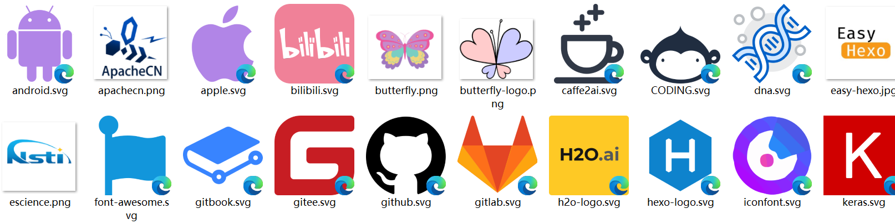

Windows 系统默认是无法查看SVG图形文件的缩略图，很多时候我们想像预览 JPG、PNG 等图片一样批量预览 SVG 文件。Github 上已经有大神开发免费开源的 Windows 资源管理器的扩展模块 [tibold/svg-explorer-extension](https://github.com/tibold/svg-explorer-extension) 以呈现 SVG 缩略图，下载一个适合你电脑的版本，安装完成后，就可以直接查看SVG图形文件的缩略图了。如果安装后缩略图不显示，可以在 Github 查找故障方法。

