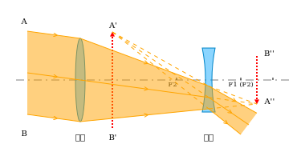
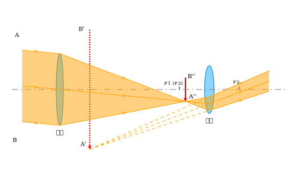
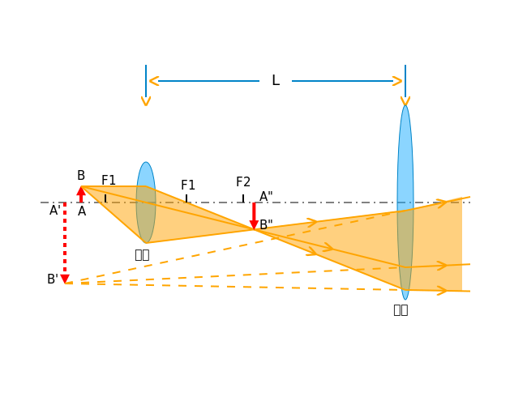

通常把光学分成几何光学、波动光学和量子光学。

# 几何光学

## 几何光学基本定律

## 惠更斯原理

## 费马原理

## 成像

## 薄透镜

## 光学仪器

### 照相机

### 眼睛

### 显微镜

### 望远镜

21-2 Images
21-3 Thin Lenses
21-4 Optical Instruments 光学仪器

伽利略望远镜

物镜焦距较长，目镜为凹透镜，物体在物镜焦平面上成像 $A'B'$，最终成像于无穷远处
$$
\beta=\frac{f_1}{f_2}
$$

开普勒望远镜

物镜焦距较长，目镜焦距较短，物体在物镜焦平面上成像 $A'B'$，最终成像于无穷远处
$$
\beta=\frac{f_1}{f_2}
$$

显微镜原理

物体$AB$置于物镜焦点外靠近焦点时，$u_1\approx f_1$
实像$A'B'$在目镜焦点内靠近焦点处，$u_2\approx f_2$

眼睛靠近目镜的光心观察处于明视距离的$A''B''$

其中人眼焦距 $f_e\approx 25cm$ ，镜筒长度为 $L$

物镜的视角放大率
$$
\beta_1=\frac{\phi_1'}{\phi_1}=\frac{A'B'/L}{AB/L}=\frac{AB/f_1}{AB/L}=\frac{L}{f_1}
$$
目镜的放大率
$$
\beta_2=\frac{\phi_2'}{\phi_2}=\frac{A''B''/f_e}{A'B'/f_e}=\frac{A'B'/f_2}{A'B'/f_e}=\frac{f_e}{f_2}
$$

总放大率
$$
\beta=\beta_1\beta_2=\frac{f_e}{f_1f_2}\cdot L
$$
由于 $f_2\ll L$ ，因此用 $L$ 代表物镜像距，通常$f_1$ 为 mm 数量级，$f_2$ 小于 2cm。

# 波动光学

21-5 Light as a Wave
21-6 Diffraction 衍射
21-7 Diffraction by a Circular Aperture 圆孔衍射
21-8 Diffraction by a Double Slit 双缝衍射
21-9 Diffraction Gratings 光栅衍射
21-10 X-Ray Diffraction
21-11 Interference 干涉
21-12 Interference from Thin Films 薄膜干涉
21-13 Michelson's Interferometer

## 光程方程

作为电磁波，光波的电场强度满足
$$
\frac{\partial^2 \vec E}{\partial x^2}+\frac{\partial^2 \vec E}{\partial y^2}+\frac{\partial^2 \vec E}{\partial z^2}=\frac{1}{u^2}\frac{\partial^2 \vec E}{\partial t^2}
$$
在无限大的均匀介质中，沿 $z$ 轴传播的平面简谐光波，波函数为
$$
\vec E=\vec E_0\cos[\omega(t-\frac{z}{u})]=\vec E_0\cos(kz-\omega t)
$$
其中 $k=\omega/u=n\omega/c$ 称为波矢。

对于沿任意方向 $\vec e_k$传播的平面简谐光波
$$
\vec E_k=\vec E_0\cos(\vec k\cdot\vec r-\omega t)
$$
波矢
$$
\vec k=\frac{n\omega}{c}\vec e_k=\frac{2\pi n}{\lambda}\vec e_k=n\vec k_0
$$
其中 $\vec k_0=\frac{\omega}{c}\vec e_k$ 为光波在真空中传播的波矢。

光波的相位中与空间有关的部分为
$$
\varphi(\vec r)=\vec k\cdot\vec r=\vec k_0\vec e_k\cdot n\vec r=\vec k_0L(\vec r)
$$
其中 $L(\vec r)$ 称为光程，对于平面光波，沿光波传播方向度量时，相对于原点处光程为
$$
L=ns
$$
其中 $s$ 为光波的路径长度。再利用折射定义，有
$$
L=\frac{c}{u}s=ct
$$
引入光程后，
$$
\vec E=\vec E_0\cos(k_0L(\vec r)-\omega t)
$$
带入光波的电场强度公式中，得
$$
\vec E_0k_0^2\left[(\frac{\partial L}{\partial x})^2+(\frac{\partial L}{\partial y})^2+(\frac{\partial L}{\partial z})^2\right]\cos(k_0L-\omega t) \\
+\vec E_0k_0\left[\frac{\partial^2 L}{\partial x^2}+\frac{\partial^2 L}{\partial y^2}+\frac{\partial^2 L}{\partial z^2}\right]\sin(k_0L-\omega t)\\
=\vec E_0\frac{\omega^2}{u^2}\cos(k_0L-\omega t)
$$
上式两端同时除以 $k_0^2$ ，由波矢的公式知，当 $\lambda\to 0,k_0\to\infty$ ，此时
$$
(\frac{\partial L}{\partial x})^2+(\frac{\partial L}{\partial y})^2+(\frac{\partial L}{\partial z})^2=n^2
$$
简记为
$$
(\nabla L)^2=n^2
$$
上式称为光程方程。

## 光线方程

作为电磁波，对于给定时刻，其振动相位相同的点，所构成的曲面称为波面。由 $\varphi(\vec r)=\vec k_0L(\vec r)$ 知，$L(\vec r)$ 为常数的面即为波面。在各向同性介质中，波面上某点法线方向代表了该点处光的传播方向，一般讲光波波面法线称为光线。

设 $\vec r(s)$ 代表某一光线上任一点 $P(x,y,z)$ 的位矢，它是光线弧长 $s$ 的函数，显然光线传播的方向
$$
\vec e_k=\frac{\mathrm d\vec r}{\mathrm ds}
$$
为光程梯度 $\nabla L$ 的方向。利用光程方程，得光线轨迹方程
$$
n\frac{\mathrm d\vec r}{\mathrm ds}=\nabla L(\vec r)
$$
上式两边对 $s$ 求导，有
$$
\begin{aligned}
\frac{\mathrm d}{\mathrm ds}(n\frac{\mathrm d\vec r}{\mathrm ds})
&=\frac{\mathrm d}{\mathrm ds}(\nabla L) \\
&=\frac{\mathrm d\vec r}{\mathrm ds}\frac{\mathrm d}{\mathrm d\vec r}(\nabla L)\\
&=\frac{\mathrm d\vec r}{\mathrm ds}\cdot\nabla(\nabla L)\\
&=\frac{1}{n}\nabla L\cdot\nabla(\nabla L)\\
&=\frac{1}{2n}\nabla[(\nabla L)^2]
\end{aligned}
$$
带入到光线方程可得
$$
\frac{\mathrm d}{\mathrm ds}(n\frac{\mathrm d\vec r}{\mathrm ds})=\nabla n(\vec r)
$$
上式称为光线方程。

根据平均能流密度公式，$P$ 点光强为
$$
I=\bar S=\sqrt{\frac{\epsilon}{\mu}}\cdot\overline{E^2}
$$
光的干涉和衍射可从电磁理论导得。

# 量子光学

## 热辐射

## 光的波粒二象性

