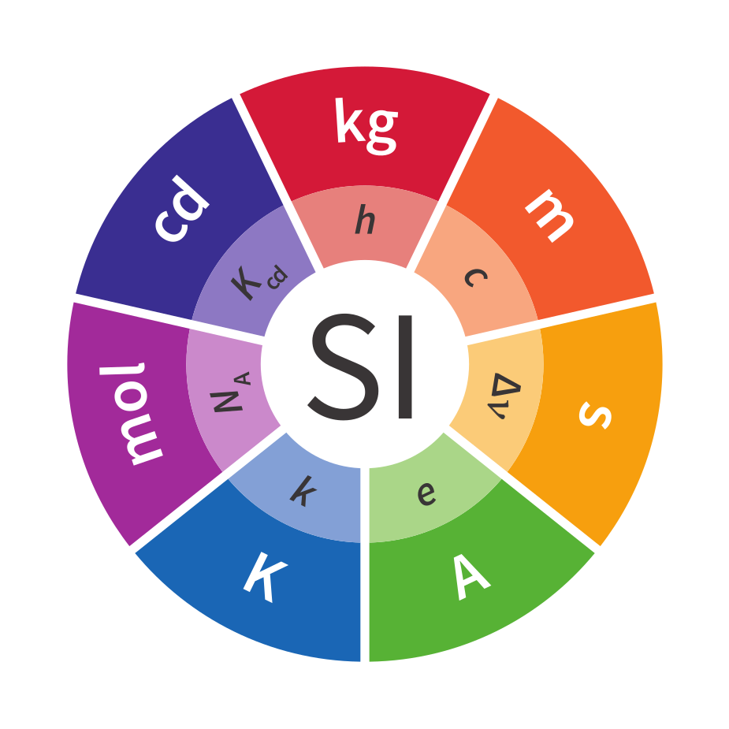

大学物理基础(Essential college physics I)
运动(Motion)
Force and Newton' Laws of Motion
Work and Energy
Kinetic Energy动能
动量和碰撞(Momentum and Collisions)
冲量与动量Impulse and Momentum
振动(Oscillations)
转动(Rotational Motion)
引力(Gravitation)
Potential Energy势能
固体和液体(Solids and Fluids)
Waves and Sound
States of Matter物质的状态
Temperature, Thermal Expansion and Ideal Gases
温度，热膨胀和理想气体
Heat
Heat Transfer热传递
热力学定律(The Laws of Thermodynamics)

