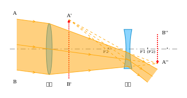
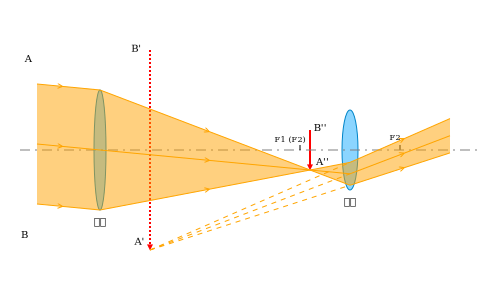
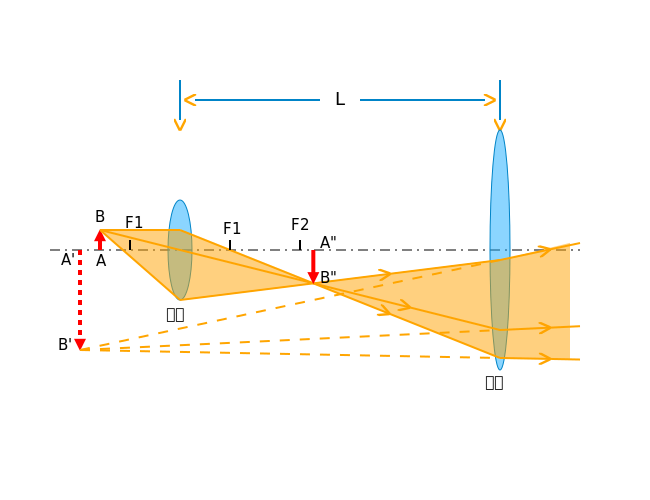

通常把光学分成几何光学、波动光学和量子光学。

# 几何光学

## 几何光学基本定律

## 惠更斯原理

## 费马原理

## 成像

## 薄透镜

## 光学仪器

### 照相机

### 眼睛

### 显微镜

### 望远镜

21-2 Images
21-3 Thin Lenses
21-4 Optical Instruments 光学仪器

伽利略望远镜

物镜焦距较长，目镜为凹透镜，物体在物镜焦平面上成像 $A'B'$，最终成像于无穷远处
$$
\beta=\frac{f_1}{f_2}
$$

开普勒望远镜

物镜焦距较长，目镜焦距较短，物体在物镜焦平面上成像 $A'B'$，最终成像于无穷远处
$$
\beta=\frac{f_1}{f_2}
$$

显微镜原理

物体$AB$置于物镜焦点外靠近焦点时，$u_1\approx f_1$
实像$A'B'$在目镜焦点内靠近焦点处，$u_2\approx f_2$

眼睛靠近目镜的光心观察处于明视距离的$A''B''$

其中人眼焦距 $f_e\approx 25cm$ ，镜筒长度为 $L$

物镜的视角放大率
$$
\beta_1=\frac{\phi_1'}{\phi_1}=\frac{A'B'/L}{AB/L}=\frac{AB/f_1}{AB/L}=\frac{L}{f_1}
$$
目镜的放大率
$$
\beta_2=\frac{\phi_2'}{\phi_2}=\frac{A''B''/f_e}{A'B'/f_e}=\frac{A'B'/f_2}{A'B'/f_e}=\frac{f_e}{f_2}
$$

总放大率
$$
\beta=\beta_1\beta_2=\frac{f_e}{f_1f_2}\cdot L
$$
由于 $f_2\ll L$ ，因此用 $L$ 代表物镜像距，通常$f_1$ 为 mm 数量级，$f_2$ 小于 2cm。

# 波动光学

21-5 Light as a Wave
21-6 Diffraction 衍射
21-7 Diffraction by a Circular Aperture 圆孔衍射
21-8 Diffraction by a Double Slit 双缝衍射
21-9 Diffraction Gratings 光栅衍射
21-10 X-Ray Diffraction
21-11 Interference 干涉
21-12 Interference from Thin Films 薄膜干涉
21-13 Michelson's Interferometer

# 量子光学

## 热辐射

## 光的波粒二象性

