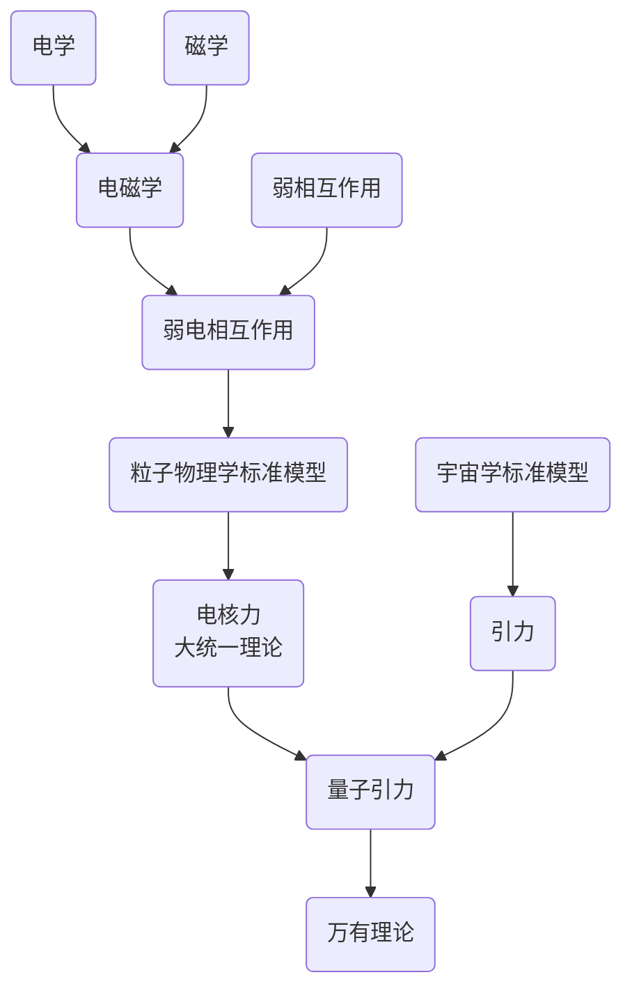
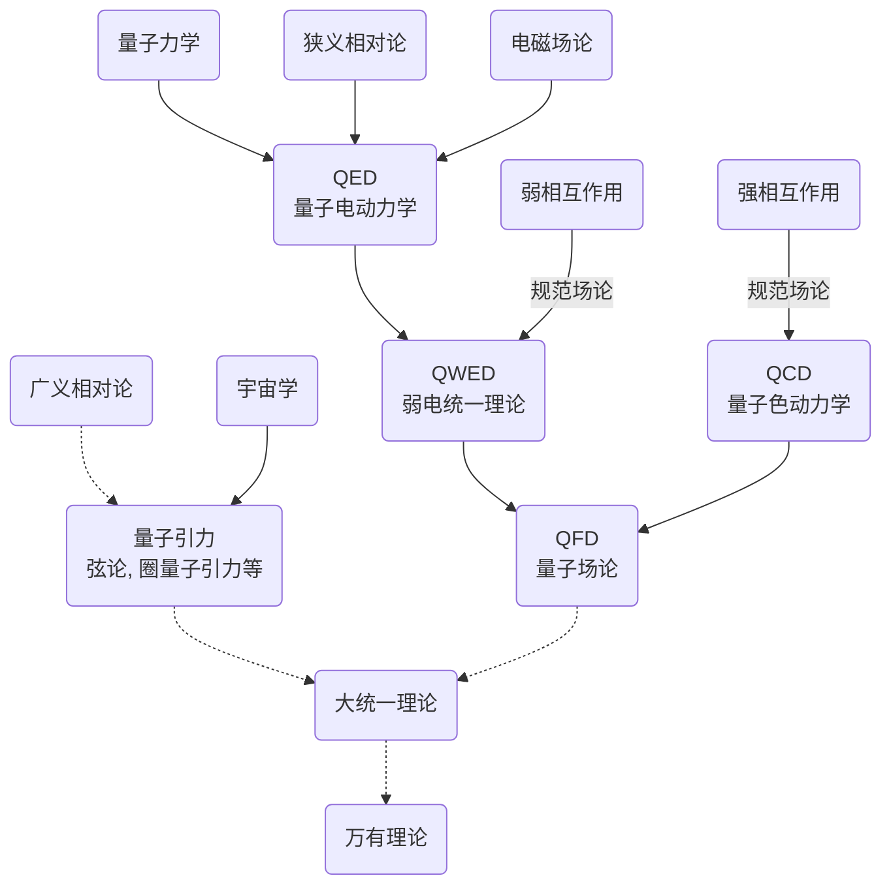
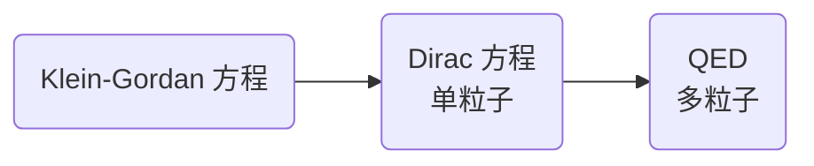

[万有理论][toe]（英语：Theory of Everything或ToE）指的是假定存在的一种具有总括性、一致性的物理理论框架，能够解释宇宙的所有物理奥秘。

[toe]: https://baike.baidu.com/item/%E4%B8%87%E6%9C%89%E7%90%86%E8%AE%BA/630145?fr=aladdin

包括光学、电学等

或者直接更新四大力学

三角形内角和

$$
\alpha+\beta+\gamma
\begin{cases}
=\pi &\text{欧几里得几何} \\
<\pi &\text{双曲几何(罗巴切夫斯基几何)}\\  >\pi &\text{椭圆几何(黎曼几何)}
\end{cases}
$$
量子物理发展

相对论性量子力学发展

