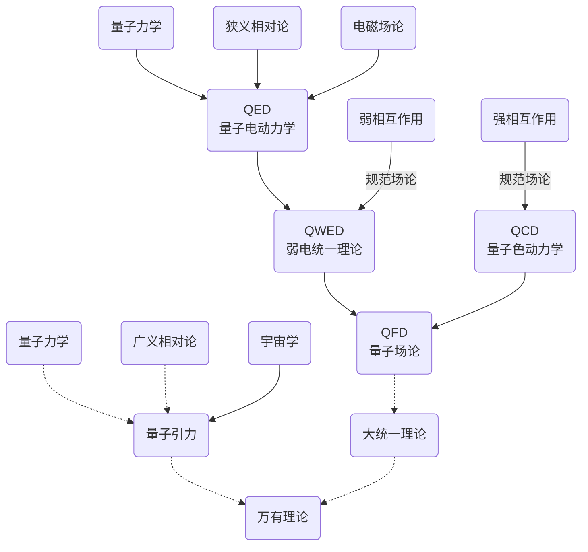

[万物理论][toe](Theory of Everything, ToE) 指的是假定存在的一种具有总括性、一致性的物理理论框架，能够解释宇宙的所有物理奥秘。

[toe]: https://baike.baidu.com/item/%E4%B8%87%E6%9C%89%E7%90%86%E8%AE%BA/630145?fr=aladdin

量子物理发展

量子引力：弦论，圈量子引力等

