# Overview

Machine learning algorithms

- Supervised learning
- Unsupervised learning

Reinforcement learning 强化学习

## Supervised learning

Learns from being given "right answers"

- **Regression**: Predict a number
- **Classification**: predict categories

## Unsupervised Learning

Data only comes with inputs x, but not output labels y. Algorithm has to find structure in the data.

- **Clustering**: Group similar data points together.
- **Anomaly detection**: (异常检测) Find unusual data points.
- **Dimensionality reduction**: Compress data using fewer numbers.

#  Regression Model

## Linear Regression with One Variable 

一元线性回归

## Notation

Here is a summary of some of the notation you will encounter.  

|General Notation  | Description| Python (if applicable) |
|:------------|:--------------|:------|
| $a$ | scalar, non bold    ||
| $\mathbf{a}$ | vector, bold   ||
| **Regression** |         |    |
|  $\mathbf{x}$ | Training Example feature values (in this lab - Size (1000 sqft))  | `x_train` |
|  $\mathbf{y}$  | Training Example  targets (in this lab Price (1000s of dollars)).  | `y_train` |
|  $x^{(i)}$, $y^{(i)}$ | $i^{th}$ Training Example | `x_i`, `y_i`|
| m | Number of training examples | `m`|
|  $w$  |  parameter: weight,  | `w`    |
|  $b$  |  parameter: bias  | `b`    |
| $f_{w,b}(x^{(i)})$ | The result of the model evaluation at $x^{(i)}$ parameterized by $w,b$: $f_{w,b}(x^{(i)}) = wx^{(i)}+b$  | `f_wb` |

**Notation**:

$x$ = "input" variable; feature   输入变量；特征
$y$ = "output" variable; "target" variable  输出变量；目标变量
$m$ = number of training examples  训练样本的总数
$(x, y)$ = single training example  单个训练样本
$(x^{(i)}, y^{(i)})$ = $i^{th}$ training example  (1^st^, 2^nd^, 3^rd^ ...)   第 i 个训练样本

> 其中 i 仅为样本索引，并非指数

learning algorithm: $x \to f \to \hat{y}$

$x$ = feature  特征
$f$ = model (hypothesis function)  模型(假设函数)
$\hat{y}$ = prediction (estimated y)  目标变量 y 的预测值(估计值)

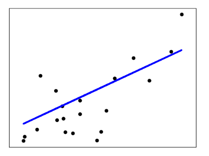

**Model** : (假设函数)  
$$
f_{w,b}(x)=wx+b
$$
**parameters**: $w,b$

其中，参数 $w,b$ 也称为系数 (coefficients) 或权重 (weights)

**cost function**: (损失函数，代价函数) 衡量预测值 $\hat y$ 和真实值 $y$ 之间的差异
$$
J(w,b)=\cfrac{1}{2m}\sum_{i=1}^{m}\left(\hat y^{(i)}-y^{(i)}\right)^2
$$
where 
$$
\hat y^{(i)}=f_{w,b}(x^{(i)})=wx^{(i)}+b
$$
为了建立一个不会因训练集变大而变大的代价函数，我们计算均方误差而不是平方误差。额外的 1/2 是为了让后面的计算更简介些。

**goal**:  
$$
\min_{\substack{w,b}} J(w,b)
$$

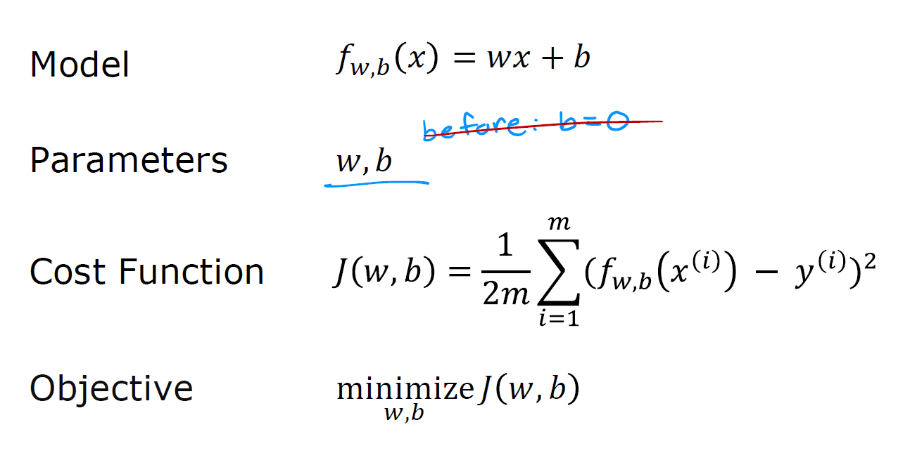

## Gradient Descent

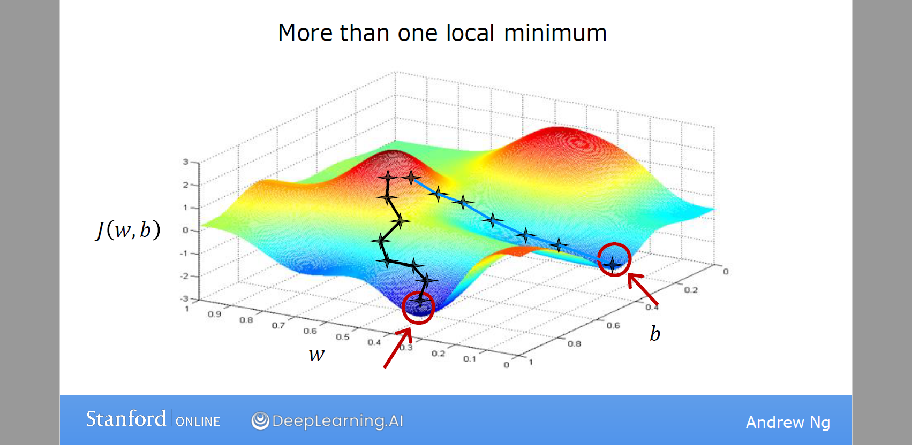

**Gradient descent algorithm**

have some function $J(w,b)$

want $\displaystyle\min_{\substack{w,b}} J(w,b)$

1. start with some $w,b$ (set $w=0,b=0$)
2. Keep changing $w,b$ to reduce  $J(w,b)$
3. Until we settle at or near a minimum

In lecture, *gradient descent* was described as: (直到收敛)
$$
\begin{align*} \text{repeat}&\text{ until convergence:} \; \lbrace \newline
\;  w &= w -  \alpha \frac{\partial J(w,b)}{\partial w}   \; \newline 
 b &= b -  \alpha \frac{\partial J(w,b)}{\partial b}  \newline 
   & \text{simultaneously update }w,b \\
 \rbrace
\end{align*}
$$
参数 $w,b$  需要同步更新。$\alpha$ 也叫学习率 (Learning rate) ，数值介于 0 到 1 之间。$\alpha$ 的作用是控制向下走的每一步的步幅。$\frac{\partial J(w,b)}{\partial w}$ 称为导数项 (Derivative) 控制下降的方向。

更准确的说，这种梯度下降过程称为**批量梯度下降** (batch gradient descent)，指的是每一步都会考虑所有的训练样本，而不是训练数据的自己。

均方误差代价函数的导数项为
$$
\begin{align}
\frac{\partial J(w,b)}{\partial w}  &= \frac{1}{m} \sum\limits_{i = 0}^{m-1} (f_{w,b}(x^{(i)}) - y^{(i)})x^{(i)} \tag{4}\\
  \frac{\partial J(w,b)}{\partial b}  &= \frac{1}{m} \sum\limits_{i = 0}^{m-1} (f_{w,b}(x^{(i)}) - y^{(i)}) \tag{5}\\
\end{align}
$$

Here *simultaniously* means that you calculate the partial derivatives for all the parameters before updating any of the parameters.

### Learning Rate

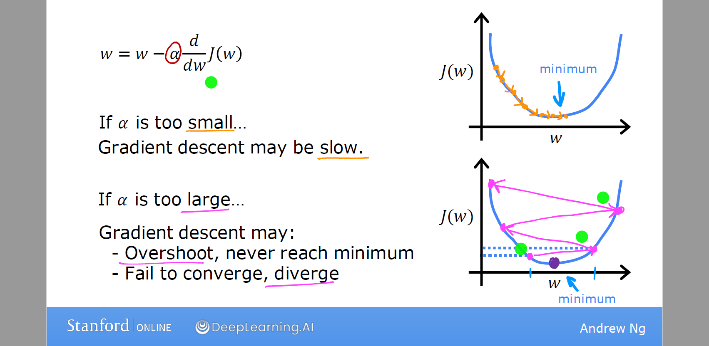

- 如果 $\alpha$ 太小，梯度下降会起作用，但会很慢。
- 如果 $\alpha$ 太大，梯度下降可能不断跨过最小值，永远不能接近。换一种说法，就是不收敛，甚至可能发散

### Derivative

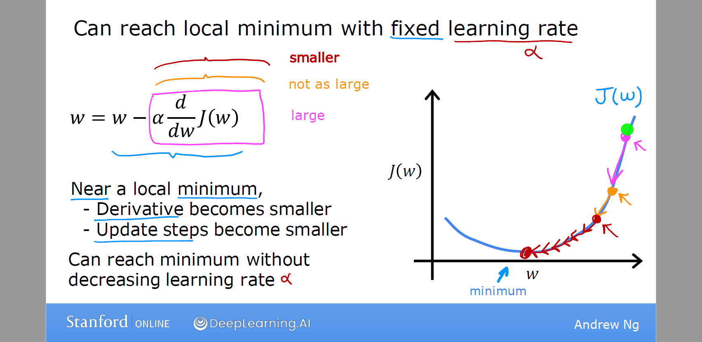

当我们接近局部最小值时，导数会自动变小，因此，更新的步幅也会自动变小。即使学习率 $\alpha$ 保持在某个固定值。

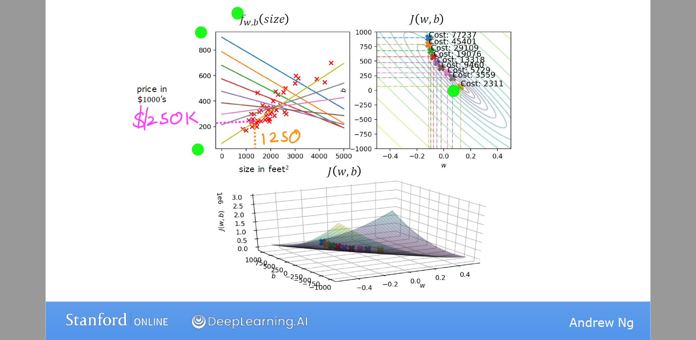

## Linear Regression with Multiple Variables

多元线性回归

## Notation

Here is a summary of some of the notation you will encounter, updated for multiple features.  

|General Notation  | Description| Python (if applicable) |
|:------------|:---------------------------|:----|
| $a$ | scalar, non bold      ||
| $\mathbf{a}$ | vector, bold   ||
| $\mathbf{A}$ | matrix, bold capital   ||
| **Regression** |         |    | 
|  $\mathbf{X}$ | training example maxtrix  | `X_train` |   
|  $\mathbf{y}$  | training example  targets   | `y_train` |
|  $\mathbf{x}^{(i)}$, $y^{(i)}$ | $i_{th}$Training Example | `X[i]`, `y[i]`|
| m | number of training examples | `m`|
| n | number of features in each example | `n`|
|  $\mathbf{w}$  |  parameter: weight,   | `w`    |
|  $b$           |  parameter: bias     | `b`    |     
| $f_{\mathbf{w},b}(\mathbf{x}^{(i)})$ | The result of the model evaluation at $\mathbf{x^{(i)}}$ parameterized by $\mathbf{w},b$: $f_{\mathbf{w},b}(\mathbf{x}^{(i)}) = \mathbf{w} \cdot \mathbf{x}^{(i)}+b$  | `f_wb` | 

$\mathbf{X}$ is a matrix with dimensions ($m$, $n$) (m rows, n columns).

$$
\mathbf{X} = 
\begin{pmatrix}
1 & x^{(1)}_1 & \cdots & x^{(1)}_{n} \\ 
1 & x^{(2)}_1 & \cdots & x^{(2)}_{n} \\
 \vdots &  \vdots & \ddots& \vdots \\
1 & x^{(m)}_1 & \cdots & x^{(m)}_n 
\end{pmatrix}
$$
notation:

- $\mathbf{x}^{(i)}$ is vector containing example i. $\mathbf{x}^{(i)}$ $ = (1, x^{(i)}_1, \cdots,x^{(i)}_n)$
- $x^{(i)}_j$ is element j in example i. The superscript in parenthesis indicates the example number while the subscript represents an element.  

**Notation**:

$x_j$ = $j^{th}$ feature   第 $j$ 个特征
$n$ = number of feature  特征的总数
$\mathbf x^{(i)}$ = features of  i^th^ training example  (1^st^, 2^nd^, 3^rd^ ...)   第 i 个训练样本的特征向量
$x_j^{(i)}$ = value of feature $j$ in $i^{th}$ training example

2.2 Parameter vector w, b

* $\mathbf{w}$ is a vector with $n$ elements.
  - Each element contains the parameter associated with one feature.
  - in our dataset, n is 4.
  - notionally, we draw this as a column vector

$$
\mathbf{w} = \begin{pmatrix}
w_0 \\ 
w_1 \\
\vdots\\
w_n
\end{pmatrix}
$$
* $b$ is a scalar parameter.  

**Model**: multiple linear regression
The model's prediction with multiple variables is given by the linear model:
$$
f_{\mathbf{w},b}(\mathbf{x}) =  w_1x_1 + w_2x_2 +... + w_nx_n + b=\sum_{j=1}^n w_jx_j+b
$$
为了计算方便，定义 $x_0=1$，并记 $w_0=b$
$$
\mathbf{x} = \begin{pmatrix}
x_0 \\ 
x_1 \\
\vdots\\
x_n
\end{pmatrix} \in\R^{n+1},
\quad
\mathbf{w} = \begin{pmatrix}
w_0 \\ 
w_1 \\
\vdots\\
w_n
\end{pmatrix}\in\R^{n+1}
$$
模型向量表示为
$$
f_{\mathbf{w}}(\mathbf{x}) = \mathbf{w}^T\mathbf{x}
$$
**cost function**: 
$$
J(\mathbf{w}) = \frac{1}{2m} \sum\limits_{i = 0}^{m-1} (f_{\mathbf{w}}(\mathbf{x}^{(i)}) - y^{(i)})^2 \tag{3}
$$
where:
$$
f_{\mathbf{w}}(\mathbf{x}^{(i)}) = \mathbf{w}^T \mathbf{x}^{(i)}
$$
 **Goal**: 
$$
\min J(\mathbf{w})
$$

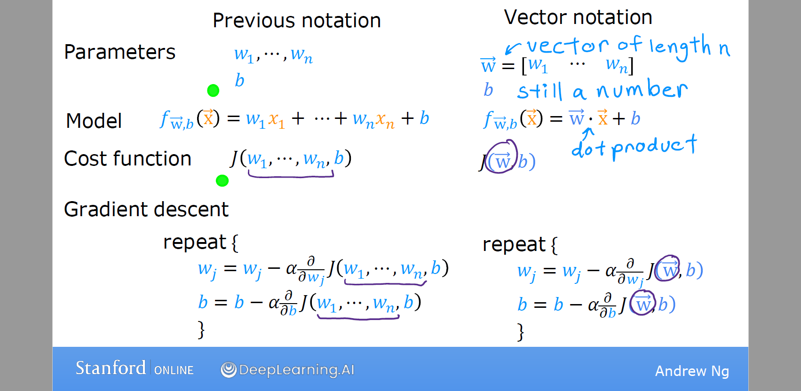

## Gradient Descent for Multiple Regression

Gradient descent for multiple variables:

$$
\begin{align*} \text{repeat}&\text{ until convergence:} \; \lbrace \newline\;
& w_j = w_j -  \alpha \frac{\partial J(\mathbf{w},b)}{\partial w_j} \tag{5}  \; & \text{for all }j\newline
&b\ \ = b -  \alpha \frac{\partial J(\mathbf{w},b)}{\partial b}  \newline \rbrace
\end{align*}
$$
simultaneously update $w_j$ (for $j=1,2,\cdots,n$ ) and $b$ and where  
$$
\begin{align}
\frac{\partial J(\mathbf{w},b)}{\partial w_j}  &= \frac{1}{m} \sum\limits_{i = 0}^{m-1} (f_{\mathbf{w},b}(\mathbf{x}^{(i)}) - y^{(i)})x_{j}^{(i)} \tag{6}  \\
\frac{\partial J(\mathbf{w},b)}{\partial b}  &= \frac{1}{m} \sum\limits_{i = 0}^{m-1} (f_{\mathbf{w},b}(\mathbf{x}^{(i)}) - y^{(i)}) \tag{7}
\end{align}
$$
* m is the number of training examples in the data set

*  $f_{\mathbf{w},b}(\mathbf{x}^{(i)})$ is the model's prediction, while $y^{(i)}$ is the target value

## Normal equation

 m 个样本 $\{(x^{(1)},y^{(1)}),(x^{(2)},y^{(2)}),\cdots,(x^{(m)},y^{(m)})\}$ ; n 个特征向量
$$
\mathbf{x}^{(i)} = \begin{pmatrix}
1 \\ 
x_1^{(i)} \\
\vdots\\
x_n^{(i)}
\end{pmatrix},
\quad
\mathbf{y} = \begin{pmatrix}
y^{(1)} \\
\vdots\\
y^{(m)}
\end{pmatrix}
$$
数据集可以表示成 $(m,n+1)$ 维矩阵
$$
\mathbf{X} = \begin{pmatrix}
(x^{(1)})^T \\ 
(x^{(2)})^T \\
\vdots\\
(x^{(m)})^T
\end{pmatrix} = 
\begin{pmatrix}
1 & x^{(1)}_1 & \cdots & x^{(1)}_{n} \\ 
1 & x^{(2)}_1 & \cdots & x^{(2)}_{n} \\
 \vdots &  \vdots & \ddots& \vdots \\
1 & x^{(m)}_1 & \cdots & x^{(m)}_n 
\end{pmatrix}
$$

最小二乘法解析解
$$
\mathbf{w=(X^T X)^{-1}X^T y}
$$
Normal equation  正规方程
- Only for linear regression  仅用于线性回归
- 不需要调试超参数
- Solve for w, b without iterations

Disadvantages 缺点

- Doesn’t generalize to other  learning algorithms.  无法推广到其他学习算法
- $X^T X$ 为可逆矩阵，逆矩阵计算的复杂度 $O(n^3)$
- Slow when number of features  is large (> 10,000) 如果样本特征的数量太大，正规方程将执行的非常慢

$X^T X$ 不可逆的可能原因

- 特征之间可能线性相关
- 特征数量大于样本总数 $m>n$

## Feature scaling 

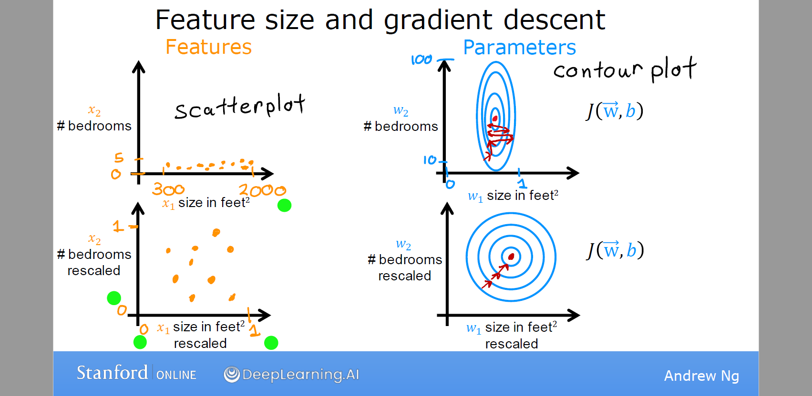

当你有不同的特征且取值范围差异较大，它可能导致梯度下降运行缓慢。但通过重新缩放特征，使他们具有可比较的值范围，可显著加快梯度下降速度。

Feature scaling 特征缩放

- $x_{scaled}:=\dfrac{x}{max}$
- Mean normalization(均值归一化): $x_{scaled} = \dfrac{x - \mu}{max - min} $ 
- z-score normalization(Z-score标准化)

After z-score normalization, all features will have a mean of 0 and a standard deviation of 1.
To implement z-score normalization, adjust your input values as shown in this formula:
$$
x^{(i)}_j = \dfrac{x^{(i)}_j - \mu_j}{\sigma_j} \tag{4}
$$
where $j$ selects a feature or a column in the X matrix. $µ_j$ is the mean of all the values for feature (j) and $\sigma_j$ is the standard deviation of feature (j).
$$
\begin{align}
  \mu_j &= \frac{1}{m} \sum_{i=0}^{m-1} x^{(i)}_j \tag{5}\\
  \sigma^2_j &= \frac{1}{m} \sum_{i=0}^{m-1} (x^{(i)}_j - \mu_j)^2  \tag{6}
  \end{align}
$$
## 检测特都下降是否收敛

- LearningCurve学习曲线: 横轴是梯度下降的迭代次数，纵轴代表代价函数 $J(w,b)$。不同的应用场景中，梯度下降的收敛速度可能有很大差异。事实证明，我们很难事先知道梯度下降要经过多少次迭代才能收敛，所以你可以先画个学习曲线后再训练模型。
- 另一种方法是自动收敛测试(Automatic convergence test): 我们设置一个小数字变量 $\epsilon=0.001$ ，如果代价函数在一次迭代中减少的量小于这个值，则可以认为它收敛了。

记住，收敛是指你找到了代价函数 J 接近最小值的可能参数。选出正确的 $\epsilon$ 是相当困难的，所以更倾向于使用学习曲线。

## 学习率选择

- 如果 $\alpha$ 太小，梯度下降会起作用，但会很慢。
- 如果 $\alpha$ 太大，梯度下降可能不断跨过最小值，永远不能接近。换一种说法，就是不收敛，甚至可能发散

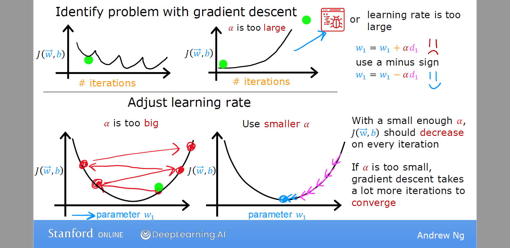

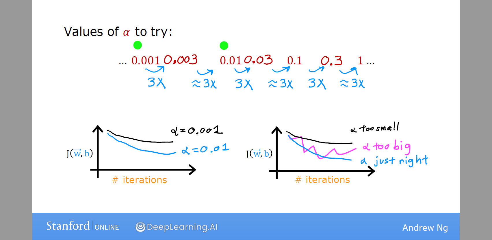

使用梯度下降法时，通常建议尝试一系列 $\alpha$ 值，对于每一个学习率画出少量迭代的代价函数，在尝试了一系列 $\alpha$ 后，你可能会选择能快速且持续降低 J 的$\alpha$ 值。

## Feature Engineering

特征工程：

- 通常通过变换或者合并原始特征设计新的特征。

## Polynomial Regression

多项式回归

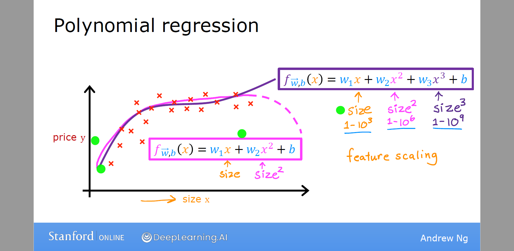

# Classification

这种结果只有两种的分类问题称为二分类问题 (binary classification)，输出变量通常表示为正样本/负样本(positive/negative) such as 'yes'/'no, 'true'/'false' or '1'/'0'

$y\in\{0,1\}$

- 0: negative class;
- 1: positive class;

## Logistic Regression

我们可以尝试在分类数据集上使用线性回归算法拟合一条直线。但线性回归预测的是不限于 0/1 的连续数值，而我们这里想预测类别，因此可以尝试选择一个阈值（比如0.5），如果模型输出的值小于阈值则判定 0，否则判定为 1。

由于线性回归对异常值过于敏感，并不是解决分类问题的好算法。相比之下，逻辑回归输出一条 S 曲线去拟合数据。为此我们需要引入sigmoid函数，也称logistic函数

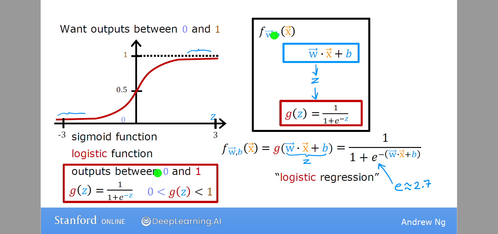

A logistic regression model applies the sigmoid to the familiar linear regression model as shown below:
$$
f_{\mathbf{w}}(\mathbf{x}) = g(\mathbf{w}^T \mathbf{x})
$$
 where $g(z)$ is the sigmoid function
$$
g(z) = \frac{1}{1+e^{-z}}
$$
模型的输出可视为正样本的概率 $\mathbb P_1(y_i=1)=f(x)$，则负样本的概率 $\mathbb P_0(y_i=0)=1-f(x)$。简写为
$$
\mathbb P(y_i)=(f(x))^{y_i}(1-f(x))^{1-y_i}
$$
  if $f_{\mathbf{w},b}(x) >= 0.5$, predict $\hat y=1$

  if $f_{\mathbf{w},b}(x) < 0.5$, predict $\hat y=0$

## Decision Boundary

决策边界

* As you can see, $g(z) >= 0.5$ for $z >=0$ 

* For a logistic regression model, $z = \mathbf{w} \cdot \mathbf{x} + b$. Therefore,

  if $\mathbf{w} \cdot \mathbf{x} + b >= 0$, the model predicts $\hat y=1$
  
  if $\mathbf{w} \cdot \mathbf{x} + b < 0$, the model predicts $\hat y=0$

Non-linear decision boundaries

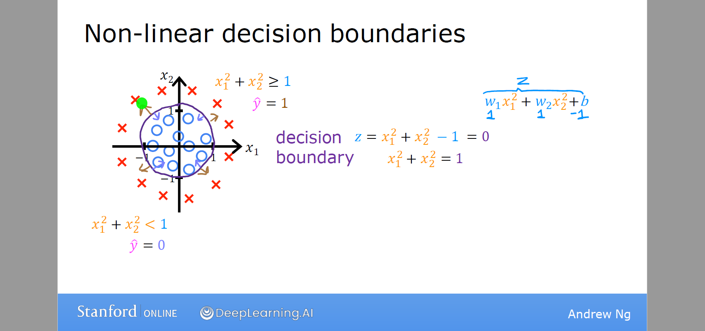

## Cost Function for Logistic Regression

对于线性回归来说均方误差代价函数是一个凸函数，梯度下降可以一步一步找到全局最小值。但逻辑回归若采用相同的代价函数，是一个非凸函数(non-convex)，会存在许多局部极小值。因此我们尝试极大似然估计

**Loss Function** (损失函数) 度量单样本损失

$loss(f_{\mathbf{w},b}(\mathbf{x}^{(i)}), y^{(i)})$ is the cost for a single data point, which is:
$$
\begin{equation}
  loss(f_{\mathbf{w},b}(\mathbf{x}^{(i)}), y^{(i)}) = \begin{cases}
    - \log\left(f_{\mathbf{w},b}\left( \mathbf{x}^{(i)} \right) \right) & \text{if $y^{(i)}=1$}\\
    \log \left( 1 - f_{\mathbf{w},b}\left( \mathbf{x}^{(i)} \right) \right) & \text{if $y^{(i)}=0$}
  \end{cases}
\end{equation}
$$
简写为
$$
loss(f_{\mathbf{w},b}(\mathbf{x}^{(i)}), y^{(i)})=-y_i\mathbf w^T\mathbf{\hat x}_i+\ln(1+e^{\mathbf w^T\mathbf{\hat x}_i})
$$
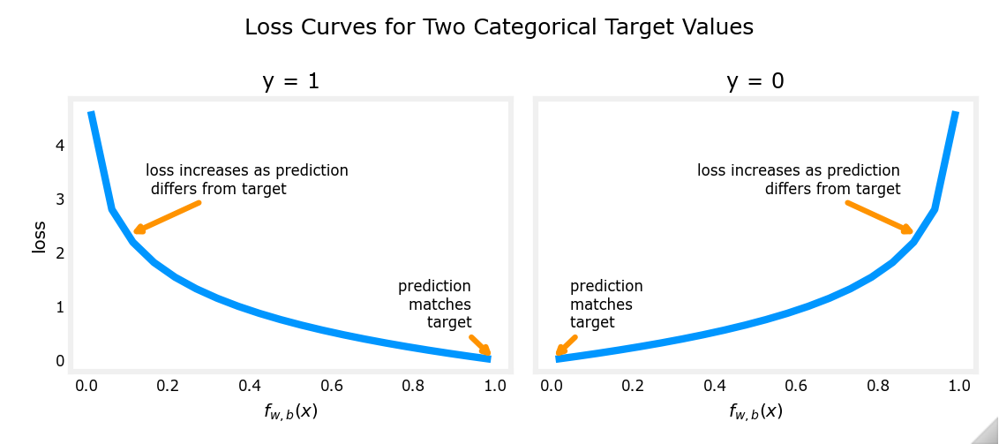

Cost Function
$$
J(\mathbf{w},b) = \frac{1}{m} \sum\limits_{i = 1}^m\text{loss}(f_{\mathbf{w},b}(\mathbf{x}^{(i)}), y^{(i)})
$$

## 高级优化算法

- Conjugate gradie
- BFGS  共轭梯度算法
- L-BFGS

优缺点：

- 不需要手动指定学习率 $\alpha$ 
- 通常收敛速度远大于梯度下降
- 算法过于复杂

## multi-class classification

multi-class classification 多分类问题 $y\in\{0,1,2,\cdots\}$

一对多算法

One-vs-all

# Overfitting

- underfit 欠拟合，也称高偏差 high bias 模型对训练数据拟合不足
- just right 模型拟合的很好。算法也能适用于没出现在样本中的数据，称之为泛化 (generalization)
- overfit 过拟合，也称高方差 high variance

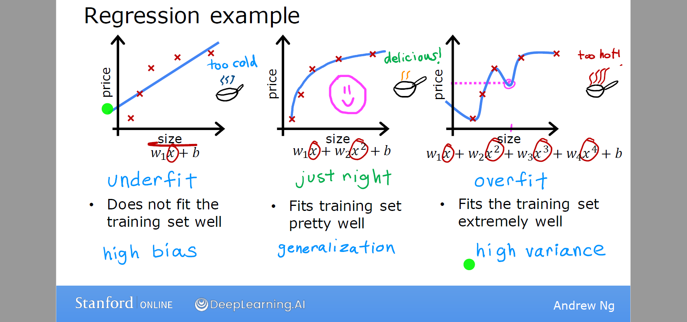

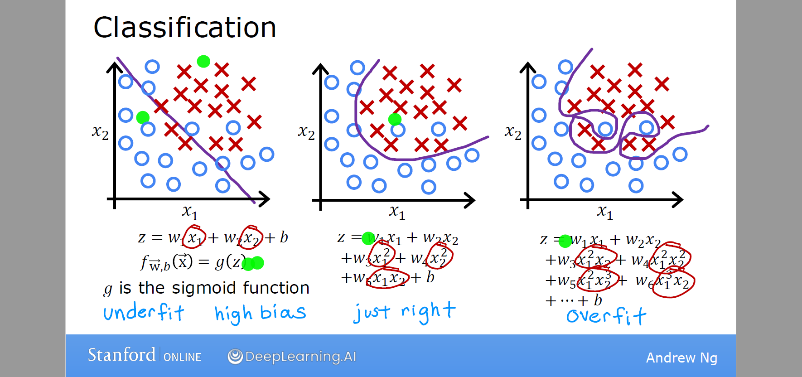

## 解决过拟合

- 增加训练样本
- 选择最合适的特征子集（特征选择 feature selection）
- 正则化 Regularization：保留所有的特征，通过缩小特征权重，减少过拟合的风险。

## Cost Function with Regularization

正则化的实现方式通常是惩罚所有的特征

The equation for the cost function regularized linear regression is:
$$
J(\mathbf{w}) = \frac{1}{2m} \left[\sum\limits_{i = 1}^{m}\text{loss}(f_{\mathbf{w}}(\mathbf{x}^{(i)}), y^{(i)})  + \lambda\sum_{j=0}^n w_j^2\right]
$$
 按照惯例，正则化项 (Regularization term) 也乘以 $\dfrac{1}{2m}$ ，这样正则化项不会随训练集规模变大而变大。

> 实际生活中，正则化 b 项影响很小，可以忽略。

线性回归的代价函数正则化
$$
J(\mathbf{w}) = \frac{1}{2m} \left[\sum\limits_{i = 1}^{m}(f_{\mathbf{w}}(\mathbf{x}^{(i)})- y^{(i)})^2  + \lambda\sum_{j=0}^n w_j^2\right]
$$
最小二乘法可求得解析解
$$
\mathbf{w=(X^T X}+\lambda \mathbf{I)^{-1}X^T y}
$$
其中 $\mathbf I$ 是 $n+1$ 维单位阵

Gradient descent for multiple variables:
$$
\begin{align*} \text{repeat}&\text{ until convergence:} \; \lbrace \newline\;
& w_j = w_j -  \alpha \frac{\partial J(\mathbf{w},b)}{\partial w_j} \tag{5}  \; & \text{for j = 0..n-1}\newline
&b\ \ = b -  \alpha \frac{\partial J(\mathbf{w},b)}{\partial b}  \newline \rbrace
\end{align*}
$$
simultaneously update $w_j$ (for $j=1,2,\cdots,n$ ) and $b$ and where  

Gradient descent with regularization (both linear/logistic)
$$
\frac{\partial J(\mathbf{w},b)}{\partial w_j}  = \frac{1}{m} \sum\limits_{i = 1}^{m} \frac{\partial}{\partial w_j}loss(f_{\mathbf{w},b}(\mathbf{x}^{(i)}), y^{(i)})  +  \frac{\lambda}{m} w_j
$$

$$
\begin{align*}
w_j &= w_j-\alpha\left[\frac{1}{m} \sum\limits_{i = 1}^{m} \frac{\partial}{\partial w_j}loss(f_{\mathbf{w},b}(\mathbf{x}^{(i)}), y^{(i)})  +  \frac{\lambda}{m} w_j \right] \\
&=w_j(1-\alpha\frac{\lambda}{m})-\alpha\frac{1}{m} \sum\limits_{i = 1}^{m} \frac{\partial}{\partial w_j}loss(f_{\mathbf{w},b}(\mathbf{x}^{(i)}), y^{(i)})
\end{align*}
$$

上式第二项是梯度下降中的普通更新 (usual update) ，正则化项（假如 $\alpha=0.01,\lambda=1$）所做的就是在每一次梯度下降迭代时，用$w_j$乘以一个略小于1的数字，来执行普通更新。这也就理解了正则化项为什么可以在每次迭代中缩小 $w_j$ 的值。

