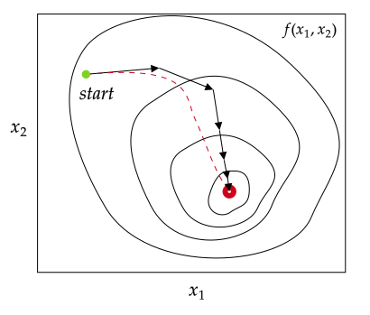
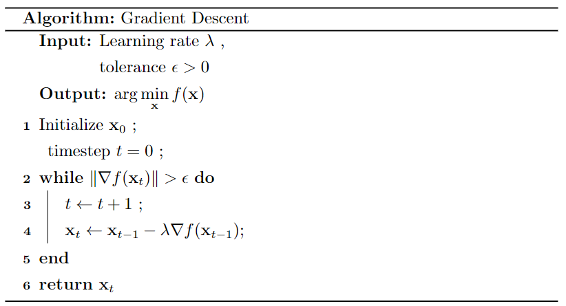
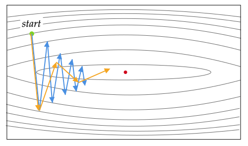
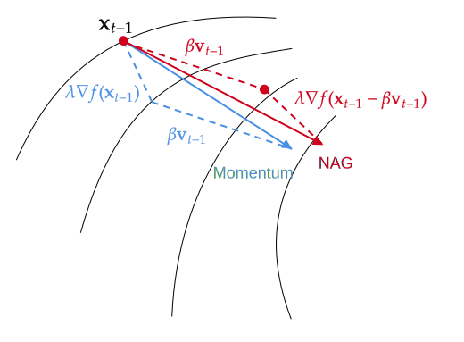
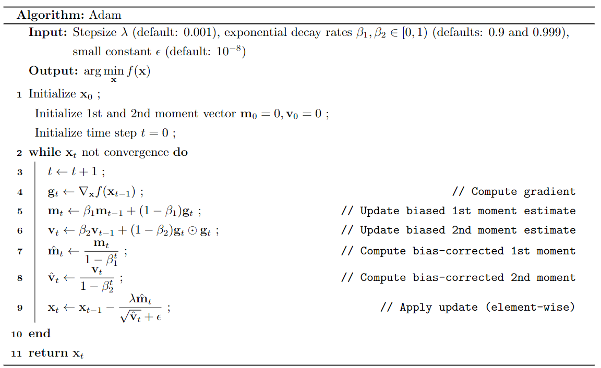
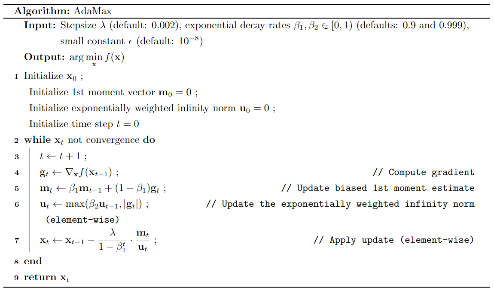

大多数机器学习算法都涉及某种形式的优化。优化指的是改变 $\mathbf x$ 以最小化或最大化 $f(\mathbf x)$ 的任务。我们通常以最小化 $f(\mathbf x)$ 指代大多数最优化问题，最大化可经由最小化 $-f(\mathbf x)$ 来实现。

# 无约束优化解析解

考虑无约束优化问题
$$
\min\limits_{\mathbf x} f(\mathbf x)
$$
假定目标函数 $f(\mathbf x)$ 二阶连续可微，自变量 $\mathbf x\in\R^n$。一元函数对极值的推导可以推广到多元函数，函数取得极值的必要条件是导数为0。无约束的优化问题中
$$
\nabla f(\mathbf x)=\frac{\partial f(\mathbf x)}{\partial\mathbf x}=0
$$
梯度为0的点称为临界点（critical point）或驻点（stationary point）。下图为三种驻点：极大、极小和鞍点

极大或极小值的判定，取决于该函数的二阶导数，Hessian矩阵是由多元函数的二阶偏导数组成的矩阵
$$
\mathbf H(\mathbf x)=\begin{pmatrix}
\cfrac{\partial^2 f}{\partial x_1^2}&\cfrac{\partial^2 f}{\partial x_1\partial x_2}&\cdots&\cfrac{\partial^2 f}{\partial x_1\partial x_n} \\
\cfrac{\partial^2 f}{\partial x_2\partial x_1}&\cfrac{\partial^2 f}{\partial x_2^2}&\cdots&\cfrac{\partial^2 f}{\partial x_2\partial x_n} \\
\vdots &\vdots &\ddots &\vdots \\ 
\cfrac{\partial^2 f}{\partial x_n\partial x_1}&\cfrac{\partial^2 f}{\partial x_n\partial x_2}&\cdots&\cfrac{\partial^2 f}{\partial x_n^2} \\
\end{pmatrix}
$$
一般情况下，多元函数的混合二阶偏导数与求导次序无关
$$
\cfrac{\partial^2 f}{\partial x_i\partial x_j}=\cfrac{\partial^2 f}{\partial x_j\partial x_i}
$$
因此Hessian矩阵是一个对称矩阵。多元函数极值的判别如下

- 如果Hessian矩阵在该点是正定的，则函数在该点有极小值；
- 如果Hessian矩阵在该点是负定的，则函数在该点有极大值；
- 如果Hessian矩阵在该点是不定的，则该点为鞍点，它在一个方向上具有极小值，在另一个方向上具有极大值。

> 对于 $n$ 阶矩阵 $\mathbf A$ ，若对任意的$n$维非0向量 $\mathbf x$ 都有
> (1)  $\mathbf x^T\mathbf A\mathbf x>0$ ，则称矩阵$\mathbf A$为正定矩阵
> (2)  $\mathbf x^T\mathbf A\mathbf x<0$ ，则称矩阵$\mathbf A$为负定矩阵
> 若 $\mathbf x^T\mathbf A\mathbf x\geqslant 0$ ，则称矩阵$\mathbf A$为半正定矩阵

在许多情况下，找解析解是一个很困难的问题，这就迫使我们使用数值方法找近似解，最常用的求解算法包括梯度下降法，牛顿法，拟牛顿法等。

# 拉格朗日乘子法

拉格朗日乘子法(Lagrange multipliers)是一种寻找多元函数在一组约束下的极值的方法。通过引入拉格朗日乘子，可将有 $d$ 个变量与 $k$ 个约束条件的最优化问题转化为具有 $d+k$ 个变量的无约束优化问题求解。

## 等式约束

考虑受限于如下形式的等式约束：
$$
g_i(\mathbf x)=0,i= 1,2,\cdots,p
$$
求$f(x_1,x_2,\cdots,x_d)$的极小值问题。

一种称作拉格朗日乘子的方法可以用来解约束优化问题。该方法涉及如下步骤。
(1) 定义拉格朗日函数
$$
L(\mathbf x,λ)=f(\mathbf x)+\sum_{i=1}^{p} λ_ig_i(\mathbf x)
$$
其中$λ_i$是哑变量，称作拉格朗日乘子(Lagrange multiplier)。
(2) 令拉格朗日函数关于$\mathbf x$和拉格朗日乘子的一阶导数等于0：
$$
\cfrac{\partial L}{\partial x_i}=0,\forall i=1,2,\cdots,d
$$
并且
$$
\cfrac{\partial L}{\partial λ_i}=0,\forall i=1,2,\cdots,p
$$
(3) 求解步骤(2)得到的$(d+p)$个方程，得到平稳点$\mathbf x^*$和对应的$λ_i$的值。

## 不等式约束

考虑受限于如下形式的等式约束：
$$
h_i(\mathbf x)=0,i= 1,2,\cdots,q
$$
求$f(x_1,x_2,\cdots,x_d)$的最小值问题。

求解这类问题的方法与上面介绍的拉格朗日方法非常相似。然而，不等式约束把一些附加条件施加到优化问题上。特殊地，上述优化问题导致如下拉格朗日函数：
$$
L(\mathbf x,λ)=f(\mathbf x)+\sum_{i=1}^{q} λ_ih_i(\mathbf x)
$$
和称作Karush-Kuhn-Tucker(KKT)条件的约束：
$$
\cfrac{\partial L}{\partial x_i}=0,\forall i=1,2,\cdots,d \\
h_i(\mathbf x)\leqslant 0,\forall i=1,2,\cdots,q \\
λ_i\geqslant 0,\forall i=1,2,\cdots,q \\
λ_ih_i(\mathbf x)=0,\forall i=1,2,\cdots,q \\
$$
注意，拉格朗日乘子在不等式约束中出现，不再是不受限的。
求解KKT条件可能是一项相当艰巨的任务，当约束不等式的数量较大时尤其如此。在这种情况下，求闭型解不再可行，而需要使用诸如线性和二次规划这样的数值优化技术。

# 梯度下降法

梯度下降法的一系列算法在众多文章中表述均有差异，本文为了理解方便，以Adam算法公式为基准构造其他梯度下降系公式，符号均和Adam算法保持一致，其本质是一样的，最终结果经过变换也是相同的。统一初始点记为 $\mathbf x_0$，第一次迭代记为 $t=1$ 。

## 梯度下降法

梯度下降法（Gradient Descent，GD）也称最速下降法（steepest descent），是一种常用的一阶（first-order）优化方法，是求解无约束优化问题最简单、最经典的迭代方法之一。它被广泛应用于机器学习，是许多算法的基础，比如线性回归、逻辑回归，以及神经网络的早期实现。

考虑无约束优化问题
$$
\min\limits_{\mathbf x} f(\mathbf x)
$$
假定目标函数$f(\mathbf x)$连续可微，自变量 $\mathbf x\in\R^n$。

**基本思路**：梯度下降法希望通过不断执行迭代过程**收敛**到极小点，即构造一个序列 $\mathbf x_0,\mathbf x_1,\mathbf x_2,\cdots$ ，每次迭代都满足
$$
f(\mathbf x_{t})<f(\mathbf x_{t-1}),\quad t=1,2,\cdots
$$
假设第 $t$ 次迭代值为 $\mathbf x_t$ 。梯度下降法使用泰勒一阶展开式[^taylor]来近似代替目标函数
$$
f(\mathbf x)\approx f(\mathbf x_{t-1})+\Delta\mathbf x^T\mathbf g_t
$$
这里 $\mathbf g_t=\nabla f(\mathbf x_{t-1})$ 为 $f(\mathbf x)$ 在 $\mathbf x_{t-1}$ 的梯度向量，$\Delta\mathbf x=\mathbf x-\mathbf x_{t-1}$。

我们希望找到使 $f$ 下降的最快的方向，即求解
$$
\begin{aligned}
\min_{\Delta\mathbf x}f(\mathbf x)
&\approx\min_{\Delta\mathbf x}f(\mathbf x_{t-1})+\Delta\mathbf x^T\mathbf g_t \\
&= \min_{\Delta\mathbf x}\Delta\mathbf x^T\mathbf g_t \\
&=\min_{\Delta\mathbf x}\|\Delta\mathbf x\|_2\|\mathbf g_t\|_2\cos\theta
\end{aligned}
$$
上式中 $\theta$ 为 $\Delta\mathbf x$ 和梯度向量的夹角。函数值 $f(\mathbf x_{t-1})$ 为常数，去除后不影响。

当移动方向与梯度方向相反时（即 $\cos\theta=-1$）取得最小值，也就是沿着负梯度曲线移动能最快到达极值点。

由于梯度曲线是连续曲线，每次迭代步长要无限小才是最短路径。考虑迭代次数有限，加入一个接近于0的正数控制下降的步幅。因此梯度下降法的迭代公式为
$$
\mathbf x_{t}=\mathbf x_{t-1}-\lambda\mathbf g_t
$$
数值 $\lambda>0$ 称为**学习率** (learning rate)，作用是控制下降的步幅。梯度向量 $\mathbf g_t$ 控制下降的方向。

注意：初始位置的不同可能导致下降到不同的极值点。梯度下降不一定能够找到全局的最优解，有可能是一个局部最优解。当目标函数为凸函数时，局部极小点就对应着函数的全局最小点。

**学习率**：通过选取合适的步长 $\lambda$，就能确保通过梯度下降收敛到局部极小点。

- 如果 $\lambda$ 太小，梯度下降会起作用，但会很慢
- 如果 $\lambda$ 太大，梯度下降可能不断跨过最小值，永不收敛

使用梯度下降法时，通常建议尝试一系列 $\lambda$ 值，对于每一个学习率画出少量迭代的代价函数，在尝试了一系列 $\lambda$ 后，你可能会选择能快速且持续降低 $f$ 的 $\lambda$ 值。
$$
\text{Values of learning rate to try:} \\
\begin{matrix}
\cdots & 0.001 & 0.01 & 0.1 & 1 & \cdots \\
\cdots & 0.003 & 0.03 & 0.3 & 3 & \cdots \\
\cdots & 0.006 & 0.06 & 0.6 & 6 & \cdots \\
\end{matrix}
$$
**梯度向量**： $\mathbf g_t$ 控制下降的方向，但同时也影响下降的步幅。当我们接近局部最小值时，导数从负值慢慢趋近于0，因此绝对值会自动变小。所以，即使学习率 $\lambda$ 保持在某个固定值，更新的步幅也会自动变小。

**收敛判断**

- 学习曲线（LearningCurve）：横轴是梯度下降的迭代次数，纵轴代表目标函数 $f(\mathbf x)$。不同的应用场景中，梯度下降的收敛速度可能有很大差异。事实证明，我们很难事先知道梯度下降要经过多少次迭代才能收敛，所以可以先画个学习曲线后再训练模型。
- 另一种方法是自动收敛测试 (Automatic convergence test)：我们设置一个小容差 $\epsilon$ (=0.001)，如果代价函数在一次迭代中减少的量小于这个值，则可以认为它收敛了。

记住，收敛是指你找到了函数 $f$ 接近最小值的可能参数。选出正确的 $\epsilon$ 是相当困难的，所以更倾向于使用学习曲线。

## 随机梯度下降

给定的数据集  
$$
D=\{(\mathbf x_1,y_1),(\mathbf x_2,y_2),\cdots,(\mathbf x_N,y_N)\}
$$
包含 $N$ 个样本，$p$ 个特征。其中，第 $i$ 个样本的特征向量为 $\mathbf x_i=(x_{i1},x_{i2},\cdots,x_{ip})^T$ 。代价函数为
$$
J(\theta)=\frac{1}{N}\sum_{i=1}^N L(\theta;\mathbf x_i,y_i)
$$
即损失函数 $L(\theta;\mathbf x_i,y_i)$ 的期望。准确计算这个期望的计算代价非常大，因为我们需要在整个数据集上的每个样本上评估模型。在实践中，我们可以从数据集中随机采样少量的样本，然后计算这些样本上的平均值来估计期望。

梯度下降法的迭代公式为
$$
\theta_{t}=\theta_{t-1}-\lambda\mathbf g_t
$$
根据样本量在参数更新的准确性和执行更新所需的时间之间的权衡，梯度下降法有三种不同的应用方式。

**批量梯度下降法**（Batch Gradient Descent，Batch GD）是梯度下降法的最原始形式。为了获取准确的梯度，每一 步都在全部数据集上计算梯度，时间花费和内存开销都非常大，无法应用于大数据集、大模型的场景。
$$
\mathbf g_t=\sum_{i=1}^N \nabla_\theta L(\theta_{t-1};\mathbf x_i,y_i)
$$
**随机梯度下降法**（Stochastic Gradient Descent，SGD）是深度学习最常用的优化方法。SGD 放弃了对梯度准确性的追求，每一步采样单个样本来估计当前的梯度，计算速度快，内存开销小。但由于每步接受的信息量有限，随机梯度下降法对梯度的估计常常出现偏差，造成目标函数曲线收敛得很不稳定，伴有剧烈波动，有时甚至出现不收敛的情况。同时使用单个观测更新也可以在一定程度上增加不确定度，从而减轻陷入局部最小的可能。
$$
\mathbf g_t=\nabla_\theta L(\theta_{t-1};\mathbf x_i,y_i)
$$

**小批量梯度下降法**（Mini-batch Gradient Descent，Mini-batch GD）是 Batch GD 和 SGD 的折中方案，在一定程度上兼顾了以上两种方法的优点，缩写 SGD 通常指的是小批量梯度下降。每次从训练样本集上随机抽取一个小样本集，在抽出来的小样本集上迭代更新权重。小批量大小（batch size）通常在 50 到 256 之间，但可能因不同的应用而异。小批量梯度下降通常是训练神经网络时的首选算法。
$$
\mathbf g_t=\sum_{i=1}^{b} \nabla_\theta L(\theta_{t-1};\mathbf x_i,y_i)
$$
**优点：**由于不是在全部训练数据上的损失函数，而是在每轮迭代中，随机优化某一条训练数据上的损失函数，这样每一轮参数的更新速度大大加快。

**缺点：**

（1）准确度下降。由于即使在目标函数为强凸函数的情况下，SGD仍旧无法做到线性收敛。
（2）可能会收敛到局部最优，由于单个样本并不能代表全体样本的趋势。
（3）不易于并行实现。

一般来说SGD步长的选择比 batch GD的步长要小一点，因为梯度下降法使用的是准确梯度，所以它可以朝着全局最优解（当问题为凸问题时）较大幅度的迭代下去，但是随机梯度法不行，因为它使用的是近似梯度，或者对于全局来说有时候它走的也许根本不是梯度下降的方向，故而它走的比较缓，同样这样带来的好处就是相比于梯度下降法，它不是那么容易陷入到局部最优解中去。

## Momentum

多维情况下，单个点处梯度的各个维度的分量往往差别很大，这在局部最优附近很常见。在这些情况下，SGD 往往在斜坡上振荡。这时，可以考虑梯度在不同维度上的分量变化，用历史的数据（惯性）修正下降方向，减少这种振荡。

**Momentum**（动量）：一词借鉴了物理中的概念，是一种用来抑制振荡，加速梯度下降的技术。我们定义动量项为梯度方向和历史动量的加权求和
$$
\mathbf m_t=\beta\mathbf m_{t-1}+\mathbf g_t
$$
其中，$\mathbf g_t=\nabla f(\mathbf x_{t-1})$ 为梯度向量，$0<\beta<1$ 是指数衰减系数。动量项累积了之前的梯度信息，类似于保持行走时的惯性，以避免来回震荡，加快收敛速度。

加上动量项后的迭代公式为
$$
\mathbf x_{t}=\mathbf x_{t-1}-\lambda\mathbf m_t
$$

动量法相当于每次迭代的时候，都会将之前的梯度考虑进来，每次的移动方向不仅取决于当前的梯度，还取决于过去各个梯度分量在各自方向上是否一致。如果一个梯度分量一直沿着当前方向进行更新，那么每次更新的幅度就越来越大。如果一个梯度分量在一个方向上不断改变，那么其更新幅度就会被衰减。这样我们就可以使用一个较大的学习率，得到了更快的收敛速度以及更小的震荡。

**动量项**：初始 $\mathbf m_0=0$ ，将动量项迭代展开
$$
\mathbf m_t=\mathbf g_t+\beta\mathbf g_{t-1}+\beta^2\mathbf g_{t-2}+\cdots+\beta^{t-1}\mathbf g_{1}
$$
由于 $0<\beta<1$ ，越远的梯度权重也会越小。通常取系数 $\beta=0.9$，相当于取了近10个梯度计算移动平均。这里使用了**指数加权移动平均**的数学概念，只是省略了权重系数 $(1-\beta)$，其本质影响相同。

> 注意，记$\mathbf v_{t-1}=\lambda\mathbf m_{t-1}$ ，带入动量项和迭代公式，会发现和其他文章公式一致。

**指数加权移动平均**（Exponentially Moving Average，EMA）是一种常用的序列处理方式，通过它可以来计算局部的平均值。$t$ 时刻 EMA 计算公式是：
$$
v_t=\beta v_{t-1}+(1-\beta)\theta_t
$$
其中 $\theta_t$ 为$t$ 时刻的真实值，$0<\beta<1$ 为权重系数。我们将序列逐一迭代展开得到
$$
\begin{aligned}
&v_0=0 \\
&v_1=(1-\beta)\theta_1 \\
&v_2=(1-\beta)(\theta_2+\beta\theta_1) \\
&v_3=(1-\beta)(\theta_3+\beta\theta_2+\beta^2\theta_1) \\
&\cdots \\
&v_t=(1-\beta)(\theta_t+\cdots+\beta^{t-2}\theta_2+\beta^{t-1}\theta_1) 
\end{aligned}
$$
可以看到，本质上就是加权系数呈指数衰减的移动平均，越靠近当前时刻的数值加权系数就越大。

## NAG

**NAG**（Nesterov accelerated gradient，Nesterov 加速梯度）用历史数据和超前梯度修正下降方向，减少振荡。

定义 Nesterov 动量
$$
\mathbf v_{t}=\beta\mathbf v_{t-1}+\lambda\nabla_{\mathbf x} f(\mathbf x_{t-1}-\beta\mathbf v_{t-1})
$$
迭代公式为
$$
\mathbf x_{t}=\mathbf x_{t-1}-\mathbf v_{t}
$$

Momentum 算法首先计算当前梯度 $\nabla f(\mathbf x_{t-1})$，然后沿累积梯度方向 $\mathbf v_{t-1}$ 进行大跳跃，如图中蓝色向量。但 NAG 首先平移到累积梯度方向 $\mathbf v_{t-1}$ 指向的点 $(\mathbf x_{t-1}-\beta\mathbf v_{t-1})$  ，然后从这个点计算梯度 $\nabla_{\mathbf x} f(\mathbf x_t-\beta\mathbf v_{t-1})$，如图中红色向量。

**等价形式**：记 $\Delta\mathbf x_{t-1}=\mathbf x_{t-1}-\mathbf x_{t-2}$ ，则 $\Delta\mathbf x_{t-1}=-\mathbf v_{t-1}$ 。NAG 迭代公式可以变换为
$$
\mathbf x_{t}=\mathbf x_{t-1}+\beta\Delta\mathbf x_{t-1}-\lambda\nabla_{\mathbf x} f(\mathbf x_{t-1}+\beta\Delta\mathbf x_{t-1})
$$
这可以理解为，先按上一步的方向移动，然后再按这个点的梯度移动。

## AdaGrad

学习率自适应调节

修正不同维度上的学习率

所有历史梯度的平方和

历史数据修改的越多，学习率 $\lambda$ 减少的越多，

AdaGrad（adaptive gradient）即自适应梯度，是梯度下降法最直接的改进。AdaGrad累积了到本次迭代为止梯度的历史值信息用于生成梯度值来调整学习率。迭代公式如下
$$
\mathbf x_{t}=\mathbf x_{t-1}-\frac{\lambda}{\sqrt{\mathbf v_{t}}+\epsilon}\mathbf g_t
$$

在这里图片是向量每个元素分别计算平方，后面所有的计算公式都是对向量的每个分量进行。接下来计算如下RMS量：

这也是一个向量，计算时分别对向量的每个分量进行。然后计算参数的更新值：

其中
$$
\mathbf v_{t}=\mathbf v_{t-1}+\mathbf g_t^2
$$

其中 $\lambda$ 是学习因子， $\mathbf g_t=\nabla f(\mathbf x_{t-1})$ 是第 $t$ 次迭代时的梯度向量，$\epsilon$是一个很小的正数，为了避免分母为零，下标 $i$ 表示向量的分量。和标准梯度下降法唯一不同的是多了分母中的这一项，它累积了到本次迭代为止梯度的历史值信息用于生成梯度下降的系数值。

历史数据修改的多，学习率η减少得就越多；学习率小，则特征调整少

在应用中，**我们希望更新频率低的参数可以拥有较大的更新步幅，而更新频率高的参数的步幅可以减小**。AdaGrad方法采用“**历史梯度平方和**”来衡量不同参数的梯度的稀疏性，取值越小表明越稀疏，具体的更新公式表示梯度的内积开方，学习到的梯度是真实梯度除以梯度内积的开方。adagrad本质是解决各方向导数数值量级的不一致而将梯度数值归一化

ε是极小值，为了避免分母为零

另外，分母中求和的形式实现了退火过程，这是很多优化技术中常见的策略，意味着随着时间的推移，学习速率越来越小。从而保证了算法的最终收敛。

直到2011年，一种改进的SGD：AdaGrad(adaptive gradient algorithm) 问世。它加快了稀疏参数的训练速度。2012年出现的AdaDelta是AdaGrad的一种扩展，为了降低Adagrad中学习速率衰减过快问题，它进行了三处改动：一是使用了窗口(Math Processing Error)w；二是对于参数梯度历史窗口序列(不包括当前)不再使用平方和，而是使用均值代替；三是最终的均值是历史窗口序列均值与当前梯度的时间衰减加权平均。2012年，Geoff Hinton在Coursera上提出了RMSProp(Root Mean Square Propagation)。经验上，RMSProp被证明有效且实用的深度学习网络优化算法。相比于AdaGrad的历史梯度，RMSProp增加了一个衰减系数来控制历史信息的获取多少。后来经过升级，有了Adam(Adaptive Moment Estimation)。Adam算法可以看做是修正后的动量法和RMSProp的结合，动量直接并入梯度一阶矩估计中(指数加权)。与RMSprop区别在于，它计算历史梯度衰减方式不同，不使用历史平方衰减。

Adagrad的主要优点之一是它消除了手动调整学习率的需要。大多数实现使用默认值 0.01，并将其保留为默认值。

Adagrad的主要弱点是它在分母中累积了平方梯度：由于每个增加的项都是正数，因此累积的总和在训练期间不断增长。这反过来又导致学习率缩小并最终变得无限小，此时算法不再能够获得额外的知识。以下算法旨在解决此缺陷。

**AdaDelta**算法是 Adagrad 的改进，旨在解决Adagrad急剧下降的学习率。模型在后期也有较好的学习率

Adadelta 不是累积所有过去的平方梯度，而是将累积的过去梯度的窗口限制为某个固定大小w。平均值
$$
E[\mathbf g^2]_t=\beta E[\mathbf g^2]_{t-1}+(1-\beta)\mathbf g^2_t
$$

假设要优化的参数为x，梯度下降法第t次迭代时计算出来的参数梯度值为 $\mathbf g_t$ 。算法首先初始化如下两个向量为0向量：
$$
\mathbf x_{t+1}=\mathbf x_t-\frac{\lambda}{\sqrt{E[\mathbf g^2]_t}+\epsilon}\mathbf g_t
$$

## RMSprop

AdaGrad考虑了历史所有的梯度修正学习率，简单的平方和

RMSprop：AdaGrad优化，就是AdaGrad + 指数加权移动平均

均方根传播
$$
\mathbf x_{t+1}=\mathbf x_t-\frac{\lambda}{\sqrt{S_{t}}+\epsilon}\mathbf g_t
$$
其中
$$
S_{t}=\beta S_{t-1}+(1-\beta)\mathbf g_t^2
$$

学习率的默认值很好η�为 0.001。

## Adam

- Adam使用**动量**和**自适应学习率**来加快收敛速度；

做法：基于梯度的一阶矩估计（First Moment Estimation，即**梯度的均值**）和二阶矩估计（Second Moment Estimation，即**梯度的未中心化的方差**）进行综合考虑，**计算出更新步长**。

与传统随机梯度下降保持同一个学习率不同，adam方法从梯度的一阶矩和二阶矩的预算来计算不同参数的自适应学习速率。

一阶矩估计在统计学上为期望值，二阶中心矩即为方差，体现偏离均值的范围

Adam算法和传统的随机梯度下降不同。随机梯度下降保持单一的学习率（即alpha）更新所有的权重，学习率在训练过程中并不会改变。而Adam通过计算梯度的一阶矩估计和二阶矩估计而为不同的参数设计独立的自适应性学习率。

Adam可以被看作是RMSprop和动量的组合：RMSprop贡献了过去平方梯度的指数衰减平均值vt��，

Momentum + RMSprop

该算法更新梯度的指数加权平均值 $\mathbf m_t$ 和平方梯度的加权平均值 $\mathbf v_t$ ，而参数 $\beta_1,\beta_2\in[0,1)$ 是控制这些移动平均的指数衰减率（exponential decay rates）。移动平均使用梯度的一阶矩（均值）和二阶矩（无中心方差）进行估计。然而这些均值是初始化为0的向量，所以矩估计值会偏向0。

偏差修正（bias-corrected）的矩估计

修正梯度方向
$$
\mathbf v_{t}=\beta_1\mathbf v_{t-1}+(1-\beta_1)\mathbf g_t
$$
修正学习率
$$
S_{t}=\beta_2 S_{t-1}+(1-\beta_2)\mathbf g_t^2
$$

其中 $\mathbf g_t^2$ 为 Hadamard 积
$$
\mathbf g_t^2=\mathbf g_t\odot \mathbf g_t
$$

即梯度向量 $\mathbf g_t$ 的各分量的平方组成的向量。

> **Hadamard 积**：设 $\mathbf A=(a_{ij})_{m\times n}$ 和 $\mathbf B=(b_{ij})_{m\times n}$ 是两个同型矩阵，则称各元素乘积组成的同型矩阵
> $$
> \mathbf A\odot\mathbf B=(a_{ij}b_{ij})_{m\times n}
> $$
> 为 $\mathbf A,\mathbf B$ 的哈达玛积（Hadamard product）。

Adam 是 Adaptive Moment estimation (自适应矩估计) 的简称。它通常比梯度下降快得多，已经称为实践者训练神经网络的行业标准。根据梯度下降的过程，Adam 算法可以自动调整学习率，即对学习率容错性更强。

一方面，Adam记录梯度的一阶矩(first moment)，即过往梯度与当前梯度的平均，这体现了惯性保持；另一方面，Adam还记录梯度的二阶矩( sccond moment)，即过往梯度平方与当前梯度平方的平均，这类似AdaGrad方法，体现了环境感知能力，为不同参数产生自适应的学习速率。一阶矩和二阶矩采用类似于滑动窗口内求平均的思想进行融合，即当前梯度和近一段时间内梯度的平均值，时间久远的梯度对当前平均值的贡献呈指数衰减。具体来说，一阶矩和二阶矩采用指数衰退平均( exponential decay average)技术

adam  个人理解，简单一点，先理解随机变量的一阶矩和二阶矩。模型的梯度是一个随机变量，一阶矩表示梯度均值，二阶矩表示其方差，一阶矩来控制模型更新的方向，二阶矩控制步长(学习率)。用moveing average来对一阶矩和二阶矩进行估计。bias correct是为了缓解初始一阶矩和二阶矩初始为0带来的moving average的影响。

一阶矩
$$
\mathbf m_{t}=\beta_1\mathbf m_{t-1}+(1-\beta_1)\mathbf g_t
$$
二阶矩
$$
\mathbf v_{t}=\beta_2\mathbf v_{t-1}+(1-\beta_2)\mathbf g_t^2
$$
其中 $\beta_1,\beta_2$ 为衰减系数

mt��和vt��分别是梯度的第一个矩（平均值）和第二个矩（非中心方差）的估计值，因此该方法的名称。如mt��和vt��被初始化为 0 的向量，Adam 的作者观察到它们偏向于零，尤其是在初始时间步长中，尤其是当衰减率很小时（即β1�1和β2�2接近 1）。

其中
$$
\hat{\mathbf m}_t=\frac{\mathbf m_t}{1-\beta_1^t},\quad \hat{\mathbf v}_t=\frac{\mathbf v_t}{1-\beta_2^t}
$$

如果真实二阶矩E[g2i]是静态的（stationary），那么ζ=0，否则ζ可以保留一个很小的值。

Adam利用了初始化偏差修正项。本部分将由二阶矩估计推导出这一偏差修正项，一阶矩估计的推导完全是相似的。
$$
\begin{aligned}
\mathbb E[v_t] &= \mathbb E\left[(1-\beta_2)\sum_{i=1}^t\beta_2^{t-i}\cdot g_i^2\right]  \\
&=\mathbb E[g_t^2]\cdot(1-\beta_2)\sum_{i=1}^t\beta_2^{t-i}+\zeta \\
&=\mathbb E[g_t^2]\cdot(1-\beta_2^t)+\zeta
\end{aligned}
$$

他们通过计算偏差校正的第一和第二矩估计来抵消这些偏差：

与AdaGrad方法不同，不是从开始到现在的加和，而是它的期望。它们的物理意义是，当 $\|\mathbf m_t\|$ 大且 $\mathbf v_t$大时，梯度大且稳定，这表明遇到一个明显的大坡，前进方向明确；当$\|\mathbf m_t\|$ 趋于零且 $\mathbf v_t$ 大时，梯度不稳定，表明可能遇到一个峡谷，容易引起反弹震荡；当 $\|\mathbf m_t\|$ 大且 $\mathbf v_t$ 趋于零时，这种情况不可能出现；当 $\|\mathbf m_t\|$ 趋于零且 $\mathbf v_t$ 趋于零时，梯度趋于零，可能到达局部最低点，也可能走到一片坡度极缓的平地，此时要避免陷入平原( plateau)。另外，Adam方法还考虑了 $\mathbf m_t,\mathbf v_t$ 在零初始值情况下的偏置矫正。具体来说，Adam的更新公式为
$$
\mathbf x_{t+1}=\mathbf x_t-\frac{\lambda\hat{\mathbf m}_t}{\sqrt{\hat{\mathbf v}_t}+\epsilon}
$$

Adam 算法并不是全局都使用同一个 $\lambda$ ，模型的每个参数都会用不同的学习率。

默认$\lambda=0.001,\beta_1=0.9,\beta_2=0.999,\epsilon=10^{-8}$ 

- 如果参数持续沿着大致相同的方向移动，我们将提高这个参数的学习率。
- 相反，如果一个参数来回振荡，我们将减小这个参数的学习率。

**优缺点**：

- 不需要手动指定学习率 
- 通常收敛速度远大于梯度下降
- 算法过于复杂

适用于非稳态（non-stationary）目标

　　适用于解决包含很高噪声或稀疏梯度的问题

　　超参数可以很直观地解释，并且基本上只需极少量的调参

虽然Adam算法在实践中要比RMSProp更加优秀，但同时我们也可以尝试SGD+Nesterov动量来作为Adam的替代。即我们通常推荐在深度学习模型中使用Adam算法或SGD+Nesterov动量法。

## AdaMax

最后，我们讨论了AdaMax，即一种基于无穷范数（infinity norm）的Adam变体。

在Adam中，单个权重的更新规则是将其梯度与当前和过去梯度的L^2^范数（标量）成反比例缩放。而我们可以将基于L^2^范数的更新规则泛化到基于L^p^范数的更新规则中。虽然这样的变体会因为p的值较大而在数值上变得不稳定，但是在特例中，我们令p→∞会得出一个极其稳定和简单的算法（见算法2）。现在我们将推导这个算法，在使用L^p^范数情况下，时间t下的步长和vt^(1/p)成反比例变化。

注意这里的衰减项等价地为β2^p，而不是β2。现在令p→∞，并定义

然后有：
$$
\begin{aligned}
u_t=\lim\limits_{p\to\infty}(v_t)^{1/p}&=\lim\limits_{p\to\infty}\left((1-\beta_2^p)\sum_{i=1}^t\beta_2^{p(t-i)}\cdot |g_i|^p\right)^{1/p} \\
&=\lim\limits_{p\to\infty}(1-\beta_2^p)^{1/p}\left(\sum_{i=1}^t\beta_2^{p(t-i)}\cdot |g_i|^p\right)^{1/p} \\
&=\lim\limits_{p\to\infty}\left(\sum_{i=1}^t\beta_2^{(t-i)}\cdot |g_i|^p\right)^{1/p} \\
&=\max(\beta_2^{t-1}|g_1|,\beta_2^{t-2}|g_2|,\cdots,\beta_2|g_{t-1}|,|g_t|)
\end{aligned}
$$
该表达式就对应相当于极其简单的迭代公式：

其中初始值u0=0。注意这里十分便利，在该情况下我们不需要修正初始化偏差。同样AdaMax参数更新的量级要比Adam更简单，即|t|≤α。

默认$\lambda=0.002,\beta_1=0.9,\beta_2=0.999$

## NAdam

Nadam (Nesterov-accelerated Adaptive Moment Estimation) [[16\]](https://www.ruder.io/optimizing-gradient-descent/#fn16) thus combines Adam and NAG. In order to incorporate NAG into Adam, we need to modify its momentum term mt��.

NAG + RMSprop

## AMSGrad

# 牛顿法和拟牛顿法

牛顿法和拟牛顿法也是求解无约束优化问题常用的方法，有收敛速度快的优点。

## 牛顿法

**基本思路**：考虑无约束优化问题
$$
\min\limits_{\mathbf x} f(\mathbf x)
$$
假定目标函数 $f(\mathbf x)$ 二阶连续可微，自变量 $\mathbf x\in\R^n$。**牛顿法**(Newton method)使用更精确的二阶泰勒展开式来近似代替目标函数，其迭代轮数远小于梯度下降法。

假设第 $t$ 次迭代值为 $\mathbf x_t$ 。根据泰勒二阶展开式有
$$
f(\mathbf x)\approx f(\mathbf x_t)+(\mathbf x-\mathbf x_{t})^T\mathbf g_t
+\frac{1}{2}(\mathbf x-\mathbf x_{t})^T\mathbf H_t(\mathbf x-\mathbf x_{t})
$$
这里，$\mathbf g_t$ 为 $f(\mathbf x)$ 的梯度向量$\nabla f(\mathbf x)$在 $\mathbf x=\mathbf x_t$ 处的值。$\mathbf H_t$ 为 $f(\mathbf x)$ 的Hessian 矩阵$\mathbf H(\mathbf x)$在 $\mathbf x=\mathbf x_t$ 的值。
$$
\nabla f(\mathbf x)=\frac{\partial f}{\partial\mathbf x},\quad \mathbf H(\mathbf x)=\left(\frac{\partial^2 f}{\partial x_i\partial x_j}\right)_{n\times n}
$$
牛顿法使用近似式的极小值点来接近$f(\mathbf x)$ 的极小点。函数有极值的必要条件是在极值处的一阶导数为0，即梯度向量为0。于是，计算 $f(\mathbf x)$ 二阶泰勒近似的梯度向量
$$
\nabla f(\mathbf x)\approx\mathbf g_t+\mathbf H_t(\mathbf x-\mathbf x_{t})=0
$$
因此牛顿法的迭代公式为
$$
\mathbf x_{t+1}=\mathbf x_t-\mathbf H_t^{-1}\mathbf g_t
$$
直到它收敛于极小值。牛顿法是一种移动方向 
$$
\mathbf p_t=-\mathbf H^{-1}(\mathbf x_t)\nabla f(\mathbf x_t)
$$
步长 $\lambda=1$ 的迭代算法。可以证明牛顿法是二次收敛的，但当初始点 $\mathbf x_0$ 远离极小值时可能不收敛。

**牛顿法不严谨解释**：

$f(\mathbf x)$ 的泰勒二阶展开式为
$$
f(\mathbf x) \approx f(\mathbf x_t)+(\mathbf x-\mathbf x_{t})^T\mathbf g_t
+\frac{1}{2}(\mathbf x-\mathbf x_{t})^T\mathbf H_t(\mathbf x-\mathbf x_{t})
$$
令 $\mathbf z=\mathbf x-\mathbf x_{t}$ ，则函数
$$
\varphi(\mathbf z)=\frac{1}{2}\mathbf z^T\mathbf H_t\mathbf z+\mathbf g_t^T\mathbf z+c
$$
其中，Hessian 矩阵 $\mathbf H_t$ 为对称阵，$c=f(\mathbf x_t)$ 为常数值。$f(\mathbf x)$ 的函数图像可通过平移 $\mathbf x_t$ 得到。

易知 $\varphi(\mathbf z)$ 的梯度和Hessian 矩阵分别为
$$
\nabla \varphi(\mathbf z)=\mathbf H_t\mathbf z+\mathbf g_t,\quad \mathbf H(\mathbf z)=\mathbf H_t
$$
可以看出 $\varphi(\mathbf z)$ 为二次超曲面，若 $\mathbf H_t$ 为正定矩阵，则$\varphi(\mathbf z)$为凸曲面。所以，梯度下降法可以看做在函数下降最快的方向线性搜索极值点，牛顿法则可看做用二阶超曲面去拟合函数，然后搜索极值点迭代。

下图为一元函数和二元函数的示意图：

## 拟牛顿法

牛顿法使用了二阶导数， 其每轮迭代中涉及到海森矩阵的求逆，计算复杂度相当高，尤其在高维问题中几乎不可行。拟牛顿法(quasi-Newton method)通过正定矩阵近似 Hessian 矩阵的逆矩阵或Hessian矩阵，则可显著降低计算开销。

然而，更容易的办法不是计算黑森矩阵的逆，而是解如下方程：
$$
\mathbf{Hz}=-\nabla f(\mathbf x)
$$
来得到向量$\mathbf z$。找平稳点的迭代公式修改为$\mathbf{x=x+z}$。

BFGS  共轭梯度算法

# 坐标下降法

# 黄金搜索

考虑图中所示的单峰分布，其极小值在区间a和b之间。黄金搜索方法迭代地找相继较小的、包含极小值的区间，直到区间的宽度足够小，可以近似平稳点。为了确定较小的区间，选择两个点c和d，使得区间 $(a,c,d)$ 和$(c,d,b)$具有相等的宽度。令$c-a=b-d=\alpha(b-a), d-c=\beta(b-a)$。因此
$$
1=\frac{(b-d)+(d-c)+(c-a)}{b-a}=\alpha+\beta+\alpha
$$
或等价地
$$
β=1-2α\tag{1.3}
$$
还要选择宽度，满足以下条件，使得我们可以使用递归过程：
$$
\frac{d-c}{b-c}=\frac{c-a}{b-a}
$$
或等价地
$$
\frac{β}{1-α}=α\tag{1.4}
$$
公式(1.3)和公式(1.4)中的方程可以一起求解，得到$\alpha,\beta$。通过比较$f(c)$和$f(d)$，可以确定极小值在区间$(a,c,d)$，还是在区间$(c,d,b)$。然后递归地划分包含最小值的区间，直到区间宽度足够小，可以近似极小值。

**黄金搜索算法**

$\begin{aligned}\hline
1:\ &c=a+α(b-a) \\
2:\ &\textbf{while } b -a >ϵ \mathbf{\ do} \\
3:\ &\quad d=b-α(b-a)  \\
4:\ &\quad \textbf{if } f(d)>f(c) \textbf{ then}  \\
5:\ &\qquad b=d \\
6:\ &\quad \textbf{else} \\
7:\ &\qquad a=c,c=d  \\
8:\ &\quad \textbf{end if} \\
9:\ &\textbf{end while} \\
10:\ &\textbf{return } c \\
\hline\end{aligned}$

除了假定函数在初始区间$[a,b]$中连续并且是单峰的之外，黄金搜索方法不对函数做其他假定。它线性收敛于极小值解。

[^taylor]: 泰勒展开式 $f(x+\Delta x)=f(x)+f'(x)\Delta x+\dfrac{1}{2}f''(x)(\Delta x)^2+\cdots$
