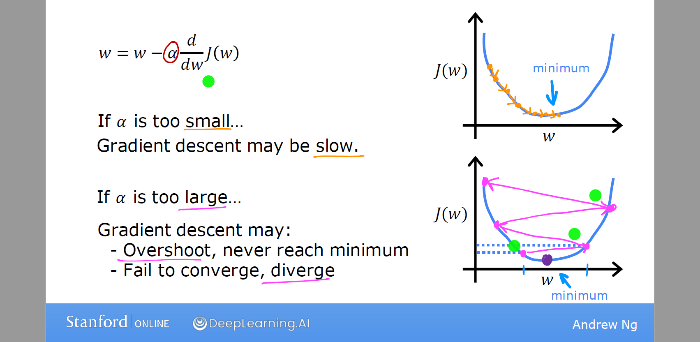
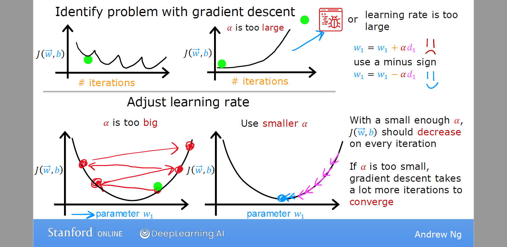
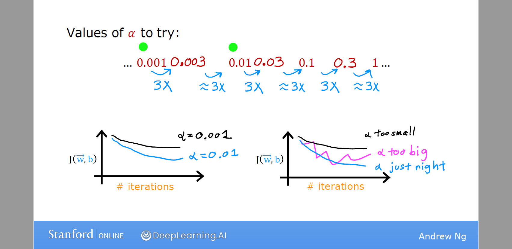
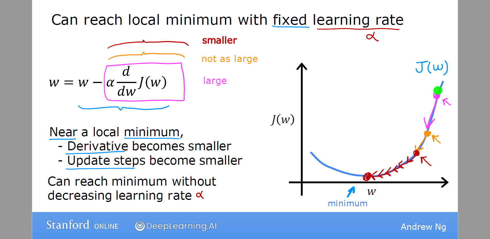
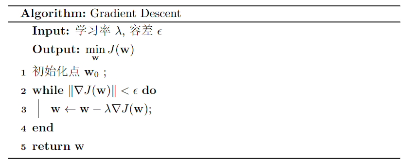
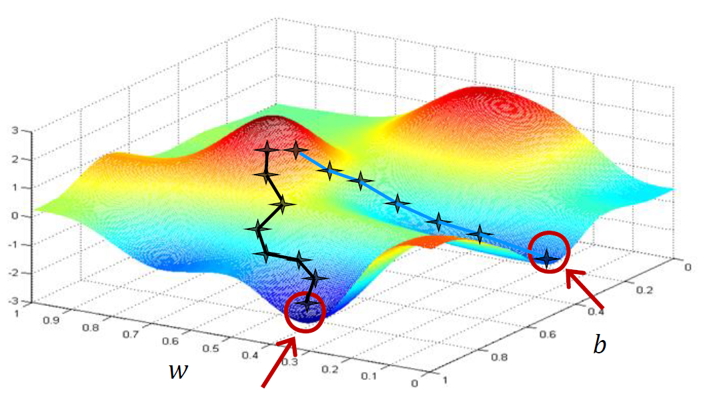
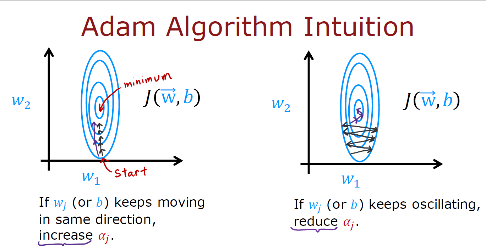

优化是找出函数的最大值或最小值的方法。优化是机器学习的重要课题，因为许多机器学习任务都可以设计成优化问题，例如，最小二乘方法旨在学习最小化SSE模型的回归系数。

<!-- more -->

# 解析解

假设$f(x)$是一元函数，具有连续一阶导数和二阶导数。在无约束的优化问题中，任务是找出最小化或最大化$f(x)$的解$x^*$，而不对$x^*$施加任何约束条件。解$x^*$称作称为临界点（critical point）或驻点（stationary point）。，可以通过取$f$的一阶导数，并令它等于零找到:
$$
\frac{\mathrm{d}y}{\mathrm{d}x}\mid_{x=x^*}=0
$$

$f(x)$可以取极大或极小值，取决于该函数的二阶导数。

-   如果在$x=x^*$有$\cfrac{\mathrm{d}^2y}{\mathrm{d}x^2}<0$，则$x^*$是极大值。
-   如果在$x=x^*$有$\cfrac{\mathrm{d}^2y}{\mathrm{d}x^2}>0$，则$x^*$是极小值。
-   当在$x=x^*$有$\cfrac{\mathrm{d}^2y}{\mathrm{d}x^2}=0$，则$x^*$是拐点。

下图函数包含三个驻点（极大、极小和拐点）：

该定义可以推广到多元函数$f(x_1,x_2,\cdots,x_d)$，这里找驻点$\mathbf x^*=(x_1^*,x_2^*,\cdots,x_d^*)^T$的条件为
$$
\frac{\mathrm{d}y}{\mathrm{d}x_i}\mid_{x_i=x_i^*}=0,\forall i=1,2,\cdots,d \tag{1.1}
$$
然而，不像一元函数，确定$\mathbf x^*$是极大还是极小值更困难。困难的原因在于我们需要对所有可能的一对$i,j$，考虑偏导数$\cfrac{\partial^2 f}{\partial x_i\partial x_j}$。二阶偏导数的完全集由海塞矩阵(Hessian matrix)给出：
$$
\mathbf H(\mathbf x)=\begin{pmatrix}
\cfrac{\partial^2 f}{\partial x_1^2}&\cfrac{\partial^2 f}{\partial x_1\partial x_2}&\cdots&\cfrac{\partial^2 f}{\partial x_1\partial x_d} \\
\cfrac{\partial^2 f}{\partial x_2\partial x_1}&\cfrac{\partial^2 f}{\partial x_2^2}&\cdots&\cfrac{\partial^2 f}{\partial x_2\partial x_d} \\
\vdots &\vdots &\ddots &\vdots \\ 
\cfrac{\partial^2 f}{\partial x_d\partial x_1}&\cfrac{\partial^2 f}{\partial x_d\partial x_2}&\cdots&\cfrac{\partial^2 f}{\partial x_d^2} \\
\end{pmatrix} \tag{1.2}
$$

- 如果$\mathbf H(\mathbf x^*)$是正定的，则$\mathbf x^*$是极小平稳点。黑森矩阵$\mathbf H$是正定的$\iff \forall \mathbf x\not=\mathbf 0,\mathbf x^T\mathbf H\mathbf x>0$
- 如果$\mathbf H(\mathbf x^*)$是正定的，则$\mathbf x^*$是极大平稳点。黑森矩阵$\mathbf H$是正定的$\iff \forall \mathbf x\not=\mathbf 0,\mathbf x^T\mathbf H\mathbf x<0$
- 具有不定黑森矩阵的平稳点是鞍点(saddlepoint)，它在一个方向上具有极小值，在另一个方向上具有极大值。

在许多情况下，找解析解是一个很困难的问题，这就迫使我们使用数值方法找近似解。本文简略回顾用于求解优化问题的各种技术。

# 梯度下降

梯度下降 (Gradient Descent) 是一种优化算法，它被广泛应用于机器学习，是许多算法的基础，比如线性回归、逻辑回归，以及神经网络的早期实现。

目标函数
$$
\min_{\substack{\mathbf w}} J(\mathbf w)
$$
梯度下降法假定函数$J(\mathbf w)$是可微的，并沿梯度方向搜索极值点

1. 初始化随机点 $\mathbf w_0$
2. 沿下降最陡的方向迭代更新 $\mathbf w$ 来减小 $J(\mathbf w)$ 的值
3. 在极小值附近收敛后停止更新

当前到下一轮的迭代公式为
$$
\mathbf w_{t+1}=\mathbf w_t-\lambda\nabla J(\mathbf w_t)
$$
数值 $\lambda\in[0,1]$ 称为学习率 (Learning rate)，作用是控制向下走的每一步的步幅。梯度 $\nabla J(\mathbf w)=\dfrac{\partial J(\mathbf{w})}{\partial\mathbf w}$ 称为导数项 (Derivative) ，控制下降的方向。

更准确的说，这种梯度下降过程称为**批量梯度下降** (batch gradient descent)，指的是每一步都会考虑所有的训练样本。

**学习率**

- 如果 $\lambda$ 太小，梯度下降会起作用，但会很慢。
- 如果 $\lambda$ 太大，梯度下降可能不断跨过最小值，永远不能接近。换一种说法，就是不收敛，甚至可能发散

使用梯度下降法时，通常建议尝试一系列 $\lambda$ 值，对于每一个学习率画出少量迭代的代价函数，在尝试了一系列 $\lambda$ 后，你可能会选择能快速且持续降低 $J$ 的 $\lambda$ 值。

**导数项功效**：当我们接近局部最小值时，导数会自动变小。因此，更新的步幅也会自动变小。即使学习率 $\lambda$ 保持在某个固定值。

**检测梯度下降是否收敛**

- LearningCurve学习曲线: 横轴是梯度下降的迭代次数，纵轴代表代价函数 $J(w,b)$。不同的应用场景中，梯度下降的收敛速度可能有很大差异。事实证明，我们很难事先知道梯度下降要经过多少次迭代才能收敛，所以你可以先画个学习曲线后再训练模型。
- 另一种方法是自动收敛测试(Automatic convergence test): 我们设置一个小数字变量 $\epsilon$ (=0.001)，如果代价函数在一次迭代中减少的量小于这个值，则可以认为它收敛了。

记住，收敛是指你找到了代价函数 $J$ 接近最小值的可能参数。选出正确的 $\epsilon$ 是相当困难的，所以更倾向于使用学习曲线。

**梯度下降法缺点**

# Adam 算法

根据梯度下降的过程，Adam 算法可以自动调整学习率，即对学习率容错性更强。Adam 是 Adaptive Moment estimation (自适应矩估计) 的简称。它通常比梯度下降快得多，已经称为实践者训练神经网络的行业标准。

- 如果参数继续沿着大致相同的方向移动，我们将提高这个参数的学习率。
- 相反，如果一个参数来回振荡，我们将减小这个参数的学习率。

优缺点：

- 不需要手动指定学习率 $\alpha$ 
- 通常收敛速度远大于梯度下降
- 算法过于复杂

Adam 算法并不是全局都使用同一个 $\alpha$ ，模型的每个参数都会用不同的学习率。
$$
\begin{align*} 
\text{repeat}&\text{ until convergence:} \; \lbrace \newline\;
& w_j = w_j -  \alpha_j \frac{\partial J(\mathbf{w},b)}{\partial w_j}  \; & \text{for all }j\newline
&b\ \ = b -  \alpha_0 \frac{\partial J(\mathbf{w},b)}{\partial b}  \newline \rbrace
\end{align*}
$$

# Stochastic Gradient Descent - SGD 随机梯度下降

[1.5 随机梯度下降-scikit-learn中文社区](http://scikit-learn.org.cn/view/84.html)

# 黄金搜索

考虑图中所示的单峰分布，其极小值在区间a和b之间。黄金搜索方法迭代地找相继较小的、包含极小值的区间，直到区间的宽度足够小，可以近似平稳点。为了确定较小的区间，选择两个点c和d，使得区间 $(a,c,d)$ 和$(c,d,b)$具有相等的宽度。令$c-a=b-d=\alpha(b-a), d-c=\beta(b-a)$。因此
$$
1=\frac{(b-d)+(d-c)+(c-a)}{b-a}=\alpha+\beta+\alpha
$$
或等价地
$$
β=1-2α\tag{1.3}
$$
还要选择宽度，满足以下条件，使得我们可以使用递归过程：
$$
\frac{d-c}{b-c}=\frac{c-a}{b-a}
$$
或等价地
$$
\frac{β}{1-α}=α\tag{1.4}
$$
公式(1.3)和公式(1.4)中的方程可以一起求解，得到$\alpha,\beta$。通过比较$f(c)$和$f(d)$，可以确定极小值在区间$(a,c,d)$，还是在区间$(c,d,b)$。然后递归地划分包含最小值的区间，直到区间宽度足够小，可以近似极小值。

**黄金搜索算法**

$\begin{aligned}\hline
1:\ &c=a+α(b-a) \\
2:\ &\textbf{while } b -a >ϵ \mathbf{\ do} \\
3:\ &\quad d=b-α(b-a)  \\
4:\ &\quad \textbf{if } f(d)>f(c) \textbf{ then}  \\
5:\ &\qquad b=d \\
6:\ &\quad \textbf{else} \\
7:\ &\qquad a=c,c=d  \\
8:\ &\quad \textbf{end if} \\
9:\ &\textbf{end while} \\
10:\ &\textbf{return } c \\
\hline\end{aligned}$

除了假定函数在初始区间$[a,b]$中连续并且是单峰的之外，黄金搜索方法不对函数做其他假定。它线性收敛于极小值解。

# 牛顿法

牛顿法是使用如下更新方程渐近地寻找函数的平稳点的多种增量方法之一：
$$
\mathbf x=\mathbf x+\lambda g(\mathbf x)\tag{1.7}
$$
函数$g(\mathbf x)$确定搜索方向，而$\lambda$确定步长。

牛顿法基于使用函数$f(x)$的二次近似。通过使用$f$在$x_0$的泰勒级数展开式，得到如下表达式：
$$
f(x)= f(x_0)+(x-x_0)f'(x_0)+\frac{(x-x_0)^2}{2}f''(x_0)\tag{1.5}
$$
取该函数关于$x$的导数，并令它等于零，得到如下等式：
$$
f'(x)= f'(x_0)+(x-x_0)f''(x_0)=0 \\
x=x_0-\frac{f'(x_0)}{f''(x_0)}
\tag{1.6}
$$
可以使用公式(1.6)更新$x$，直到它收敛于极小值。可以证明牛顿法是二次收敛的，尽管它可能不收敛，特别是当初始点$x_0$远离极小值时。

**牛顿法**：

$\begin{aligned}\hline
1:\ &\text{令}x_0\text{为初始点} \\
2:\ &\textbf{while}\ |f'(x_0)|>ϵ \mathbf{\ do} \\
3:\ &\quad x=x_0-\cfrac{f'(x_0)}{f''(x_0)} \\
4:\ &\quad x_0=x \\
5:\ &\textbf{end while} \\
6:\ &\textbf{return } x \\
\hline\end{aligned}$

用梯度算子$\nabla f(\mathbf x)$替换一阶导数$f'(x)$，用黑森矩阵$\mathbf H$替换二阶导数$f''(x)$，可以把牛顿法推广到多元数据：
$$
\mathbf x=\mathbf x-\mathbf H^{-1}\nabla f(\mathbf x)
$$
然而，更容易的办法不是计算黑森矩阵的逆，而是解如下方程：
$$
\mathbf{Hz}=-\nabla f(\mathbf x)
$$
来得到向量$\mathbf z$。找平稳点的迭代公式修改为$\mathbf{x=x+z}$。

# 约束优化

本节考察当变量受限于各种约束时如何解优化问题。

## 等式约束

考虑受限于如下形式的等式约束：
$$
g_i(\mathbf x)=0,i= 1,2,\cdots,p
$$
求$f(x_1,x_2,\cdots,x_d)$的极小值问题。

一种称作拉格朗日乘子的方法可以用来解约束优化问题。该方法涉及如下步骤。
(1) 定义拉格朗日函数
$$
L(\mathbf x,λ)=f(\mathbf x)+\sum_{i=1}^{p} λ_ig_i(\mathbf x)
$$
其中$λ_i$是哑变量，称作拉格朗日乘子(Lagrange multiplier)。
(2) 令拉格朗日函数关于$\mathbf x$和拉格朗日乘子的一阶导数等于0：
$$
\cfrac{\partial L}{\partial x_i}=0,\forall i=1,2,\cdots,d
$$
并且
$$
\cfrac{\partial L}{\partial λ_i}=0,\forall i=1,2,\cdots,p
$$
(3) 求解步骤(2)得到的$(d+p)$个方程，得到平稳点$\mathbf x^*$和对应的$λ_i$的值。

## 不等式约束

考虑受限于如下形式的等式约束：
$$
h_i(\mathbf x)=0,i= 1,2,\cdots,q
$$
求$f(x_1,x_2,\cdots,x_d)$的最小值问题。

求解这类问题的方法与上面介绍的拉格朗日方法非常相似。然而，不等式约束把一些附加条件施加到优化问题上。特殊地，上述优化问题导致如下拉格朗日函数：
$$
L(\mathbf x,λ)=f(\mathbf x)+\sum_{i=1}^{q} λ_ih_i(\mathbf x)
$$
和称作Karush-Kuhn-Tucker(KKT)条件的约束：
$$
\cfrac{\partial L}{\partial x_i}=0,\forall i=1,2,\cdots,d \\
h_i(\mathbf x)\leqslant 0,\forall i=1,2,\cdots,q \\
λ_i\geqslant 0,\forall i=1,2,\cdots,q \\
λ_ih_i(\mathbf x)=0,\forall i=1,2,\cdots,q \\
$$
注意，拉格朗日乘子在不等式约束中出现，不再是不受限的。
求解KKT条件可能是一项相当艰巨的任务，当约束不等式的数量较大时尤其如此。在这种情况下，求闭型解不再可行，而需要使用诸如线性和二次规划这样的数值优化技术。

# 高级优化算法

- Conjugate gradie
- BFGS  共轭梯度算法
- L-BFGS
