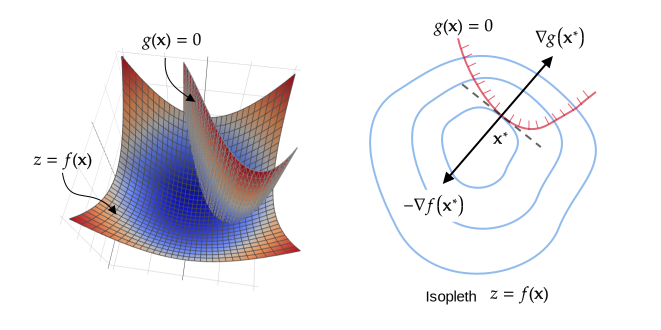
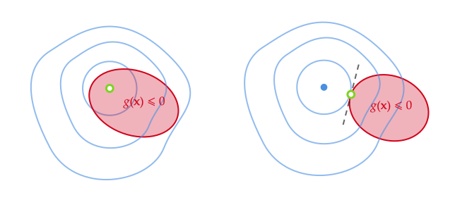
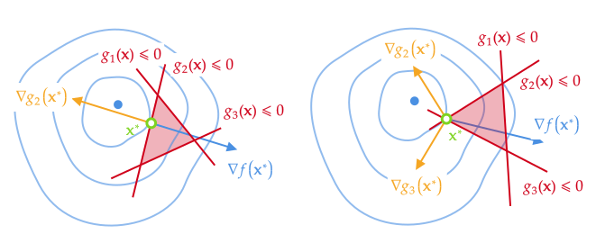
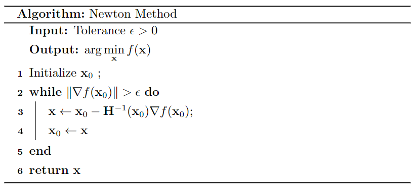
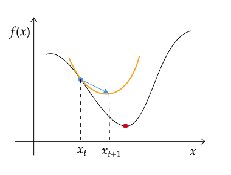
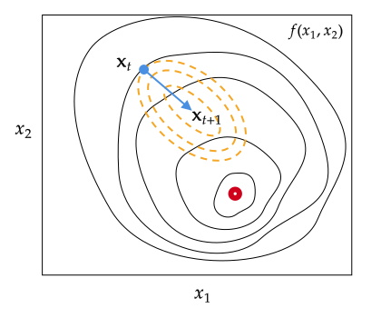
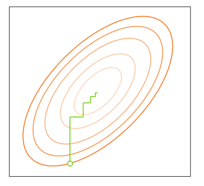

大多数机器学习算法都涉及某种形式的优化。优化指的是改变 $\mathbf x$ 以最小化或最大化 $f(\mathbf x)$ 的任务。我们通常以最小化 $f(\mathbf x)$ 指代大多数最优化问题，最大化可经由最小化 $-f(\mathbf x)$ 来实现。

# 函数极值

考虑无约束优化问题
$$
\min\limits_{\mathbf x} f(\mathbf x)
$$
假定目标函数 $f(\mathbf x)$ 二阶连续可微，自变量 $\mathbf x\in\R^n$。一元函数对极值的推导可以推广到多元函数，函数取得极值的必要条件是导数为0。无约束的优化问题中
$$
\nabla f(\mathbf x)=\frac{\partial f(\mathbf x)}{\partial\mathbf x}=0
$$
梯度为0的点称为临界点（critical point）或驻点（stationary point）。下图为三种驻点：极大、极小和鞍点

极大或极小值的判定，取决于该函数的二阶导数，Hessian矩阵是由多元函数的二阶偏导数组成的矩阵
$$
\mathbf H(\mathbf x)=\begin{pmatrix}
\cfrac{\partial^2 f}{\partial x_1^2}&\cfrac{\partial^2 f}{\partial x_1\partial x_2}&\cdots&\cfrac{\partial^2 f}{\partial x_1\partial x_n} \\
\cfrac{\partial^2 f}{\partial x_2\partial x_1}&\cfrac{\partial^2 f}{\partial x_2^2}&\cdots&\cfrac{\partial^2 f}{\partial x_2\partial x_n} \\
\vdots &\vdots &\ddots &\vdots \\ 
\cfrac{\partial^2 f}{\partial x_n\partial x_1}&\cfrac{\partial^2 f}{\partial x_n\partial x_2}&\cdots&\cfrac{\partial^2 f}{\partial x_n^2} \\
\end{pmatrix}
$$
一般情况下，多元函数的混合二阶偏导数与求导次序无关
$$
\cfrac{\partial^2 f}{\partial x_i\partial x_j}=\cfrac{\partial^2 f}{\partial x_j\partial x_i}
$$
因此Hessian矩阵是一个对称矩阵。多元函数极值的判别如下

- 如果Hessian矩阵在该点是正定的，则函数在该点有极小值；
- 如果Hessian矩阵在该点是负定的，则函数在该点有极大值；
- 如果Hessian矩阵在该点是不定的，则该点为鞍点，它在一个方向上具有极小值，在另一个方向上具有极大值。

> 对于 $n$ 阶矩阵 $\mathbf A$ ，若对任意的$n$维非0向量 $\mathbf x$ 都有
> (1)  $\mathbf x^T\mathbf A\mathbf x>0$ ，则称矩阵$\mathbf A$为正定矩阵
> (2)  $\mathbf x^T\mathbf A\mathbf x<0$ ，则称矩阵$\mathbf A$为负定矩阵
> 若 $\mathbf x^T\mathbf A\mathbf x\geqslant 0$ ，则称矩阵$\mathbf A$为半正定矩阵

在许多情况下，找解析解是一个很困难的问题，这就迫使我们使用数值方法找近似解，最常用的求解算法包括梯度下降法，牛顿法，拟牛顿法等。

# 拉格朗日乘数法

## 等式约束

**拉格朗日乘数法**（Lagrange multipliers）是一种寻找多元函数在一组约束下的极值的方法。通过引入拉格朗日乘数，可将有 $n$ 个变量与 $l$ 个约束条件的最优化问题转化为具有 $n+l$ 个变量的无约束优化问题求解。

考虑约束优化问题
$$
\begin{aligned}
\min\limits_{\mathbf x}& f(\mathbf x) \\
\text{s.t.} &\quad h_i(\mathbf x)= 0 ,\quad i=1,2,\cdots l 
\end{aligned}
$$
**几何意义**：对于一个具有等式约束的优化问题
$$
\begin{aligned}
\min\limits_{\mathbf x}& f(\mathbf x) \\
\text{s.t.} &\quad h(\mathbf x)= 0
\end{aligned}
$$
从几何角度看，该问题的目标是在由方程 $h(\mathbf x)=0$ 确定的 $n-1$ 维曲面上寻找目标函数的极小点。

如图所示，  $f(\mathbf x)=c_m$ 为目标函数的等值线 （蓝色），约束曲线 $h(\mathbf x)=0$ （红色）。对于约束曲面上的任意点 $\mathbf x$ ，该点的梯度 $\nabla h(\mathbf x)$ 正交于约束曲面。假设 $\mathbf x_0$ 是约束曲线和等高线的交点，我们沿着 $h(\mathbf x)=0$ 移动，总能走到更高或更低的等高线上，直至约束曲线和等高线相切。也就是说，极值点必是目标函数 $f(\mathbf x)$ 等值线族中与约束曲线 $h(\mathbf x)$ 能相切的那个切点 。

假设切点为 $\mathbf x^*$ ，因为两曲线在切点处必有公法线，则两曲线在切点处的梯度向量共线，即存在 $\lambda\neq0$ ，使下式成立
$$
\begin{aligned}
&\nabla f(\mathbf x^*)+\lambda\nabla h(\mathbf x^*)=0 \\
&\text{s.t.}\quad h(\mathbf x^*)= 0
\end{aligned}
$$
参数 $\lambda$ 称为拉格朗日乘数（Lagrange multiplier）。定义拉格朗日函数（Lagrangian function）
$$
L(\mathbf x,λ)=f(\mathbf x)+λh(\mathbf x)
$$
不难发现原问题等价于
$$
\begin{cases}
\nabla_{\mathbf x} L(\mathbf x,λ)=0 \\
\nabla_{\lambda} L(\mathbf x,λ)=0
\end{cases}
$$
于是，原等式约束优化问题转化为对拉格朗日函数 $L(\mathbf x,λ)$ 的无约束优化问题。

**简易证明**：**(1)** 求目标函数 $f(x,y,z)$ 在一个约束条件 $G(x,y,z)=0$ 的极值。

假设约束条件可确定隐函数
$$
z=z(x,y)
$$
带入目标函数，原问题就转化为二元函数
$$
\varphi(x,y)=f(x,y,z(x,y))
$$
的无条件极值问题。取极值的必要条件为
$$
\frac{\partial\varphi}{\partial x}=f_x+f_z\frac{\partial z}{\partial x}=0 \\  
\frac{\partial\varphi}{\partial y}=f_y+f_z\frac{\partial z}{\partial y}=0
$$
另一方面将二元函数 $z=z(x,y)$ 带入约束条件得恒等式
$$
G(x,y,z(x,y))=0
$$
对 $x,y$ 分别求导，得
$$
G_x+G_z\frac{\partial z}{\partial x}=0 \\
G_y+G_z\frac{\partial z}{\partial y}=0
$$
由此，可知
$$
\frac{f_x}{G_x}=\frac{f_y}{G_y}=\frac{f_z}{G_z}
$$
方程组形式为
$$
f_yG_z-f_zG_y=0 \\  
f_xG_z-f_zG_x=0 \\
f_xG_y-f_yG_x=0
$$
即极值点处，目标函数的梯度 $\nabla f=(f_x,f_y,f_z)$ 和约束条件的梯度 $\nabla G=(G_x,G_y,G_z)$ 外积为零
$$
\nabla f\times \nabla G=\begin{vmatrix} \mathbf i & \mathbf h & \mathbf k \\
f_x & f_y & f_z \\ G_x & G_y & G_z\end{vmatrix}=0
$$
也就是极值点处 $\nabla f$ 和 $\nabla G$ 共线。不妨设 $\nabla f+\lambda \nabla G=0$ ，则上述问题可转化为
$$
\begin{cases}
f_x(x,y,z)+\lambda G_x(x,y,z)=0 \\
f_y(x,y,z)+\lambda G_y(x,y,z)=0 \\
f_z(x,y,z)+\lambda G_z(x,y,z)=0 \\
G(x,y,z)=0
\end{cases}
$$
引进辅助函数
$$
L(x,y,z,\lambda)=f(x,y,z)+\lambda G(x,y,z)
$$
我们容易看出方程组等价于 $\nabla L(x,y,z,\lambda)=0$ 。函数 $L$ 称为拉格朗日函数，参数 $\lambda$ 称为拉格朗日乘数。

**(2)** 求三元函数 $f(x,y,z)$ 在两个约束条件 $G(x,y,z)=0,H(x,y,z)=0$ 的极值。

两个约束条件的交集可确定，参数形式可写为
$$
\begin{cases}
x=x \\
y=y(x) \\
z=z(x)  
\end{cases}
$$
带入目标函数，原问题就转化为一元函数
$$
\varphi(x)=f(x,y(x),z(x))
$$
的无条件极值问题。取极值的必要条件为
$$
\frac{\partial\varphi}{\partial x}=f_x+f_y\frac{\mathrm dy}{\mathrm dx}+f_z\frac{\mathrm dz}{\mathrm dx}=0
$$
另一方面，将 $y=y(x),z=z(x)$ 带入约束条件得恒等式
$$
G(x,y(x),z(x))=0 \\
H(x,y(x),z(x))=0
$$
两式对 $x$ 求导，得
$$
G_x+G_y\frac{\mathrm dy}{\mathrm dx}+G_z\frac{\mathrm dz}{\mathrm dx} =0 \\
H_x+H_y\frac{\mathrm dy}{\mathrm dx}+H_z\frac{\mathrm dz}{\mathrm dx} =0
$$
再加上取极值的必要条件，我们知道以下三个梯度
$$
\nabla f=(f_x,f_y,f_z) \\
\nabla G=(G_x,G_y,G_z) \\
\nabla H=(H_x,H_y,H_z)
$$
在极值点处都与向量 $(1,\dfrac{\mathrm dy}{\mathrm dx},\dfrac{\mathrm dz}{\mathrm dx})$ 垂直。所以这三个梯度在极值点是**共面**的，即他们的混合积为零
$$
[\nabla f\ \nabla G\ \nabla H]=\begin{vmatrix}
f_x & f_y & f_z \\ G_x & G_y & G_z \\ H_x & H_y & H_z
\end{vmatrix}=0
$$
不妨设 $\nabla f+\lambda_1 \nabla G+\lambda_2 \nabla H=0$ ，则原问题可转化为
$$
\nabla f+\lambda_1 \nabla G+\lambda_2 \nabla H=0 \\
G=0,H=0
$$
引进拉格朗日函数 
$$
L(x,y,z,\lambda_1,\lambda_2)=f(x,y,z)+\lambda_1G(x,y,z)+\lambda_2H(x,y,z)
$$
则上述方程组等价于 $\nabla L(x,y,z,\lambda_1,\lambda_2)=0$ 。

**(3)** 考虑高维优化问题
$$
\begin{aligned}
\min\limits_{\mathbf x}& f(\mathbf x) \\
\text{s.t.}&\quad h_i(\mathbf x)= 0, \quad i=1,2,\cdots,l
\end{aligned}
$$
其中，定义域 $D\in\R^n$ 。现使用**行向量**记
$$
\mathbf x=(x_1,x_2,\cdots,x_n)=(x_1,\cdots,x_r,x_{r+1}\cdots,x_{r+l})=(\mathbf y,\mathbf z)
$$
 其中 $\mathbf y\in\R^r,\mathbf z\in\R^l,n=r+l$ 。并使用$k$ 维向量函数 $\mathbf h:D\to\R^l$ 记约束条件 $\mathbf h(\mathbf x)= 0$ 。

优化问题可记作向量形式
$$
\begin{aligned}
\min\limits_{\mathbf x}& f(\mathbf{y,z}) \\
\text{s.t.}&\quad \mathbf h(\mathbf{y,z})= 0
\end{aligned}
$$

> 本节使用**分子布局**：分子为列向量。分子布局与分母布局只是相差一个转置。

若满足隐函数存在定理，约束条件可确定唯一隐函数
$$
\mathbf z=\mathbf z(\mathbf y)
$$
于是由复合函数的求导法则，知
$$
\frac{\partial\mathbf h}{\partial\mathbf y}+\frac{\partial\mathbf h}{\partial\mathbf z}\frac{\mathrm d\mathbf z}{\mathrm d\mathbf y}=0
$$
取极值的必要条件为
$$
\frac{\partial f}{\partial\mathbf y}+\frac{\partial f}{\partial\mathbf z}\frac{\mathrm d\mathbf z}{\mathrm d\mathbf y}=0
$$
于是得到极值点处
$$
\frac{\partial f}{\partial\mathbf y}\left(\frac{\partial\mathbf h}{\partial\mathbf y}\right)^{-1}-\frac{\partial f}{\partial\mathbf z}\left(\frac{\partial\mathbf h}{\partial\mathbf z}\right)^{-1}=0
$$
引入拉格朗日乘数向量  $\lambda=(\lambda_1,\lambda_2,\cdots,\lambda_l)^T$，设
$$
\frac{\partial f}{\partial\mathbf y}\left(\frac{\partial\mathbf g}{\partial\mathbf y}\right)^{-1}=\frac{\partial f}{\partial\mathbf z}\left(\frac{\partial\mathbf g}{\partial\mathbf z}\right)^{-1}=-\lambda^T
$$
可转化为
$$
\frac{\partial f}{\partial\mathbf y}+\lambda^T\frac{\partial\mathbf h}{\partial\mathbf y}=0 \\
\frac{\partial f}{\partial\mathbf z}+\lambda^T\frac{\partial\mathbf h}{\partial\mathbf z}=0
$$
于是定义拉格朗日函数为
$$
L(\mathbf y,\mathbf z,λ)=f(\mathbf y,\mathbf z)+\lambda^T\mathbf h(\mathbf{y,z})
$$
原问题等价于
$$
\nabla L(\mathbf x,λ)=0
$$
拉格朗日乘数法的**具体步骤**如下：

(1) 定义拉格朗日函数
$$
L(\mathbf x,λ)=f(\mathbf x)+\sum_{i=1}^{l} λ_ih_i(\mathbf x)
$$
其中 $λ_i$ 称作拉格朗日乘数（Lagrange multiplier）。
(2) 令拉格朗日函数关于 $\mathbf x$ 和拉格朗日乘数 $\lambda$ 的梯度等于零
$$
\begin{cases}
\dfrac{\partial L}{\partial x_j}=0, &j=1,2,\cdots,n \\
\dfrac{\partial L}{\partial \lambda_i}=0, &i=1,2,\cdots,l
\end{cases}
$$
(3) 求解得到的$(n+l)$个方程，即可得到极值点。

拉格朗日乘数法所得的驻点会包含原问题的所有最小解，但并不保证每个驻点都是原问题的最小解。

##  不等式约束

现在进一步考虑不等式约束优化问题，先考虑一个不等式约束
$$
\begin{aligned}
\min\limits_{\mathbf x}& f(\mathbf x) \\
\text{s.t.}&\quad g(\mathbf x)\leqslant 0
\end{aligned}
$$
引入拉格朗日函数
$$
L(\mathbf x,\mu)=f(\mathbf x)+\mu g(\mathbf x)
$$

图中阴影部分代表不等式约束表示的可行域，我们可以根据目标函数 $f(\mathbf x)$ 的最优解 $\mathbf x^*$ 是否在可行域内将这类不等式约束优化问题分为两类：

- $g(\mathbf x^*)<0$ 即最优点在不等式区域内，此时不等式约束不起作用，可直接通过求解 $\nabla f(\mathbf x)=0$ 求解最优点。这等价于设置 $\mu=0$ 时，求解 $\nabla L(\mathbf x^*,\mu)=0$ 获得最优点。
- $g(\mathbf x^*)=0$ 即最优点在区域边界上，此时不等式约束退化为等式约束。若要在边界上取得极小值，等值面的梯度必定是指向 $g(\mathbf x)<0$ 区域内，而 $g(\mathbf x)=0$ 的梯度显然是向外。因此，最优解处 $\nabla f(\mathbf x^*)$ 的方向必须与 $\nabla g(\mathbf x^*)$ 的**相反**，即存在常数 $\mu>0$ 使得 $\nabla L(\mathbf x^*,\mu)=0$ 。

整合这两种情形，必满足  $\mu g(\mathbf x)=0$。因此，原问题可转化成在如下约束条件下最小化拉格朗日函数 
$$
\begin{cases}
\nabla_{\mathbf x}L=\nabla f(\mathbf x)+\mu \nabla g(\mathbf x)=0 \\
g(\mathbf x)\leqslant 0 \\
\mu \geqslant 0 \\
\mu g(\mathbf x)=0
\end{cases}
$$
这些条件合称为 **KKT (Karush-Kuhn-Tucker)** 条件。不等式约束优化问题中的拉格朗日乘数也称为KKT 乘数。KKT条件将Lagrange乘数法所处理涉及等式的约束优化问题推广至不等式。

> 注意，拉格朗日乘数在不等式约束中出现，不再是不受限的。

上述做法可推广到多个不等式约束
$$
\begin{aligned}
\min\limits_{\mathbf x}& f(\mathbf x) \\
\text{s.t.}&\quad g_i(\mathbf x)\leqslant 0 \quad i=1,2,\cdots,k 
\end{aligned}
$$

- 若最优点 $\mathbf x^*$ 在不等式区域内 $g_i(\mathbf x^*)<0$ 。此时不等式约束不起作用，可直接通过求解 $\nabla f(\mathbf x)=0$ 求解最优点。这等价于拉格朗日乘子全部为零 $\mu_i=0$ ，求解 $\nabla L(\mathbf x^*,\mu)=0$ 获得最优点。
- 若最优点 $\mathbf x^*$ 位于第 $t$ 个边界上 $g_t(\mathbf x^*)=0$ 。此时不等式约束退化为一个等式约束，$\nabla f(\mathbf x^*)+\mu_t\nabla g_t(\mathbf x^*)=0$，常数 $\mu_t>0$ 。等价于拉格朗日乘子可全部设置为零，求解 $\nabla L(\mathbf x^*,\mu)=0$ 获得最优点。
- 若最优点 $\mathbf x^*$ 位于多个边界的交界面上。此时不等式约束退化为等式约束，交界面对应的拉格朗日乘子大于零，其他拉格朗日乘子可全部设置为零，求解 $\nabla L(\mathbf x^*,\mu)=0$ 获得最优点。

以上约束条件必满足  $\mu_i g_i(\mathbf x)=0$，称为互补松弛性(complementary slackness)。因此，原问题可转化成在如下约束条件下最小化拉格朗日函数 
$$
\begin{cases}
\displaystyle\nabla_{\mathbf x}L=\nabla f(\mathbf x)+\sum_{i=1}^k\mu_i \nabla g_i(\mathbf x)=0 \\
g_i(\mathbf x)\leqslant 0 \\
\mu_i \geqslant 0 \\
\mu_i g_i(\mathbf x)=0
\end{cases}
$$
一般地，考虑具有 $k$ 个不等式约束和 $l$ 个等式约束的的优化问题：
$$
\begin{aligned}
\min\limits_{\mathbf x}& f(\mathbf x) \\
\text{s.t.} &\quad h_i(\mathbf x)= 0 ,\quad i=1,2,\cdots l \\
&\quad g_j(\mathbf x)\leqslant 0 ,\quad j=1,2,\cdots k 
\end{aligned}
$$
引入拉格朗日乘子 $\lambda=(\lambda_1,\lambda_2,\cdots,\lambda_l)^T$ 和 $\mu=(\mu_1,\mu_2,\cdots,\mu_k)^T$， 相应的拉格朗日函数为
$$
L(\mathbf x,\lambda,\mu)=f(\mathbf x)+\sum_{i=1}^l\lambda_i h_i(\mathbf x)+\sum_{j=1}^k\mu_j g_j(\mathbf x)
$$
其KKT条件为 $(i=1,2,\cdots,l;j=1,2,\cdots,k)$
$$
\begin{cases}
\displaystyle\nabla_{\mathbf x}f(\mathbf x)+\sum_{i=1}^l\lambda_i \nabla_{\mathbf x}h_i(\mathbf x)+\sum_{j=1}^k\mu_j \nabla_{\mathbf x}g_j(\mathbf x)=0 \\
h_i(\mathbf x)=0 \\
g_j(\mathbf x)\leqslant 0 \\
\mu_j \geqslant 0 \\
\mu_j g_j(\mathbf x)=0
\end{cases}
$$
KKT 条件是非线性规划（nonlinear programming）最优解的必要条件而不是充分条件。在实际应用上，KKT条件(方程组)一般不存在代数解，许多优化算法可供数值计算选用。

## 对偶问题

KKT条件虽然从理论上给出了极值的必要条件，但实际上方程解不一定好求。于是，我们又引入了它的对偶问题来辅助求解。对偶问题是利用拉格朗日对偶性将原始问题转换为对偶问题，通过解对偶问题得到原始问题的解。

**原始问题（primal problem）**：考虑约束最优化问题
$$
\begin{aligned}
\min\limits_{\mathbf x}& f(\mathbf x) \\
\text{s.t.} &\quad h_i(\mathbf x)= 0 ,\quad i=1,2,\cdots l \\
&\quad g_j(\mathbf x)\leqslant 0 ,\quad j=1,2,\cdots k 
\end{aligned}
$$
首先引入拉格朗日函数
$$
L(\mathbf x,\lambda,\mu)=f(\mathbf x)+\sum_{i=1}^l\lambda_i h_i(\mathbf x)+\sum_{j=1}^k\mu_j g_j(\mathbf x)
$$
其中$\lambda_i,\mu_j$ 是拉格朗日乘数，$\mu_j \geqslant 0$ 。我们再定义函数
$$
\theta_p(\mathbf x)=\max_{\lambda,\mu;\mu\geqslant 0} L(\mathbf x,\lambda,\mu)
$$
我们可以通过 $\mathbf x$ 是否满足原始问题的约束条件来分析函数 $\theta_p$：

(1) 如果存在违反原始约束的条件，即有 $h_i(\mathbf x)\neq 0$ 或 $g_j(\mathbf x)>0$  。此时可通过调整 $\lambda_i$ 使得 $\lambda_i h_i(\mathbf x)\to+\infty$ ，或者调整 $\mu_j\to+\infty$ 使得 $\mu_j g_j(\mathbf x)\to+\infty$ ，而将其余各 $\lambda_i,\mu_j$ 均取为零。那么就有
$$
\theta_p(\mathbf x)=\max_{\lambda,\mu;\mu\geqslant 0} \left[f(\mathbf x)+\sum_{i=1}^l\lambda_i h_i(\mathbf x)+\sum_{j=1}^k\mu_j g_j(\mathbf x)\right]=+\infty
$$
(2) 如果满足原始约束条件，则一定是令 $g_j(\mathbf x)=0$  ，同时 $h_i(\mathbf x)=0$ 。因此 $\theta_p(\mathbf x)$ 为定值
$$
\theta_p(\mathbf x)=\max_{\lambda,\mu;\mu\geqslant 0} L(\mathbf x,\lambda,\mu)=f(\mathbf x)
$$
整合这两种情形
$$
\theta_p(\mathbf x)=\begin{cases}
f(\mathbf x), & \text{if } h_i(\mathbf x)= 0\text{ and }g_j(\mathbf x)\leqslant 0\\
+\infty, & \text{others}
\end{cases}
$$
如果考虑极小化问题
$$
\min_{\mathbf x} \theta_p(\mathbf x)=\min_{\mathbf x}\max_{\lambda,\mu;\mu\geqslant 0}L(\mathbf x,\lambda,\mu)=\min_{\mathbf x}\max\{+\infty,f(\mathbf x)\}
$$
所以无约束 $\min\limits_{\mathbf x} \theta_p(\mathbf x)$ 等价于在原始约束条件下的 $\min\limits_{\mathbf x} f(\mathbf x)$ ，即它们有相同的解。问题 $\min_{\mathbf x}\max_{\lambda,\mu;\mu\geqslant 0}L(\mathbf x,\lambda,\mu)$ 称为拉格朗日函数的 **Min-Max 问题**。

综上所述，我们可以把原始问题中的约束条件去掉，得到原始问题的等价问题：
$$
\min_{\mathbf x}\max_{\lambda,\mu} L(\mathbf x,\lambda,\mu) \\
\text{s.t. }\mu_j\geqslant 0
$$
为了方便，定义原始问题的最优值
$$
p^*=\min_{\mathbf x} \theta_p(\mathbf x)
$$
**对偶问题**（dual problem）：定义**对偶函数**
$$
\theta_D(\lambda,\mu)=\min_{\mathbf x} L(\mathbf x,\lambda,\mu)
$$
对偶函数是以 $\lambda,\mu$ 为自变量的函数。对于给定的 $\lambda,\mu$，在可行域内变动 $\mathbf x$ ，拉格朗日函数 $L$ 最小值就是 $\theta_D$ 的值。对偶函数可令 $\nabla L_{\mathbf x}(\mathbf x,\lambda,\mu)=0$ 求得。

再考虑极大化问题
$$
\max_{\lambda,\mu;\mu\geqslant 0}\theta_D(\lambda,\mu)=\max_{\lambda,\mu;\mu\geqslant 0}\min_{\mathbf x} L(\mathbf x,\lambda,\mu)
$$
称为拉格朗日函数的 **Max-Min 问题**，可表示为约束最优化为题
$$
\max_{\lambda,\mu}\min_{\mathbf x} L(\mathbf x,\lambda,\mu) \\
\text{s.t. }\mu_j\geqslant 0
$$
称为原始问题的对偶问题。定义对偶问题的最优值
$$
d^*=\max_{\lambda,\mu;\mu\geqslant 0}\theta_D(\lambda,\mu)
$$
**原始问题和对偶问题的关系**：对任意的 $\mathbf x,\lambda,\mu$ 都有
$$
\theta_D(\lambda,\mu)=\min_{\mathbf x} L(\mathbf x,\lambda,\mu)\leqslant L(\mathbf x,\lambda,\mu)\leqslant \max_{\lambda,\mu;\mu\geqslant 0} L(\mathbf x,\lambda,\mu)=\theta_p(\mathbf x)
$$
即对偶函数满足
$$
\theta_D(\lambda,\mu)\leqslant\theta_p(\mathbf x)
$$
则原始问题和对偶问题的最优值满足
$$
d^*=\max_{\lambda,\mu;\mu\geqslant 0}\min_{\mathbf x} L(\mathbf x,\lambda,\mu)\leqslant \min_{\mathbf x}\max_{\lambda,\mu;\mu\geqslant 0} L(\mathbf x,\lambda,\mu)=p^*
$$

在某些条件下，$d^*=p^*$ ，由对偶问题的最优值即可得到原始问题的最优值。

- 最优值显然满足 $d^*\leqslant p^*$ ，这称为**弱对偶性**（weak duality）。$p^*-d^*$ 称为最优对偶间隙（duality gap），是一个非负值。
- 若 $d^*=p^*$，则称为**强对偶性**（strong duality）成立。强对偶成立必须满足以下条件：
  - 原始问题是凸优化问题：$f(\mathbf x)$ 和 $g_j(\mathbf x)$ 均为凸函数，$h_i(\mathbf x)$ 为仿射函数；
  - 可行域中至少有一点使不等式约束严格成立。

在强对偶性成立时，将拉格朗日函数分别对原变量和对偶变量求导，再并令导数等于霉，即可得到原变量与对偶变量的数值关系。

**为什么要求对偶问题？**

1. 约束减少了，对偶问题只剩 n 个不等式约束；
2. 主问题不一定是凸优化问题（局部最优不一定是全局最优），对偶问题一定是凸优化问题。

# 梯度下降法

梯度下降法的一系列算法在众多文章中表述均有差异，本文为了理解方便，以Adam算法公式为基准构造其他梯度下降系公式，符号均和Adam算法保持一致，其本质是一样的，最终结果经过变换也是相同的。统一初始点记为 $\mathbf x_0$，第一次迭代记为 $t=1$ 。

## 梯度下降法

梯度下降法（Gradient Descent，GD）也称最速下降法（steepest descent），是一种常用的一阶（first-order）优化方法，是求解无约束优化问题最简单、最经典的迭代方法之一。它被广泛应用于机器学习，是许多算法的基础，比如线性回归、逻辑回归，以及神经网络的早期实现。

考虑无约束优化问题
$$
\min\limits_{\mathbf x} f(\mathbf x)
$$
假定目标函数$f(\mathbf x)$连续可微，自变量 $\mathbf x\in\R^n$。

**基本思路**：梯度下降法希望通过不断执行迭代过程**收敛**到极小点，即构造一个序列 $\mathbf x_0,\mathbf x_1,\mathbf x_2,\cdots$ ，每次迭代都满足
$$
f(\mathbf x_{t})<f(\mathbf x_{t-1}),\quad t=1,2,\cdots
$$
假设第 $t$ 次迭代值为 $\mathbf x_t$ 。梯度下降法使用泰勒一阶展开式[^taylor]来近似代替目标函数
$$
f(\mathbf x)\approx f(\mathbf x_{t-1})+\Delta\mathbf x^T\mathbf g_t
$$
这里 $\mathbf g_t=\nabla f(\mathbf x_{t-1})$ 为 $f(\mathbf x)$ 在 $\mathbf x_{t-1}$ 的梯度向量，$\Delta\mathbf x=\mathbf x-\mathbf x_{t-1}$。

我们希望找到使 $f$ 下降的最快的方向，即求解
$$
\begin{aligned}
\min_{\Delta\mathbf x}f(\mathbf x)
&\approx\min_{\Delta\mathbf x}f(\mathbf x_{t-1})+\Delta\mathbf x^T\mathbf g_t \\
&= \min_{\Delta\mathbf x}\Delta\mathbf x^T\mathbf g_t \\
&=\min_{\Delta\mathbf x}\|\Delta\mathbf x\|_2\|\mathbf g_t\|_2\cos\theta
\end{aligned}
$$
上式中 $\theta$ 为 $\Delta\mathbf x$ 和梯度向量的夹角。函数值 $f(\mathbf x_{t-1})$ 为常数，去除后不影响。

当移动方向与梯度方向相反时（即 $\cos\theta=-1$）取得最小值，也就是沿着负梯度曲线移动能最快到达极值点。

由于梯度曲线是连续曲线，每次迭代步长要无限小才是最短路径。考虑迭代次数有限，加入一个接近于0的正数控制下降的步幅。因此梯度下降法的迭代公式为
$$
\mathbf x_{t}=\mathbf x_{t-1}-\lambda\mathbf g_t
$$
数值 $\lambda>0$ 称为**学习率** (learning rate)，作用是控制下降的步幅。梯度向量 $\mathbf g_t$ 控制下降的方向。

注意：初始位置的不同可能导致下降到不同的极值点。梯度下降不一定能够找到全局的最优解，有可能是一个局部最优解。当目标函数为凸函数时，局部极小点就对应着函数的全局最小点。

**学习率**：通过选取合适的步长 $\lambda$，就能确保通过梯度下降收敛到局部极小点。

- 如果 $\lambda$ 太小，梯度下降会起作用，但会很慢
- 如果 $\lambda$ 太大，梯度下降可能不断跨过最小值，永不收敛

使用梯度下降法时，通常建议尝试一系列 $\lambda$ 值，对于每一个学习率画出少量迭代的代价函数，在尝试了一系列 $\lambda$ 后，你可能会选择能快速且持续降低 $f$ 的 $\lambda$ 值。
$$
\text{Values of learning rate to try:} \\
\begin{matrix}
\cdots & 0.001 & 0.01 & 0.1 & 1 & \cdots \\
\cdots & 0.003 & 0.03 & 0.3 & 3 & \cdots \\
\cdots & 0.006 & 0.06 & 0.6 & 6 & \cdots \\
\end{matrix}
$$
**梯度向量**： $\mathbf g_t$ 控制下降的方向，但同时也影响下降的步幅。当我们接近局部最小值时，导数从负值慢慢趋近于0，因此绝对值会自动变小。所以，即使学习率 $\lambda$ 保持在某个固定值，更新的步幅也会自动变小。

**收敛判断**

- 学习曲线（LearningCurve）：横轴是梯度下降的迭代次数，纵轴代表目标函数 $f(\mathbf x)$。不同的应用场景中，梯度下降的收敛速度可能有很大差异。事实证明，我们很难事先知道梯度下降要经过多少次迭代才能收敛，所以可以先画个学习曲线后再训练模型。
- 另一种方法是自动收敛测试 (Automatic convergence test)：我们设置一个小容差 $\epsilon$ (=0.001)，如果代价函数在一次迭代中减少的量小于这个值，则可以认为它收敛了。

记住，收敛是指你找到了函数 $f$ 接近最小值的可能参数。选出正确的 $\epsilon$ 是相当困难的，所以更倾向于使用学习曲线。

## 随机梯度下降

给定的数据集  
$$
D=\{(\mathbf x_1,y_1),(\mathbf x_2,y_2),\cdots,(\mathbf x_N,y_N)\}
$$
包含 $N$ 个样本，$p$ 个特征。其中，第 $i$ 个样本的特征向量为 $\mathbf x_i=(x_{i1},x_{i2},\cdots,x_{ip})^T$ 。代价函数为
$$
J(\theta)=\frac{1}{N}\sum_{i=1}^N L(\theta;\mathbf x_i,y_i)
$$
即损失函数 $L(\theta;\mathbf x_i,y_i)$ 的期望。准确计算这个期望的计算代价非常大，因为我们需要在整个数据集上的每个样本上评估模型。在实践中，我们可以从数据集中随机采样少量的样本，然后计算这些样本上的平均值来估计期望。

根据样本量在参数更新的准确性和执行更新所需的时间之间的权衡，梯度下降法有三种不同的应用方式。

**批量梯度下降法**（Batch Gradient Descent）是梯度下降法的最原始形式。为了获取准确的梯度，每一 步都在全部数据集上计算梯度，时间花费和内存开销都非常大，无法应用于大数据集、大模型的场景。
$$
\theta_t=\theta_{t-1}-\lambda\frac{1}{N}\sum_{i=1}^N \nabla_\theta L(\theta;\mathbf x_i,y_i)
$$
**随机梯度下降法**（Stochastic Gradient Descent，SGD）是深度学习最常用的优化方法。SGD 放弃了对梯度准确性的追求，每一步采样单个样本来估计当前的梯度，计算速度快，内存开销小。但由于每步接受的信息量有限，随机梯度下降法对梯度的估计常常出现偏差，造成目标函数曲线收敛得很不稳定，伴有剧烈波动，有时甚至出现不收敛的情况。同时使用单个观测更新也可以在一定程度上增加不确定度，从而减轻陷入局部最小的可能。

**小批量梯度下降法**（Stochastic Gradient Descent，SGD with mini-batch）是批量梯度下降和随机梯度下降的折中方案，在一定程度上兼顾了以上两种方法的优点，通常缩写 SGD 指的是小批量梯度下降。每次从训练样本集上随机抽取一个小样本集，在抽出来的小样本集上迭代更新权重。小批量大小 $b$（batch size）通常在 50 到 256 之间 （$b<<N$），但可能因不同的应用而异。小批量梯度下降通常是训练神经网络时的首选算法。

**优点：**由于不是在全部训练数据上的损失函数，而是在每轮迭代中，随机优化某一条训练数据上的损失函数，这样每一轮参数的更新速度大大加快。

**缺点：**

（1）准确度下降。由于即使在目标函数为强凸函数的情况下，SGD仍旧无法做到线性收敛。
（2）可能会收敛到局部最优，由于单个样本并不能代表全体样本的趋势。
（3）不易于并行实现。

一般来说SGD步长的选择比 batch GD的步长要小一点，因为梯度下降法使用的是准确梯度，所以它可以朝着全局最优解（当问题为凸问题时）较大幅度的迭代下去，但是随机梯度法不行，因为它使用的是近似梯度，或者对于全局来说有时候它走的也许根本不是梯度下降的方向，故而它走的比较缓，同样这样带来的好处就是相比于梯度下降法，它不是那么容易陷入到局部最优解中去。

## Momentum

多维情况下，单个点处梯度的各个维度的分量往往差别很大，这在局部最优附近很常见。在这些情况下，SGD 往往在斜坡上振荡。这时，可以考虑梯度在每个维度上的分量变化，用历史的数据（惯性）**修正下降方向**，减少这种振荡。

**Momentum**（动量）：一词借鉴了物理中的概念，是一种用来抑制振荡，加速梯度下降的技术。我们定义动量项为梯度方向和历史动量的加权求和
$$
\mathbf m_t=\beta\mathbf m_{t-1}+\mathbf g_t
$$
其中，$\mathbf g_t=\nabla f(\mathbf x_{t-1})$ 为梯度向量，$0<\beta<1$ 是指数衰减系数。加上动量项后的迭代公式为

$$
\mathbf x_{t}=\mathbf x_{t-1}-\lambda\mathbf m_t
$$

动量法相当于每次迭代的时候，都会将之前的梯度考虑进来，每次的移动方向不仅取决于当前的梯度，还取决于过去各个梯度分量在各自方向上是否一致。如果一个梯度分量一直沿着当前方向进行更新，那么每次更新的幅度就越来越大。如果一个梯度分量在一个方向上不断改变，那么其更新幅度就会被衰减。这样我们就可以使用一个较大的学习率，得到了更快的收敛速度以及更小的震荡。

**动量项**：初始 $\mathbf m_0=0$ ，将动量项迭代展开
$$
\mathbf m_t=\mathbf g_t+\beta\mathbf g_{t-1}+\beta^2\mathbf g_{t-2}+\cdots+\beta^{t-1}\mathbf g_{1}
$$
由于 $0<\beta<1$ ，越远的梯度权重也会越小，一般可认为这个影响范围为 $1/(1-\beta)$。这里使用了**指数加权移动平均**的数学概念，只是省略了权重系数 $(1-\beta)$，其本质相同。通常取系数 $\beta=0.9$，相当于取了近10个梯度计算移动平均，因为再往前权重太小了，基本没影响了。

> 注意，记$\mathbf v_{t-1}=\lambda\mathbf m_{t-1}$ ，动量项变为
> $$
> \mathbf v_t=\beta\mathbf v_{t-1}+\lambda\mathbf g_t
> $$
> 迭代公式为
> $$
> \mathbf x_{t}=\mathbf x_{t-1}-\mathbf v_t
> $$
> 此时，会发现和其他文章公式一致。

**指数加权移动平均**（Exponentially Moving Average，EMA）是一种计算比较相近时刻数据的加权平均值。$t$ 时刻 EMA 计算公式是：
$$
v_t=\beta v_{t-1}+(1-\beta)\theta_t
$$
其中 $\theta_t$ 为$t$ 时刻的真实值，$0<\beta<1$ 为权重系数。我们将序列逐一迭代展开得到
$$
\begin{aligned}
&v_0=0 \\
&v_1=(1-\beta)\theta_1 \\
&v_2=(1-\beta)(\theta_2+\beta\theta_1) \\
&v_3=(1-\beta)(\theta_3+\beta\theta_2+\beta^2\theta_1) \\
&\cdots \\
&v_t=(1-\beta)(\theta_t+\beta\theta_{t-1}+\beta^{2}\theta_{t-2}+\cdots+\beta^{t-1}\theta_1) 
\end{aligned}
$$
可以看到，本质上就是加权系数呈指数衰减的移动平均，越靠近当前时刻的数值加权系数就越大。

## NAG

**NAG**（Nesterov accelerated gradient）用历史数据和超前梯度修正下降方向，尤其在极值点附近，能有效减少振荡。

定义 Nesterov 动量
$$
\mathbf v_{t}=\beta\mathbf v_{t-1}+\lambda\nabla_{\mathbf x} f(\mathbf x_{t-1}-\beta\mathbf v_{t-1})
$$
迭代公式为
$$
\mathbf x_{t}=\mathbf x_{t-1}-\mathbf v_{t}
$$

Momentum 算法首先计算当前梯度 $\nabla f(\mathbf x_{t-1})$，然后沿累积梯度方向 $\mathbf v_{t-1}$ 进行大跳跃，如图中蓝色向量。但 NAG 首先平移到累积梯度方向 $\mathbf v_{t-1}$ 指向的点 $(\mathbf x_{t-1}-\beta\mathbf v_{t-1})$  ，然后从这个点计算梯度 $\nabla_{\mathbf x} f(\mathbf x_t-\beta\mathbf v_{t-1})$，如图中红色向量。

记 $\Delta\mathbf x_{t-1}=\mathbf x_{t-1}-\mathbf x_{t-2}=-\mathbf v_{t-1}$ 。则 NAG 迭代公式可以变换为
$$
\mathbf x_{t}=\mathbf x_{t-1}+\beta\Delta\mathbf x_{t-1}-\lambda\nabla_{\mathbf x} f(\mathbf x_{t-1}+\beta\Delta\mathbf x_{t-1})
$$
这可以理解为，先按上一步的方向移动，然后再按这个点的梯度移动。

## AdaGrad

在梯度下降法中，学习率的选取十分重要，因为它关乎到优化过程每一步步幅大小，步幅太大会导致在最优解附近来回振荡，步幅太小容易陷入局部最优解。由于自变量每个维度上收敛速度都不相同，因此根据不同维度的收敛情况分别设置学习率。

AdaGrad（Adaptive Gradient，自适应梯度）是梯度下降法最直接的改进。AdaGrad 累积了到本次迭代为止梯度的历史值信息用于**修正不同维度上的学习率**
$$
\mathbf v_{t}=\mathbf v_{t-1}+\mathbf g_t^2
$$
这也是一个向量，计算时分别对向量的每个分量进行。其中 $\mathbf g_t^2=\mathbf g_t\odot \mathbf g_t$ 为 Hadamard 积 [^Hadamard]，即梯度向量 $\mathbf g_t$ 的各分量的平方组成的向量（square element-wise）。==后面所有的计算公式都是对向量的每个分量进行。==

迭代公式如下
$$
\mathbf x_{t}=\mathbf x_{t-1}-\frac{\lambda}{\sqrt{\mathbf v_{t}}+\epsilon}\mathbf g_t
$$

其中 $\lambda$ 是学习率， $\mathbf g_t=\nabla f(\mathbf x_{t-1})$ 是第 $t$ 次迭代时的梯度向量，$\epsilon$是一个很小的正数，为了避免分母为零。和标准梯度下降法唯一不同的是多了分母中的这一项。默认取 $\lambda=0.01,\epsilon=10^{-8}$ 。

Adagrad的主要优点是它消除了手动调整学习率的需要。采用**历史梯度平方和**来修正学习率，历史数据变化的越多，学习率减少的越多。本质是解决各方向导数数值量级的不一致而振荡的问题。

直观的来看，在平缓山谷处，更为平缓的方向，会取得更大的进步（因为平缓，所以历史梯度平方和较小，对应学习下降的幅度较小），并且能够使得陡峭的方向变得平缓，从而加快训练速度。

另外，分母中求和的形式实现了退火过程[^Annealing]，这是很多优化技术中常见的策略，意味着随着时间的推移，学习速率越来越小，从而保证了算法的最终收敛。

[^Annealing]: 从经验上看，学习率在一开始要保持大些来保证收敛速度，在收敛到最优点附近时要小些以避免来回振荡．比较简单的学习率调整可以通过学习率衰减（Learning Rate Decay）的方式来实现，也称为学习率退火（Learning Rate Annealing）。

AdaGrad 算法的缺点是在经过一定次数的迭代依然没有找到最优点时，由于这时的学习率已经非常小，很难再继续找到最优点。

## RMSprop

RMSprop（Root Mean Square Propagation，均方根传播）算法是 Adagrad 的改进，为了降低Adagrad中学习率衰减过快问题，使用梯度平方的指数加权平均限制梯度窗口
$$
\mathbf v_{t}=\beta\mathbf v_{t-1}+(1-\beta)\mathbf g_t^2
$$
迭代公式
$$
\mathbf x_{t}=\mathbf x_{t-1}-\frac{\lambda}{\sqrt{\mathbf v_{t}}+\epsilon}\mathbf g_t
$$
其中 $\lambda$ 是学习率， $\mathbf g_t=\nabla f(\mathbf x_{t-1})$ 是第 $t$ 次迭代时的梯度向量，$\epsilon$是一个很小的正数，为了避免分母为零。默认值 $\lambda=0.001,\beta=0.9,\epsilon=10^{-8}$ 。经验上，RMSProp被证明有效且实用的深度学习网络优化算法。

优势：能够克服AdaGrad梯度急剧减小的问题，在很多应用中都展示出优秀的学习率自适应能力。尤其在不稳定(Non-Stationary)的目标函数下，比基本的SGD、Momentum、AdaGrad表现更良好。

## AdaDelta

AdaDelta 算法和RMSprop类似，也是对 Adagrad 的改进。通过使用梯度平方的指数衰减移动平均，降低学习率衰减过快问题。本节使用统计学符号表示，Adagrad 中的 $\mathbf v_t$ 用数学期望 $\mathbb E[\mathbf g^2]_t$ 表示，初始值 $\mathbb E[\mathbf g^2]_0=0$

$$
\mathbb E[\mathbf g^2]_t=\beta\mathbb E[\mathbf g^2]_{t-1}+(1-\beta)\mathbf g_t^2
$$
更新量
$$
\Delta\mathbf x_t=\mathbf x_t-\mathbf x_{t-1}=-\frac{\lambda}{\sqrt{\mathbb E[\mathbf g^2]_t}+\epsilon}\mathbf g_t
$$
其中 $\lambda$ 是学习率， $\mathbf g_t=\nabla f(\mathbf x_{t-1})$ 是第 $t$ 次迭代时的梯度向量，$\epsilon$是一个很小的正数，为了避免分母为零。由于分母是梯度的均方根 
$$
\text{RMS}[\mathbf g]_{t}=\sqrt{\mathbb E[\mathbf g^2]_t}+\epsilon
$$
更新量可简写为
$$
\Delta\mathbf x_t=-\frac{\lambda}{\text{RMS}[\mathbf g]_{t}}\mathbf g_t
$$
上式其实还是依赖于全局学习率的，AdaDelta算法采用了牛顿法的思想，寻找最优的全局学习率，并采用Hessian矩阵的对角线近似Hessian矩阵。（原理不理解）

AdaDelta 不需要提前设置全局学习率这一超参数，通过维护更新量 $\Delta\mathbf x$ 平方的指数衰减移动平均来动态确定学习率，初始值 $\mathbb E[\Delta\mathbf x^2]_0=0$
$$
\mathbb E[\Delta\mathbf x^2]_t=\beta\mathbb E[\Delta\mathbf x^2]_{t-1}+(1-\beta)\Delta\mathbf x_t^2
$$
更新量的均方根为
$$
\text{RMS}[\Delta\mathbf x]_{t}=\sqrt{\mathbb E[\Delta\mathbf x^2]_t}+\epsilon
$$
最终的迭代公式为
$$
\mathbf x_t=\mathbf x_{t-1}-\frac{\text{RMS}[\Delta\mathbf x]_{t}}{\text{RMS}[\mathbf g]_{t}}\mathbf g_t
$$
从上式可以看出，AdaDelta 算法将初始全局学习率改为动态计算的 $\text{RMS}[\Delta\mathbf x]_{t}$，在一定程度上平抑了学习率的波动。

**特点：**训练初中期，加速效果不错，很快。训练后期，反复在局部最小值附近抖动

## Adam

**Adam** 是 Adaptive Moment estimation（自适应矩估计）的简称，与传统梯度下降保持同一个学习率不同，Adam通过计算梯度的一阶矩估计（First Moment Estimation）和二阶矩估计（Second Moment Estimation）而为 $\mathbf x$ 的不同分量设计独立的自适应性学习率。它通常比梯度下降快得多，已经成为实践者训练神经网络的行业标准。

Adam算法可以看做是修正后的动量法和RMSProp的结合。采用指数衰减移动平均（exponential decay average）来对一阶矩和二阶矩进行估计，时间久远的梯度对当前平均值的贡献呈指数衰减。

一阶矩 $\mathbb E[\mathbf g]$ 表示梯度的均值，这体现了惯性保持，用来控制更新的方向
$$
\mathbf m_{t}=\beta_1\mathbf m_{t-1}+(1-\beta_1)\mathbf g_t
$$
二阶矩 $\mathbb E[\mathbf g^2]$ 表示梯度无中心方差（梯度平方的均值），为不同分量产生自适应的学习速率
$$
\mathbf v_{t}=\beta_2\mathbf v_{t-1}+(1-\beta_2)\mathbf g_t^2
$$
其中 $\mathbf g_t=\nabla f(\mathbf x_{t-1})$ 是第 $t$ 次迭代时的梯度向量， $\beta_1,\beta_2\in[0,1)$ 为衰减系数，控制这些移动平均的指数衰减率（exponential decay rates）。 $\mathbf g_t^2=\mathbf g_t\odot \mathbf g_t$ 为 Hadamard 积 [^Hadamard]，即梯度向量 $\mathbf g_t$ 的各分量的平方组成的向量（square element-wise）。==后面所有的计算公式都是对向量的每个分量进行。==

然而， $\mathbf m_t,\mathbf v_t$ 是初始化为0的有偏估计，矩估计值会偏向0，尤其是在训练初期阶段。因此，为了缓解一阶矩和二阶矩初始为0带来的影响，Adam利用了偏差修正（bias-correct）
$$
\hat{\mathbf m}_t=\frac{\mathbf m_t}{1-\beta_1^t},\quad \hat{\mathbf v}_t=\frac{\mathbf v_t}{1-\beta_2^t}
$$

现推导二阶矩 $\mathbb E[\mathbf g^2_t]$ 和 $\mathbb E[\mathbf v_t]$ 的关系，得到偏差修正项， $v_t$ 代表 $\mathbf v_t$ 的任意分量
$$
\begin{aligned}
\mathbb E[v_t] &= \mathbb E\left[(1-\beta_2)\sum_{i=1}^t\beta_2^{t-i}\cdot g_i^2\right]  \\
&=\mathbb E[g_t^2]\cdot(1-\beta_2)\sum_{i=1}^t\beta_2^{t-i}+\zeta \\
&=\mathbb E[g_t^2]\cdot(1-\beta_2^t)+\zeta
\end{aligned}
$$

如果真实二阶矩 $\mathbb E[g_t^2]$ 是静态的（stationary），那么 $\zeta=0$。通常可以忽略常数 $\zeta$ ，得到上述修正项。一阶矩估计的推导完全是相似的。

最后，迭代公式为
$$
\mathbf x_{t}=\mathbf x_{t-1}-\frac{\lambda}{\sqrt{\hat{\mathbf v}_t}+\epsilon}\hat{\mathbf m}_t
$$

其中 $\lambda$ 是学习率，$\epsilon$是一个很小的正数，为了避免分母为零。默认$\lambda=0.001,\beta_1=0.9,\beta_2=0.999,\epsilon=10^{-8}$ 

**物理意义**：

- 当 $\|\mathbf m_t\|$ 大且 $\mathbf v_t$大时，梯度大且稳定，这表明遇到一个明显的大坡，前进方向明确；
- 当$\|\mathbf m_t\|$ 趋于零且 $\mathbf v_t$ 大时，梯度不稳定，表明可能遇到一个峡谷，容易引起反弹震荡；
- 当 $\|\mathbf m_t\|$ 大且 $\mathbf v_t$ 趋于零时，这种情况不太可能出现；
- 当 $\|\mathbf m_t\|$ 趋于零且 $\mathbf v_t$ 趋于零时，梯度趋于零，可能到达局部最低点，也可能走到一片坡度极缓的平地，此时要避免陷入平原( plateau)。

**优缺点**：不需要手动指定学习率；通常收敛速度远大于梯度下降；适用于非稳态（non-stationary）目标；适用于解决包含很高噪声或稀疏梯度的问题；超参数可以很直观地解释，并且基本上只需极少量的调参。

虽然Adam算法是目前主流的优化算法，不过在很多领域里（如计算机视觉的对象识别、NLP中的机器翻译）仍然是使用动量（SGD with Momentum）的效果最佳。

## AdaMax

AdaMax 是的Adam变体。在Adam中， $\mathbf v_t$ 基于当前梯度平方和过去梯度平方的序列更新，过去梯度平方的权重呈反比例缩放。 $\mathbf v_t$ 的任意分量  $v_t$ 为

$$
\begin{aligned}
v_{t}&=\beta_2v_{t-1}+(1-\beta_2)g_t^2 \\
&=(1-\beta_2)(g_t^2+\beta_2 g_{t-1}^2+\beta_2^2 g_{t-2}^2+\cdots+\beta_2^{t-1}g_1^2) 
\end{aligned}
$$
其中 $g_t$ 是第 $t$ 次迭代时的梯度向量 $\nabla f(\mathbf x_{t-1})$ 的分量。可见  $v_t$ 基于梯度序列的 $L_2$ 范数[^norm]更新，我们可以将其推广到基于 $L_p$ 范数的更新规则中
$$
v_{t}=\beta_2^p v_{t-1}+(1-\beta_2^p)|g_t|^p
$$
注意，这里的衰减系数相应的变为 $\beta_2^p$。然而，$p$ 值较大的范数会变得不稳定，但当 $p\to\infty$ 时通常会变得很稳定。为了避免与Adam混淆，我们使用 $u_t$ 表示无穷范数
$$
u_t=\lim\limits_{p\to\infty}\left(\beta_2^p v_{t-1}+(1-\beta_2^p)|g_t|^p\right)^{1/p}
=\max(\beta_2u_{t-1},|g_t|)
$$
这里使用的最大值，不需要修正初始化偏差。$\mathbf m_t$ 仍然和Adam一样
$$
\mathbf m_{t}=\beta_1\mathbf m_{t-1}+(1-\beta_1)\mathbf g_t
$$
最终得到简单的迭代公式
$$
\mathbf x_t= \mathbf x_{t-1}-\frac{\lambda}{\mathbf u_t}\frac{\mathbf m_t}{1-\beta_1^t}
$$
默认$\lambda=0.002,\beta_1=0.9,\beta_2=0.999$

## Nadam

Adam 可以看做是修正后的动量法和RMSProp的结合，我们还可以看到 NAG 优于原版动量，**Nadam**（Nesterov-accelerated Adaptive Moment Estimation）从而结合了 Adam 和 NAG 。

Adam 动量项更新规则如下
$$
\mathbf m_t =\beta_1\mathbf m_{t-1}+(1-\beta_1)\mathbf g_t 
$$
NAG 的核心在于使用超前点的信息，NAdam 中提出了一种公式变形的思路，即能达到 Nesterov 的效果。在假定连续两次的梯度变化不大的情况下，修改动量项为
$$
\mathbf m_t' =\beta_1\mathbf m_t+(1-\beta_1)\mathbf g_t
$$
更新规则如下
$$
\mathbf x_{t} =\mathbf x_{t-1}-\frac{\lambda}{\sqrt{\hat{\mathbf v}_t}+\epsilon}\left(\beta_1\hat{\mathbf m}_t+\frac{(1-\beta_1)\mathbf g_t}{1-\beta_1^t}\right)
$$

# 牛顿法和拟牛顿法

牛顿法和拟牛顿法也是求解无约束优化问题常用的方法，有收敛速度快的优点。

## 牛顿法

**基本思路**：考虑无约束优化问题
$$
\min\limits_{\mathbf x} f(\mathbf x)
$$
假定目标函数 $f(\mathbf x)$ 二阶连续可微，自变量 $\mathbf x\in\R^n$。**牛顿法**(Newton method)使用更精确的二阶泰勒展开式来近似代替目标函数，其迭代轮数远小于梯度下降法。

假设第 $t$ 次迭代值为 $\mathbf x_t$ 。根据泰勒二阶展开式有
$$
f(\mathbf x)\approx f(\mathbf x_{t-1})+\mathbf p^T\mathbf g_t
+\frac{1}{2}\mathbf p^T\mathbf H_t\mathbf p
$$
其中，$\mathbf g_t$ 为 $f(\mathbf x)$ 的梯度向量$\nabla f(\mathbf x)$在 $\mathbf x=\mathbf x_{t-1}$ 处的值。$\mathbf H_t$ 为 $f(\mathbf x)$ 的Hessian 矩阵$\mathbf H(\mathbf x)$在 $\mathbf x=\mathbf x_{t-1}$ 的值。$\mathbf p=\mathbf x-\mathbf x_{t-1}$ 。
$$
\nabla f(\mathbf x)=\frac{\partial f}{\partial\mathbf x},\quad \mathbf H(\mathbf x)=\left(\frac{\partial^2 f}{\partial x_i\partial x_j}\right)_{n\times n}
$$
牛顿法使用近似式的极小值点来接近$f(\mathbf x)$ 的极小点。函数有极值的必要条件是在极值处的一阶导数为0，即梯度向量为0。于是，计算 $f(\mathbf x)$ 二阶泰勒近似的梯度向量
$$
\nabla f(\mathbf x)\approx\mathbf g_t+\mathbf H_t\mathbf p=0
$$
其解 
$$
\mathbf p=-\mathbf H_t^{-1}\mathbf g_t
$$
称为牛顿方向。牛顿法的迭代公式为
$$
\mathbf x_{t}=\mathbf x_{t-1}+\mathbf p
$$
直到它收敛于极小值。牛顿法是一种步长 $\lambda=1$ 的迭代算法。可以证明牛顿法是二次收敛的，但当初始点 $\mathbf x_0$ 远离极小值时可能不收敛。

牛顿法使用了二阶导数， 其每轮迭代中涉及到 Hessian 矩阵的求逆，计算复杂度相当高，尤其在高维问题中几乎不可行。另外，如果Hessian矩阵不可逆，则这种方法失效。**拟牛顿法**（quasi-Newton method）则通过正定矩阵近似 Hessian 矩阵的逆矩阵或Hessian矩阵，可显著降低计算开销。

**牛顿法不严谨解释**：

$f(\mathbf x)$ 的泰勒二阶展开式为
$$
f(\mathbf x) \approx f(\mathbf x_{t-1})+(\mathbf x-\mathbf x_{t-1})^T\mathbf g_t
+\frac{1}{2}(\mathbf x-\mathbf x_{t-1})^T\mathbf H_t(\mathbf x-\mathbf x_{t-1})
$$
令 $\mathbf z=\mathbf x-\mathbf x_{t-1}$ ，构造函数 $\varphi(\mathbf z)$
$$
\varphi(\mathbf z)=\frac{1}{2}\mathbf z^T\mathbf H_t\mathbf z+\mathbf g_t^T\mathbf z+c
$$
则 $f(\mathbf x)=\varphi(\mathbf x-\mathbf x_{t-1})$ 的函数图像可通过平移 $\mathbf x_{t-1}$ 得到。其中，Hessian 矩阵 $\mathbf H_t$ 为对称阵，$c=f(\mathbf x_{t-1})$ 为常数值。易知 $\varphi(\mathbf z)$ 的梯度和Hessian 矩阵分别为

$$
\nabla \varphi(\mathbf z)=\mathbf H_t\mathbf z+\mathbf g_t,\quad \nabla^2 \varphi(\mathbf z)=\mathbf H_t
$$
可以看出 $\varphi(\mathbf z)$ 为二次超曲面，若 $\mathbf H_t$ 为正定矩阵，则$\varphi(\mathbf z)$为凸曲面。所以，从几何上说，牛顿法就是用一个二次曲面去拟合你当前所处位置的局部曲面，而梯度下降法是用一个平面去拟合当前的局部曲面，通常情况下，二次曲面的拟合会比平面更好，所以牛顿法选择的下降路径会更符合真实的最优下降路径。

下图为一元函数和二元函数的示意图：

## DFP

## BFGS

BFGS  共轭梯度算法

## L-BFGS

# 坐标下降法

坐标下降法（Coordinate Descent）求解流程为每次选择一个分量  $x_j$ 进行优化，将其他分量固定住不动，这样将一个多元函数的极值问题转换为一元函数的极值问题。如果要求解的问题规模很大，这种做法能有效的加快速度。

假设要求解的优化问题为
$$
\min\limits_{\mathbf x} f(x_1,x_2,\cdots,x_n)
$$
那么第 $t$ 轮第 $j$ 个变量得迭代公式为
$$
x_j^{(t)}=\arg\min_{y} f(x_1^{(t)},\cdots,x_{j-1}^{(t)},y,x_{j+1}^{(t-1)}\cdots,x_n^{(t-1)})
$$
与梯度下降法类似，通过迭代执行该过程，能收敛到所期望的极值。坐标下降法不需计算目标函数的梯度，在每步迭代中仅需求解一维搜索问题，对于某些复杂问题计算较为简便。

[^taylor]: **泰勒展开式** $f(x+\Delta x)=f(x)+f'(x)\Delta x+\dfrac{1}{2}f''(x)(\Delta x)^2+\cdots$
[^Hadamard]: **Hadamard 积**：设 $\mathbf A=(a_{ij})_{m\times n}$ 和 $\mathbf B=(b_{ij})_{m\times n}$ 是两个同型矩阵，则称各元素乘积组成的同型矩阵 $\mathbf A\odot\mathbf B=(a_{ij}b_{ij})_{m\times n}$ 为 $\mathbf A,\mathbf B$ 的哈达玛积（Hadamard product）。
[^norm]: **范数**：向量 $\mathbf x\in\R^n$ 的 L~p~ 范数定义如下 $\|\mathbf x\|_p=(|x_1|^p+|x_2|^p+\cdots+|x_n|^p)^{1/p}$。L~2~ 范数在机器学习中出现地十分频繁，经常简化表示为$\|\mathbf x\|$，略去下标2。 $L_\infty$ 范数也被称为最大范数，这个范数表示向量中具有最大幅值的元素的绝对值 $\|\mathbf x\|_\infty=\max\limits_{1\leqslant i\leqslant n}|x_i|$

