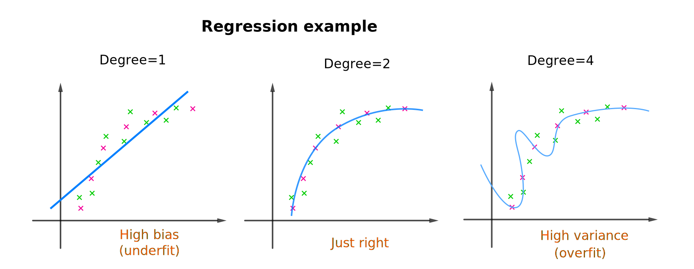
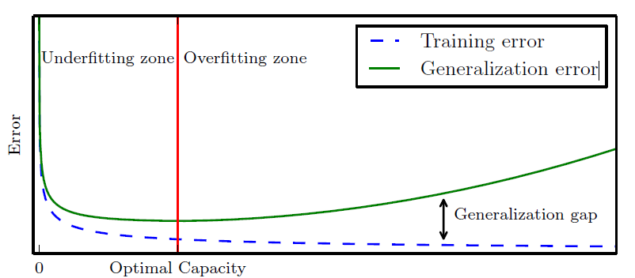
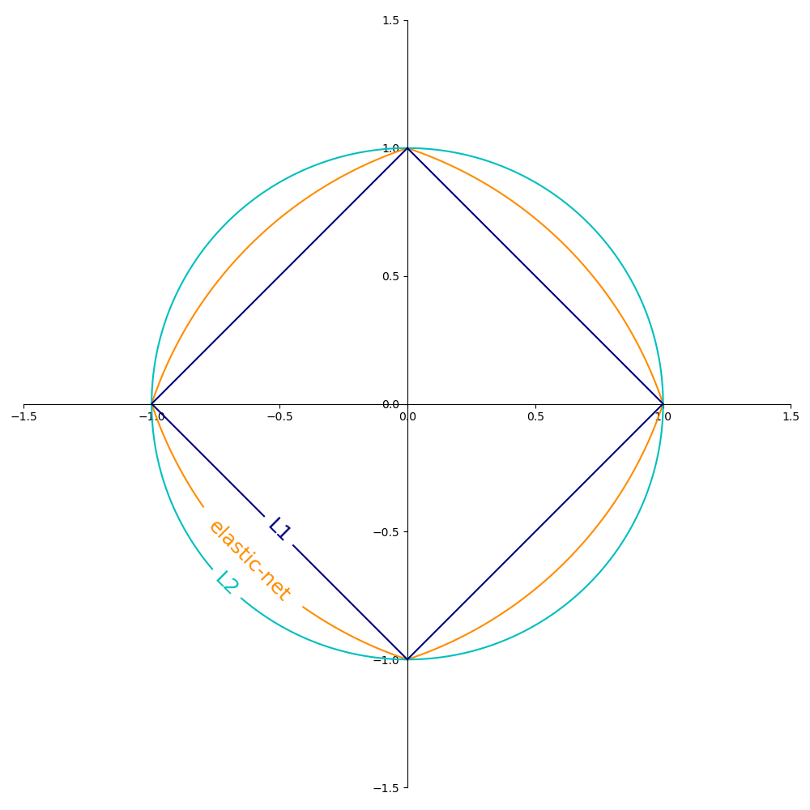
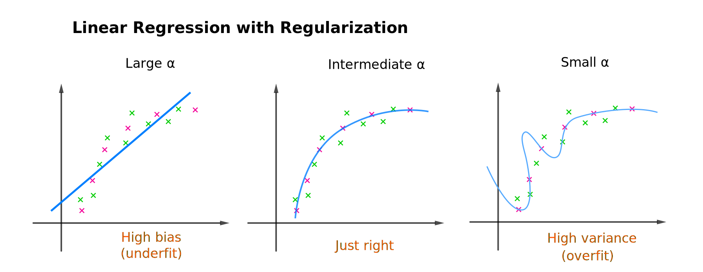
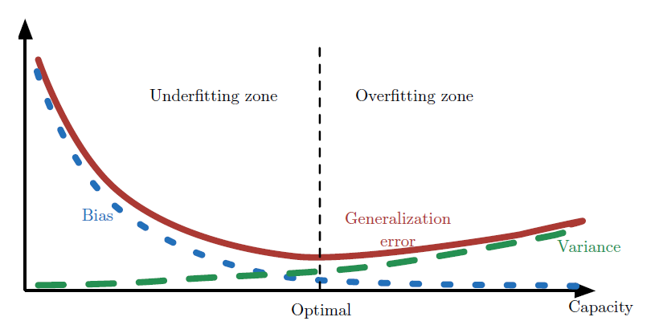
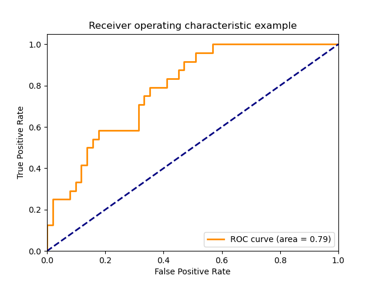

# 模型选择

## 经验风险最小化

机器学习基本概括为通过数据、模型、代价函数、优化来建立一个算法。模型的假设空间包含所有可能的映射函数，例如线性函数集合。接下来要考虑按照什么样的准则来学习或者优化模型，我们使用**损失函数**（loss function）来度量一个样本预测的效果。常用的损失函数有

(1) 0-1损失函数
$$
L(f(\mathbf x),y)=\mathbb I(y\neq f(\mathbf x))
$$
其中 $\mathbb I$ 为指示函数[^1]

(2) 平方损失函数
$$
L(f(\mathbf x),y)=(f(\mathbf x)-y)^2
$$
(3) 绝对损失函数
$$
L(f(\mathbf x),y)=|f(\mathbf x)-y|
$$
(4) 对数损失函数
$$
L(f(\mathbf x),y)=-\log\mathbb P(y|\mathbf x)
$$

由于模型的输入变量和目标变量是随机变量，遵循联合分布 $\mathbb P(\mathbf x,y)$，所以损失函数的期望是
$$
J(\mathbf\theta)=\mathbb E[L(f_{\mathbf\theta}(\mathbf x),y)]
$$
模型的**期望损失**（expected loss）称为**风险**（risk），机器学习算法的目标是期望风险最小化。在这里，我们强调该期望取自真实分布 $\mathbb P(\mathbf x,y)$ 。然而，我们遇到的机器学习问题，通常是不知道  $\mathbb P(\mathbf x,y)$。根据大数定律，我们通常使用训练数据集上的经验分布估计真实分布。模型关于训练数据集的平均损失称为**经验风险**（empirical risk）或**经验损失**（empirical loss）。度量平均意义下模型预测效果的函数，称为**目标函数**（objective function）或**代价函数**（cost function）
$$
J(\mathbf\theta)=\frac{1}{m}\sum_{i=1}^{m}L(f_{\mathbf\theta}(\mathbf x^{(i)}),y^{(i)})
$$
基于最小化这种平均损失的训练过程被称为**经验风险最小化**（empirical risk minimization, ERM）。
$$
\min\limits_{\mathbf\theta}\frac{1}{m}\sum_{i=1}^{m}L(f_{\mathbf\theta}(\mathbf x^{(i)}),y^{(i)})
$$

## 泛化能力

用于机器学习的数据集通常被分为**训练集**（training set）和**测试集**（test set）。需注意的是，训练集/测试集的划分要尽可能保持数据分布的一致性，避免因数据划分过程引入额外的偏差而对最终结果产生影响。

- 训练集：最小化代价函数拟合模型参数
- 测试集：不参与训练流程，测试模型泛化能力

我们把模型的实际预测输出与样本的真实输出之间的差异称为**误差** (error) 。模型在训练集上的误差称为**训练误差** （training error）或**经验误差**（empirical error）。
$$
J_\text{train}(\mathbf\theta) = 
\frac{1}{m_\text{train}}\sum_{i=1}^{m_\text{train}}L(f_{\mathbf\theta}(\mathbf x^{(i)}),y^{(i)})
$$
通常，我们会更加关注模型在未观测数据上的性能如何，因为这将决定其在实际应用中的性能。模型在新样本上的误差期望称为**泛化误差**（generalization error）。显然，我们希望得到泛化误差小的模型。然而，我们事先并不知道新样本是什么样的，通常使用**测试误差**（test error）估计模型泛化能力。
$$
J_\text{test}(\mathbf\theta) = 
\frac{1}{m_\text{test}}\sum_{i=1}^{m_\text{test}}L(f_{\mathbf\theta}(\mathbf x^{(i)}),y^{(i)})
$$
注意，模型误差可能与拟合模型用的代价函数有所不同，模型误差不包括正则化项。

## 模型选择

在现实任务中，我们往往有多种学习算法可供选择，甚至对同一个学习算法，当使用不同的参数配置时（例如多项式的阶数），也会产生不同的模型。这就是机器学习中的模型选择（model selection）问题。假设模型由多项式函数生成
$$
f_{\mathbf w}(x)=w_0+w_1x+\cdots+w_dx^d=\sum_{j=0}^dw_jx^j
$$
首先要确定模型的复杂度，即多项式的阶，然后根据经验风险最小化原则求解多项式的系数。以下是模型泛化能力的表现

- **欠拟合**：(under-fitting) 也称**高偏差**（high bias） 。模型对训练数据拟合不足，训练误差和测试误差都较高。
- **过拟合**：(over-fitting) 也称**高方差**（high variance）。测试误差高，与训练误差距太大。
- 模型拟合的刚好：(just right) 模型也适用于新数据，泛化能力很好。

通过调整模型复杂度，我们可以控制模型是否偏向于过拟合或者欠拟合。通俗地，模型的复杂度是指模型假设空间的容量。容量低的模型可能很难拟合训练集，容量高的模型可能会过拟合。

如何判断一个算法有高偏差或高方差。事实证明，在判断误差是否高的时候，建立基准水平（baseline）通常是有用的。基线水平指的是对学习算法的误差水平有个合理的期待。建立基线水平的常见方法

- 衡量人类在这项任务上的表现。
- 竞争对手的算法表现
- 经验猜测

在机器学习中，进行模型选择或者说提高模型的泛化能力是一个重要问题。欠拟合比较容易克服，我们可以添加更多的训练数据或者增加额外的特征来降低处理欠拟合问题。过拟合比较难处理，常用的模型选择方法有正则化与交叉验证。

## 交叉验证

大部分机器学习算法都有超参数（必须在学习算法外设定），用来控制模型的复杂度（如多项式模型的阶数）或者优化（如梯度下降的学习率）。如果给定的样本数据充足，可以将数据集分为训练集（training set）、验证集（validation set）和测试集（test set）。

| data             | % of total | Description          |
| ---------------- | :--------: | :------------------- |
| training         |     60     | 拟合模型参数         |
| cross-validation |     20     | 调整超参数，优化模型 |
| test             |     20     | 评估模型的泛化能力   |

应用最多的是**K折交叉验证**（K-fold cross validation）。方法如下：

1. 先随机的将训练数据切分为K个大小相似的互斥子集
2. 然后，在第 i 次训练时，数据的第 i 个子集用于验证集，其余的数据用于训练集
3. 将这一过程对可能的K种选择重复进行，这样就可获得k组训练/测试集
4. 最后选出K次评估中验证误差最小的模型

再次以选择多项式模型选择为例，可用使用K交叉验证选择合适的阶数
--Model-Selection-and-Evaluation.assets/degree_selection.png)

**留一交叉验证**（leave-one-out, LOO）：K折交叉验证的特殊情形是K等于训练数据的大小，这样，每次只在一个样本上验证。留一法往往在数据缺乏时使用。

## 正则化

**正则化**（regularization）通过在经验风险上加上表示模型复杂度的正则化项（regularization term）或惩罚项（penalty term）。我们将正则化后的代价函数记为
$$
\tilde J(\mathbf\theta;\mathbf{X,y})=J(\mathbf\theta;\mathbf{X,y})+\alpha\Omega(\mathbf\theta)
$$
$\alpha\geqslant0$ 是**正则化超参数**，用于权衡经验风险和惩罚项。将 $\alpha$ 设为 0 表示没有正则化。 $\alpha$ 越大，对应正则化惩罚越大。
需要说明一点，在神经网络中，参数包括每一层神经元的权重(weight)和偏置(bias)，我们通常只对权重做惩罚而不对偏置做正则惩罚，也不会导致太大的方差。另外，正则化偏置参数可能会导致明显的欠拟合。本章，我们使用向量 $\mathbf w$ 表示所有应受范数惩罚影响的权重，而向量 $\mathbf\theta$ 表示所有参数(包括 $\mathbf w$ 和无需正则化的参数)。

求解最优模型等价于求解最优化问题
$$
\min\limits_{\mathbf\theta}J(\mathbf\theta;\mathbf{X,y})+\alpha\Omega(\mathbf\theta)
$$

正则化的实现方式通常是添加参数范数惩罚。比较流行的正则化项有L~2~参数正则化和L~1~参数正则化。

**L~2~参数正则化**：通常被称为权重衰减（weight decay）的 L~2~ 参数范数惩罚
$$
\Omega(\mathbf w)=\frac{1}{2}\|\mathbf w\|_2^2=\frac{1}{2}\mathbf w^T\mathbf w
$$
在其他学术圈，L~2~  也被称为**岭回归**(Ridge)或Tikhonov 正则。系数$1/2$ 只是为了计算方便。与之对应的梯度为
$$
\nabla_{\mathbf w}\tilde J(\mathbf w;\mathbf{X,y})=\nabla_{\mathbf w}J(\mathbf w;\mathbf{X,y})+\alpha\mathbf w
$$
使用单步梯度下降法，更新方程为
$$
\mathbf w \gets\mathbf w-\lambda(\nabla_{\mathbf w}J(\mathbf w;\mathbf{X,y})+\alpha\mathbf w)
$$
其中$\lambda$为梯度下降学习率。上式换一种写法就是
$$
\mathbf w\gets(1-\lambda\alpha)\mathbf w-\lambda\nabla_{\mathbf w}J(\mathbf w;\mathbf{X,y})
$$
上式第二项是梯度下降中的普通更新，正则化项所做的就是在每一次梯度下降迭代时先收缩权重向量（将权重向量乘以一个略小于1的常数因子）。这也就理解了正则化项为什么可以在每次迭代中缩小 $w_j$ 的值。

**L~1~参数正则化**：即各个参数的绝对值之和，这会导致稀疏的解
$$
\Omega(\mathbf w)=\|\mathbf w\|_1=\sum_{j}|w_j|
$$
对应的梯度(实际上是次梯度)
$$
\nabla_{\mathbf w}\tilde J(\mathbf w;\mathbf{X,y})=\nabla_{\mathbf w}J(\mathbf w;\mathbf{X,y})+\alpha\text{sign}(\mathbf w)
$$
其中 $\text{sign}(\mathbf w)$ 只是简单地取 $\mathbf w$ 各个元素的正负号。

**Elastic Net**：弹性网格正则化
$$
\Omega(\mathbf w)=\rho \|\mathbf w\|_1+ \frac{(1-\rho)}{2} \|\mathbf w\|_2^2
$$
下图显示了当 $\Omega(\mathbf w)=1$ 时，不同正则化项在二维参数空间中的等值线

**正则化超参数选择**：添加正则化项，缩小特征权重。参数越大特征权重越小，模型偏向高偏差。以多项式回归为例
$$
f_{\mathbf w}(x)=w_0+w_1x+w_2x^2+w_3x^3+w_4x^4
$$
正则化代价函数为
$$
J(\mathbf w)=\frac{1}{2m}\sum_{i=1}^m(f_{\mathbf w}(x^{(i)})-y^{(i)})^2+\frac{\alpha}{2}\sum_{j}w_j^2
$$

## 偏差和方差

机器学习本质上属于应用统计学，算法在不同训练集上学得的结果很可能不同，即便这些训练集是来自同一个分布。

**点估计**(point estimation)是用样本统计量来估计总体参数。可以是<u>单个参数</u>，或是某些参数模型中的一个<u>向量参数</u>，例如线性回归中的权重，但是也有可能是整个函数。

为了区分参数估计和真实值，我们习惯将参数 $\mathbf\theta$ 的点估计表示为 $\hat{\mathbf\theta}$ 。令 $\{\mathbf x^{(1)},\mathbf x^{(2)},\cdots,\mathbf x^{(m)}\}$ 是 m 个独立同分布 (i.i.d.)的数据点。我们假设真实参数 $\mathbf\theta$ 是固定但未知的，而点估计 $\hat{\mathbf\theta}$ 是数据集的函数
$$
\hat{\mathbf\theta}=\mathbf g(\mathbf x^{(1)},\mathbf x^{(2)},\cdots,\mathbf x^{(m)})
$$
由于数据集是随机采样出来的，数据集的任何函数都是随机的，因此 $\hat{\mathbf\theta}$ 是一个随机变量。点估计也可以指输入变量和目标变量之间关系的估计，我们将这种类型的点估计称为函数估计。

**函数估计**试图从输入向量 $\mathbf x$ 预测变量 $y$。我们假设 $y = f(\mathbf x) + \epsilon$，其中 $\epsilon$ 是 $y$ 中未能从$\mathbf x$ 预测的一部分。在函数估计中，我们感兴趣的是用模型估计去估计 $\hat f$ 。函数估计和估计参数是一样的，函数估计 $\hat f$ 是函数空间中的一个点估计。

函数估计可视为联合分布 $\mathbb P(\mathbf x,y)$ 的概率密度函数的估计，也即模型假设函数的参数估计。大部分监督学习算法都是基于估计概率分布 $\mathbb P(y|\mathbf x)$ 的。线性回归对应于分布族 (概率密度函数)
$$
\mathbb P(y|\mathbf x)=\mathcal N(y;\mathbf w^T\mathbf x+b,\mathbf \Sigma)
$$
即 $y$ 服从均值为 $\mathbf w^T\mathbf x$ 协方差为 $\mathbf \Sigma$ 的高斯分布。现在我们回顾点估计最常研究的性质，并探讨这些性质说明了估计的哪些特点。

估计量的期望与真实值的差别称为**偏差**(bias) ，
$$
\text{bias}(\hat \theta)=\mathbb E(\hat \theta)-\theta
$$
其中 $\hat \theta$ 为估计量，  $\theta$ 为数据分布的的真实值。如果 $\text{bias}(\hat \theta)=0$，那么估计量 $\hat \theta$ 被称为是无偏估计（unbiased）。由于估计量是随机变量，而估计值会有波动性，无偏性的统计意义是指在大量重复试验下，保证了没有系统误差。例如均值为期望的无偏估计。

估计量使用样本数相同的不同训练集产生的**方差**(variance)为
$$
\text{var}(\hat\theta)=\mathbb E(\hat \theta-\mathbb E(\hat \theta))^2
$$
噪声为
$$
\epsilon^2=\mathbb E(\theta_D-\theta)^2
$$
$\theta_D$ 为数据集上的标记值。由于样本是随机变量，与真实值存在误差。

**偏差-方差分解**（bias-variance decomposition）试图对模型的泛化误差进行拆解。以线性模型为例，我们估计的均方误差 (mean squared error, MSE)
$$
\begin{aligned}
\text{MSE} &= \mathbb E[(\hat y_m-y)^2]  \\
&=\text{bias}^2(\hat y_m)+\text{var}(\hat y_m)+\epsilon^2
\end{aligned}
$$
度量着估计 $\hat y_m$ 和真实参数 $y$ 之间平方误差的总体期望。MSE 估计包含了偏差和方差，偏差度量着偏离真实函数或参数的误差期望，而方差度量着特定采样可能导致的误差。

偏差和方差的关系和模型假设空间的容量、欠拟合和过拟合的概念紧密相联。

# 评估指标

对学习器的泛化性能进行评估，不仅需要有效可行的实验估计方法，还需要有衡量模型泛化能力的评价标准，这就是**性能度量**(performance measure)。

## 分类问题

**准确率**：是最常用的分类性能指标，分类正确的样本数占样本总数的比例
$$
\text{Accuracy}=\frac{1}{m}\sum_{i=1}^m\mathbb I(\hat y=y)
$$
其中 $\mathbb I$ 为指示函数[^1]

**混淆矩阵**(Confusion Matrix)也称误差矩阵，是表示分类结果精度评价的一种标准格式。矩阵的每一行代表实例的预测类别，每一列代笔实例的真实类别。

- TP（实际为正预测为正）
- FP（实际为负但预测为正）
- TN（实际为负预测为负）
- FN（实际为正但预测为负）

$\text{Accuracy}=\dfrac{TP+TN}{TP+FP+TN+FN}$

**精确率**（查准率）：是模型区分的能力
$$
\text{Precision}=\frac{TP}{TP+FP}
$$
**召回率**（查全率）：是找到正样本的能力
$$
\text{Recall(Sensitivity)}=\frac{TP}{TP+TN}
$$

$$
\text{Specificity}=\frac{TN}{FP+TN}
$$

**F1-measures**：查准率和查全率的**调和平均数**
$$
\cfrac{1}{F_1}=\cfrac{1}{2}(\cfrac{1}{\text{Precision}}+\cfrac{1}{\text{Recall}})
$$

$$
F_1=\cfrac{2\times\text{Recall}\times\text{Precision}}{\text{Recall}+\text{Precision}}
$$

**Fbeta-measures**：查准率和查全率的加权**调和平均数**。通常，对于不同的问题，查准率查全率的侧重不同。比如，在商品推荐系统中，为了尽可能少打扰用户，更希望推荐内容确是用户感兴趣的，此时查准率更重要；而在逃犯信息检索系统中，更希望尽可能少漏掉逃犯，此时查全率更重要。
$$
\cfrac{1}{F_β}=\cfrac{1}{1+β^2}(\cfrac{1}{\text{Precision}}+\cfrac{β^2}{\text{Recall}})
$$

$$
F_β=\cfrac{(1+β^2)\times\text{Recall}\times\text{Precision}}{\text{Recall}+β^2 \times\text{Precision}}
$$

其中 β>0 度量了查全率对查准率的相对重要性，β=1 时退化为标准的F1； β> 1 时查全率有更大影响；β < 1 时查准率有更大影响。

与算术平均数 $\cfrac{1}{2}(\text{Recall} + \text{Precision})$ 和几何平均数 $\sqrt[]{\text{Recall} \times \text{Precision}}$ 相比，调和平均数更重视较小值，所以精确率和召回率接近时，F值最大。很多推荐系统的评测指标就是用F值的。

**ROC曲线** （受试者工作特征曲线，Receiver Operating Characteristic）

二分类问题，对于正负例的判定通常会有一个阈值，ROC曲线描绘的是不同的阈值时，TPR(True Positive Rate)随着FPR(False Positive Rate)的变化。
$$
FPR=\frac{FP}{FP+TN} \\
TPR=\frac{TP}{TP+FN} 
$$

总之，ROC曲线越靠近左上角，该分类器的性能越好。而且一般来说，如果ROC是光滑的，那么基本可以判断没有太大的过拟合。

**AUC**（Area Under Curve）：被定义为ROC曲线下的面积，AUC越大的分类器，性能越好。
$$
AUC=\displaystyle \frac{1}{2}\sum_{i=1}^{m-1}(x_{i+1}-x_i)(y_i+y_{i+1})
$$
**PR曲线**：查准率和查全率（召回率）之间的关系。查准率和查全率是一对矛盾的度量，一般来说，查准率高时，查全率往往偏低，查全率高时，查准率往往偏低。

如果一个学习器的P-R曲线被另一个学习器的P-R曲线完全包住，则可断言后者的性能优于前者，当然我们可以根据曲线下方的面积大小来进行比较，但更常用的是**平衡点**（Break-Even Point, BEP）。平衡点是查准率=查全率时的取值，如果这个值较大，则说明学习器的性能较好。

**KS曲线**（洛伦兹曲线，Kolmogorov-Smirnov）
KS曲线和ROC曲线都用到了TPR，FPR。KS曲线是把TPR和FPR都作为纵坐标，而样本数作为横坐标。
TPR和FPR曲线分隔最开的位置就是最好的阈值，最大间隔距离就是KS值。KS值可以反应模型的最优区分效果，一般$KS>0.2$可认为模型有比较好的预测准确性。
$$
KS=\max\{TPR-FPR\}
$$

- $KS<0.2$ ：模型无鉴别能力
- $0.2 ⩽ KS<0.4$ ：模型勉强接受
- $0.4 ⩽ KS<0.6$ ：模型具有区别能力
- $0.6 ⩽ KS<0.75$ ：模型有非常好的区别能力
- $KS⩾0.75$ ：此模型异常

**Gain曲线**（增益图，Gain Chart）是描述整体精准度的指标。
$$
\text{Gain}=\frac{TP}{TP+FP}
$$

**Lift曲线**（提升图，Lift Chart）衡量的是，与不利用模型相比，模型的预测能力“变好”了多少，lift(提升指数)越大，模型的运行效果越好。
$$
\text{Lift}=\frac{\frac{TP}{TP+FP}}{\frac{P}{P+N}}=\frac{\text{Gain}}{PR}
$$

**模型稳定度指标PSI**（Population Stability Index）反映了**验证样本**在各分数段的分布与**建模样本**分布的稳定性。可衡量测试样本及模型开发样本评分的的分布差异，为最常见的模型稳定度评估指标。
$$
PSI=\sum(f_{dev}^i-f_{valid}^i)*\ln(f_{dev}^i/f_{valid}^i)
$$

- 若 $PSI<0.1$ 样本分布有微小变化，模型基本可以不做调整
- 若 $0.1 ⩽ PSI ⩽ 0.2$ ，样本分布有变化，根据实际情况调整评分切点或调整模型
- 若 $PSI>0.2$ 样本分布有显著变化，必须调整模型

## 多分类问题

对于多分类问题，可以被当作是二分类问题的集合。每个类都对应一个混淆矩阵，先在各混淆矩阵上分别计算出查准率和查全率，记为 $(P_1,R_1),(P_2,R_2),\cdots,(P_n,R_n)$ ， 再计算平均值，这样就得到**宏查准率**（macro-Precision）、**宏查全率** （macro-Recall），以及相应的**宏F1**（macro-F1）。

还可先将各混淆矩阵的对应元素进行平均，得到 $TP,FP,TN,FN$ 的平均值，分别记为 $\overline{TP},\overline{FP},\overline{TN},\overline{FN}$，再基于这些平均值计算出**微查准率**(micro-Precision) 、微查全率（micro-Recall）和**微F1**（micro-F1）。

| average   | Precision                                                    | Recall                                                       | F1                                                           |
| --------- | ------------------------------------------------------------ | ------------------------------------------------------------ | ------------------------------------------------------------ |
| **macro** | $\displaystyle\frac{1}{n}\sum_{i=1}^{n}P_i$                  | $\displaystyle\frac{1}{n}\sum_{i=1}^{n}R_i$                  | $\displaystyle\cfrac{2\times\text{macro-}P\times\text{macro-}R}{\text{macro-}P+\text{macro-}R}$ |
| **micro** | $\displaystyle\frac{\overline{TP}}{\overline{TP}+\overline{FP}}$ | $\displaystyle\frac{\overline{TP}}{\overline{TP}+\overline{FN}}$ | $\displaystyle\cfrac{2\times\text{micro-}P\times\text{micro-}R}{\text{micro-}P+\text{micro-}R}$ |

## 回归问题

**可解释方差**（Explained Variance）：衡量所有预测值$\hat y_i$和样本值$y_i$之间的差的方差与样本本身的方差的相近程度。最大值为1，数值越大代表模型预测结果越好。
$$
\text{Explained Var}=1-\cfrac{\text{var}(y-\hat y)}{\text{var}(y)}
$$
**平均绝对误差**（Mean Absolute Error, MAE）：

$$
\text{MAE}=\frac{1}{m}\sum_{i=1}^{m}|y_i-\hat y_i|
$$
**均方误差**（Mean Squared Error, MSE）：衡量的是样本与模型预测值偏离程度，数值越小代表模型拟合效果越好。
$$
\text{MSE}=\frac{1}{m}\sum_{i=1}^{m}(y_i-\hat y_i)^2=\frac{1}{m}\|\mathbf y-\mathbf{\hat y}\|_2^2
$$
**决定系数**（R-Square）：其取值范围为$[0,1]$，一般来说，R-Square 越大，表示模型拟合效果越好。R-Square 反映的是大概有多准，因为，随着样本数量的增加，R-Square必然增加，无法真正定量说明准确程度，只能大概定量。
$$
R^2=1-\cfrac{\sum(y_i-\hat y_i)^2}{\sum(y_i-\bar y_i)^2}=1-\cfrac{\text{MSE}(y,\hat y)}{\text{var}(y)/m}
$$
**调整R2**（Adjusted R-Square）：

$$
\text{Adjusted }R^2=1-\cfrac{(1-R^2)(n-1)}{n-p-1}
$$
其中，n 是样本数量，p 是特征数量。调整R2抵消样本数量对 R-Square的影响，做到了真正的 0~1，越大越好。

## 聚类指标

# 学习曲线

学习曲线（Learning curves）是一种帮你了解学习算法性能如何的方式。它用于发现增加训练样本数，算法的收益变化。

--Model-Selection-and-Evaluation.assets/Learning-Curves.svg)

- 当训练集越来越大时，你学到的模型更好，交叉验证误差也会减少。
- 当你有非常少的训练样本时，你可以很容易地得到零或很小的训练误差。当你有一个更大的训练集时，模型很难完美的拟合所有的训练样本。

# 误差分析

误差分析（error analysis）的要点是，手动检查一组算法错误分类的样本。通常分析完后，下一步要做什么的灵感就来了。有时无法分析也会告诉你，某种误差十分罕见，不值得花费过多时间来修复。

------

[^1]: 指示函数(indicator function) $\mathbb I(\text{condition})=\begin{cases}1 & \text{if true}\\ 0 & \text{if false}\end{cases}$
[^2]: 符号函数 $$\text{sign}(x)=\begin{cases}+1 & \text{if }x\geqslant 0\\ -1 & \text{if }x<0\end{cases}$$

