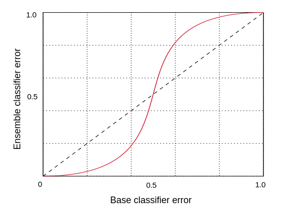
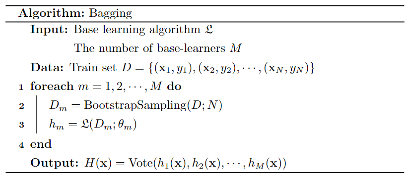
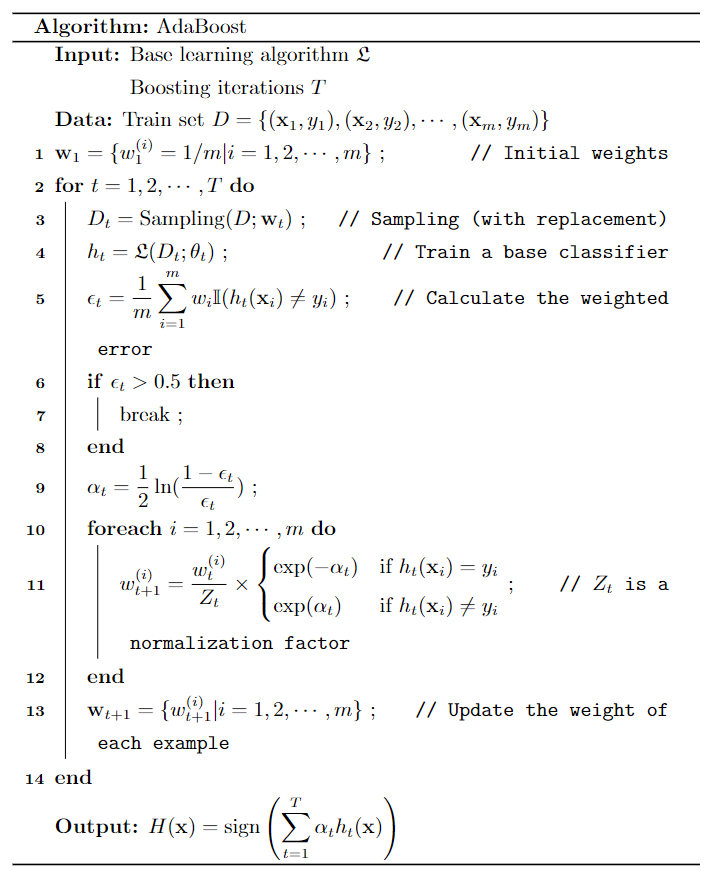
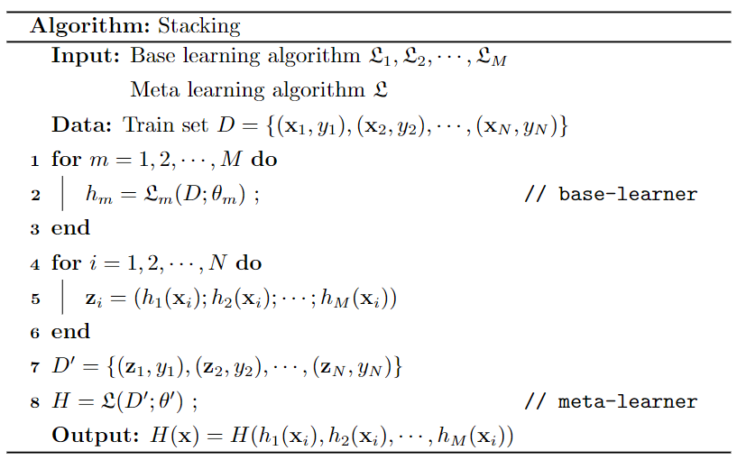

# 引言

分类和回归是监督学习的核心问题。

(1) 若目标变量是连续值，此类学习任务称为**回归** (regression)。
(2) 当目标变量取有限个离散值时，称为**分类**（classification）。当分类的结果只有两种的分类问题称为**二分类**问题 (binary classification)，输出变量通常表示为正样本/负样本(positive/negative)。

# 线性回归

## 基本形式

给定的数据集  
$$
D=\{(\mathbf x_1,y_1),(\mathbf x_2,y_2),\cdots,(\mathbf x_m,y_m)\}
$$
包含 $m$ 个样本，$d$ 个特征。其中，第 $i$ 个样本的特征向量为 $\mathbf x_i=(x_{i1},x_{i2},\cdots,x_{id})^T$ 。目标变量 $y_i\in \R$ 。


**Model**：线性模型假设目标变量是特征的线性组合。因此，我们试图拟合函数
$$
f_{\mathbf{w},b}(\mathbf{x})=w_1x_1+w_2x_2+\cdots+w_dx_d+b=\sum_{j=1}^d w_jx_j+b
$$
称为多元线性回归 (multiple linear regression)。一般写作向量形式
$$
f_{\mathbf{w},b}(\mathbf{x})=\mathbf{w}^T\mathbf{x}+b
$$
特征向量 $\mathbf x=(x_1,x_2,\cdots,x_d)^T$，参数 $\mathbf{w}=(w_1,w_2,\cdots,w_d)^T$ 称为系数 (coefficients) 或权重 (weights)，标量 $b$ 称为偏置项(bias) 。求得参数 $\mathbf{w},b$ 后，模型就得以确定。$\mathbf w$ 可以直观表达了各特征在预测中的重要性，因此线性模型有很好的可解释性(comprehensibility) 。

为了计算方便，通常定义 $x_0=1,w_0=b$ 。线性回归模型可简写为
$$
f_{\mathbf{w}}(\mathbf{x}) = \mathbf{w}^T\mathbf{x}
$$
其中，特征向量 $\mathbf x=(x_0,x_1,x_2,\cdots,x_d)^T$，权重向量 $\mathbf{w}=(w_0,w_1,w_2,\cdots,w_d)^T$

## 最小二乘法

**普通最小二乘法** (ordinary least squares, OLS) 使用残差平方和来估计参数，使得数据的实际观测值和模型预测值尽可能接近。

**loss function** ：衡量单个样本预测值 $f_{\mathbf{w}}(\mathbf{x})$ 和真实值 $y$ 之间差异的
$$
\text{loss}=(f_{\mathbf{w}}(\mathbf{x})-y)^2
$$
**cost function** ：衡量样本集的差异 
$$
J(\mathbf{w}) = \frac{1}{2m} \sum\limits_{i=1}^{m} \left(f_{\mathbf{w}}(\mathbf{x}_i) - y_i\right)^2
$$
为了建立一个不会因训练集变大而变大的代价函数，我们计算均方误差而不是平方误差。额外的 1/2 是为了让后面的计算更简洁些。矩阵形式为
$$
J(\mathbf{w})=\cfrac{1}{2m}\|\mathbf{Xw-y}\|_2^2=\cfrac{1}{2m}(\mathbf{Xw-y})^T(\mathbf{Xw-y})
$$
其中，$\mathbf X$ 称为**设计矩阵**（design matrix）
$$
\mathbf{X}=\begin{pmatrix}
1&x_{11}&x_{12}&\cdots&x_{1d} \\
1&x_{21}&x_{22}&\cdots&x_{2d} \\
\vdots&\vdots&\ddots&\vdots \\
1&x_{m1}&x_{m2}&\cdots&x_{md} \\
\end{pmatrix},
\quad \mathbf{w}=\begin{pmatrix}w_0\\ w_1\\ \vdots\\w_d\end{pmatrix},
\quad \mathbf{y}=\begin{pmatrix}y_1\\ y_2\\ \vdots\\y_m\end{pmatrix}
$$
最后，模型参数估计等价于求解
$$
\arg\min\limits_{\mathbf w} J(\mathbf{w})
$$

**参数估计** ：(parameter estimation) 由于 $J(\mathbf w)$ 为凸函数，且 Hessian 矩阵 $\nabla^2 J(\mathbf w)$ 正定。可以使用凸优化方法求解
$$
\nabla J(\mathbf w)=\frac{\partial J}{\partial\mathbf w}=2\mathbf X^T(\mathbf{Xw-y})=\mathbf 0
$$
此方程被称为**正规方程**（normal equation）。如果 $\mathbf X^T \mathbf X$ 为满秩矩阵(full-rank matrix)或正定矩阵(positive definite matrix)，则可求得最优解
$$
\mathbf w^*=(\mathbf X^T\mathbf X)^{-1}\mathbf X^T\mathbf y
$$
**最小二乘法的特点** 

现实任务中 $\mathbf X^T\mathbf X$ 可能不可逆，原因如下

- 特征之间可能线性相关
- 特征数量大于样本总数 ($d>m$)

最小二乘法的优点

- 求解参数不需要迭代计算
- 不需要调试超参数

最小二乘法的缺点

- 仅适用于线性回归，无法推广到其他学习算法
- 假设 $m\geqslant d$ ，这个算法的复杂度为 $O(md^2)$
- 如果样本特征的数量太大 (>10k)，模型将执行的非常慢

## 极大似然估计

对于线性回归来说，也可以假设其为以下模型
$$
f_{\mathbf{w}}(\mathbf{x}) = \mathbf{w}^T\mathbf{x}+e
$$
其中，特征向量 $\mathbf x=(x_0,x_1,x_2,\cdots,x_d)^T$，权重向量 $\mathbf{w}=(w_0,w_1,w_2,\cdots,w_d)^T$ 。$e$ 为随机误差，通常假设其服从正态分布 $e∼\mathcal N(0, σ^2)$ 。所以的概率密度函数为
$$
\mathbb P(e)=\frac{1}{\sqrt{2\pi}\sigma}\exp(-\frac{e^2}{2\sigma^2})
$$
且样本间的误差相互独立 $\mathrm{cov}(e_i,e_j)=0$

**极大似然估计**：(maximum likelihood estimate, MLE) 使得样本误差的联合概率（也称似然函数）取得最大值。为求解方便，对样本联合概率取对数似然函数
$$
\begin{aligned}
\ln L(\mathbf w) &=\ln\prod_{i=1}^m\mathbb P(e_i)=\sum_{i=1}^m\ln\mathbb P(e_i) \\
&=\sum_{i=1}^m\ln\frac{1}{\sqrt{2\pi}\sigma}\exp(-\frac{(f_{\mathbf{w}}(\mathbf{x}_i) - \mathbf{w}^T\mathbf{x}_i)^2}{2\sigma^2})  \\
&=m\ln\frac{1}{\sqrt{2\pi}\sigma}-\frac{1}{2\sigma^2}\sum_{i=1}^m(f_{\mathbf{w}}(\mathbf{x}_i) - \mathbf{w}^T\mathbf{x}_i)^2 \\
\end{aligned}
$$
最后，最大化对数似然函数等价于求解
$$
\arg\max\limits_{\mathbf w} \ln L(\mathbf{w})=\arg\min\limits_{\mathbf w} \sum_{i=1}^m(f_{\mathbf{w}}(\mathbf{x}_i) - \mathbf{w}^T\mathbf{x}_i)^2
$$

上式与最小二乘法等价

## 正则化

**Ridge** (岭回归) 通过引入 $l_2$ 范数正则化(regularization) 项来解决普通最小二乘的过拟合问题

Cost function
$$
J(\mathbf{w})=\cfrac{1}{2m}\|\mathbf{Xw-y}\|_2^2+ \alpha \|\mathbf w\|^2
$$
其中，正则化参数 $\alpha>0$ 通过缩小特征权重来控制模型复杂度，值越大，收缩量越大，这样，系数对共线性的鲁棒性就更强了。

最小化代价函数可求得解析解
$$
\mathbf{w=(X^T X}+\alpha \mathbf{I)^{-1}X^T y}
$$
其中 $\mathbf I$ 是 $n+1$ 维单位阵。利用$l_2$ 范数进行正则化不仅可以抑制过拟合，同时叶避免了 $\mathbf{X^T X}$ 不可逆的问题。

**Lasso** 是一个估计稀疏系数的线性模型。它在某些情况下是有用的，因为它倾向于给出非零系数较少的解，从而有效地减少了给定解所依赖的特征数。 它由一个带有 $l_1$ 范数正则项的线性模型组成。

Cost function
$$
J(\mathbf{w})=\cfrac{1}{2m}\left(\|\mathbf{Xw-y}\|_2^2+ \alpha \|\mathbf w\|_1\right)
$$
Lasso 中一般采用坐标下降法来实现参数估计。由于Lasso回归产生稀疏模型，因此也可以用来进行特征选择。

**Elastic-Net** 是一个训练时同时用 $l_1$ 和  $l_2$ 范数进行正则化的线性回归模型。这种组合允许学习稀疏模型，其中很少有权重是非零类。当多个特征存在相关时，弹性网是很有用的。Lasso很可能随机挑选其中之一，而弹性网则可能兼而有之。在这种情况下，要最小化的目标函数

Cost function
$$
J(\mathbf{w})=\cfrac{1}{2m}\left(\|\mathbf{Xw-y}\|_2^2+ \alpha\rho \|\mathbf w\|_1+ \frac{\alpha(1-\rho)}{2} \|\mathbf w\|_2^2\right)
$$

Elastic-Net 使用坐标下降法来估计参数。

## 广义线性回归

线性模型往往不能很好地拟合数据，我们可以在线性方程后面引入一个非线性变换，拟合许多功能更为强大的非线性模型(non-linear model)。例如，对数线性回归 (log-linear regression)
$$
\ln f_{\mathbf{w},b}(\mathbf{x})=\mathbf{w}^T\mathbf{x}+b
$$
这个非线性变换称为激活函数(activation function)。更一般地，考虑激活函数 $y=g(z)$，令 
$$
f_{\mathbf{w},b}(\mathbf{x})=g(\mathbf{w}^T\mathbf{x}+b)
$$
这样得到的模型称为广义线性模型 (Generalized Linear Models, GLM)，激活函数的反函数 $z=g^{-1}(y) $ 称为联系函数 (link function)。广义线性模型的参数估计常通过加权最小二乘法或极大似然估计。

## 多项式回归

为了更好的拟合数据，机器学习中一个常见模式是使用非线性函数对数据进行变换来创建新的特征。例如，可以通过构造**多项式特征**(**polynomial features**)来扩展简单的线性回归。在标准线性回归的情况下，您可能拟合一个二维特征的模型
$$
f_{\mathbf w}(\mathbf x)=w_0+w_1x_1+w_2x_2
$$
如果我们想用抛物面来拟合数据而不是平面，我们可以用二阶多项式组合特征，这样模型看起来就像这样
$$
f_{\mathbf w}(\mathbf x)=w_0+w_1x_1+w_2x_2+w_3x_1x_2+w_4x_1^2+w_5x_2^2
$$
其实，得到的多项式回归依旧是线性模型：只需引入新的特征向量进行转换
$$
\begin{matrix}
\text{from}&x_1&x_2&x_1x_2&x_1^2&x_2^2 \\
\to&z_1&z_2&z_3&z_4&z_5
\end{matrix}
$$
下面是一个应用于一维数据的例子，使用了不同程度的多项式特征：


# 线性分类

## Logistic 回归

### 基本形式

给定的数据集  
$$
D=\{(\mathbf x_1,y_1),(\mathbf x_2,y_2),\cdots,(\mathbf x_m,y_m\}
$$
包含 $m$ 个样本，$d$ 个特征。其中，第 $i$ 个样本的特征向量为 $\mathbf x_i=(x_{i1},x_{i2},\cdots,x_{id})^T$ 。目标变量 $y_i\in \{0,1\}$ 。逻辑回归试图预测正样本的概率，那我们需要一个输出 $[0,1]$ 区间的激活函数。假设二分类数据集 $D$ 不同类别的特征值服从均值不同、方差相同的正态分布
$$
\begin{cases}
\mathbb P(\mathbf x|y=1)∼\mathcal N(\mathbf \mu_1, \mathbf\Sigma) \\
\mathbb P(\mathbf x|y=0)∼\mathcal N(\mathbf \mu_0, \mathbf\Sigma)
\end{cases}
$$
其中，协方差矩阵$\mathbf\Sigma$ 为对称阵。利用贝叶斯定理，正样本条件概率
$$
\mathbb P(y=1|\mathbf x)=\frac{\mathbb P(\mathbf x|y=1)\mathbb P(y=1)}{\mathbb P(\mathbf x|y=0)\mathbb P(y=0)+\mathbb P(\mathbf x|y=1)\mathbb P(y=1)}
$$
令 
$$
\begin{aligned}
z&=\ln\frac{\mathbb P(\mathbf x|y=1)\mathbb P(y=1)}{\mathbb P(\mathbf x|y=0)\mathbb P(y=0)} \\
&=\frac{1}{2}[(\mathbf x-\mathbf μ_0)^T\mathbf\Sigma^{-1}(\mathbf x-\mathbf μ_0)-(\mathbf x-\mathbf μ_1)^T\mathbf\Sigma^{-1}(\mathbf x-\mathbf μ_1)]+\ln\frac{\mathbb P(y=1)}{\mathbb P(y=0)} \\
&=(\mathbf μ_1-\mathbf μ_0)^T\mathbf\Sigma^{-1}\mathbf x+\ln\frac{\mathbb P(y=1)}{\mathbb P(y=0)}
\end{aligned}
$$
由于 $\mathbb P(y=1)$ 和 $\mathbb P(y=0)$ 是先验概率为常数，上式可简化为
$$
z=\mathbf w^T\mathbf x+b
$$
于是
$$
\mathbb P(y=1|\mathbf x)=\frac{1}{1+e^{-z}}
$$
上式称为 Sigmoid 函数（S型曲线），也称 logistic 函数。


**Model**: 逻辑回归 (logistic regression, logit regression) 通过引入Sigmod 函数将输入值映射到 $[0,1]$ 来实现分类功能。
$$
f_{\mathbf{w},b}(\mathbf{x}) = g(\mathbf{w}^T \mathbf{x}+b)
$$
其中
$$
g(z) = \frac{1}{1+e^{-z}}
$$
式中特征向量 $\mathbf x=(x_1,x_2,\cdots,x_d)^T$，参数 $\mathbf{w}=(w_1,w_2,\cdots,w_d)^T$ 称为系数 (coefficients) 或权重 (weights)，标量 $b$ 称为偏置项(bias) 。

为计算方便，引入 $x_0=1,w_0=b$ 。模型简写为
$$
f_{\mathbf{w}}(\mathbf{x}) = \frac{1}{1+\exp(-\mathbf{w}^T\mathbf{x})}
$$
其中，特征向量 $\mathbf x=(x_0,x_1,x_2,\cdots,x_d)^T$，权重向量 $\mathbf{w}=(w_0,w_1,w_2,\cdots,w_d)^T$

可以通过引入阈值（默认0.5）实现分类预测
$$
\hat y=\begin{cases}
1 &\text{if } f_{\mathbf{w}}(\mathbf{x})\geqslant 0.5 \\
0 &\text{if } f_{\mathbf{w}}(\mathbf{x})<0.5
\end{cases}
$$
模型的输出为正样本的概率
$$
\begin{cases}
\mathbb P(y=1|\mathbf x)=f_{\mathbf{w}}(\mathbf{x}) \\
\mathbb P(y=0|\mathbf x)=1-f_{\mathbf{w}}(\mathbf{x}) 
\end{cases}
$$

可简记为
$$
\mathbb P(y|\mathbf x)=[f_{\mathbf{w}}(\mathbf{x})]^{y}[1-f_{\mathbf{w}}(\mathbf{x})]^{1-y}
$$

### 极大似然估计

logistic 回归若采用均方误差作为 cost function，是一个非凸函数(non-convex)，会存在许多局部极小值，因此我们尝试极大似然估计。

**极大似然估计**：(maximum likelihood estimate, MLE)  使得观测样本出现的概率最大，也即使得样本联合概率（也称似然函数）取得最大值。

为求解方便，对样本联合概率取对数似然函数
$$
\begin{aligned}
\log L(\mathbf w) & =\log\prod_{i=1}^{m} \mathbb P(y_i|\mathbf x_i)=\sum_{i=1}^m\log \mathbb P(y_i|\mathbf x_i) \\
&=\sum_{i=1}^{m}[y_i\log f_{\mathbf{w}}(\mathbf{x}_i)+(1-y_i)\log(1-f_{\mathbf{w}}(\mathbf{x}_i))] \\
&=\sum_{i=1}^{m}[y_i\mathbf{w}^T\mathbf{x}-\log(1+e^{\mathbf{w}^T\mathbf{x}})]
\end{aligned}
$$
因此，可定义 **loss function**  
$$
\text{loss}=-y\mathbf{w}^T\mathbf{x}+\log(1+e^{\mathbf{w}^T\mathbf{x}})
$$

最大化似然函数等价于最小化 **cost function**
$$
J(\mathbf w)=\frac{1}{m}\sum_{i=1}^{m}(-y_i\mathbf{w}^T\mathbf{x}+\log(1+e^{\mathbf{w}^T\mathbf{x}}))
$$
**参数估计** ：(parameter estimation) $J(\mathbf w)$ 是关于参数 $\mathbf w$ 的高阶可导连续凸函数，经典的数值优化算法如梯度下降法 (gradient descent method) 、牛顿法 (Newton method) 等都可求得其最优解
$$
\arg\min\limits_{\mathbf w} J(\mathbf{w})
$$

### 决策边界

**决策边界**：逻辑回归模型 $f_{\mathbf{w},b}(\mathbf{x})=g(z)= g(\mathbf{w}^T \mathbf{x}+b)$


在 logistic 回归模型中，$z=\mathbf{w}^T\mathbf{x}+b$ 。对于 sigmoid 函数（如上图），$g(z)\geqslant 0.5 \text{ for } z\geqslant 0$ 。因此，模型预测
$$
\hat y=\begin{cases}
1 &\text{if } \mathbf{w}^T\mathbf{x}+b\geqslant 0 \\
0 &\text{if } \mathbf{w}^T\mathbf{x}+b<0
\end{cases}
$$
由此可见，logistic 回归输出一个线性决策边界 (linear decision boundary) 
$$
\mathbf{w}^T\mathbf{x}+b=0
$$
我们也可以创建多项式特征拟合一个非线性边界。例如，模型 
$f(x_1,x_2) = g(x_1^2+x_2^2-36)\text{ where } g(z) = \cfrac{1}{1+e^{-z}}$ 
决策边界方程为 $x_1^2+x_2^2-36=0$


## 感知机

感知机（Perceptron）是线性二分类模型，适用于线性可分的数据集。

**Model**：感知机选取符号函数为激活函数
$$
f_{\mathbf{w},b}(\mathbf{x})=\text{sign}(\mathbf{w}^T\mathbf{x}+b)
$$
这样就可以将线性回归的结果映射到两分类的结果上了。符号函数 
$$
\text{sign}(z)=\begin{cases}+1 & \text{if }z\geqslant 0\\ -1 & \text{if }z<0\end{cases}
$$
为计算方便，引入 $x_0=1,w_0=b$ 。模型简写为
$$
f_{\mathbf{w}}(\mathbf{x}) = \text{sign}(\mathbf{w}^T\mathbf{x})
$$
其中，特征向量 $\mathbf x=(x_0,x_1,x_2,\cdots,x_d)^T$，权重向量 $\mathbf{w}=(w_0,w_1,w_2,\cdots,w_d)^T$

cost function：误分类点到分离超平面的总距离
$$
J(\mathbf w)=-\sum_{\mathbf x_i\in M}y_i\mathbf{w}^T\mathbf{x}_i
$$
其中，$M$ 是错误分类集合。

基于梯度下降法对代价函数的最优化算法，有原始形式和对偶形式。算法简单且易于实现。

损失函数的梯度
$$
\nabla J(\mathbf w)=-\sum_{\mathbf x_i\in M}y_i\mathbf{x}_i
$$


感知机有无穷多个解，其解由于不同的初始值或不同的迭代顺序而有所不同。

Perceptron 是另一种适用于大规模学习的简单分类算法。

- 它不需要设置学习率
- 它不需要正则项
- 它只用错误样本更新模型

最后一个特点意味着Perceptron的训练速度略快于带有合页损失(hinge loss)的SGD，因此得到的模型更稀疏。

**被动感知算法** (Passive Aggressive Algorithms) 是一种大规模学习的算法。和感知机相似，因为它们不需要设置学习率。然而，与感知器不同的是，它们包含正则化参数。

## 线性判别分析

线性判别分析（Linear Discriminant Analysis，LDA）亦称 Fisher 判别分析。其基本思想是：将训练样本投影到一条直线上，使得同类的样例尽可能近，不同类的样例尽可能远。如图所示：

## 朴素贝叶斯分类


# 决策树

## 树的生成

**决策树**（Decision Tree）是一种用于分类和回归的有监督学习方法。其目标是创建一个模型，通过学习从数据特性中归纳出一组分类规则来预测目标变量的值。下图是一颗决策树


决策树是一种由节点（node）和有向边（directed edge）组成的树形结构。从根节点（root node）开始，包含若干内部节点（internal node）和叶节点（leaf node）。其中每个叶节点对应一种分类结果，其他每个节点表示一个特征的判断条件，每个分支代表一个判断结果的输出。

其实决策树可以看做一个if-then规则的集合。我们从决策树的根结点到每一个都叶结点构建一条规则，并且我们将要预测的实例都可以被一条路径或者一条规则所覆盖。


**Hunt 算法**：决策树学习旨在构建一个泛化能力好，并且复杂度小的决策树。因为从可能的决策树中直接选取最优决策树是 NP 完全问题，可构造的决策树的数目达指数级，找出最佳决策树在计算上时不可行的。现实中采用启发式方法，在合理的时间学习一颗次优的决策树。

给定的数据集  
$$
D=\{(\mathbf x_1,y_1),(\mathbf x_2,y_2),\cdots,(\mathbf x_m,y_m\}
$$
包含 $m$ 个样本，$d$ 个特征。其中，第 $i$ 个样本的特征向量为 $\mathbf x_i=(x_{i1},x_{i2},\cdots,x_{id})^T$ 。目标变量 $y_i\in\{y_1,y_2,\cdots,y_K\}$ ，有 $K$ 个类别。

Hunt 算法以递归方式建立决策树，使得各分支结点所包含的样本尽可能属于同一类别。设节点 $t$ 处的数据集为 $D_t$ ，样本量为 $m_t$

1. 在根节点从所有训练样本开始；
2. 在节点 $t$ 处，选择一个特征 $x_t$ 将数据集 $D_t$ 划分成更小的子集；
3. 对于每个子节点，递归的调用此算法，只到满足停止条件。

从上述步骤可以看出，决策生成过程中有两个重要的问题

- 如何选择最优的划分特征：常用的算法有 ID3、C4.5 和 CART
- 什么时候停止划分：
  - 当一个节点100%是一个类别时；
  - 当分裂一个节点导致树超过最大深度时 (maximum depth)；
  - 如果分裂一个节点导致的纯度提升低于阈值；
  - 如果一个节点的样本数低于阈值。

> 限制决策树深度和设置阈值的一个原因是通过保持树的小巧而不容易导致过拟合

**决策树的特点**

决策树的一些优点：

- 决策树是一种非参数模型。换句话说，它不要求任何先验假设，不假定类和特征服从一定概率分布。
- 决策树可以被可视化，简单直观。
- 对于异常点的容错能力好，健壮性高。

决策树的缺点包括：

- 决策树算法非常容易过拟合，导致泛化能力不强，可以通过剪枝改进。
- 决策树可能是不稳定的。事实证明，只需要改变极少量训练样本，信息增益最大的特征就可能发生改变，会生成一颗完全不同的树。可以通过集成学习来缓解这个问题。
- 寻找最优的决策树是一个NP完全问题，我们一般是通过启发式算法（如贪婪算法），容易陷入局部最优。可以通过集成学习之类的方法来改善。
- 有些比较复杂的边界关系，决策树很难学习。

## 特征二元化

**连续特征离散化**：待划分的特征分为离散型和连续型两种。对于离散型的特征，按照特征值进行划分，每个特征值对应一个子节点；对于连续型的数据，由于可取值数目不再有限，一般需要离散化，常用二分法处理。

给定样本 $D$ 和连续特征 $x$ ，若样本中 $x$ 有 $p$ 个值。对所有样本排序，取排序样本中的所有 $p-1$ 个中点值作为阈值的候选值  $a\in\{a_1,a_2,\cdots,a_{p-1}\}$ ，取划分后纯度最高的中点值作为阈值。以基尼指数为例，最佳阈值为
$$
\arg\min\limits_{a}\text{Gini}(D,x(a))
$$
其中，$x(a)$ 表示以候选阈值 $a$ 对 $x$ 进行二元重编码后的特征
$$
x(a)=\begin{cases} 1 & \text{if } x\leqslant a \\ 0 & \text{otherwise} \end{cases}
$$
然后，我们就可以像离散特征一样来使用。需注意的是，与离散特征不同，若当前结点划分为连续特征，该特征还可作为其后代结点的划分特征。

**one-hot encoding**：某些算法（CART）只产生二元划分。如果一个离散特征可以取 $p$ 个值，可以通过创建 $p$ 个取值为0或1的二元特征来替换。如下图示例


## 划分特征选择

显然，决策树学习的关键在于划分数据集，我们希望不断地选取局部最优的特征，将无序的数据变得更加有序，即结点的**纯度** (purity) 越来越高。由于纯度的度量方法不同，也就导致了学习算法的不同，常用的算法有 ID3 、C4.5和 CART。

### 信息增益

**信息熵**（information entropy）是度量数据集纯度的最常用的指标。给定的数据集  
$$
D=\{(\mathbf x_1,y_1),(\mathbf x_2,y_2),\cdots,(\mathbf x_m,y_m\}
$$
包含 $m$ 个样本，$d$ 个特征。其中，第 $i$ 个样本的特征向量为 $\mathbf x_i=(x_{i1},x_{i2},\cdots,x_{id})^T$ 。目标变量 $y_i\in\{y_1,y_2,\cdots,y_K\}$ ，有 $K$ 个类别。经验分布为
$$
\mathbb P(y=y_k)=p_k
$$
则信息熵为
$$
H(D)=-\sum_{k=1}^Kp_k\log p_k
$$
注意，计算信息熵时约定 $0\log 0 = 0$。由定义可知，熵只依赖于 $y$ 的分布，与取值无关，所以也可将熵记作 $H(p)$ 。

对于二分类问题，目标变量 $y_i\in \{0,1\}$ 。正样本比例为 $p_1\ (0\leqslant p_1\leqslant 1)$ ，则负样本比例 $p_0=1-p_1$ 。信息熵可写为
$$
H(p_1)=-p_1\log p_1-(1-p_1)\log (1-p_1)
$$
二元变量的熵曲线如下图


**条件熵**（condition entropy）用来表示离散特征 $x$ 划分后的数据集 $D$ 纯度。使用划分后子集的熵的加权平均值度来度量
$$
H(D|x)=\sum_{n=1}^N w_nH(D_n)
$$
其中，散特征值 $x$ 有 $N$ 个值。 $w_n=m_n/m$ 代表离散特征 $x$ 划分后的子集 $D_n$ 的样本数占比， $H(D_n)$ 代表子集$D_n$的信息熵。条件熵一般小于熵，例如，知道西瓜的色泽（青绿,乌黑,浅白）后，西瓜质量的不确定性就会减少了。

**信息增益**（Information Gain）表示使用特征 $x$ 的信息进行划分而使数据集 $D$ 纯度提升的程度
$$
\text{Gain}(D,x)=H(D)-H(D|x)
$$

以二元离散特征 $x$ 为例，将二分类数据集 $D$ 划分为 $D^{\text{left}}$和 $D^{\text{left}}$ 两个子集，则信息增益为
$$
\text{Gain}(D,x)=H(p_1)-\left(w^{\text{left}}H(p_1^{\text{left}})+w^{\text{right}}H(p_1^{\text{right}})\right)
$$
其中 $p_1$ 表示子集中正样本的比例，$w$ 表示子集的样本数占比。

**ID3**（Iterative Dichotomiser 3, 迭代二分器 3）算法在迭代中选取信息增益最大的特征进行划分
$$
\arg\max\limits_{x}\text{Gain}(D,x)
$$
其中特征 $x\in\{x_i,x_2,\cdots,x_d\}$ 。对于所有的节点来说，节点处数据集的熵是个不变的值，所以最大化信息增益等价于最小化条件熵。

以吴恩达老师的==猫分类数据集==为例：


根节点的熵为：$H(p_1^{\text{root}})=H(0.5)=-\cfrac{1}{2}\log \cfrac{1}{2}-\cfrac{1}{2}\log \cfrac{1}{2}=1$

然后，计算各特征的信息增益：

Ear shape: $H(0.5)-(\cfrac{3}{10}H(0.67)+\cfrac{4}{10}H(0.75)+\cfrac{3}{10}H(0))=0.4$
Face shape: $H(0.5)-(\cfrac{7}{10}H(0.57)+\cfrac{3}{10}H(0.33))=0.03$
Whiskers: $H(0.5)-(\cfrac{4}{10}H(0.75)+\cfrac{6}{10}H(0.33))=0.12$
Weight: $H(0.5)-(\cfrac{4}{10}H(1)+\cfrac{6}{10}H(0.17))=0.61$


显然，Weight ⩽ 9 的信息增益最大，于是Weight被选为在根节点划分的特征。类似的，再对每个分支结点进行上述操作，进一步划分，最终得到整颗决策树。 

### 信息增益率

从信息增益的公式中，其实可以看出，信息增益准则偏向取值较多的特征。原因是当特征的取值较多时，根据此特征划分更容易得到纯度更高的子集，因此划分之后的条件熵更低。为减少这种偏好可能带来的不利影响，C4.5通过**信息增益率**（Information Gain Rate）来选择最优划分特征
$$
\text{Gain\_rate}(D,x)=\frac{\text{Gain}(D,x)}{\text{IV}(x)}
$$

其中 $\text{IV}(x)$ 称为特征 $x$ 的固有值（intrinsic value）
$$
\text{IV}(x)=-\sum_{n=1}^Nw_n\log w_n
$$
其中，散特征值 $x$ 有 $N$ 个值。 $w_n=m_n/m$ 代表离散特征 $x$ 划分后的子集 $D_n$ 的样本数占比。$\text{IV}(x)$ 可看作数据集 $D$ 关于 $x$ 的信息熵，特征 $x$ 的取值越多，通常 $\text{IV}(x)$ 越大。

需注意的是，信息增益率准对可取值数目较少的特征有所偏好。因此， C4.5算法并不是直接选择增益率最大的特征划分，而是使用了一个启发式：先从候选特征中找出信息增益高于平均水平的特征，再从中选择增益率最高的划分。

### 基尼指数

**基尼指数**（Gini Index）给定的数据集  
$$
D=\{(\mathbf x_1,y_1),(\mathbf x_2,y_2),\cdots,(\mathbf x_m,y_m\}
$$
包含 $m$ 个样本，$d$ 个特征。其中，第 $i$ 个样本的特征向量为 $\mathbf x_i=(x_{i1},x_{i2},\cdots,x_{id})^T$ 。目标变量 $y_i\in\{y_1,y_2,\cdots,y_K\}$ ，有 $K$ 个类别。经验分布为
$$
\mathbb P(y=y_k)=p_k
$$
基尼指数可表示数据集 $D$ 的纯度
$$
\text{Gini}(D)=\sum_{k=1}^Kp_k(1-p_k)=1-\sum_{k=1}^Kp_k^2
$$

直观来说，基尼指数反应了从数据集中随机抽取两个样本，其类别不一致的概率。因此，基尼指数越小，则数据集的纯度越高。

对于二分类问题，目标变量 $y_i\in \{0,1\}$ 正样本比例为 $p_1\ (0\leqslant p_1\leqslant 1)$ ，则负样本比例 $p_0=1-p_1$ 。二分类变量的基尼指数可写为
$$
\text{Gini}(p_1)=2p_1(1-p_1)
$$
数据集 $D$ 在离散特征 $x$ 划分后的基尼指数定义为
$$
\text{Gini}(D,x)=\sum_{n=1}^Nw_n\text{Gini}(D_n)
$$
可理解为划分后子集基尼指数的加权平均值。其中，离散特征 $x$ 有$N$ 个值， $w_n=m_n/m$ 代表离散特征 $x$ 划分后的子集 $D_n$ 的样本数占比， $\text{Gini}(D_n)$ 代表子集$D_n$的基尼指数。

**CART**（Classification and Regression Trees）使用划分后基尼指数最小的特征作为最优划分特征
$$
\arg\min\limits_{x}\text{Gini}(D,x)
$$
同时，CART使用**二叉树**准则减少对取值较多特征的偏向，并且可以分类也可以回归，也提供了优化的剪枝策略。

## 回归树

回归树是一个 if-then 规则的集合，每个特征向量对应一个叶节点。使用叶节点处目标变量 $y$ 的平均值输出
$$
f(\mathbf x)=\bar y_t
$$
其中，特征向量 $\mathbf x=(x_1,x_2,\cdots,x_d)^T$ 对应的叶节点 $t$ 处的平均值为 $\bar y_t$。

回归树使用加权均方误差选择最优划分特征。由于模型输出为子集平均值，均方误差等价于方差。设节点 $t$ 处的数据集为 $D_t$ ，样本数为 $m_t$ ，则划分特征为
$$
\arg\min\limits_{x}\sum_{n=1}^Nw_{tn}\text{var}(D_{tn})
$$
其中，离散特征 $x$ 有$N$ 个值。$D_{tn}$ 为节点 $t$ 处特征 $x$ 划分的子集，$w_{tn}=m_{tn}/m_t$ 为子集的样本数占比。

## 剪枝处理

递归生成的决策树往往过于复杂，从而过拟合。对决策树进行简化的过程称为**剪枝**（pruning），剪枝的基本策略有预剪枝和后剪枝。剪枝过程中一般使用验证集评估决策树泛化能力的提升。

决策树学习的**代价函数**定义为
$$
C_\alpha(T)=C(T)+\alpha|T|
$$
其中，$|T|$ 是决策树 $T$ 中叶节点个数，$\alpha$ 是平衡树的复杂度和不纯度的超参数。$C(T)$ 是叶节点不纯度的加权平均值。以基尼指数为例，给定数据集 $D$ ，样本数为 $m$ ，则
$$
C(T)=\sum_tw_t\text{Gini}(D_t)
$$
其中，$D_t$ 为叶节点 $t$ 处的数据集，$w_t=m_t/m$ 为叶节点 $t$ 处的样本数占比。

**预剪枝**：（pre-pruning）是指在决策树生成过程中，对每个结点在划分前先进行估计，若当前结点的划分不能带来决策树泛化性能提升，则停止划分并将当前结点标记为叶结点。

预剪枝使得决策树的很多分支都没有展开，限制减少了决策树的时间开销，同时也给预剪枝决策树带来了欠拟含的风险。

**后剪枝**：（post-pruning）先从训练集生成一棵完整的决策树，然后剪掉一些叶结点或叶结点以上的子树，若能带来决策树泛化性能提升，则将其父结点作为新的叶结点，从而递归的简化生成的决策树。

一般情形下，后剪枝决策树的欠拟合风险很小，泛化性能往往优于预剪枝决策树，但决策树的时间开销要大得多。

**CART 剪枝**：首先从生成的决策树 $T_0$ 底端开始不断剪枝，直到根节点，形成一个子树序列  $\{T_0,T_1,\cdots,T_n\}$。然后通过交叉验证法选择最优子树。

## 决策边界

若我们把每个特征视为坐标空间中的一个坐标轴，则每个样本对应一个数据点，两个不同类之间的边界称为决策边界（decision boundary）。决策树所形成的分类边界有一个明显的特点：由于节点测试只涉及单个特征，它的决策边界由若干个与坐标轴平行的分段组成。这就限制了决策树对连续特征之间复杂关系的建模能力。


**斜决策树**（oblique decision tree）在每个节点，不再是仅对某个特征，而是对特征的线性组合进行测试
$$
\sum_{j=1}^dw_jx_j+b=0
$$
尽管这种技术有更强的表达能力，并且能够产生更紧凑的决策树，但为找出最佳测试条件的计算可能相当复杂。

# 支持向量机

**支持向量机**（support vector machine, SVM）是一种用于分类、回归和异常检测的有监督学习方法。按照数据集的特点，可分为3类：

1. 当数据集线性可分时，通过硬间隔最大化（不容许错误分类），学习线性可分支持向量机，又叫硬间隔支持向量机（hard-margin SVM）
2. 当数据集近似线性可分时，通过软间隔最大化（容许一定误差），学习线性支持向量机（linear SVM），又叫软间隔支持向量机（soft-margin SVM）
3. 当数据集线性不可分时，通过核技巧（kernel method）及软间隔最大化，学习非线性支持向量机（non-linear SVM）

给定的数据集  
$$
D=\{(\mathbf x_1,y_1),(\mathbf x_2,y_2),\cdots,(\mathbf x_m,y_m\}
$$
包含 $m$ 个样本，$d$ 个特征。其中，第 $i$ 个样本的特征向量为 $\mathbf x_i=(x_{i1},x_{i2},\cdots,x_{id})^T$ 。目标变量 $y_i\in\{-1,+1\}$ 。

## 间隔最大化

本节讨论线性可分的数据集，即存在无数超平面，可以将正样本和负样本正确分类。从几何角度，具有最大间隔的超平面有更好的泛化性能，因为该超平面对训练样本局部扰动的容忍性最好。SVM 采用**最大间隔超平面**（maximal margin hyperplane）作为决策边界，此时的超平面是存在且唯一的。

分离的超平面可以写为如下形式
$$
\mathbf{w}^T\mathbf{x}+b=0
$$
其中 $\mathbf w=(w_1,w_2,\cdots,w_d)^T$ 为法向量，决定了超平面的方向；$b$ 为位移项，决定了超平面与原点之间的距离。显然，超平面可被法向量 $\mathbf w$ 和位移 $b$ 确定，下面我们将其记为 $(\mathbf w,b)$ 。

**Model**：
$$
f_{\mathbf{w},b}(\mathbf{x})=\text{sign}(\mathbf{w}^T\mathbf{x}+b)
$$
符号函数 
$$
\text{sign}(z)=\begin{cases}+1 & \text{if }z\geqslant 0\\ -1 & \text{if }z<0\end{cases}
$$
**最大间隔**：


距离超平面 $(\mathbf w,b)$ 最近的样本，被称为**支持向量** （support vector）。如上图，设超平面两侧平行边界的方程分别为
$$
\begin{aligned}
B_1: & \mathbf{w}^T\mathbf{x}+b=\gamma \\
B_2: & \mathbf{w}^T\mathbf{x}+b=-\gamma
\end{aligned}
$$
超平面 $B_1,B_2$ 间的距离称为**间隔**（margin）
$$
\text{margin}=\frac{2\gamma}{\|\mathbf w\|}
$$
假设样本能被超平面正确分类，则
$$
\begin{cases}
\mathbf{w}^T\mathbf{x}_i+b\geqslant \gamma  & \text{if }y_i=+1\\
\mathbf{w}^T\mathbf{x}_i+b\leqslant- \gamma & \text{if }y_i=-1
\end{cases}
$$
可简写为
$$
y_i(\mathbf{w}^T\mathbf{x}_i+b)\geqslant \gamma \quad i=1,2,\cdots,m
$$

**参数估计**：由于超平面的系数经过同比例缩放不会改变这个平面，我们不妨给出约束 $\gamma=1$，从而得到唯一系数。那么最大化间隔可表示为：
$$
\begin{aligned}
\max\limits_{\mathbf w,b}&\frac{2}{\|\mathbf w\|} \\
\text{s.t.}&\quad y_i(\mathbf{w}^T\mathbf{x}_i+b)\geqslant 1, \quad i=1,2,\cdots,m
\end{aligned}
$$

s.t. 是 subject to (such that) 的缩写，表示约束条件。约束为分类任务的要求。

显然，为了最大化间隔，仅需最大化 $\|\mathbf w\|^{-1}$，这等价于最小化 $\|\mathbf w\|^2$ 。于是上式可重写为
$$
\begin{aligned}
\min\limits_{\mathbf w,b}&\frac{1}{2}\|\mathbf w\|^2 \\
\text{s.t.}&\quad y_i(\mathbf{w}^T\mathbf{x}_i+b)\geqslant 1, \quad i=1,2,\cdots,m
\end{aligned}
$$
这就是 SVM 的基本形式，是一个包含 $m$ 个约束的凸优化问题。

## 对偶问题

支持向量机通常将原始问题（primal problem）转化成拉格朗日对偶问题（dual problem）来求解。首先引入 Lagrange 函数
$$
L(\mathbf w,b,\mathbf\alpha)=\frac{1}{2}\mathbf w^T\mathbf w+\sum_{i=1}^m\alpha_i(1-y_i(\mathbf{w}^T\mathbf{x}_i+b))
$$
参数 $\alpha_i\geqslant 0$ 称为拉格朗日乘子（Lagrange multiplier）。根据拉格朗日对偶性，原始问题的对偶问题为
$$
\max_{\mathbf\alpha}\min_{\mathbf w,b}L(\mathbf w,b,\mathbf\alpha)
$$
令 $L(\mathbf w,b,\mathbf\alpha)$ 对 $\mathbf w$ 和 $b$ 的偏导数为 0 可以得到
$$
\sum_{i=1}^m\alpha_iy_i=0\\
\mathbf w=\sum_{i=1}^m\alpha_iy_i\mathbf x_i
$$
将上式带入拉格朗日函数，我们就可以消去 $\mathbf w$ 和 $b$ ，得到对偶最优化问题
$$
\begin{aligned}
\max\limits_{\mathbf\alpha}&\sum_{i=1}^m\alpha_i-\frac{1}{2}\sum_{i=1}^m\sum_{j=1}^m\alpha_i\alpha_jy_iy_j\mathbf x_i^T\mathbf x_j \\
\text{s.t.}&\quad \sum_{i=1}^m\alpha_iy_i=0 \\
&\quad\alpha_i\geqslant 0, \quad i=1,2,\cdots,m
\end{aligned}
$$
原问题和对偶问题等价的充要条件为其满足 KKT（Karush-Kuhn-Tucker）条件
$$
\begin{cases}
\alpha_i\geqslant 0  \\
1-y_i(\mathbf{w}^T\mathbf{x}_i+b) \leqslant 0  \\
\alpha_i(1-y_i(\mathbf{w}^T\mathbf{x}_i+b))=0 
\end{cases}
$$
解出 $\mathbf\alpha$ 后，求出 $\mathbf w$ 和 $b$ 即可得到模型
$$
\begin{aligned}
f_{\mathbf{w},b}(\mathbf{x})&=\text{sign}(\mathbf{w}^T\mathbf{x}+b) \\
&=\text{sign}(\sum_{i=1}^m\alpha_iy_i\mathbf x_i^T\mathbf x+b)
\end{aligned}
$$
由 KKT 互补条件可知，对任意训练样本 $(\mathbf x_i,y_i)$， 总有 $\alpha_i=0$ 或 $y_i(\mathbf{w}^T\mathbf{x}_i+b)=1$。

- 若 $\alpha_i=0$ ，则该样本将不会在式 $f_{\mathbf{w},b}(\mathbf{x})$ 的求和中出现，也就不会对模型有任何影响
- 若 $\alpha_i>0$，则必有 $y_i(\mathbf{w}^T\mathbf{x}_i+b)=1$ ，所对应的样本点位于最大间隔边界上，被称为支持向量。这显示出 SVM 的一个重要性质：训练完成后，大部分的训练样本都不需保留，最终模型仅与支持向量有关。

不难发现，求解 $\mathbf\alpha$ 是一个二次规划问题，可使用通用的二次规划算法来求解。然而，该问题的规模正比于训练样本数，这会在实际任务中造成很大的开销。为了避开这个障碍，人们通过利用问题本身的特性，提出了很多高效算法， SMO (Sequential Minimal Optimization) 是其中典型代表。

## 软间隔与正则化

在前面的讨论中，假定训练样本是线性可分的，即所有样本都必须严格满足约束
$$
y_i(\mathbf{w}^T\mathbf{x}_i+b)\geqslant 1
$$
这称为**硬间隔**（hard margin）。然而，现实任务中的数据很难线性可分，这时，我们为每个样本引入**松弛变量**（slack variable） $\xi_i>0$ ，允许某些样本不满足约束，约束条件修改为
$$
y_i(\mathbf{w}^T\mathbf{x}_i+b)\geqslant 1-\xi_i
$$
使用**软间隔**（soft margin）最大化求解。


当然，在最大化间隔的同时，不满足约束的样本应尽可能少。于是，引入损失
$$
\xi_i=\max\{0,1-y_i(\mathbf{w}^T\mathbf{x}_i+b)\}
$$
每个样本都有一个对应的松弛变量， 用以表征该样本不满足严格约束的程度。上式称为hinge损失函数
$$
\text{hinge\_loss}(z)=\max\{0,1-z\}
$$


因此，软间隔SVM的优化目标可写为
$$
\begin{aligned}
\min\limits_{\mathbf w,b,\mathbf\xi}&\frac{1}{2}\|\mathbf w\|^2+C\sum_{i=1}^m\xi_i \\
\text{s.t.}&\quad y_i(\mathbf{w}^T\mathbf{x}_i+b)\geqslant 1-\xi_i \\
&\quad \xi_i\geqslant 0, \qquad i=1,2,\cdots,m
\end{aligned}
$$
其中，$C$ 为惩罚参数，用于控制惩罚强度。这便是线性 SVM 的基本式。

原始问题的拉格朗日函数为
$$
L(\mathbf w,b,\mathbf\xi,\mathbf\alpha,\mathbf\eta)=\frac{1}{2}\mathbf w^T\mathbf w+C\sum_{i=1}^m\xi_i+\sum_{i=1}^m\alpha_i(1-\xi_i-y_i(\mathbf{w}^T\mathbf{x}_i+b))-\sum_{i=1}^m\eta_i\xi_i
$$
参数 $\alpha_i\geqslant 0,\eta_i$ 称为拉格朗日乘子。令 $L(\mathbf w,b,\mathbf\xi,\mathbf\alpha,\mathbf\eta)$ 对 $\mathbf w,b$ 和 $\mathbf \xi$ 的偏导数为 0 可以得到
$$
\sum_{i=1}^m\alpha_iy_i=0\\
\mathbf w=\sum_{i=1}^m\alpha_iy_i\mathbf x_i \\
\alpha_i+\eta_i=C
$$
将上式带入拉格朗日函数，得到**拉格朗日对偶问题**
$$
\begin{aligned}
\max\limits_{\mathbf\alpha}&\sum_{i=1}^m\alpha_i-\frac{1}{2}\sum_{i=1}^m\sum_{j=1}^m\alpha_i\alpha_jy_iy_j\mathbf x_i^T\mathbf x_j \\
\text{s.t.}&\quad \sum_{i=1}^m\alpha_iy_i=0 \\
&\quad 0\leqslant\alpha_i\leqslant C, \quad i=1,2,\cdots,m
\end{aligned}
$$
上式与线性可分对偶问题唯一不同的是对 $\alpha_i$ 的约束。对软间隔支持向量机， KKT 条件要求
$$
\begin{cases}
\alpha_i\geqslant 0 ,\quad \eta_i \geqslant 0 \\
1-\xi_i-y_i(\mathbf{w}^T\mathbf{x}_i+b)\leqslant 0  \\
\alpha_i(1-\xi_i-y_i(\mathbf{w}^T\mathbf{x}_i+b))=0 \\
\xi_i\geqslant 0 ,\quad \eta_i\xi_i=0
\end{cases}
$$
解出 $\mathbf\alpha,\mathbf\eta$ 后，求出 $\mathbf w$ 和 $b$ 即可得到模型
$$
\begin{aligned}
f_{\mathbf{w},b}(\mathbf{x})&=\text{sign}(\mathbf{w}^T\mathbf{x}+b) \\
&=\text{sign}(\sum_{i=1}^m\alpha_iy_i\mathbf x_i^T\mathbf x+b)
\end{aligned}
$$
由 KKT 条件可知，对任意训练样本 $(\mathbf x_i,y_i)$， 总有 $\alpha_i=0$ 或 $y_i(\mathbf{w}^T\mathbf{x}_i+b)=1-\xi_i$。

- 若 $\alpha_i=0$ ，则该样本将不会在式 $f_{\mathbf{w},b}(\mathbf{x})$ 的求和中出现，也就不会对模型有任何影响
- 若 $\alpha_i>0$，则必有 $y_i(\mathbf{w}^T\mathbf{x}_i+b)=1-\xi_i$ ，该样本为支持向量
- 若 $\alpha_i<C$，则 $\eta_i>0$，进而有 $\xi_i=0$ ，即该样本恰在最大间隔边界上
- 若 $\alpha_i=C$，则有 $\eta_i=0$，此时若  $\xi_i\leqslant 1$  则该样本落在最大间隔内部，若 $\xi_i>1$ 则该样本被错误分类

由此可看出，软间隔支持向量机的最终模型仅与支持向量有关，即通过采用hinge 损失函数仍保持了稀疏性。

## 核方法

现实任务中，原始样本空间内也许并不存在一个能正确划分两类样本的超平面。对这样的问题，可将样本从原始空间映射到一个更高维的特征空间，使得样本在这个特征空间内线性可分。如下图，异或问题就不能线性可分


> 可证明，如果原始空间是有限维， 即属性数有限，那么一定存在一个高维特征空间使样本可分。

令 $\mathbf{\phi(x)}$ 表示将 $\mathbf x$ 映射后的特征向量，于是，在特征空间中划分超平面所对应的模型可表示为
$$
f_{\mathbf{w},b}(\mathbf{x})=\text{sign}(\mathbf{w}^T\mathbf{\phi(x)}+b)
$$
那么最大化间隔可表示为
$$
\begin{aligned}
\min\limits_{\mathbf w,b}&\frac{1}{2}\|\mathbf w\|^2+C\sum_{i=1}^m\xi_i \\
\text{s.t.}&\quad y_i(\mathbf{w}^T\mathbf\phi(\mathbf x_i)+b)\geqslant 1-\xi_i \\
&\quad \xi_i\geqslant 0, \qquad i=1,2,\cdots,m
\end{aligned}
$$
其对偶问题是
$$
\begin{aligned}
\max\limits_{\mathbf\alpha}&\sum_{i=1}^m\alpha_i-\frac{1}{2}\sum_{i=1}^m\sum_{j=1}^m\alpha_i\alpha_jy_iy_j\mathbf\phi(\mathbf x_i)^T\mathbf\phi(\mathbf x_j) \\
\text{s.t.}&\quad \sum_{i=1}^m\alpha_iy_i=0 \\
&\quad 0\leqslant\alpha_i\leqslant C, \quad i=1,2,\cdots,m
\end{aligned}
$$
求解上述问题涉及到计算 $\mathbf\phi(\mathbf x_i)^T\mathbf\phi(\mathbf x_j)$， 这是样本 $\mathbf x_i$ 与 $\mathbf x_j$ 映射到特征空间之后的内积。由于特征空间维数可能很高，甚至可能是无穷维，因此直接计算  $\mathbf\phi(\mathbf x_i)^T\mathbf\phi(\mathbf x_j)$ 通常是困难的。为了避开这个障碍，引入**核函数**（kernel function） 
$$
K(\mathbf x_1,\mathbf x_2)=\mathbf\phi(\mathbf x_1)^T\mathbf\phi(\mathbf x_2)
$$
即  $\mathbf x_i$ 与 $\mathbf x_j$  在特征空间的内积等于它们在原始样本空间中通过核函数计算的结果，这称为**核技巧**（kernel trick）。核函数 $K$ 的实现方法通常有比直接构建 $\mathbf\phi(\mathbf x)$ 再算点积高效很多。

于是，对偶问题可重写为
$$
\begin{aligned}
\max\limits_{\mathbf\alpha}&\sum_{i=1}^m\alpha_i-\frac{1}{2}\sum_{i=1}^m\sum_{j=1}^m\alpha_i\alpha_jy_iy_j K(\mathbf x_i,\mathbf x_j) \\
\text{s.t.}&\quad \sum_{i=1}^m\alpha_iy_i=0 \\
&\quad 0\leqslant\alpha_i\leqslant C, \quad i=1,2,\cdots,m
\end{aligned}
$$
可写为矩阵形式
$$
\begin{aligned}
\min\limits_{\mathbf\alpha}&\frac{1}{2}\mathbf\alpha^T\mathbf Q\mathbf\alpha-\mathbf e^T\mathbf\alpha \\
\text{s.t.}&\quad \mathbf y^T\mathbf\alpha=0 \\
&\quad 0\leqslant\alpha_i\leqslant C, \quad i=1,2,\cdots,m
\end{aligned}
$$
其中，$\mathbf e$ 是一个全1的 $m$ 维向量，$\mathbf Q$ 是一个 $m\times m$ 的半正定矩阵，$Q_{ij}=y_iy_j K(\mathbf x_i,\mathbf x_j)$。

求解后即可得到
$$
\begin{aligned}
f_{\mathbf{w},b}(\mathbf{x})&=\text{sign}(\mathbf{w}^T\mathbf{\phi(x)}+b) \\
&=\text{sign}(\sum_{i=1}^m\alpha_iy_iK(\mathbf x_i,\mathbf x)+b)
\end{aligned}
$$
通过前面的讨论可知，我们希望样本在特征空间内线性可分，因此特征空间的好坏对支持向量机的性能至关重要。需注意的是，在不知道特征映射的形式时，我们并不知道什么样的核函数是合适的，而核函数也仅是隐式地定义了
这个特征空间。于是，"核函数选择"成为支持向量机的最大变数，若核函数选择不合适，则意味着将样本映射到了一个不合适的特征空间，很可能导致性能不佳。

下面介绍几种常用的核函数

(1) 线性核函数（linear kernel function）
$$
K(\mathbf x_1,\mathbf x_2)=\mathbf x_1^T\mathbf x_2
$$
(2) 多项式核函数（polynomial kernel function）
$$
K(\mathbf x_1,\mathbf x_2)=(\mathbf x_1^T\mathbf x_2+1)^d
$$
(3) 高斯核函数（Gaussian kernel function）：也被称为径向基函数（radial basis function, RBF），是最常用的核函数。$\sigma>0$ 为高斯核的带宽（width）。
$$
K(\mathbf x_1,\mathbf x_2)=\exp(\frac{\|\mathbf x_1-\mathbf x_2\|^2}{2\sigma^2})
$$
(4) 拉普拉斯核函数（Laplace kernel function）
$$
K(\mathbf x_1,\mathbf x_2)=\exp(\frac{\|\mathbf x_1-\mathbf x_2\|}{2\sigma^2})
$$
(5) Sigmoid 核函数（Sigmoid kernel function）
$$
K(\mathbf x_1,\mathbf x_2)=\tanh(\beta\mathbf x_1^T\mathbf x_2+\theta)
$$


## 支持向量回归

支持向量分类方法可以推广到解决回归问题，这种方法称为支持向量回归（Support Vector Regression，SVR）。

给定的数据集  
$$
D=\{(\mathbf x_1,y_1),(\mathbf x_2,y_2),\cdots,(\mathbf x_m,y_m\}
$$
包含 $m$ 个样本，$d$ 个特征。其中，第 $i$ 个样本的特征向量为 $\mathbf x_i=(x_{i1},x_{i2},\cdots,x_{id})^T$ 。目标变量 $y_i\in\R$ 。

**Model**：相比于线性回归用一条线来拟合训练样本， SVR采用一个以 $f(\mathbf x)$ 为中心，宽度为 $2\epsilon$ 的间隔带，来拟合训练样本。预测函数仍为
$$
f_{\mathbf{w},b}(\mathbf{x})=\mathbf{w}^T\mathbf\phi(\mathbf x)+b
$$


落在带子内的样本不计算损失，不在带子内的样本则以偏离的程度作为损失，然后以最小化损失的方式迫使间隔带从样本最密集的地方（中心地带）穿过，进而达到拟合训练样本的目的。

为适应每个样本，引入松弛变量
$$
\xi_i=\max\{0,|\mathbf{w}^T\mathbf\phi(\mathbf x_i)+b-y_i|-\epsilon\}
$$
并将 $\xi_i\geqslant 0$ 作为惩罚项加入优化，惩罚那些偏离 $\epsilon$ 带的样本，$\xi_i$ 表示样本远离带的程度。

因此SVR的优化问题可以写为
$$
\begin{aligned}
\min\limits_{\mathbf w,b}&\frac{1}{2}\|\mathbf w\|^2+C\sum_{i=1}^m\xi_i \\
\text{s.t.}&\quad -\epsilon-\xi_i \leqslant \mathbf{w}^T\mathbf\phi(\mathbf x_i)+b\leqslant \epsilon+\xi_i \\
&\quad \xi_i\geqslant 0, \qquad i=1,2,\cdots,m
\end{aligned}
$$
> 注释：
>
> - 当样本在带内时，一定满足约束条件，因此代价函数中惩罚项取最小值 $\xi_i=0$
> - 当样本在带外时，为满足样本位置和惩罚项最小值，约束条件则变为 $|\mathbf{w}^T\mathbf\phi(\mathbf x_i)+b|=\epsilon+\xi_i$

这里我们使用了**ϵ-不敏感损失函数**（epsilon-insensitive）, 即小于ϵ的误差被忽略了。
$$
\text{loss}_\epsilon(z)-=\max\{0,|z|-\epsilon\}
$$


> 在这里不用均方误差的目的是为了和软间隔支持向量机的优化目标保持形式上的一致，这样就可以导出对偶问题引入核函数

如果考虑两边采用不同的松弛程度，可重写为
$$
\begin{aligned}
\min\limits_{\mathbf w,b}&\frac{1}{2}\|\mathbf w\|^2+C\sum_{i=1}^m(\xi_i+\xi_i') \\
\text{s.t.}&\quad -\epsilon-\xi_i' \leqslant \mathbf{w}^T\mathbf\phi(\mathbf x_i)+b\leqslant \epsilon+\xi_i \\
&\quad \xi_i\geqslant 0,\xi_i'\geqslant 0, \qquad i=1,2,\cdots,m
\end{aligned}
$$
对偶问题为
$$
\begin{aligned}
\max\limits_{\mathbf\alpha,\mathbf\alpha'}&\sum_{i=1}^my_i(\alpha_i'-\alpha_i)-\epsilon(\alpha_i'+\alpha_i) \\
&-\frac{1}{2}\sum_{i=1}^m\sum_{j=1}^m(\alpha_i'-\alpha_i)(\alpha_j'-\alpha_j)K(\mathbf x_i,\mathbf x_j) \\
\text{s.t.}&\quad \sum_{i=1}^m(\alpha_i'-\alpha_i)=0 \\
&\quad 0\leqslant\alpha_i,\alpha_i'\leqslant C, \quad i=1,2,\cdots,m
\end{aligned}
$$
可写为矩阵形式
$$
\begin{aligned}
\min\limits_{\mathbf\alpha,\mathbf\alpha'}&\frac{1}{2}(\mathbf\alpha-\mathbf\alpha')^T\mathbf Q(\mathbf\alpha-\mathbf\alpha')+\epsilon\mathbf e^T(\mathbf\alpha+\mathbf\alpha')-\mathbf y^T(\mathbf\alpha-\mathbf\alpha') \\
\text{s.t.}&\quad \mathbf e^T(\mathbf\alpha-\mathbf\alpha')=0 \\
&\quad 0\leqslant\alpha_i,\alpha_i'\leqslant C, \quad i=1,2,\cdots,m
\end{aligned}
$$
其中，$\mathbf e$ 是一个全1的 $m$ 维向量，$\mathbf Q$ 是一个 $m\times m$ 的半正定矩阵，$Q_{ij}=K(\mathbf x_i,\mathbf x_j)$。

上述过程中需满足KKT 条件，即要求
$$
\begin{cases}
\alpha_i(\mathbf{w}^T\mathbf\phi(\mathbf x_i)+b-y_i-\epsilon-\xi_i)=0 \\
\alpha_i'(y_i-\mathbf{w}^T\mathbf\phi(\mathbf x_i)-b-\epsilon-\xi_i')=0 \\
\alpha_i\alpha_i'=0 ,\quad \xi_i\xi_i'=0 \\
(C-\alpha_i)\xi_i=0 ,\quad (C-\alpha_i')\xi_i'=0
\end{cases}
$$
可以看出

- 当且仅当 $\mathbf{w}^T\mathbf\phi(\mathbf x_i)+b-y_i-\epsilon-\xi_i=0$ 时，$\alpha_i$ 能取非零值
- 当且仅当 $y_i-\mathbf{w}^T\mathbf\phi(\mathbf x_i)-b-\epsilon-\xi_i'=0$ 时，$\alpha_i'$ 能取非零值

换言之，仅当样本不落入间隔带中，相应的 $\alpha_i$ 和 $\alpha_i'$ 才能取非零值。

- 此外，约束 $\mathbf{w}^T\mathbf\phi(\mathbf x_i)+b-y_i-\epsilon-\xi_i=0$ 和 $y_i-\mathbf{w}^T\mathbf\phi(\mathbf x_i)-b-\epsilon-\xi_i'=0$ 不能同时成立，因此 $\alpha_i$ 和 $\alpha_i'$ 中至少有一个为零。

预测函数为
$$
f_{\mathbf{w},b}(\mathbf{x})=\sum_{i=1}^m(\alpha_i-\alpha_i')K(\mathbf x_i,\mathbf x)+b
$$
能使上式中的 $\alpha_i-\alpha_i'\neq 0$ 的样本即为 SVR 的支持向量，它们必落在 $\epsilon$ 间隔带之外。显然，SVR 的支持向量仅是训练样本的一部分，即其解仍具有稀疏性。

#  贝叶斯分类器

# 多分类和多标签

## 多类别分类任务

**Multiclass classification**：目标变量包含两个以上离散值的分类任务 $y\in\{0,1,2,\cdots,K\}$。每个样本只能标记为一个类。例如，使用从一组水果图像中提取的特征进行分类，其中每一幅图像都可能是一个橙子、一个苹果或一个梨。每个图像就是一个样本，并被标记为三个可能的类之一。


- One-Vs-Rest (OVR) 也称为one-vs-all，为每个类分别拟合一个二分类模型，这是最常用的策略，对每个类都是公平的。这种方法的一个优点是它的可解释性，每个类都可以查看自己模型的相关信息。

- One-Vs-One (OVO) 是对每一对类分别拟合一个二分类模型。在预测时，选择得票最多的类别。在票数相等的两个类别中，它选择具有最高总分类置信度的类别，方法是对由底层二分类器计算的对分类置信度进行求和。

  由于它需要拟合 $\frac{K(K-1)}{2}$ 个分类器，这种方法通常比one-vs-rest要慢，原因就在于其复杂度 O(K^2^) 。然而，这个方法也有优点，比如说是在没有很好的缩放样本数的核方法中。这是因为每个单独的学习问题只涉及一小部分数据，而对于一个 one-vs-rest，完整的数据集将会被使用 K 次。

**One-Vs-Rest**：为每个类分别拟合一个二分类模型
$$
f^i_{\mathbf{w},b}(\mathbf{x})=\mathbb P(y=i|\mathbf x;\mathbf w,b)
$$
模型预测值，一种方法是选择概率最大的类别
$$
\hat y=\arg\max\limits_{i} f^i_{\mathbf{w},b}(\mathbf{x})
$$


## Lasso和Elastic-Net

包含多个目标变量的回归任务称为 **Multioutput regression**

**Multi-task Lasso** 是一个估计多任务的稀疏系数的线性模型， $\mathbf Y$ 是一个  $m\times n_{tasks}$ 矩阵。约束条件是，对于所有回归问题（也叫任务），所选的特征是相同的。它混合使用 $l_1l_2$ 范数作为正则化项。

Cost function
$$
J(\mathbf{W})=\cfrac{1}{2m}\left(\|\mathbf{XW-Y}\|^2_{Fro}+ \alpha \|\mathbf W\|_{21}\right)
$$
其中 Fro 表示Frobenius范数
$$
\mathbf \|\mathbf A\|_{Fro}=\sqrt{\sum_{ij}a^2_{ij}}=\sqrt{\text{tr}(\mathbf A^T\mathbf A)}
$$
混合 $l_1l_2$ 范数
$$
\mathbf \|\mathbf A\|_{21}=\sum_i\sqrt{\sum_{j}a^2_{ij}}
$$
Multi-task Lasso 也采用坐标下降法来估计参数。

**Multi-task Elastic-Net** 是一个估计多任务的稀疏系数的线性模型， $\mathbf Y$ 是一个  $m\times n_{tasks}$ 矩阵。约束条件是，对于所有回归问题（也叫任务），所选的特征是相同的。它使用混合的 $l_1l_2$ 范数和$l_2$作为正则化项。

Cost function
$$
J(\mathbf{W})=\cfrac{1}{2m}\left(\|\mathbf{XW-Y}\|^2_{Fro}+ \alpha\rho \|\mathbf W\|_{21}+ \frac{\alpha(1-\rho)}{2} \|\mathbf W\|_{Fro}^2\right)
$$
Multi-task Elastic-Net 也采用坐标下降法来估计参数。

## 多标签分类任务

包含多个目标变量的分类任务称为 **Multilabel classification**

# 集成学习

## 集成学习

**集成学习**（ensemble learning）通过构建并组合多个**基学习器**（base learner）的结果来提升预测结果的准确性和泛化能力。其中，基学习器通常采用弱学习算法，集成形成强学习算法。

> 准确率仅比随机猜测略高的学习算法称为**弱学习算法**，准确率很高并能在多项式时间内完成的学习算法称为**强学习算法**。

假定集成包含$T$个基学习器$\{h_1,h_2,\cdots,h_T\}$，集成学习器表示为
$$
H(\mathbf x)=\text{Vote}(h_1(\mathbf x),h_2(\mathbf x),\cdots,h_T(\mathbf x))
$$
下面以二分类为例，说明集成学习器为什么能够改善分类器的性能。集成分类器采用多数表决的方法来预测类别，仅当基分类器超过一半预测错误的情况下，集成分类器预测错误。
$$
H(\mathbf x)=\text{sign}\left(\frac{1}{T}\sum_{t=1}^Th_t(\mathbf x)\right)
$$
假设基分类器之间相互独立，且错误率相等为 $\epsilon$ 。则集成分类器的错误率为
$$
\epsilon_{\text{ensemble}} =\sum_{k=0}^{\lfloor T/2\rfloor}\complement^k_T(1-\epsilon)^k\epsilon^{T-k} 
$$
取25个基分类器，误差率均为 0.35 ，计算可得集成分类器的误差为 0.06 ，远低于基分类器的误差率。注意，当 $\epsilon>0.5$ 时，集成分类器比不上基分类器。



令$\epsilon=0.5-\gamma$ ，其中 $\gamma$ 度量了分类器比随机猜测强多少。则由Hoeffding 不等式可知
$$
\epsilon_{\text{ensemble}}\leqslant \exp(-2T\gamma^2)
$$
上式指出，随着基分类器的个数的增加集成错误率呈指数下降，从而快速收敛。但前提是基分类器之间相互独立。

假设 $T$ 个回归模型，集成模型以均值输出
$$
H(\mathbf x)=\frac{1}{T}\sum_{t=1}^Th_t(\mathbf x)
$$
每个基模型的误差服从均值为零的正态分布
$$
\epsilon_t\sim N(0,\sigma^2)
$$
若不同模型误差间的协方差均为 $\text{Cov}(\epsilon_i,\epsilon_j)=c$ 。则集成模型误差平方的期望是


$$
\begin{aligned}
\mathbb E(\epsilon_{\text{ensemble}}^2)
&=\mathbb E\left[\left(\frac{1}{T}\sum_{t=1}^T\epsilon_t\right)^2\right] \\
&=\frac{1}{T^2}\mathbb E\left[\sum_{i=1}^T\left(\epsilon_i^2+\sum_{j\neq i}\epsilon_i\epsilon_j\right)\right]  \\
&=\frac{1}{T}\sigma^2+\frac{T-1}{T}c
\end{aligned}
$$

在误差完全相关即 $c=\sigma^2$ 的情况下，误差平方减少到 $\sigma^2$ ，所以，模型平均没有任何帮助。在误差彼此独立即 $c=0$ 的情况下，该误差平方的期望仅为 $\sigma^2/T$ 。

上述示例容易得出，集成学习的基学习器要有足够的**准确性**和**差异性**。集成方法主分成两种：

- Bagging：是一种并行方法。通过在训练集上的有放回抽样来获得基学习器间的差异性。最典型的代表就是随机森林。
- Boosting：是一种串行迭代过程。自适应的改变训练数据的权重分布，构建一系列基分类器。最经典的包括AdaBoost算法和GBDT算法。

给定的数据集  
$$
D=\{(\mathbf x_1,y_1),(\mathbf x_2,y_2),\cdots,(\mathbf x_m,y_m)\}
$$
包含 $m$ 个样本，$d$ 个特征。其中，第 $i$ 个样本的特征向量为 $\mathbf x_i=(x_{i1},x_{i2},\cdots,x_{id})^T$ 。

## Bagging

### Bagging

Bagging（Bootstrap aggregating，袋装算法）是一种并行式的集成学习方法。通过在基学习器的训练集中引入随机化后训练。随机从数据集$D$中有放回的抽取$T$个包含$m$个样本的数据集，从而训练出 $T$ 个基学习器。



可以看出Bagging主要通过**样本的扰动**来增加基学习器之间的差异性，因此Bagging的基学习器应为那些对训练集十分敏感的不稳定学习算法，例如：神经网络与决策树等。从偏差-方差分解来看，Bagging算法主要关注于降低方差，即通过多次重复训练提高泛化能力。

由于抽样都来自于同一个数据集，且是有放回抽样，所以$T$个数据集彼此相似，而又因随机性而稍有不同。Bagging训练集中有接近36.8%的样本没有被采到
$$
\lim_{m\to\infty}(1-\frac{1}{m})^m=\frac{1}{e}\approx 0.368
$$
Bagging方法有许多不同的变体，主要是因为它们提取训练集的随机子集的方式不同：

- 如果使用无放回抽样，我们叫做 Pasting
- 如果使用有放回抽样，我们称为 Bagging
- 如果抽取特征的随机子集，我们叫做随机子空间 (Random Subspaces) 
- 最后，如果基学习器构建在对于样本和特征抽取的子集之上时，我们叫做随机补丁 (Random Patches) 

### 随机森林

对于决策树，事实证明，只需要改变一个训练样本，最高信息增益对应的特征就可能发生改变，因此在根节点会产生一个不同的划分，生成一颗完全不同的树。因此单个决策树对数据集的微小变化异常敏感。

**随机森林**（Random Forest）是Bagging的一个拓展体，它的基学习器固定为决策树，在基学习器构造过程中引入随机：

1. 采用有放回抽样的方式添加样本扰动，但有时在根节点附近也有相似的特征组成。
2. 因此进一步引入了特征扰动，每一个分裂过程从待选的 $n$ 个特征中随机选出包含 $k$ 个特征的子集，从这个子集中选择最优划分特征，一般推荐 $k=\log_2(n)$ 或 $k=\sqrt{n}$ 。
3. 每棵树都会完整成长而不会剪枝

--Supervised-Learning.assets/random-forest.svg)

**随机森林优势**

- 它能够处理很高维度（特征很多）的数据，并且不用做特征选择
- 容易做成并行化方法，速度比较快
- 只在特征集的一个子集中选择划分，因此训练效率更高

## Boosting

### Boosting

**Boosting**（提升方法）是一种串行迭代过程。先从初始训练集训练出一个基学习器，再根据基学习器的表现对训练样本分布进行调整，使得先前基学习器做错的训练样本在后续受到更多关注，然后基于调整后的样本分布来训练下一个基学习器。如此迭代，构建一系列基学习器（弱学习器），最终将这些弱学习器加权结合，构成一个强学习器。最经典的包括AdaBoost算法和GBDT算法。

--Supervised-Learning.assets/boosting-flowchart.svg)

从偏差-方差分解来看：Boosting算法主要关注于降低偏差，每轮的迭代都关注于训练过程中预测错误的样本，很容易受过拟合的影响。

### AdaBoost

Boosting族算法最著名、使用最为广泛的就是AdaBoost。**AdaBoost** （Adaptive Boosting，自适应提升）的核心思想是用反复调整的数据来训练一系列的弱学习器，由这些弱学习器的加权组合，产生最终的预测结果。

具体说来，整个Adaboost 迭代算法分为3步：

1. **训练弱学习器**：在连续的提升（boosting）迭代中，那些在上一轮迭代中被预测错误的样本的权重将会被增加，而那些被预测正确的样本的权重将会被降低。然后，权值更新过的样本集被用于训练弱学习器。随着迭代次数的增加，那些难以预测的样例的影响将会越来越大，每一个随后的弱学习器都将会被强迫关注那些在之前被错误预测的样例。初始化时，所有样本都被赋予相同的权值 $1/m$ 。
2. **计算弱学习器权重**：在每一轮迭代中加入一个新的弱分类器，直到达到某个预定的足够小的错误率或达到预先指定的最大迭代次数，从而得到 $T$ 个弱学习器 $h_1,h_2,\cdots,h_T$。各个弱分类器的训练过程结束后，加大分类误差率小的弱分类器的权重，使其在最终的分类函数中起着较大的决定作用，而降低分类误差率大的弱分类器的权重，使其在最终的分类函数中起着较小的决定作用。这样，每个弱分类器 $h_t$ 都有对应的权重 $\alpha_t$ 。
3. **组合成强学习器**：最后的强学习器由生成的多个弱学习器加权求和产生。

--Supervised-Learning.assets/AdaBoost_example.svg)

可以看出：**AdaBoost的核心步骤就是计算基学习器权重和样本权重分布**。AdaBoost 算法有多种推导方式，比较容易理解的是基于加性模型（additive model）的**向前分布算法**（forward stagewise algorithm）。

给定二分类数据集  
$$
D=\{(\mathbf x_1,y_1),(\mathbf x_2,y_2),\cdots,(\mathbf x_m,y_m)\}
$$
包含 $m$ 个样本，$d$ 个特征。其中，第 $i$ 个样本的特征向量为 $\mathbf x_i=(x_{i1},x_{i2},\cdots,x_{id})^T$ 。目标 $y_i\in\{-1,+1\}$

基分类器的加权组合即为加法模型
$$
f(\mathbf x)=\sum_{t=1}^T\alpha_th_t(\mathbf x)
$$
最终的强分类器为
$$
H(\mathbf x)=\mathrm{sign}(f(\mathbf x))=\mathrm{sign}\left(\sum_{t=1}^T\alpha_th_t(\mathbf x)\right)
$$
这里 $\alpha_t$ 表示基分类器 $h_t$ 的重要性。$f(\mathbf x)$ 的符号决定了实例 $\mathbf x$ 的类别。

给定损失函数 $L(y,f(\mathbf x))$ ，学习模型 $f(\mathbf x)$ 所要考虑的问题是如何求出所有的 $\alpha_t,h_t$，即求解极小化代价函数
$$
\min_{\alpha_t,h_t}\sum_{i=1}^mL\left(y_i,\sum_{t=1}^{T}\alpha_th_t(\mathbf x_i)\right)
$$
通常这是一个复杂的全局优化问题，向前分布算法使用其简化版求解这一问题：既然是加法模型，每一步只学习一个弱学习器及其系数，且不调整已经加入模型中的参数和系数来向前逐步建立逼近。这样，向前分布算法将同时求解 $t=1$ 到 $T$ 所有参数 $\alpha_t,\theta_t$ 的优化问题简化为逐步求解 $\alpha_t,\theta_t$ 的优化问题。

假设经过 $t-1$ 轮迭代，已经得到之前所有弱分类器的加权和 
$$
f_{t-1}(\mathbf x)=\alpha_1h_1(\mathbf x)+\cdots+\alpha_{t-1}h_{t-1}(\mathbf x)
$$
在第 $t$ 轮迭代求解 $\alpha_{t},h_{t}$ 得到
$$
f_t(\mathbf x)=f_{t-1}(\mathbf x)+\alpha_t h_t(\mathbf x)
$$
则每一步只需优化如下代价函数
$$
(\alpha_t,h_t)=\arg\min_{\alpha,h}\sum_{i=1}^mL\left(y_i,f_{t-1}(\mathbf x)+\alpha h(\mathbf x_i)\right)
$$
其中，在第$t$轮迭代中，$f_{t-1}(\mathbf x)$ 相当于一个定值。AdaBoost 每步采用**指数损失函数**（exponential loss function）
$$
L(y,f(\mathbf x))=\exp(-yf(\mathbf x))
$$

优化函数可变为
$$
\begin{aligned}
(\alpha_t,h_t)&=\arg\min_{\alpha,h}\sum_{i=1}^mL(y_i,f_{t-1}(\mathbf x_i)+\alpha h(\mathbf x_i)) \\
&=\arg\min_{\alpha,h}\sum_{i=1}^m\exp[-y_i(f_{t-1}(\mathbf x_i)+\alpha h(\mathbf x_i))] \\
&=\arg\min_{\alpha,h}\sum_{i=1}^m  w_{t}^{(i)}\exp[-y_i\alpha h(\mathbf x_i)] \\

\end{aligned}
$$
其中 $ w_t^{(i)}=\exp(-y_if_{t-1}(\mathbf x_i))$ 。$ w_t^{(i)}$ 不依赖于 $\alpha$ 和 $h$ ，所以与优化无关。

由 AdaBoost 基分类器 $h(\mathbf x_i)\in\{-1,+1\}$ ，且 $y_i\in\{-1,+1\}$ 则
$$
-y_ih(\mathbf x_i)=\begin{cases}
+1 & \text{if }h(\mathbf x_i)\neq y_i \\
-1 & \text{if }h(\mathbf x_i)= y_i
\end{cases}
$$

所以，优化函数进一步化为

$$
\begin{aligned}
(\alpha_t,h_t)&=\arg\min_{\alpha,h}\left\{\sum_{i=1}^m  w_{t}^{(i)}e^{-\alpha}\mathbb I(h_t(\mathbf x_i)=y_i)+\sum_{i=1}^m  w_{t}^{(i)}e^{\alpha}\mathbb I(h_t(\mathbf x_i)\neq y_i)\right\} \\
&=\arg\min_{\alpha,h}\left\{(e^{\alpha}-e^{-\alpha})\sum_{i=1}^m  w_{t}^{(i)}\mathbb I(h_t(\mathbf x_i)\neq y_i)+e^{-\alpha}\sum_{i=1}^m  w_{t}^{(i)}\right\} \\
\end{aligned}
$$

上式的解可以通过两步得到。首先，对于任意 $\alpha>0$ ，基分类器的解为
$$
h_t=\arg\min_{h}\sum_{i=1}^m w_{t}^{(i)}\mathbb I(h(\mathbf x_i)\neq y_i)
$$
这是第 $t$ 轮加权错误率最小的基分类器。将已求得的 $h_t$ 带入优化函数

$$
\alpha_t=\arg\min_{\alpha}\left\{(e^{\alpha}-e^{-\alpha})\epsilon_t+e^{-\alpha}\right\}
$$
其中， $\epsilon_t$ 是正是基分类器 $h_t$ 在加权训练集 $D_t$ 的错误率
$$
\epsilon_t=\frac{\displaystyle\sum_{i=1}^m  w_t^{(i)} \mathbb I(h_t(\mathbf x_i)\neq y_i)}{\displaystyle\sum_{i=1}^m w_t^{(i)}}
$$
这里 $ w_t^{(i)}$ 是第 $t$ 轮迭代中样本 $(\mathbf x_i,y_i)$ 的权重 ，因为Adaboost更新样本权值分布时做了规范化，所示上式中的分母为1。权重依赖于 $f_{t-1}(\mathbf x)$ ，随着每一轮迭代而发生改变。

对 $\alpha$ 求导并使导数为 0，即可得到基分类器 $h_t$ 的权重
$$
\alpha_t=\frac{1}{2}\ln(\frac{1-\epsilon_t}{\epsilon_t})
$$

由上式可知，当 $\epsilon_t\leqslant 0.5$ 时，$\alpha_t\geqslant 0$，并且 $\alpha_t$ 随 $\epsilon_t$ 的减小而增大 。所以，分类误差率越小的基分类器在最终分类器中的作用越大。如下图

--Supervised-Learning.assets/AdaBoost_alpha.svg)

最后，更新样本的权重，为下一轮做准备。由
$$
\begin{cases}
f_t(\mathbf x)=f_{t-1}(\mathbf x)+\alpha_t h_t(\mathbf x) \\
 w_t^{(i)}=\exp(-y_if_{t-1}(\mathbf x_i))
\end{cases}
$$
可得到
$$
w_{t+1}^{(i)}= w_{t}^{(i)}\exp(-\alpha_ty_ih_t(\mathbf x_i))
$$
为了确保  $\mathbf w_{t+1}$ 成为一个概率分布 $\sum_{i=1}^mw_{t+1}^{(i)}=1$， 权重更新变为
$$
w_{t+1}^{(i)}=\frac{w_t^{(i)}}{Z_t}\exp(-\alpha_ty_ih_t(\mathbf x_i))
$$
其中， $Z_t$ 是正规因子。对原始式中所有的权重都乘以同样的值，对权重更新没有影响。
$$
Z_t=\sum_{i=1}^mw_t^{(i)}\exp(-\alpha_ty_ih_t(\mathbf x_i))
$$
上式可拆解为 
$$
w_{t+1}^{(i)}=\frac{w_t^{(i)}}{Z_t}\times\begin{cases}
\exp(-\alpha_t) & \text{if }h_t(\mathbf x_i)=y_i \\
\exp(\alpha_t) & \text{if }h_t(\mathbf x_i)\neq y_i 
\end{cases}
$$

上式给出的权值更新公式增加那些被错误分类的样本的权值，并减少那些被正确分类的样本的权值。



**正则化**：对每个基学习器乘以一个系数 $\nu(0<\nu<1)$，使其对最终模型的贡献减小，从而防止学的太快产生过拟合。$\nu$ 又称学习率，于是上文的迭代变为
$$
f_t(\mathbf x)=f_{t-1}(\mathbf x)+\nu\cdot\alpha_t h_t(\mathbf x)
$$
一般$\nu$ 要和迭代次数T结合起来使用。

### GBDT

--Supervised-Learning.assets/GBDT-example.svg)

sklearn：梯度提升树(Gradient Boosted Decision Trees，GBDT)是Booting对任意可微损失函数的推广。GBDT是一种准确有效的现成程序，可用于各种领域的回归和分类问题，包括Web搜索、排名和生态领域。

Gradient Boosting Decision Tree

GBDT也是集成学习Boosting家族的成员，但是却和传统的Adaboost有很大的不同。回顾下Adaboost，我们是利用前一轮迭代弱学习器的误差率来更新训练集的权重，这样一轮轮的迭代下去。GBDT也是迭代，使用了前向分布算法，但是弱学习器限定了只能使用CART回归树模型，同时迭代思路和Adaboost也有所不同。

在GBDT的迭代中，假设我们前一轮迭代得到的强学习器是ft−1(x)ft−1(x), 损失函数是L(y,ft−1(x))L(y,ft−1(x)), 我们本轮迭代的目标是找到一个CART回归树模型的弱学习器ht(x)ht(x)，让本轮的损失函数L(y,ft(x)=L(y,ft−1(x)+ht(x))L(y,ft(x)=L(y,ft−1(x)+ht(x))最小。也就是说，本轮迭代找到决策树，要让样本的损失尽量变得更小。

GBDT的思想可以用一个通俗的例子解释，假如有个人30岁，我们首先用20岁去拟合，发现损失有10岁，这时我们用6岁去拟合剩下的损失，发现差距还有4岁，第三轮我们用3岁拟合剩下的差距，差距就只有一岁了。如果我们的迭代轮数还没有完，可以继续迭代下面，每一轮迭代，拟合的岁数误差都会减小。

### XGBoost


Given training set of size $m$

XGBoost 是 GBDT 的一种高效工程实现和改进。

For $b=1$ to $B$

- 抽样创建一个大小为 $m$ 的新训练集 ，代替从所有的样本等概率抽样（$1/m$），更倾向于选出之前训练的决策树分类错误的样本。（具体概率的数学细节相当复杂）
- 在新训练集上训练集一颗决策树

让这些树投票决定预测结果。种算法称为极端梯度增强 (XGBoost , eXtreme Gradient Boosting)

- 开源
- 增强树的实现，非常快速和高效
- 默认的拆分准则和停止拆分的准则都有很好的选择
- 内置正则化防止过拟合

```python
from xgboost import XGBClassifier 
model = XGBClassifier()
model.fit(X_train, y_train) 
y_pred = model.predict(X_test)
```

### LightGBM

## 投票方法

在训练好基学习器后，如何将这些基学习器的输出结合起来产生集成模型的最终输出，下面将介绍一些常用的结合策略。

对于回归问题，输出基回归模型的平均值。

**简单平均法**（simple averaging）：
$$
H(\mathbf x)=\frac{1}{T}\sum_{t=1}^Th_t(\mathbf x)
$$
**加权平均法**（weighted averaging）：
$$
H(\mathbf x)=\sum_{t=1}^Tw_th_t(\mathbf x)\\
\text{s.t.}\quad w_t>0,\sum_{t=1}^Tw_t=1
$$
对于分类问题，最常见的组合方法是硬投票和软投票。类别标签 $y\in\{c_1,c_2,\cdots,c_K\}$ 。

**硬投票**（hard voting）：即多数投票（ majority voting）。基学习器 $h_t$ 输出类别标签 $h_t(\mathbf x)\in\{c_1,c_2,\cdots,c_K\}$，预测结果中出现最多的类别。
$$
H(\mathbf x)=\arg\max_c\sum_{t=1}^Th_t(\mathbf x|y=c)
$$
例如，给定样本的预测是

| classifier   | class 1 | class 2 | class 3 |
| ------------ | ------- | ------- | ------- |
| classifier 1 | 1       | 0       | 0       |
| classifier 2 | 1       | 0       | 0       |
| classifier 3 | 0       | 1       | 0       |
| sum          | 2       | 1       | 0       |

这里预测的类别为 class 1。

**软投票**（soft voting）：基学习器 $h_t$ 输出类别概率 $h_t(\mathbf x)\in[0,1]$，会选出基学习器的加权平均概率最大的类别。
$$
H(\mathbf x)=\arg\max_c\sum_{t=1}^Tw_th_t(\mathbf x|y=c)\\
\text{s.t.}\quad w_t>0,\sum_{t=1}^Tw_t=1
$$
用一个简单的例子说明，其中3个分类器的权重相等 

| classifier       | class 1 | class 2 | class 3 |
| ---------------- | ------- | ------- | ------- |
| classifier 1     | 0.2     | 0.5     | 0.3     |
| classifier 2     | 0.6     | 0.3     | 0.1     |
| classifier 3     | 0.3     | 0.4     | 0.3     |
| weighted average | 0.37    | 0.4     | 0.23    |

这里预测的类别为 class 2，因为它具有最高的加权平均概率。

实际中，软投票和硬投票可以得出完全不同的结论。相对于硬投票，软投票考虑到了预测概率这一额外的信息，因此可以得出比硬投票法更加准确的结果。

## Stacking

stacking是指训练一个模型用于组合基学习器的方法，组合的学习器称为元学习器（meta learner）。
$$
H(\mathbf x)=H(h_1(\mathbf x),h_2(\mathbf x),\cdots,h_T(\mathbf x);\mathbf{\theta})
$$

1. 首先，训练$T$个不同的基学习器，最好每个基学习器都基于不同的算法（KNN、SVM、RF等等），以产生足够的差异性。
2. 然后，每一个基学习器的输出作为组合学习器的特征来训练一个模型，以得到一个最终的结果。



若直接使用基学习器的训练集来生成元学习器的训练集，则过拟合风险会比较大；因此一般通过交叉验证，用基学习器未使用的样本来产生元学习器的训练样本。

以 k-folds 交叉验证为例

1. 初始训练集$D=\{(\mathbf x_1,y_1),(\mathbf x_2,y_2),\cdots,(\mathbf x_m,y_m)\}$被随机划分为 $k$ 个大小相似的集合 $\{D_1,D_2,\cdots,D_k\}$ 。令 $D_j$ 和 $D-D_j$ 分别表示第 $j$ 折的测试集和训练集。
2. 给定$T$个基学习算法，初级学习器 $h_t^{(j)}$ 通过在 $D-D_j$ 上使用第$t$个学习算法而得。
3. 对 $D_j$ 中每个样本 $\mathbf x_i$，令 $z_{it}=h_t^{(j)}(\mathbf x_i)$ ，则由 $\mathbf x_i$ 产生元学习器的训练集特征 $\mathbf z_i=(z_{i1},z_{i2},\cdots,z_{iT})$，目标值为 $y_i$。
4.  于是，在整个交叉验证过程结束后，从这$T$个基学习器产生的元学习器的训练集是 $D'=\{(\mathbf z_1,y_1),(\mathbf z_2,y_2),\cdots,(\mathbf z_m,y_m)\}$ 。

有研究表明，元学习器通常采用概率作为输入特征，用多响应线性回归（MLR）算法效果较好。

# 附录

## 超平面几何

超平面方程为
$$
\mathbf{w}^T\mathbf{x}+b=0
$$
其中 $\mathbf x=(x_1,x_2,\cdots,x_d)^T$ ，$\mathbf w=(w_1,w_2,\cdots,w_d)^T$ 。

超平面的方程不唯一，同比例缩放 $\mathbf w,b$ ，仍是同一个超平面。若缩放倍数为负数，会改变法向量方向。


**法向量**：取超平面上任意两点 $\mathbf x_1,\mathbf x_2$ ，则
$$
\mathbf{w}^T\mathbf{x}_1+b=0 \\
\mathbf{w}^T\mathbf{x}_2+b=0
$$
上面两式相减可得
$$
\mathbf{w}^T(\mathbf{x}_1-\mathbf{x}_2)=\mathbf{w}\cdot(\mathbf{x}_1-\mathbf{x}_2)=0
$$
即向量 $\mathbf w$ 与超平面垂直，所以超平面 $\mathbf{w}^T\mathbf{x}+b=0$ 的法向量为  $\mathbf w$ 。

**任意点到超平面的距离**：取超平面外任意一点 $\mathbf x$ ，在超平面上的投影为 $\mathbf x_1$ ，距离为 $d>0$ ，则
$$
\mathbf{w}\cdot\mathbf{x}_1+b=0 \\
\mathbf{w}\cdot(\mathbf{x}-\mathbf{x}_1)=\|\mathbf w\|\cdot d
$$
因此 $\mathbf x$ 到超平面距离
$$
d=\frac{|\mathbf{w}^T\mathbf{x}+b|}{\|\mathbf w\|}
$$


------

> **参考文献**：
> 周志华.《机器学习》（西瓜书）
> 李航.《统计学习方法》
> Andrew Ng.《Machine Learning》.Stanford online
> 《Deep Learning》（花书）
> [【机器学习】【白板推导系列】](https://www.bilibili.com/video/BV1aE411o7qd)
