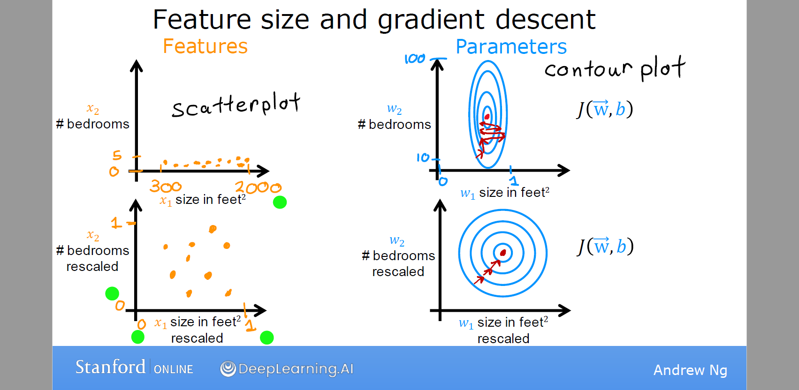

对有序（order）分类变量，可通过连续化将其转化为连续值，对于$k$分类变量可转化为 $k$ 维0-1向量

特征工程：

- 通常通过变换或者合并原始特征设计新的特征（多项式特征等）。

# 数据预处理

## 随机抽样

在数据挖掘和机器学习领域，从更大的数据集中抽样是很常见的做法。举例来说，你可能希
望选择两份随机样本，使用其中一份样本构建预测模型，使用另一份样本验证模型的有效性。
sample()函数能够让你从数据集中（有放回或无放回地）抽取大小为n的一个随机样本。

- 无放回抽样：等概率抽样
- 有放回抽样
- 分层抽样：在每个分层中无放回抽样

抽样 sampling
 随机采样  random  sampling  受总体中个体间自相关关系的影响  
 系统采样  systematic sampling  受个体特点规律性的影响
 随机-系统采样  systematic-random  sampling   不受上面的影响 
 多层次采样 strtifed  sampling   适用于可分层的总体

## 类别不平衡问题

## 降维

## 特征创建

## 缺失值处理

缺失值：缺失值通常以符号NA（Not Available，不可用）表示

R 并不把无限的或者不可能出现的数值标记成缺失值。正无穷和负无穷分别用Inf和–Inf所标记。因此5/0返
回Inf。不可能的值（比如说，sin(Inf)）用NaN符号来标记（not a number，不是一个数）

 **缺失值模式**
 完全随机缺失  MCAR
 随机缺失  MAR
 非随机缺失NMAR
 **缺失值处理**
 配对删除 
 简单抽样填补
 均值/中位数/众数填补
 回归填补，多重插补

##  特征缩放

Feature scaling

**Min-Max normalization**
$$
x^{(i)}_j=\frac{x^{(i)}_j-\min_j}{\max_j-\min_j}
$$
**Mean normalization**
$$
x^{(i)}_j=\frac{x^{(i)}_j-\mu_j}{\max_j-\min_j}
$$
**z-score normalization**：均值为0，方差为1
$$
x^{(i)}_j = \dfrac{x^{(i)}_j - \mu_j}{\sigma_j}
$$
其中，$x^{(i)}_j$ 为 $i_{th}$ 样本 $j$ 列特征值，$\mu_j$ 和 $\sigma_j$  为 $j$ 列的均值和标准差
$$
\begin{align}
\mu_j &= \frac{1}{m} \sum_{i=1}^{m} x^{(i)}_j\\
\sigma^2_j &= \frac{1}{m} \sum_{i}^{m} (x^{(i)}_j - \mu_j)^2
\end{align}
$$
当你有不同的特征且取值范围差异较大，它可能导致梯度下降法运行缓慢。但通过重新缩放特征，使他们具有可比较的值范围，可显著加快梯度下降速度。

## 离散化和二元化

分箱可按分箱宽度，按分箱数、按分位数、按平均值/标准差四种分箱方式

## 变量变换

变量的重编码

重编码涉及根据同一个变量和/或其他变量的现有值创建新值的过程。举例来说，你可能想：
- 将一个连续型变量修改为一组类别值；
- 将误编码的值替换为正确值；
- 基于一组分数线创建一个表示及格/不及格的变量。

《数据挖掘导论》

# 异常值检测

 **异常检测**  outlierTest 离群点，孤立点 
 正态分布  3倍标准差原则 
 多元正态  马氏距离 

6.数据集转换
 6.1 管道和复合估算器
 6.2 特征提取
 6.3 数据预处理
 6.4 缺失值插补
 6.5 无监督降维
 6.6 随机投影
 6.7 内核近似
 6.8 成对度量，近似关系和内核
 6.9 转换预测目标（y）

