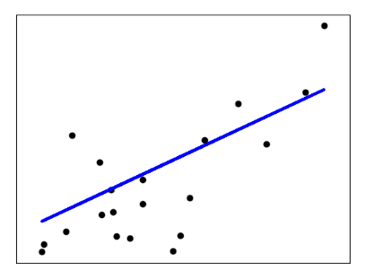
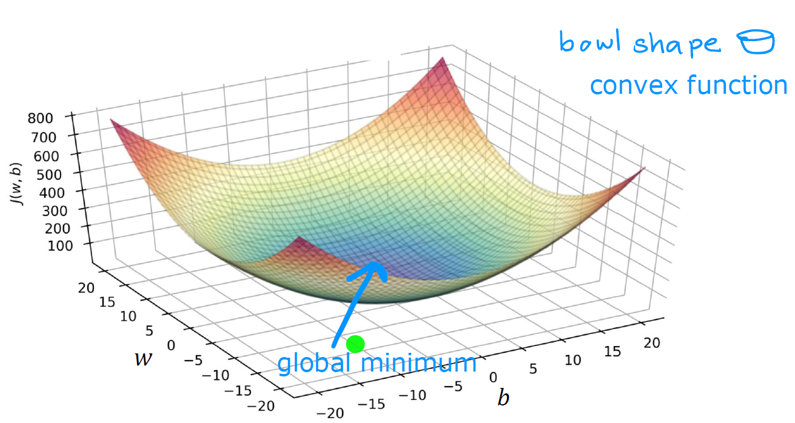
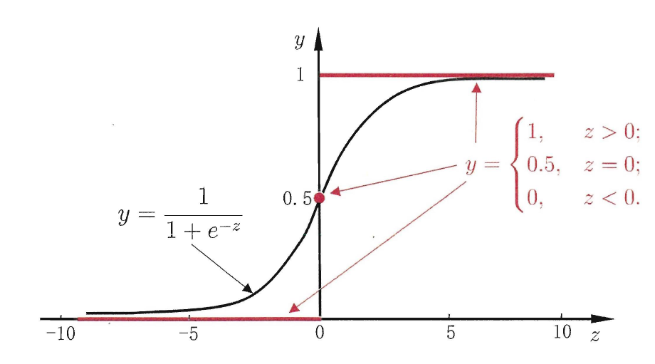
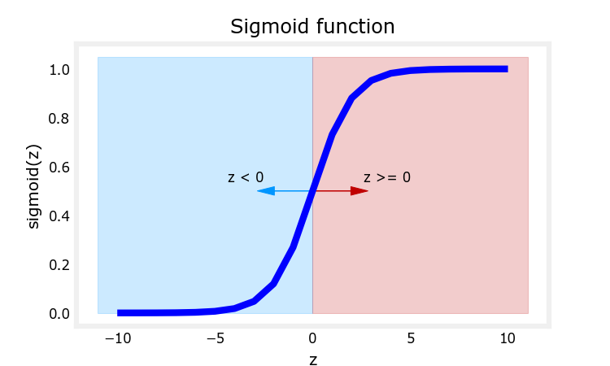
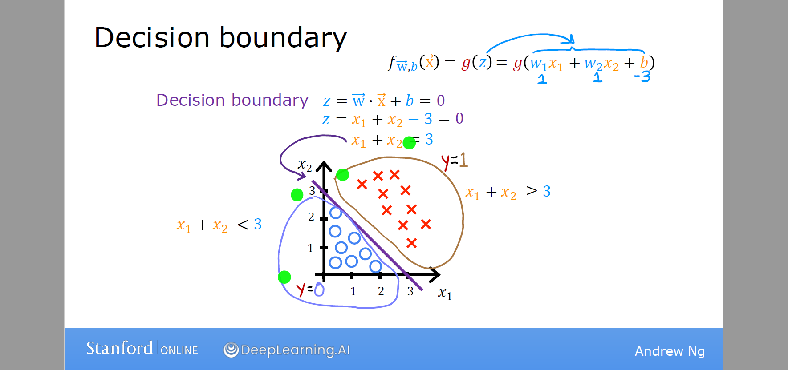
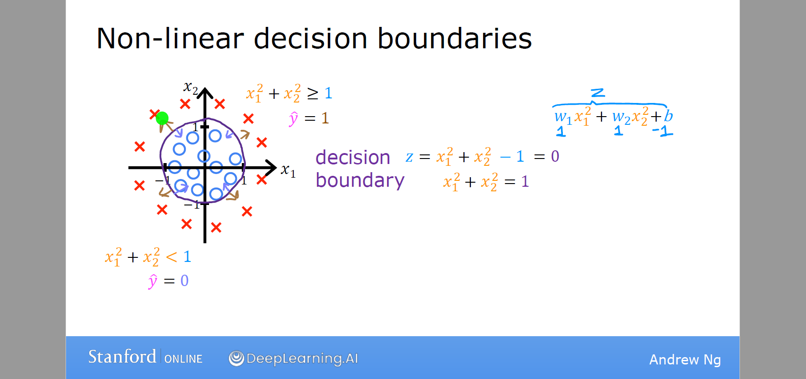
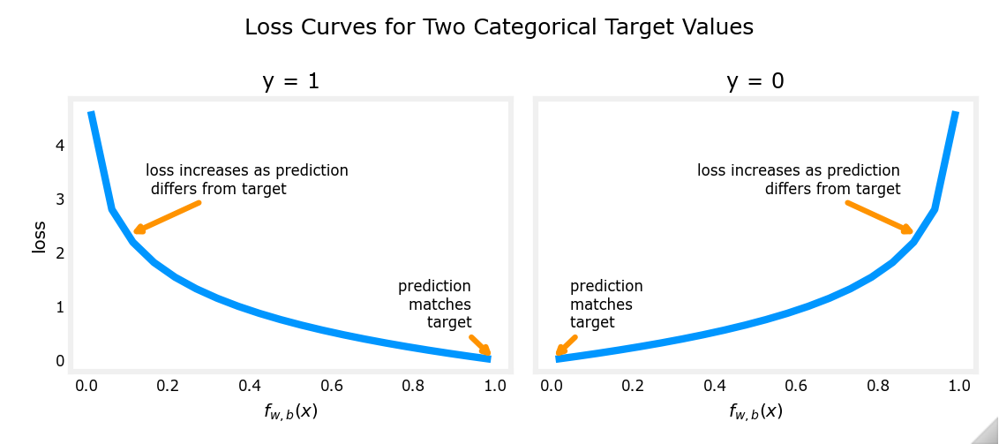
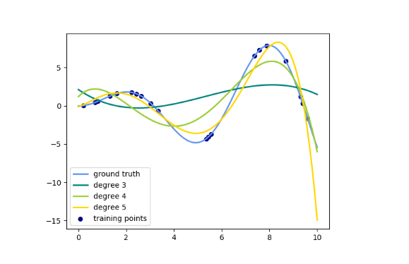
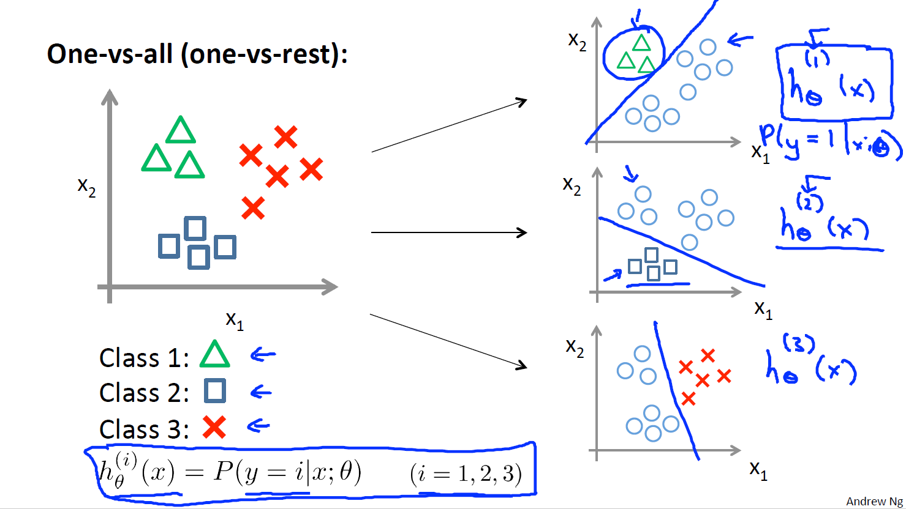

有监督学习：

常用符号集

| Notation        | Description                                                  |
| :-------------- | :----------------------------------------------------------- |
| $a$             | 标量 (scalar)，非粗体                                        |
| $\mathbf{a}$    | 向量 (vector)，粗体                                          |
| $\mathbf{A}$    | 矩阵 (matrix)，粗体大写                                      |
| $\mathbf I$     | 单位矩阵                                                     |
| $(\mathbf x,y)$ | 单个样本 (sample)，特征向量和目标变量                        |
| $\mathbf x_i$   | 第 $i$ 个样本的特征向量 $x_i=(x_{i1},x_{i2},\cdots,x_{in})^T$ |
| $x_j$           | 第 $j$ 个特征                                                |
| $x_{ij}$        | 第 $i$ 个样本的第 $j$ 个特征                                 |
| m               | 样本数量                                                     |
| n               | 每个样本的特征总数                                           |
| $\mathbf{w}$    | 参数：权重 (weight)                                          |
| $b$             | 参数：偏差(bias)                                             |
| $\hat y$        | 目标变量 $y$ 的预测值(估计值)  $\hat y=f(\mathbf x)$         |

# 线性模型

## 线性回归

### 基本形式

给定数据集 $D=\{(\mathbf x_1,y_1),(\mathbf x_2,y_2),\cdots,(\mathbf x_m,y_m)\}$，其中$\mathbf x_i=(x_{i1},x_{i2},\cdots,x_{in})^T$ 为第 $i$ 个样本的特征向量，$y_i\in \R$ 是目标变量。

**Model**：线性模型假设目标变量是特征的线性组合。因此，我们试图拟合函数
$$
f_{\mathbf{w},b}(\mathbf{x})=w_1x_1+w_2x_2+\cdots+w_nx_n+b=\sum_{j=1}^n w_jx_j+b
$$
称为多元线性回归 (multiple linear regression)。一般写作向量形式
$$
f_{\mathbf{w},b}(\mathbf{x})=\mathbf{w}^T\mathbf{x}+b
$$
特征向量 $\mathbf x=(x_1,x_2,\cdots,x_n)^T$，参数 $\mathbf{w}=(w_1,w_2,\cdots,w_d)^T$ 称为系数 (coefficients) 或权重 (weights)，标量 $b$ 称为偏置项(bias) 。求得参数 $\mathbf{w},b$ 后，模型就得以确定。$\mathbf w$ 可以直观表达了各特征在预测中的重要性，因此线性模型有很好的可解释性(comprehensibility) 。

对于每个样本，真实值 $y_i$ 和模型预测值 $\hat y_i$ 间存在误差 $e_i=y_i-\hat y_i$ ，误差满足如下**假设条件**：

1. 误差满足高斯分布 $e_i∼N(0, σ^2)$
2. 误差同分布 $\mathrm{var}(e_i)= σ^2$ 
3. 误差独立性 $\mathrm{cov}(e_i,e_j)=0 \quad (i  ≠ j)$ 

### 最小二乘法

对于给定的数据集 $D$，我们想要找到参数 $\mathbf w,b$ ，使得数据的实际观测值和线性近似预测的预测值尽可能接近。**普通最小二乘法** (ordinary least squares, OLS) 使用残差平方和来估计参数。

为了计算方便，定义 $x_0=1$，并记 $w_0=b$
$$
\mathbf{x} = \begin{pmatrix}
x_0 \\ x_1 \\ \vdots\\ x_n
\end{pmatrix},
\quad
\mathbf{w} = \begin{pmatrix}
w_0 \\ w_1 \\ \vdots\\ w_n
\end{pmatrix}
$$
线性回归模型可简写为
$$
f_{\mathbf{w}}(\mathbf{x}) = \mathbf{w}^T\mathbf{x}
$$
定义 **loss function** (损失函数) 衡量每个样本预测值 $\hat y$ 和真实值 $y$ 之间的差异，
$$
\text{loss}=(f_{\mathbf{w}}(\mathbf{x})-y)^2
$$
**cost function** (成本函数或代价函数) 衡量样本集的差异
$$
J(\mathbf{w}) = \frac{1}{2m} \sum\limits_{i=1}^{m} \left(f_{\mathbf{w}}(\mathbf{x}_i) - y_i\right)^2
$$
为了建立一个不会因训练集变大而变大的代价函数，我们计算均方误差而不是平方误差。额外的 1/2 是为了让后面的计算更简洁些。矩阵形式为
$$
J(\mathbf{w})=\cfrac{1}{2m}\|\mathbf{Xw-y}\|_2^2=\cfrac{1}{2m}(\mathbf{Xw-y})^T(\mathbf{Xw-y})
$$
其中
$$
\mathbf{X}=\begin{pmatrix}
1&x_{11}&x_{12}&\cdots&x_{1n} \\
1&x_{21}&x_{22}&\cdots&x_{2n} \\
\vdots&\vdots&\ddots&\vdots \\
1&x_{m1}&x_{m2}&\cdots&x_{mn} \\
\end{pmatrix},
\quad \mathbf{w}=\begin{pmatrix}w_0\\ w_1\\ \vdots\\w_n\end{pmatrix},
\quad \mathbf{y}=\begin{pmatrix}y_1\\ y_2\\ \vdots\\y_m\end{pmatrix}
$$
最后，模型参数估计等价于求解
$$
\argmin_{\substack{\mathbf w}} J(\mathbf{w})
$$

**参数估计** ：(parameter estimation) 使用凸优化方法求解代价函数，即
$$
\nabla J(\mathbf w)=\frac{\partial J}{\partial\mathbf x}=2\mathbf X^T(\mathbf{Xw-y})=\mathbf 0
$$
且 Hessian 矩阵 $\nabla^2 J(\mathbf w)$ 正定。如果 $\mathbf X^T \mathbf X$ 为满秩矩阵(full-rank matrix)或正定矩阵(positive definite matrix)，可求得最优解
$$
\mathbf w=(\mathbf X^T\mathbf X)^{-1}\mathbf X^T\mathbf y
$$
现实任务中 $\mathbf X^T\mathbf X$ 不可逆的可能原因如下

- 特征之间可能线性相关
- 特征数量大于样本总数 ($m>n$)

最小二乘法的优点

- 求解参数不需要迭代计算
- 不需要调试超参数

最小二乘法的缺点

- 仅适用于线性回归，无法推广到其他学习算法
- 假设 $m\geqslant n$ ，这个算法的复杂度为 $O(mn^2)$
- 如果样本特征的数量太大 (>10k)，模型将执行的非常慢

### 梯度下降法

梯度下降 (Gradient Descent) 是一种优化算法，它被广泛应用于机器学习，是许多算法的基础，比如线性回归、逻辑回归，以及神经网络的早期实现。

对于线性回归来说均方误差代价函数是一个凸函数（如下图），梯度下降可以一步一步找到全局最小值。

Gradient descent for multiple variables:

$$
\begin{align*} \text{repeat}&\text{ until convergence:} \; \lbrace \newline\;
& w_j = w_j -  \alpha \frac{\partial J(\mathbf{w},b)}{\partial w_j} \tag{5}  \; & \text{for all }j\newline
&b\ \ = b -  \alpha \frac{\partial J(\mathbf{w},b)}{\partial b}  \newline \rbrace
\end{align*}
$$
均方误差代价函数的导数项为

simultaneously update $w_j$ (for $j=1,2,\cdots,n$ ) and $b$ and where  
$$
\begin{align}
\frac{\partial J(\mathbf{w},b)}{\partial w_j}  &= \frac{1}{m} \sum\limits_{i = 0}^{m-1} (f_{\mathbf{w},b}(\mathbf{x}^{(i)}) - y^{(i)})x_{j}^{(i)} \tag{6}  \\
\frac{\partial J(\mathbf{w},b)}{\partial b}  &= \frac{1}{m} \sum\limits_{i = 0}^{m-1} (f_{\mathbf{w},b}(\mathbf{x}^{(i)}) - y^{(i)}) \tag{7}
\end{align}
$$

* m is the number of training examples in the data set

* $f_{\mathbf{w},b}(\mathbf{x}^{(i)})$ is the model's prediction, while $y^{(i)}$ is the target value

### 正则化代价函数

**Ridge** (岭回归) 通过引入正则化(regularization) 项来解决普通最小二乘的一些问题。

Cost function
$$
J(\mathbf{w})=\cfrac{1}{2m}\left(\|\mathbf{Xw-y}\|_2^2+ \alpha \|\mathbf w\|^2\right)
$$
其中，正则化参数 $\alpha$ 通过缩小特征权重来控制模型复杂度，值越大，收缩量越大，这样，系数对共线性的鲁棒性就更强了。

最小化代价函数可求得解析解
$$
\mathbf{w=(X^T X}+\alpha \mathbf{I)^{-1}X^T y}
$$
其中 $\mathbf I$ 是 $n+1$ 维单位阵

**Lasso** 是一个估计稀疏系数的线性模型。它在某些情况下是有用的，因为它倾向于给出非零系数较少的解，从而有效地减少了给定解所依赖的特征数。 它由一个带有 $l_1$ 范数正则项的线性模型组成。

Cost function
$$
J(\mathbf{w})=\cfrac{1}{2m}\left(\|\mathbf{Xw-y}\|_2^2+ \alpha \|\mathbf w\|_1\right)
$$
Lasso 中一般采用坐标下降法来实现参数估计。由于Lasso回归产生稀疏模型，因此也可以用来进行特征选择。

**Multi-task Lasso** 是一个估计多任务的稀疏系数的线性模型， $\mathbf Y$ 是一个  $m\times n_{tasks}$ 矩阵。约束条件是，对于所有回归问题（也叫任务），所选的特征是相同的。它混合使用 $l_1l_2$ 范数作为正则化项。

Cost function
$$
J(\mathbf{W})=\cfrac{1}{2m}\left(\|\mathbf{XW-Y}\|^2_{Fro}+ \alpha \|\mathbf W\|_{21}\right)
$$
其中 Fro 表示Frobenius范数
$$
\mathbf \|A\|_{Fro}=\sqrt{\sum_{ij}a^2_{ij}}
$$
混合 $l_1l_2$ 范数
$$
\mathbf \|A\|_{21}=\sum_i\sqrt{\sum_{j}a^2_{ij}}
$$
Multi-task Lasso 也采用坐标下降法来估计参数。

**Elastic-Net** 是一个训练时同时用 $l_1$ 和  $l_2$ 范数进行正则化的线性回归模型。这种组合允许学习稀疏模型，其中很少有权重是非零类。当多个特征存在相关时，弹性网是很有用的。Lasso很可能随机挑选其中之一，而弹性网则可能兼而有之。在这种情况下，要最小化的目标函数

Cost function
$$
J(\mathbf{w})=\cfrac{1}{2m}\left(\|\mathbf{Xw-y}\|_2^2+ \alpha\rho \|\mathbf w\|_1+ \frac{\alpha(1-\rho)}{2} \|\mathbf w\|_2^2\right)
$$

Elastic-Net 使用坐标下降法来估计参数。

**Multi-task Elastic-Net** 是一个估计多任务的稀疏系数的线性模型， $\mathbf Y$ 是一个  $m\times n_{tasks}$ 矩阵。约束条件是，对于所有回归问题（也叫任务），所选的特征是相同的。它使用混合的 $l_1l_2$ 范数和$l_2$作为正则化项。

Cost function
$$
J(\mathbf{W})=\cfrac{1}{2m}\left(\|\mathbf{XW-Y}\|^2_{Fro}+ \alpha\rho \|\mathbf W\|_{21}+ \frac{\alpha(1-\rho)}{2} \|\mathbf W\|_{Fro}^2\right)
$$
Multi-task Elastic-Net 也采用坐标下降法来估计参数。

**LARS** (Least-angle regression, 最小角回归 )是一种用于高维数据的回归算法。LARs和逐步向前回归很相似。在每一步中，它都会找到与目标最相关的特征。当多个特征具有相等的相关性时，它不是沿着相同的特征继续进行，而是沿着特征之间等角的方向进行。

LARS的优势在于：

- 在特征数明显大于样本数的情况下，它在数值算法上是非常有效的。
- 它的计算速度和前向选择一样快，其复杂度与普通最小二乘法相同。
- 它产生一个完整的分段线性解决方案路径，这在交叉验证或类似的尝试调优模型中很有用。
- 如果两个特征与目标之间的相关性几乎一致，那么它们的系数应以大致相同的速率增加。因此，该算法的性能与我们直觉所期望的一样，而且更稳定。
- 它很容易被修改，以便为其他估计器(如Lasso)提供解。

LARS的缺点包括：

- 因为LARS是基于对残差的迭代修改， 它可能会对噪音的影响特别敏感。

## Logistic 回归

### 基本形式

假设给定二分类样本集 $D=\{(\mathbf x_1,y_1),(\mathbf x_2,y_2),\cdots,(\mathbf x_m,y_m)\}$，其中$\mathbf x_i=(x_{i1},x_{i2},\cdots,x_{in})$ 为第 $i$ 个样本的特征向量，输出标记 $y_i\in \{0,1\}$ 。

我们可以尝试在分类数据集上使用线性回归算法分类。但线性回归模型产生的预测值 $\mathbf{w}^T\mathbf{x}+b$ 是连续数值，而我们这里想预测类别。

**Model**: 逻辑回归 (logistic regression, logit regression) 通过引入 Sigmod 函数将输入值映射到 $[0,1]$ 来实现分类功能。
$$
f_{\mathbf{w},b}(\mathbf{x}) = g(\mathbf{w}^T \mathbf{x}+b)
$$
where
$$
g(z) = \frac{1}{1+e^{-z}}
$$
式中特征向量 $\mathbf x=(x_1,x_2,\cdots,x_n)^T$，参数 $\mathbf{w}=(w_1,w_2,\cdots,w_d)^T$ 称为系数 (coefficients) 或权重 (weights)，标量 $b$ 称为偏置项(bias) 。 $g(z)$ 是 Sigmod 函数，也称 logistic 函数。求得参数 $\mathbf{w},b$ 后，模型就得以确定。

可以通过引入阈值（譬如0.5）实现分类预测
$$
\hat y=\begin{cases}
1 &\text{if } f_{\mathbf{w},b}(\mathbf{x})\geqslant 0.5 \\
0 &\text{if } f_{\mathbf{w},b}(\mathbf{x})<0.5
\end{cases}
$$
模型的输出可视为正样本的概率 $\mathbb P_1(y=1|\mathbf x)=f_{\mathbf{w},b}(\mathbf{x})$，则负样本的概率 $\mathbb P_0(y=0|\mathbf x)=1-f_{\mathbf{w},b}(\mathbf{x})$。
$$
\mathbb P(y_i|\mathbf x_i)=\begin{cases}
f_{\mathbf{w},b}(\mathbf{x}_i) &\text{if } y_i=1 \\
1-f_{\mathbf{w},b}(\mathbf{x}_i) &\text{if } y_i=0
\end{cases}
$$

### 决策边界

如上图中，$g(z)\geqslant 0.5 \text{ for } z\geqslant 0$ 。在 logistic 回归模型中，$z=\mathbf{w}^T\mathbf{x}+b$ 。因此，模型预测
$$
\hat y=\begin{cases}
1 &\text{if } \mathbf{w}^T\mathbf{x}+b\geqslant 0.5 \\
0 &\text{if } \mathbf{w}^T\mathbf{x}+b<0.5
\end{cases}
$$
logistic 回归输出一个线性决策边界 (linear decision boundary)。示例

可通过拟合非线性函数 $z(\mathbf x)$ 实现非线性决策边界。例如，模型 

$f(x_1,x_2) = g(x_1^2+x_2^2-1)\text{ where } g(z) = \cfrac{1}{1+e^{-z}}$

### 极大似然估计

logistic 回归若采用均方误差作为 cost function，是一个非凸函数(non-convex)，会存在许多局部极小值，因此我们尝试极大似然估计。

**极大似然估计**：(maximum likelihood estimate, MLE) 使得观测样本出现的概率最大，也即使得样本联合概率（也称似然函数）取得最大值。为了计算方便，定义 $x_0=1$，并记 $w_0=b$
$$
\mathbf{x} = \begin{pmatrix}
x_0 \\ x_1 \\ \vdots\\ x_n
\end{pmatrix},
\quad
\mathbf{w} = \begin{pmatrix}
w_0 \\ w_1 \\ \vdots\\ w_n
\end{pmatrix}
$$
logistic 回归模型可记为
$$
f_{\mathbf{w}}(\mathbf{x}) = \frac{1}{1+\exp(-\mathbf{w}^T\mathbf{x})}
$$
模型预测样本概率可联合记为
$$
\mathbb P(y_i|\mathbf x_i)=[f_{\mathbf{w}}(\mathbf{x}_i)]^{y_i}[1-f_{\mathbf{w}}(\mathbf{x}_i)]^{1-y_i}
$$
为求解方便，对样本联合概率取对数似然函数
$$
\begin{aligned}
\log L(\mathbf w) & =\log\prod_{i=1}^{m} \mathbb P(y_i|\mathbf x_i)=\sum_{i=1}^m\log \mathbb P(y_i|\mathbf x_i) \\
&=\sum_{i=1}^{m}[y_i\log f_{\mathbf{w}}(\mathbf{x}_i)+(1-y_i)\log(1-f_{\mathbf{w}}(\mathbf{x}_i))] \\
&=\sum_{i=1}^{m}[y_i\mathbf{w}^T\mathbf{x}-\log(1+e^{\mathbf{w}^T\mathbf{x}})]
\end{aligned}
$$
因此可定义 **loss function**  (损失函数) 度量单样本损失
$$
\text{loss}=-y\mathbf{w}^T\mathbf{x}+\log(1+e^{\mathbf{w}^T\mathbf{x}})
$$

最大化似然函数等价于最小化 **cost function**
$$
J(\mathbf w)=\frac{1}{m}\sum_{i=1}^{m}(-y_i\mathbf{w}^T\mathbf{x}+\log(1+e^{\mathbf{w}^T\mathbf{x}}))
$$
**参数估计** ：(parameter estimation) $J(\mathbf w)$ 是关于参数 $\mathbf w$ 的高阶可导连续凸函数，经典的数值优化算法如梯度下降法 (gradient descent method) 、牛顿法 (Newton method) 等都可求得其最优解
$$
\argmin_{\substack{\mathbf w}} J(\mathbf{w})
$$

### 最大期望算法

**最大期望算法**：（Expectation-Maximization algorithm, EM）与真实分布最接近的模拟分布即为最优分布，因此可以通过最小化交叉熵来求出最优分布。

真实分布可写为 
$$
\mathbb P(y_i|\mathbf x_i)=1
$$
模拟分布可写为 
$$
\mathbb Q(y_i|\mathbf x_i)=[f_{\mathbf{w}}(\mathbf{x}_i)]^{y_i}[1-f_{\mathbf{w}}(\mathbf{x}_i)]^{1-y_i}
$$
交叉熵为
$$
\begin{aligned}
H(\mathbb P,\mathbb Q) &=-\sum_{i=1}^m \mathbb P(y_i|\mathbf x_i)\log \mathbb Q(y_i|\mathbf x_i) \\
&=\sum_{i=1}^{m}(-y_i\mathbf{w}^T\mathbf{x}+\log(1+e^{\mathbf{w}^T\mathbf{x}}))
\end{aligned}
$$
**cost function**
$$
J(\mathbf w)=\frac{1}{m}\sum_{i=1}^{m}(-y_i\mathbf{w}^T\mathbf{x}+\log(1+e^{\mathbf{w}^T\mathbf{x}}))
$$
与极大似然估计相同。

## 广义线性回归

许多功能更为强大的非线性模型(non-linear model)可通过引入反向联系函数连接到输入变量的线性组合。例如，对数线性回归 (log-linear regression)
$$
\ln f_{\mathbf{w},b}(\mathbf{x})=\mathbf{w}^T\mathbf{x}+b
$$
更一般地，考虑单调可微函数 $z=h(y)$，令 
$$
f_{\mathbf{w},b}(\mathbf{x})=h^{-1}(\mathbf{w}^T\mathbf{x}+b)
$$
这样得到的模型称为广义线性模型 (Generalized Linear Models, GLM)，其中函数 $z=h(y) $ 称为联系函数 (link function)。广义线性模型的参数估计常通过加权最小二乘法或极大似然估计。

## 感知机

### 感知机

Perceptron 是另一种适用于大规模学习的简单分类算法。

- 它不需要设置学习率
- 它不需要正则项
- 它只用错误样本更新模型

最后一个特点意味着Perceptron的训练速度略快于带有合页损失(hinge loss)的SGD，因此得到的模型更稀疏。

### 被动感知算法

被动感知算法 (Passive Aggressive Algorithms) 是一种大规模学习的算法。和感知机相似，因为它们不需要设置学习率。然而，与感知器不同的是，它们包含正则化参数。

## 多项式回归

机器学习中的一个常见模式是使用非线性函数对数据的进行变换来创建新的特征。例如，可以通过构造**多项式特征**(**polynomial features**)来扩展简单的线性回归。在标准线性回归的情况下，您可能拟合一个二维特征的模型
$$
f_{\mathbf w}(\mathbf x)=w_0+w_1x_1+w_2x_2
$$
如果我们想用抛物面来拟合数据而不是平面，我们可以用二阶多项式组合特征，这样模型看起来就像这样
$$
f_{\mathbf w}(\mathbf x)=w_0+w_1x_1+w_2x_2+w_3x_1x_2+w_4x_1^2+w_5x_2^2
$$
其实，得到的多项式回归依旧是线性模型。只需引入新的特征向量进行转换
$$
\begin{matrix}
x_1&x_2&x_1x_2&x_1^2&x_2^2 \\
z_1&z_2&z_3&z_4&z_5
\end{matrix}
$$
下面是一个应用于一维数据的例子，使用了不同程度的多项式特征：

## 线性判别分析

假设给定二分类样本集 $D=\{(\mathbf x_1,y_1),(\mathbf x_2,y_2),\cdots,(\mathbf x_m,y_m)\}$，其中$\mathbf x_i=(x_{i1},x_{i2},\cdots,x_{id})$ 为第 $i$ 个样本的特征向量，输出标记 $y_i\in \{0,1\}$ 。

线性判别分析（Linear Discriminant Analysis，LDA）亦称 Fisher 判别分析。其基本思想是：将训练样本投影到一条直线上，使得同类的样例尽可能近，不同类的样例尽可能远。如图所示：

# 决策树

## 基本流程

## 核心方法

划分选择：（信息论：自信息，信息熵）、信息增益、信息增益率、基尼系数

剪枝处理：预剪枝、后剪枝

连续与缺失值

《统计-5》《花书-3.13》信息论

ID3
C4.5
C5.0 Information Gain Information Gain Rate
CART   Gini Index

## 类别不平衡问题

针对非平衡的数据集，为了使得模型在这个数据集上学习的效果更加好，需要改变原数据集中结构分布比例的不合理，通过丢弃降低多值对应数量或者复制增加低值对应数量，让不同值下的样本数量大致相同。

平衡方法：random、smote

# 神经网络

# 支持向量机

**s.t.** 是 subject to (such that) 的缩写，表示约束条件。

#  贝叶斯分类器

# 多分类和多标签

**Multiclass classification**：目标变量包含两个以上离散值的分类任务 $y\in\{0,1,2,\cdots\}$。每个样本只能标记为一个类。例如，使用从一组水果图像中提取的特征进行分类，其中每一幅图像都可能是一个橙子、一个苹果或一个梨。每个图像就是一个样本，并被标记为三个可能的类之一。

- One-Vs-Rest (OVR) 也称为one-vs-all，为每个类分别拟合一个二分类模型，这是最常用的策略，对每个类都是公平的。这种方法的一个优点是它的可解释性，每个类都可以查看自己模型的相关信息。

- One-Vs-One (OVO) 是对每一对类分别拟合一个二分类模型。在预测时，选择得票最多的类别。在票数相等的两个类别中，它选择具有最高总分类置信度的类别，方法是对由底层二分类器计算的对分类置信度进行求和。

  由于它需要拟合 `n_classes*(n_classes-1)/2` 个分类器，这种方法通常比one-vs-rest要慢，原因就在于其复杂度 O(n^2^~classes~) 。然而，这个方法也有优点，比如说是在没有很好的缩放 `n_samples` 数据的核方法中。这是因为每个单独的学习问题只涉及一小部分数据，而对于一个one-vs-rest，完整的数据集将会被使用 `n_classes`次。

**Multilabel classification**：包含多个目标变量的分类任务

**Multioutput regression**：包含多个目标变量的回归任务

# 附录

