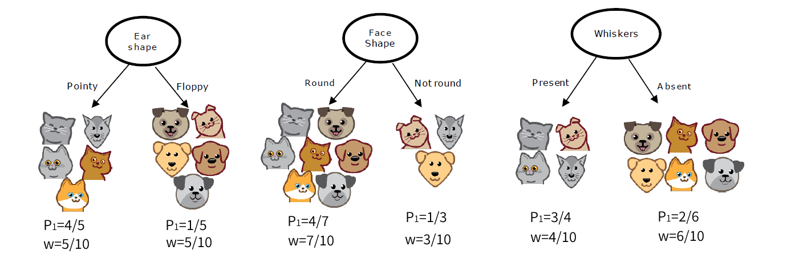

# 引言

分类和回归是监督学习的核心问题。若目标变量是连续值，此类学习任务称为**回归** (regression)。当目标变量取有限个离散值时，称为**分类**（classification）。当分类的结果只有两种的分类问题称为**二分类**问题 (binary classification)，输出变量通常表示为正样本/负样本(positive/negative)。

给定监督学习的数据集  $D=\{(\mathbf x^{(1)},y^{(1)}),(\mathbf x^{(2)},y^{(2)}),\cdots,(\mathbf x^{(m)},y^{(m)})\}$，其中$\mathbf x^{(i)}=(x_1^{(i)},x_2^{(i)},\cdots,x_d^{(i)})^T$ 为第 $i$ 个样本的特征向量。

# 线性模型

## 线性回归

### 基本形式

给定数据集 $D$ ，目标变量 $\mathbf y\in \R^m$ 

**Model**：线性模型假设目标变量是特征的线性组合。因此，我们试图拟合函数
$$
f_{\mathbf{w},b}(\mathbf{x})=w_1x_1+w_2x_2+\cdots+w_dx_d+b=\sum_{j=1}^d w_jx_j+b
$$
称为多元线性回归 (multiple linear regression)。一般写作向量形式
$$
f_{\mathbf{w},b}(\mathbf{x})=\mathbf{w}^T\mathbf{x}+b
$$
特征向量 $\mathbf x=(x_1,x_2,\cdots,x_d)^T$，参数 $\mathbf{w}=(w_1,w_2,\cdots,w_d)^T$ 称为系数 (coefficients) 或权重 (weights)，标量 $b$ 称为偏置项(bias) 。求得参数 $\mathbf{w},b$ 后，模型就得以确定。$\mathbf w$ 可以直观表达了各特征在预测中的重要性，因此线性模型有很好的可解释性(comprehensibility) 。

对于每个样本，真实值 $y^{(i)}$ 和模型预测值 $\hat y^{(i)}$ 间存在误差 $e^{(i)}=y^{(i)}-\hat y^{(i)}$ ，误差满足如下**假设条件**：

1. 误差满足高斯分布 $e^{(i)}∼N(0, σ^2)$
2. 误差同分布 $\mathrm{var}(e^{(i)})= σ^2$ 
3. 误差独立性 $\mathrm{cov}(e^{(i)},e^{(j)})=0 \quad (i  ≠ j)$ 

### 最小二乘法

对于给定的数据集 $D$，我们想要找到参数 $\mathbf w,b$ ，使得数据的实际观测值和线性近似预测的预测值尽可能接近。**普通最小二乘法** (ordinary least squares, OLS) 使用残差平方和来估计参数。

为了计算方便，定义 $x_0=1$，并记 $w_0=b$
$$
\mathbf{x} = \begin{pmatrix}
x_0 \\ x_1 \\ \vdots\\ x_d
\end{pmatrix},
\quad
\mathbf{w} = \begin{pmatrix}
w_0 \\ w_1 \\ \vdots\\ w_d
\end{pmatrix}
$$
线性回归模型可简写为
$$
f_{\mathbf{w}}(\mathbf{x}) = \mathbf{w}^T\mathbf{x}
$$
 **loss function** (损失函数) 衡量单个样本预测值 $\hat y$ 和真实值 $y$ 之间的差异
$$
\text{loss}=(f_{\mathbf{w}}(\mathbf{x})-y)^2
$$
**cost function** (成本函数或代价函数) 衡量样本集的差异
$$
J(\mathbf{w}) = \frac{1}{2m} \sum\limits_{i=1}^{m} \left(f_{\mathbf{w}}(\mathbf{x}^{(i)}) - y^{(i)}\right)^2
$$
为了建立一个不会因训练集变大而变大的代价函数，我们计算均方误差而不是平方误差。额外的 1/2 是为了让后面的计算更简洁些。矩阵形式为
$$
J(\mathbf{w})=\cfrac{1}{2m}\|\mathbf{Xw-y}\|_2^2=\cfrac{1}{2m}(\mathbf{Xw-y})^T(\mathbf{Xw-y})
$$
其中，$\mathbf X$ 称为**设计矩阵**（design matrix）
$$
\mathbf{X}=\begin{pmatrix}
1&x_{1}^{(1)}&x_{2}^{(1)}&\cdots&x_{d}^{(1)} \\
1&x_{1}^{(2)}&x_{2}^{(2)}&\cdots&x_{d}^{(2)} \\
\vdots&\vdots&\ddots&\vdots \\
1&x_{1}^{(m)}&x_{2}^{(m)}&\cdots&x_{d}^{(m)} \\
\end{pmatrix},
\quad \mathbf{w}=\begin{pmatrix}w_0\\ w_1\\ \vdots\\w_d\end{pmatrix},
\quad \mathbf{y}=\begin{pmatrix}y^{(1)}\\ y^{(2)}\\ \vdots\\y^{(m)}\end{pmatrix}
$$
最后，模型参数估计等价于求解
$$
\arg\min\limits_{\mathbf w} J(\mathbf{w})
$$

**参数估计** ：(parameter estimation) 使用凸优化方法求解代价函数，此方程被称为**正规方程**（normal equation）
$$
\nabla J(\mathbf w)=\frac{\partial J}{\partial\mathbf w}=2\mathbf X^T(\mathbf{Xw-y})=\mathbf 0
$$
且 Hessian 矩阵 $\nabla^2 J(\mathbf w)$ 正定。如果 $\mathbf X^T \mathbf X$ 为满秩矩阵(full-rank matrix)或正定矩阵(positive definite matrix)，可求得最优解。
$$
\mathbf w=(\mathbf X^T\mathbf X)^{-1}\mathbf X^T\mathbf y
$$
现实任务中 $\mathbf X^T\mathbf X$ 不可逆的可能原因如下

- 特征之间可能线性相关
- 特征数量大于样本总数 ($d>m$)

最小二乘法的优点

- 求解参数不需要迭代计算
- 不需要调试超参数

最小二乘法的缺点

- 仅适用于线性回归，无法推广到其他学习算法
- 假设 $m\geqslant d$ ，这个算法的复杂度为 $O(md^2)$
- 如果样本特征的数量太大 (>10k)，模型将执行的非常慢

### 梯度下降法

梯度下降 (Gradient Descent) 是一种优化算法，它被广泛应用于机器学习，是许多算法的基础，比如线性回归、逻辑回归，以及神经网络的早期实现。对于线性回归来说均方误差代价函数是一个凸函数（如下图），梯度下降可以一步一步找到全局最小值。

梯度下降迭代公式为

$$
\begin{align} \text{repeat}&\text{ until convergence: } \{ \\
& \mathbf w \gets \mathbf w-\lambda\nabla J(\mathbf{w}) \\ 
&\}\end{align}
$$
均方误差代价函数的导数项为

$$
\nabla J(\mathbf w)=\frac{\partial J}{\partial\mathbf w}=2\mathbf X^T(\mathbf{Xw-y})
$$

### 正则化代价函数

**Ridge** (岭回归) 通过引入正则化(regularization) 项来解决普通最小二乘的一些问题。

Cost function
$$
J(\mathbf{w})=\cfrac{1}{2m}\left(\|\mathbf{Xw-y}\|_2^2+ \alpha \|\mathbf w\|^2\right)
$$
其中，正则化参数 $\alpha$ 通过缩小特征权重来控制模型复杂度，值越大，收缩量越大，这样，系数对共线性的鲁棒性就更强了。

最小化代价函数可求得解析解
$$
\mathbf{w=(X^T X}+\alpha \mathbf{I)^{-1}X^T y}
$$
其中 $\mathbf I$ 是 $n+1$ 维单位阵

**Lasso** 是一个估计稀疏系数的线性模型。它在某些情况下是有用的，因为它倾向于给出非零系数较少的解，从而有效地减少了给定解所依赖的特征数。 它由一个带有 $l_1$ 范数正则项的线性模型组成。

Cost function
$$
J(\mathbf{w})=\cfrac{1}{2m}\left(\|\mathbf{Xw-y}\|_2^2+ \alpha \|\mathbf w\|_1\right)
$$
Lasso 中一般采用坐标下降法来实现参数估计。由于Lasso回归产生稀疏模型，因此也可以用来进行特征选择。

**Multi-task Lasso** 是一个估计多任务的稀疏系数的线性模型， $\mathbf Y$ 是一个  $m\times n_{tasks}$ 矩阵。约束条件是，对于所有回归问题（也叫任务），所选的特征是相同的。它混合使用 $l_1l_2$ 范数作为正则化项。

Cost function
$$
J(\mathbf{W})=\cfrac{1}{2m}\left(\|\mathbf{XW-Y}\|^2_{Fro}+ \alpha \|\mathbf W\|_{21}\right)
$$
其中 Fro 表示Frobenius范数
$$
\mathbf \|\mathbf A\|_{Fro}=\sqrt{\sum_{ij}a^2_{ij}}=\sqrt{\text{tr}(\mathbf A^T\mathbf A)}
$$
混合 $l_1l_2$ 范数
$$
\mathbf \|\mathbf A\|_{21}=\sum_i\sqrt{\sum_{j}a^2_{ij}}
$$
Multi-task Lasso 也采用坐标下降法来估计参数。

**Elastic-Net** 是一个训练时同时用 $l_1$ 和  $l_2$ 范数进行正则化的线性回归模型。这种组合允许学习稀疏模型，其中很少有权重是非零类。当多个特征存在相关时，弹性网是很有用的。Lasso很可能随机挑选其中之一，而弹性网则可能兼而有之。在这种情况下，要最小化的目标函数

Cost function
$$
J(\mathbf{w})=\cfrac{1}{2m}\left(\|\mathbf{Xw-y}\|_2^2+ \alpha\rho \|\mathbf w\|_1+ \frac{\alpha(1-\rho)}{2} \|\mathbf w\|_2^2\right)
$$

Elastic-Net 使用坐标下降法来估计参数。

**Multi-task Elastic-Net** 是一个估计多任务的稀疏系数的线性模型， $\mathbf Y$ 是一个  $m\times n_{tasks}$ 矩阵。约束条件是，对于所有回归问题（也叫任务），所选的特征是相同的。它使用混合的 $l_1l_2$ 范数和$l_2$作为正则化项。

Cost function
$$
J(\mathbf{W})=\cfrac{1}{2m}\left(\|\mathbf{XW-Y}\|^2_{Fro}+ \alpha\rho \|\mathbf W\|_{21}+ \frac{\alpha(1-\rho)}{2} \|\mathbf W\|_{Fro}^2\right)
$$
Multi-task Elastic-Net 也采用坐标下降法来估计参数。

**LARS** (Least-angle regression, 最小角回归 )是一种用于高维数据的回归算法。LARs和逐步向前回归很相似。在每一步中，它都会找到与目标最相关的特征。当多个特征具有相等的相关性时，它不是沿着相同的特征继续进行，而是沿着特征之间等角的方向进行。

LARS的优势在于：

- 在特征数明显大于样本数的情况下，它在数值算法上是非常有效的。
- 它的计算速度和前向选择一样快，其复杂度与普通最小二乘法相同。
- 它产生一个完整的分段线性解决方案路径，这在交叉验证或类似的尝试调优模型中很有用。
- 如果两个特征与目标之间的相关性几乎一致，那么它们的系数应以大致相同的速率增加。因此，该算法的性能与我们直觉所期望的一样，而且更稳定。
- 它很容易被修改，以便为其他估计器(如Lasso)提供解。

LARS的缺点包括：

- 因为LARS是基于对残差的迭代修改， 它可能会对噪音的影响特别敏感。

## Logistic 回归

### 基本形式

给定数据集 $D$ ，目标变量 $y^{(i)}\in \{0,1\}$ 。我们可以尝试在分类数据集上使用线性回归算法分类。但线性回归模型产生的预测值 $\mathbf{w}^T\mathbf{x}+b$ 是连续数值，而我们这里想预测类别。

**Model**: 逻辑回归 (logistic regression, logit regression) 通过引入Sigmod 函数（S型曲线）将输入值映射到 $[0,1]$ 来实现分类功能。
$$
f_{\mathbf{w},b}(\mathbf{x}) = g(\mathbf{w}^T \mathbf{x}+b)
$$
where
$$
g(z) = \frac{1}{1+e^{-z}}
$$
式中特征向量 $\mathbf x=(x_1,x_2,\cdots,x_d)^T$，参数 $\mathbf{w}=(w_1,w_2,\cdots,w_d)^T$ 称为系数 (coefficients) 或权重 (weights)，标量 $b$ 称为偏置项(bias) 。 $g(z)$ 是 Sigmod 函数，也称 logistic 函数。求得参数 $\mathbf{w},b$ 后，模型就得以确定。

可以通过引入阈值（默认0.5）实现分类预测
$$
\hat y=\begin{cases}
1 &\text{if } f_{\mathbf{w},b}(\mathbf{x})\geqslant 0.5 \\
0 &\text{if } f_{\mathbf{w},b}(\mathbf{x})<0.5
\end{cases}
$$
模型的输出可视为正样本的概率 $\mathbb P_1(y=1|\mathbf x)=f_{\mathbf{w},b}(\mathbf{x})$，则负样本的概率 $\mathbb P_0(y=0|\mathbf x)=1-f_{\mathbf{w},b}(\mathbf{x})$。联合写为
$$
\mathbb P(y|\mathbf x)=\begin{cases}
f_{\mathbf{w},b}(\mathbf{x}) &\text{if } y=1 \\
1-f_{\mathbf{w},b}(\mathbf{x}) &\text{if } y=0
\end{cases}
$$

### 极大似然估计

logistic 回归若采用均方误差作为 cost function，是一个非凸函数(non-convex)，会存在许多局部极小值，因此我们尝试极大似然估计。

**极大似然估计**：(maximum likelihood estimate, MLE) 使得观测样本出现的概率最大，也即使得样本联合概率（也称似然函数）取得最大值。为了计算方便，定义 $x_0=1$，并记 $w_0=b$
$$
\mathbf{x} = \begin{pmatrix}
x_0 \\ x_1 \\ \vdots\\ x_d
\end{pmatrix},
\quad
\mathbf{w} = \begin{pmatrix}
w_0 \\ w_1 \\ \vdots\\ w_d
\end{pmatrix}
$$
logistic 回归模型可记为
$$
f_{\mathbf{w}}(\mathbf{x}) = \frac{1}{1+\exp(-\mathbf{w}^T\mathbf{x})}
$$
模型预测样本概率可联合记为
$$
\mathbb P(y|\mathbf x)=[f_{\mathbf{w}}(\mathbf{x})]^{y}[1-f_{\mathbf{w}}(\mathbf{x})]^{1-y}
$$
为求解方便，对样本联合概率取对数似然函数
$$
\begin{aligned}
\log L(\mathbf w) & =\log\prod_{i=1}^{m} \mathbb P(y^{(i)}|\mathbf x^{(i)})=\sum_{i=1}^m\log \mathbb P(y^{(i)}|\mathbf x^{(i)}) \\
&=\sum_{i=1}^{m}[y^{(i)}\log f_{\mathbf{w}}(\mathbf{x}^{(i)})+(1-y^{(i)})\log(1-f_{\mathbf{w}}(\mathbf{x}^{(i)}))] \\
&=\sum_{i=1}^{m}[y^{(i)}\mathbf{w}^T\mathbf{x}-\log(1+e^{\mathbf{w}^T\mathbf{x}})]
\end{aligned}
$$
因此可定义 **loss function**  (损失函数) 度量单样本损失
$$
\text{loss}=-y\mathbf{w}^T\mathbf{x}+\log(1+e^{\mathbf{w}^T\mathbf{x}})
$$

最大化似然函数等价于最小化 **cost function**
$$
J(\mathbf w)=\frac{1}{m}\sum_{i=1}^{m}(-y^{(i)}\mathbf{w}^T\mathbf{x}+\log(1+e^{\mathbf{w}^T\mathbf{x}}))
$$
**参数估计** ：(parameter estimation) $J(\mathbf w)$ 是关于参数 $\mathbf w$ 的高阶可导连续凸函数，经典的数值优化算法如梯度下降法 (gradient descent method) 、牛顿法 (Newton method) 等都可求得其最优解
$$
\arg\min\limits_{\mathbf w} J(\mathbf{w})
$$

### 最大期望算法

**最大期望算法**：（Expectation-Maximization algorithm, EM）与真实分布最接近的模拟分布即为最优分布，因此可以通过最小化交叉熵来求出最优分布。

真实分布可写为 
$$
\mathbb P(y|\mathbf x)=1
$$
模拟分布可写为 
$$
\mathbb Q(y|\mathbf x)=[f_{\mathbf{w}}(\mathbf{x})]^{y}[1-f_{\mathbf{w}}(\mathbf{x})]^{1-y}
$$
交叉熵为
$$
\begin{aligned}
H(\mathbb P,\mathbb Q) &=-\sum_{i=1}^m \mathbb P(y^{(i)}|\mathbf x^{(i)})\log \mathbb Q(y^{(i)}|\mathbf x^{(i)}) \\
&=\sum_{i=1}^{m}(-y^{(i)}\mathbf{w}^T\mathbf{x}+\log(1+e^{\mathbf{w}^T\mathbf{x}}))
\end{aligned}
$$
**cost function**
$$
J(\mathbf w)=\frac{1}{m}\sum_{i=1}^{m}(-y^{(i)}\mathbf{w}^T\mathbf{x}+\log(1+e^{\mathbf{w}^T\mathbf{x}}))
$$
与极大似然估计相同。

### 决策边界

逻辑回归模型 $f_{\mathbf{w},b}(\mathbf{x})=g(z)= g(\mathbf{w}^T \mathbf{x}+b)$

对于 sigmoid 函数（如上图），$g(z)\geqslant 0.5 \text{ for } z\geqslant 0$ 。在 logistic 回归模型中，$z=\mathbf{w}^T\mathbf{x}+b$ 。因此，模型预测
$$
\hat y=\begin{cases}
1 &\text{if } \mathbf{w}^T\mathbf{x}+b\geqslant 0 \\
0 &\text{if } \mathbf{w}^T\mathbf{x}+b<0
\end{cases}
$$
由此可见，logistic 回归输出一个线性决策边界 (linear decision boundary) 
$$
\mathbf{w}^T\mathbf{x}+b=0
$$
我们也可以创建多项式特征拟合一个非线性边界。例如，模型 
$f(x_1,x_2) = g(x_1^2+x_2^2-36)\text{ where } g(z) = \cfrac{1}{1+e^{-z}}$ 
决策边界方程为 $x_1^2+x_2^2-36=0$

## 广义线性回归

许多功能更为强大的非线性模型(non-linear model)可通过引入反向联系函数连接到输入变量的线性组合。例如，对数线性回归 (log-linear regression)
$$
\ln f_{\mathbf{w},b}(\mathbf{x})=\mathbf{w}^T\mathbf{x}+b
$$
更一般地，考虑单调可微函数 $z=h(y)$，令 
$$
f_{\mathbf{w},b}(\mathbf{x})=h^{-1}(\mathbf{w}^T\mathbf{x}+b)
$$
这样得到的模型称为广义线性模型 (Generalized Linear Models, GLM)，其中函数 $z=h(y) $ 称为联系函数 (link function)。广义线性模型的参数估计常通过加权最小二乘法或极大似然估计。

## 多项式回归

机器学习中的一个常见模式是使用非线性函数对数据的进行变换来创建新的特征。例如，可以通过构造**多项式特征**(**polynomial features**)来扩展简单的线性回归。在标准线性回归的情况下，您可能拟合一个二维特征的模型
$$
f_{\mathbf w}(\mathbf x)=w_0+w_1x_1+w_2x_2
$$
如果我们想用抛物面来拟合数据而不是平面，我们可以用二阶多项式组合特征，这样模型看起来就像这样
$$
f_{\mathbf w}(\mathbf x)=w_0+w_1x_1+w_2x_2+w_3x_1x_2+w_4x_1^2+w_5x_2^2
$$
其实，得到的多项式回归依旧是线性模型。只需引入新的特征向量进行转换
$$
\begin{matrix}
\text{from}&x_1&x_2&x_1x_2&x_1^2&x_2^2 \\
\to&z_1&z_2&z_3&z_4&z_5
\end{matrix}
$$
下面是一个应用于一维数据的例子，使用了不同程度的多项式特征：

## 感知机

### 感知机

Perceptron 是另一种适用于大规模学习的简单分类算法。

- 它不需要设置学习率
- 它不需要正则项
- 它只用错误样本更新模型

最后一个特点意味着Perceptron的训练速度略快于带有合页损失(hinge loss)的SGD，因此得到的模型更稀疏。

### 被动感知算法

被动感知算法 (Passive Aggressive Algorithms) 是一种大规模学习的算法。和感知机相似，因为它们不需要设置学习率。然而，与感知器不同的是，它们包含正则化参数。

## 线性判别分析

线性判别分析（Linear Discriminant Analysis，LDA）亦称 Fisher 判别分析。其基本思想是：将训练样本投影到一条直线上，使得同类的样例尽可能近，不同类的样例尽可能远。如图所示：

# 决策树

## 基本流程

分类决策树模型是表示基于特征对实例进行分类的树形结构。决策树可以转换成一个 if-then 规则的集合，也可以看作是定义在特征空间划分上的类的条件概率分布。

文章中，我们已经知道了决策树最基本也是最核心的思想。那就是其实决策树就是可以看**做一个if-then规则的集合。**我们从决策树的根结点到每一个都叶结点构建一条规则。

**并且我们将要预测的实例都可以被一条路径或者一条规则所覆盖。**

决策树是一种树形结构，其中每个内部节点是表示一个特征的判断条件，每个分支代表一个判断结果的输出，最后每个叶节点一种分类结果。

决策树（Decision Tree）是一种用于分类和回归的非参数有监督学习方法。其目标是创建一个模型，通过学习从数据特性中推断出的简单决策规则来预测目标变量的值。

cat-classification-example

Decision Tree

决策树的学习本质上就是从训练数据集中归纳出一组分类规则，使它与训练数据矛盾较小的同时具有较强的泛华能力。

从上述步骤可以看出，决策生成过程中有三个重要的问题：

- **如何选择分裂的特征**
- **数据如何分割**
- **什么时候停止分裂**

决策树的构建算法主要有**ID3、C4.5、CART**三种

ID3 使用**信息增益**作为选择特征的准则；

C4.5 使用**信息增益比**作为选择特征的准则；

CART 使用 **Gini 指数**作为选择特征的准则。

## 划分选择

决策树学习旨在构建一个与训练数据拟合很好，并且复杂度小的决策树。因为从可能的决策树中直接选取最优决策树是 NP 完全问题。现实中采用启发式方法学习次优的决策树。

给定数据集 $D$ ，目标变量 $y^{(i)}\in \{0,1\}$ 。决策树递归地划分空间，使得具有相同标签的样本被分到一样的组。

**划分选择**

信息增益

增益率

基尼指数

ID3 Information Gain
C4.5 Information Gain Rate
C5.0  
CART   Gini Index

决策树学习算法包括 3 部分：特征选择、树的生成和树的剪枝。常用的算法有 ID3 、C4.5和 CART。

特征选择的目的在于选取对训练数据能够分类的特征．特征选择的关键是其准则．常用的准则如下：
 (1) 样本集合 D 对特征 A 的信息增益（ID3）
 (2) 样本集合 D 对特征 A 的信息增益率（C4.5）
 (3) 样本集合 D 对特征 A 的基尼指数（CART）

决策树的生成通常使用信息增益最大、信息增益比最大或基尼指数最小作为特征选择的准则，决策树的生成往往通过计算信息增益或其他指标，从根结点开始，递归地产生决策树。这相当于用信息增益或其他准则不断地选取局部最优的特征，或将训练集分割为能够基本正确分类的子集。 

**决策树的特征选择算法**

决策树学习的关键在于如何选择最优的划分属性，所谓的最优划分属性，对于二元分类而言，就是尽量使划分的样本属于同一类别，即“纯度”最高的属性。那么如何来度量特征（features）的纯度，这时候就要用到“信息熵”和"信息增益"，"信息增益率”以及“基尼系数”等概念。

决策树学习的关键其实就是选择最优划分属性，**希望划分后，分支结点的“纯度”越来越高。**那么“纯度”的度量方法不同，也就导致了学习算法的不同，这里我们讲解最常见的俩种算法，ID3算法与C4.5算法。

“信息熵”是度量样本集合不确定度（纯度）的最常用的指标。

在我们的ID3算法中，我们采取信息增益这个量来作为纯度的度量。我们选取使得信息增益最大的特征进行分裂！那么信息增益又是什么概念呢？

我们前面说了，信息熵是代表随机变量的复杂度（不确定度）通俗理解信息熵 - 知乎专栏，条件熵代表在某一个条件下，随机变量的复杂度（不确定度）通俗理解条件熵 - 知乎专栏。

而我们的信息增益恰好是：信息熵-条件熵。

信息增益表示得知属性 a 的信息而使得样本集合不确定度减少的程度。于是我们就引入了信息增益率来选择最优划分属性！

我们从上面求解信息增益的公式中，其实可以看出，信息增益准则其实是对可取值数目较多的属性有所偏好

---------------------

ID3（Iterative Dichotomiser 3）是由Ross Quinlan于1986年开发的。该算法建立了一个多路树，为每个节点(即贪婪地)寻找分类特征，从而为分类目标提供最大的信息增益。树生长到它们的最大尺寸，然后，通常采取一个剪枝步骤，以提高树的对位置数据的泛化能力。

**缺点**：信息增益偏向取值较多的特征

**原因**：当特征的取值较多时，根据此特征划分更容易得到纯度更高的子集，因此划分之后的熵更低，由于划分前的熵是一定的，因此信息增益更大，因此信息增益比较偏向取值较多的特征。

c4.5是ID3的继承者，并且通过动态定义将连续属性值分割成一组离散间隔的离散属性（基于数字变量），从而消除了特征必须是分类的限制。c4.5将经过训练的树(即ID3算法的输出)转换成一组if-then规则的集合。然后对每条规则的这些准确性进行评估，以确定应用它们的顺序。如果规则的准确性没有提高的话，则需要决策树的树枝来解决。

C4.5算法是用于生成决策树的一种经典算法，是ID3算法的一种延伸和优化。C4.5算法对ID3算法主要做了一下几点改进

1. 通过信息增益率选择分裂属性，克服了ID3算法中通过信息增益倾向于选择拥有多个属性值的属性作为分裂属性的不足
2. 能够处理离散型和连续型的属性类型，即将连续型的属性进行离散化处理
3. 构造决策树之后进行剪枝操作；
4. 能够处理具有缺失属性值的训练数据

c5.0是Quinlan在专有许可下发布的最新版本。与C4.5相比，它使用更少的内存和构建更小的规则集，同时更精确。

CART（Classification and Regression Trees）与C4.5非常相似，但它的不同之处在于它支持数值目标变量(回归)，不计算规则集。CART使用特征和阈值构造二叉树，在每个节点上获得最大的信息增益。

CART树里面对C4.5中存在的问题进行了改进。CART假设决策树是**二叉树**，并且可以分类也可以回归，而且用基尼指数代替了熵模型进行特征选择，也提供了优化的剪枝策略。

基尼指数（基尼不纯度）：表示在样本集合中一个随机选中的样本被分错的概率。

**注意**： Gini指数越小表示集合中被选中的样本被分错的概率越小，也就是说集合的纯度越高，反之，集合越不纯。

即 **基尼指数（基尼不纯度）= 样本被选中的概率 \* 样本被分错的概率**

## 剪枝处理

由于生成的决策树存在过拟合问题，需要对它进行剪枝，以简化学到的决策树。决策树的剪枝，往往从已生成的树上剪掉一些叶结点或叶结点以上的子树，并将其父结点或根结点作为新的叶结点，从而简化生成的决策树。

预剪枝

后剪枝

## 特征处理

预分裂特征的属性分为离散型和连续型两种。对于离散型的数据，按照属性值进行分裂，每个属性值对应一个分类节点；对于连续型的数据，一般性的做法是对所有样本进行排序，再将数据分成若干区间，如 $\cdots,(0,10],(10,20],(20,30],\cdots$，一个区间对应一个节点。

能够处理离散型和连续型的属性类型，即将连续型的属性进行离散化处理

**离散值特征**：one-hot encoding

如果一个离散特征可以取 $k$ 个可能的值，我们可以通过创建 $k$ 个取值为0或1的二分类特征来替换。

**连续值特征**：一种惯例是对所有样本排序，取排序样本中的所有中点值作为阈值的候选值，取信息增益最高的中点值作为阈值。

## 决策边界

## 回归树

回归树：（Regression Trees）叶节点样本的均值作为预测值

衡量划分标准的方法：加权平均方差和的减少

回归树：划分的准则是平方误差最小化

## 集成算法

事实证明，只需要改变一个训练样本，可拆分的最高信息增益对应的特征就可能发生改变，因此在根节点会产生一个不同的划分，生成一颗完全不同的树。

因此，单个决策树对数据的微小变化非常敏感。让算法变得更健壮(robust)的一个方法是构建不知一颗决策树，这称之为树集成(Tree ensemble)。

- Using multiple decision trees 多颗树投票决定预测结果
- Sampling with replacement 使用有放回抽样创建新的随机训练集

## Decision Tree Learning

1. 在根节点从所有训练样本开始
2. 计算所有特征的信息增益
3. 选择信息增益最高的特征将数据集划分为左右子分支
4. 继续重复左右分支的分裂过程，直到满足停止条件

**Decision 1**：如何选择拆分每个节点的特征

Maximize purity (or minimize impurity)

**Choosing a split: Information Gain**

条件熵是熵的加权平均

信息增益：加权平均熵的减少量

$P_1$: 子分支中正样本的比例

$w$: 子分支的样本比例

**测量纯度**

$P_1$: 正样本比例
$P_0=1-P_1$: 负样本比例

熵(entropy)：对一组数据不纯度的测量
$$
\begin{align*}
H(P_1)&=-P_1\log P_1-P_0\log P_0  \\
&=-P_1\log P_1-(1-P_1)\log (1-P_1)
\end{align*}
$$
注意：$0\log 0 = 0$

$$
\text{Gain}=H(p_1^{\text{root}})-\left(w^{\text{left}}H(p_1^{\text{left}})+w^{\text{right}}H(p_1^{\text{right}})\right)
$$
**Decision 2:**When do you stop splitting?

- 当一个节点100%是一个类别时（零熵）
- 当分裂一个节点导致树超过最大深度时 (maximum depth)。
- 如果分裂一个节点导致的信息增益低于阈值。
- 如果一个节点的样本数低于阈值

> 限制决策树深度和设置阈值的一个原因是通过保持树的小巧不容易导致过拟合

## 算法小结

决策树的一些优点：

- 易于理解和解释。决策树可以被可视化，简单直观。
- 基本不需要数据预处理，不需要数据标准化
- 使用决策树预测的代价是$O(\log_2m)$，m为样本数。
- 既可以处理离散值也可以处理连续值。
- 能够处理多输出的问题。
- 相比于黑箱模型（神经网络中），决策树在逻辑上可以得到很好的解释。
- 可以交叉验证的剪枝来选择模型，从而提高泛化能力。
- 对于异常点的容错能力好，健壮性高。

决策树的缺点包括：

- 决策树算法非常容易过拟合，导致泛化能力不强。可以通过设置节点最少样本数量和限制决策树深度来改进。
- 决策树可能是不稳定的，因为数据中的小变化可能导致生成完全不同的树。这个可以通过集成学习来缓解这个问题。
- 寻找最优的决策树是一个NP完全问题，我们一般是通过启发式算法（如贪婪算法），容易陷入局部最优。可以通过集成学习之类的方法来改善。
- 有些比较复杂的关系，决策树很难学习，比如异或。这个就没有办法了，一般这种关系可以换神经网络分类方法来解决。
- 如果某些特征的样本比例过大，生成决策树容易偏向于这些特征。因此，建议在拟合决策树之前平衡数据集。

下面是对整个 iris 数据集进行训练的树的图形输出示例

# 支持向量机

[斯坦福大学笔记.pdf](C:\Users\Admin\Documents\学习文件\机器学习\MLofAndrewNg-2022\斯坦福大学笔记.pdf)

**s.t.** 是 subject to (such that) 的缩写，表示约束条件。

#  贝叶斯分类器

# 多分类和多标签

**Multiclass classification**：目标变量包含两个以上离散值的分类任务 $y\in\{0,1,2,\cdots\}$。每个样本只能标记为一个类。例如，使用从一组水果图像中提取的特征进行分类，其中每一幅图像都可能是一个橙子、一个苹果或一个梨。每个图像就是一个样本，并被标记为三个可能的类之一。

- One-Vs-Rest (OVR) 也称为one-vs-all，为每个类分别拟合一个二分类模型，这是最常用的策略，对每个类都是公平的。这种方法的一个优点是它的可解释性，每个类都可以查看自己模型的相关信息。

- One-Vs-One (OVO) 是对每一对类分别拟合一个二分类模型。在预测时，选择得票最多的类别。在票数相等的两个类别中，它选择具有最高总分类置信度的类别，方法是对由底层二分类器计算的对分类置信度进行求和。

  由于它需要拟合 `n_classes*(n_classes-1)/2` 个分类器，这种方法通常比one-vs-rest要慢，原因就在于其复杂度 O(n^2^~classes~) 。然而，这个方法也有优点，比如说是在没有很好的缩放 `n_samples` 数据的核方法中。这是因为每个单独的学习问题只涉及一小部分数据，而对于一个one-vs-rest，完整的数据集将会被使用 `n_classes`次。

**One-Vs-Rest**：为每个类分别拟合一个二分类模型
$$
f^{(i)}_{\mathbf{w},b}(\mathbf{x})=\mathbb P(y=i|\mathbf x;\mathbf w,b)
$$
模型预测值，一种方法是选择概率最大的类别
$$
\hat y=\arg\max\limits_{i} f^{(i)}_{\mathbf{w},b}(\mathbf{x})
$$

**Multilabel classification**：包含多个目标变量的分类任务

**Multioutput regression**：包含多个目标变量的回归任务

