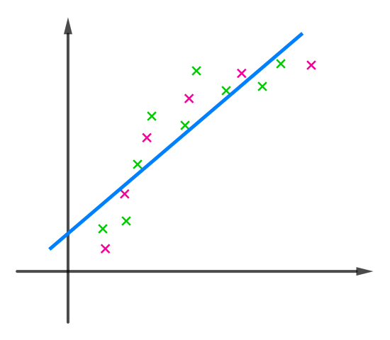
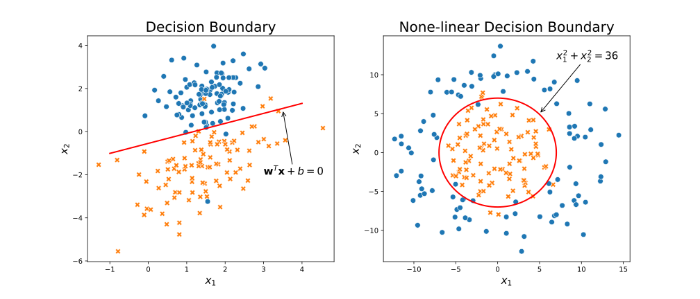
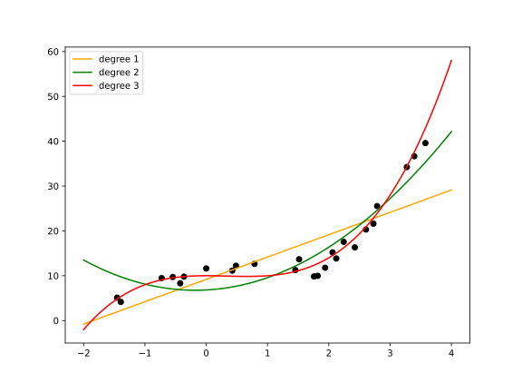
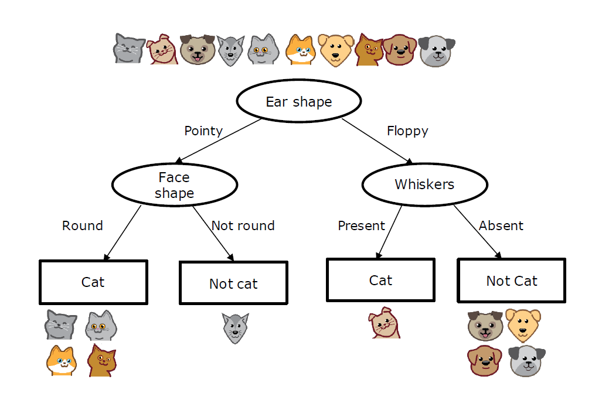
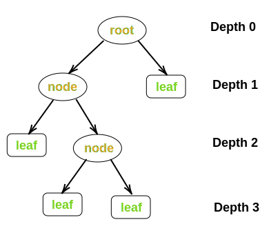
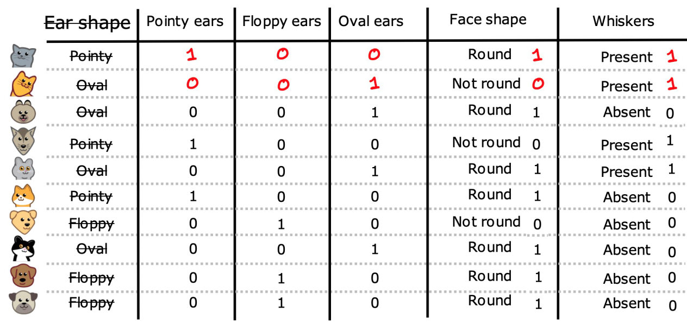
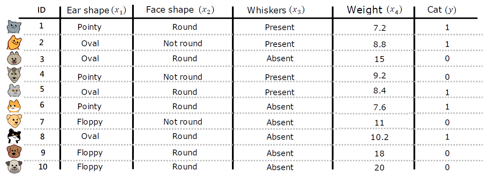
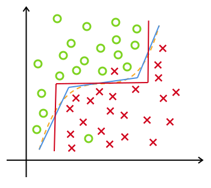
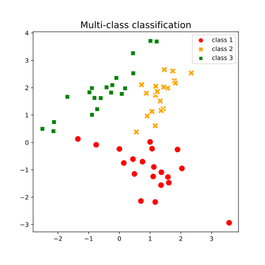
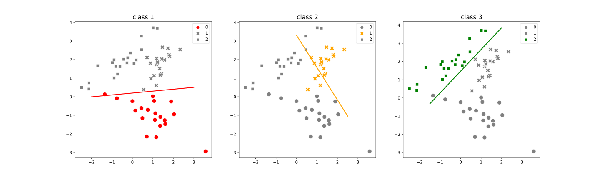

# 引言

分类和回归是监督学习的核心问题。若目标变量是连续值，此类学习任务称为**回归** (regression)。当目标变量取有限个离散值时，称为**分类**（classification）。当分类的结果只有两种的分类问题称为**二分类**问题 (binary classification)，输出变量通常表示为正样本/负样本(positive/negative)。

给定监督学习的数据集  $D=\{(\mathbf x^{(1)},y^{(1)}),(\mathbf x^{(2)},y^{(2)}),\cdots,(\mathbf x^{(m)},y^{(m)})\}$，其中$\mathbf x^{(i)}=(x_1^{(i)},x_2^{(i)},\cdots,x_d^{(i)})^T$ 为第 $i$ 个样本的特征向量。

# 线性模型

## 线性回归

### 基本形式

给定数据集 $D$ ，目标变量 $y\in \R$ 

**Model**：线性模型假设目标变量是特征的线性组合。因此，我们试图拟合函数
$$
f_{\mathbf{w},b}(\mathbf{x})=w_1x_1+w_2x_2+\cdots+w_dx_d+b=\sum_{j=1}^d w_jx_j+b
$$
称为多元线性回归 (multiple linear regression)。一般写作向量形式
$$
f_{\mathbf{w},b}(\mathbf{x})=\mathbf{w}^T\mathbf{x}+b
$$
特征向量 $\mathbf x=(x_1,x_2,\cdots,x_d)^T$，参数 $\mathbf{w}=(w_1,w_2,\cdots,w_d)^T$ 称为系数 (coefficients) 或权重 (weights)，标量 $b$ 称为偏置项(bias) 。求得参数 $\mathbf{w},b$ 后，模型就得以确定。$\mathbf w$ 可以直观表达了各特征在预测中的重要性，因此线性模型有很好的可解释性(comprehensibility) 。

对于每个样本，真实值 $y^{(i)}$ 和模型预测值 $\hat y^{(i)}$ 间存在误差 $e^{(i)}=y^{(i)}-\hat y^{(i)}$ ，误差满足如下**假设条件**：

1. 误差满足高斯分布 $e^{(i)}∼N(0, σ^2)$
2. 误差同分布 $\mathrm{var}(e^{(i)})= σ^2$ 
3. 误差独立性 $\mathrm{cov}(e^{(i)},e^{(j)})=0 \quad (i  ≠ j)$ 

### 最小二乘法

对于给定的数据集 $D$，我们想要找到参数 $\mathbf w,b$ ，使得数据的实际观测值和线性近似预测的预测值尽可能接近。**普通最小二乘法** (ordinary least squares, OLS) 使用残差平方和来估计参数。

为了计算方便，定义 $x_0=1$，并记 $w_0=b$
$$
\mathbf{x} = \begin{pmatrix}
x_0 \\ x_1 \\ \vdots\\ x_d
\end{pmatrix},
\quad
\mathbf{w} = \begin{pmatrix}
w_0 \\ w_1 \\ \vdots\\ w_d
\end{pmatrix}
$$
线性回归模型可简写为
$$
f_{\mathbf{w}}(\mathbf{x}) = \mathbf{w}^T\mathbf{x}
$$
 **loss function** (损失函数) 衡量单个样本预测值 $\hat y$ 和真实值 $y$ 之间的差异
$$
\text{loss}=(f_{\mathbf{w}}(\mathbf{x})-y)^2
$$
**cost function** (成本函数或代价函数) 衡量样本集的差异
$$
J(\mathbf{w}) = \frac{1}{2m} \sum\limits_{i=1}^{m} \left(f_{\mathbf{w}}(\mathbf{x}^{(i)}) - y^{(i)}\right)^2
$$
为了建立一个不会因训练集变大而变大的代价函数，我们计算均方误差而不是平方误差。额外的 1/2 是为了让后面的计算更简洁些。矩阵形式为
$$
J(\mathbf{w})=\cfrac{1}{2m}\|\mathbf{Xw-y}\|_2^2=\cfrac{1}{2m}(\mathbf{Xw-y})^T(\mathbf{Xw-y})
$$
其中，$\mathbf X$ 称为**设计矩阵**（design matrix）
$$
\mathbf{X}=\begin{pmatrix}
1&x_{1}^{(1)}&x_{2}^{(1)}&\cdots&x_{d}^{(1)} \\
1&x_{1}^{(2)}&x_{2}^{(2)}&\cdots&x_{d}^{(2)} \\
\vdots&\vdots&\ddots&\vdots \\
1&x_{1}^{(m)}&x_{2}^{(m)}&\cdots&x_{d}^{(m)} \\
\end{pmatrix},
\quad \mathbf{w}=\begin{pmatrix}w_0\\ w_1\\ \vdots\\w_d\end{pmatrix},
\quad \mathbf{y}=\begin{pmatrix}y^{(1)}\\ y^{(2)}\\ \vdots\\y^{(m)}\end{pmatrix}
$$
最后，模型参数估计等价于求解
$$
\arg\min\limits_{\mathbf w} J(\mathbf{w})
$$

**参数估计** ：(parameter estimation) 使用凸优化方法求解代价函数，此方程被称为**正规方程**（normal equation）
$$
\nabla J(\mathbf w)=\frac{\partial J}{\partial\mathbf w}=2\mathbf X^T(\mathbf{Xw-y})=\mathbf 0
$$
且 Hessian 矩阵 $\nabla^2 J(\mathbf w)$ 正定。如果 $\mathbf X^T \mathbf X$ 为满秩矩阵(full-rank matrix)或正定矩阵(positive definite matrix)，可求得最优解。
$$
\mathbf w=(\mathbf X^T\mathbf X)^{-1}\mathbf X^T\mathbf y
$$
现实任务中 $\mathbf X^T\mathbf X$ 不可逆的可能原因如下

- 特征之间可能线性相关
- 特征数量大于样本总数 ($d>m$)

最小二乘法的优点

- 求解参数不需要迭代计算
- 不需要调试超参数

最小二乘法的缺点

- 仅适用于线性回归，无法推广到其他学习算法
- 假设 $m\geqslant d$ ，这个算法的复杂度为 $O(md^2)$
- 如果样本特征的数量太大 (>10k)，模型将执行的非常慢

### 梯度下降法

梯度下降 (Gradient Descent) 是一种优化算法，它被广泛应用于机器学习，是许多算法的基础，比如线性回归、逻辑回归，以及神经网络的早期实现。对于线性回归来说均方误差代价函数是一个凸函数（如下图），梯度下降可以一步一步找到全局最小值。

梯度下降迭代公式为

$$
\begin{align} \text{repeat}&\text{ until convergence: } \{ \\
& \mathbf w \gets \mathbf w-\lambda\nabla J(\mathbf{w}) \\ 
&\}\end{align}
$$
均方误差代价函数的导数项为

$$
\nabla J(\mathbf w)=\frac{\partial J}{\partial\mathbf w}=2\mathbf X^T(\mathbf{Xw-y})
$$

### 正则化代价函数

**Ridge** (岭回归) 通过引入正则化(regularization) 项来解决普通最小二乘的一些问题。

Cost function
$$
J(\mathbf{w})=\cfrac{1}{2m}\left(\|\mathbf{Xw-y}\|_2^2+ \alpha \|\mathbf w\|^2\right)
$$
其中，正则化参数 $\alpha$ 通过缩小特征权重来控制模型复杂度，值越大，收缩量越大，这样，系数对共线性的鲁棒性就更强了。

最小化代价函数可求得解析解
$$
\mathbf{w=(X^T X}+\alpha \mathbf{I)^{-1}X^T y}
$$
其中 $\mathbf I$ 是 $n+1$ 维单位阵

**Lasso** 是一个估计稀疏系数的线性模型。它在某些情况下是有用的，因为它倾向于给出非零系数较少的解，从而有效地减少了给定解所依赖的特征数。 它由一个带有 $l_1$ 范数正则项的线性模型组成。

Cost function
$$
J(\mathbf{w})=\cfrac{1}{2m}\left(\|\mathbf{Xw-y}\|_2^2+ \alpha \|\mathbf w\|_1\right)
$$
Lasso 中一般采用坐标下降法来实现参数估计。由于Lasso回归产生稀疏模型，因此也可以用来进行特征选择。

**Multi-task Lasso** 是一个估计多任务的稀疏系数的线性模型， $\mathbf Y$ 是一个  $m\times n_{tasks}$ 矩阵。约束条件是，对于所有回归问题（也叫任务），所选的特征是相同的。它混合使用 $l_1l_2$ 范数作为正则化项。

Cost function
$$
J(\mathbf{W})=\cfrac{1}{2m}\left(\|\mathbf{XW-Y}\|^2_{Fro}+ \alpha \|\mathbf W\|_{21}\right)
$$
其中 Fro 表示Frobenius范数
$$
\mathbf \|\mathbf A\|_{Fro}=\sqrt{\sum_{ij}a^2_{ij}}=\sqrt{\text{tr}(\mathbf A^T\mathbf A)}
$$
混合 $l_1l_2$ 范数
$$
\mathbf \|\mathbf A\|_{21}=\sum_i\sqrt{\sum_{j}a^2_{ij}}
$$
Multi-task Lasso 也采用坐标下降法来估计参数。

**Elastic-Net** 是一个训练时同时用 $l_1$ 和  $l_2$ 范数进行正则化的线性回归模型。这种组合允许学习稀疏模型，其中很少有权重是非零类。当多个特征存在相关时，弹性网是很有用的。Lasso很可能随机挑选其中之一，而弹性网则可能兼而有之。在这种情况下，要最小化的目标函数

Cost function
$$
J(\mathbf{w})=\cfrac{1}{2m}\left(\|\mathbf{Xw-y}\|_2^2+ \alpha\rho \|\mathbf w\|_1+ \frac{\alpha(1-\rho)}{2} \|\mathbf w\|_2^2\right)
$$

Elastic-Net 使用坐标下降法来估计参数。

**Multi-task Elastic-Net** 是一个估计多任务的稀疏系数的线性模型， $\mathbf Y$ 是一个  $m\times n_{tasks}$ 矩阵。约束条件是，对于所有回归问题（也叫任务），所选的特征是相同的。它使用混合的 $l_1l_2$ 范数和$l_2$作为正则化项。

Cost function
$$
J(\mathbf{W})=\cfrac{1}{2m}\left(\|\mathbf{XW-Y}\|^2_{Fro}+ \alpha\rho \|\mathbf W\|_{21}+ \frac{\alpha(1-\rho)}{2} \|\mathbf W\|_{Fro}^2\right)
$$
Multi-task Elastic-Net 也采用坐标下降法来估计参数。

**LARS** (Least-angle regression, 最小角回归 )是一种用于高维数据的回归算法。LARs和逐步向前回归很相似。在每一步中，它都会找到与目标最相关的特征。当多个特征具有相等的相关性时，它不是沿着相同的特征继续进行，而是沿着特征之间等角的方向进行。

LARS的优势在于：

- 在特征数明显大于样本数的情况下，它在数值算法上是非常有效的。
- 它的计算速度和前向选择一样快，其复杂度与普通最小二乘法相同。
- 它产生一个完整的分段线性解决方案路径，这在交叉验证或类似的尝试调优模型中很有用。
- 如果两个特征与目标之间的相关性几乎一致，那么它们的系数应以大致相同的速率增加。因此，该算法的性能与我们直觉所期望的一样，而且更稳定。
- 它很容易被修改，以便为其他估计器(如Lasso)提供解。

LARS的缺点包括：

- 因为LARS是基于对残差的迭代修改， 它可能会对噪音的影响特别敏感。

## Logistic 回归

### 基本形式

给定数据集 $D$ ，目标变量 $y\in \{0,1\}$ 。我们可以尝试在分类数据集上使用线性回归算法分类。但线性回归模型产生的预测值 $\mathbf{w}^T\mathbf{x}+b$ 是连续数值，而我们这里想预测类别。

**Model**: 逻辑回归 (logistic regression, logit regression) 通过引入Sigmod 函数（S型曲线）将输入值映射到 $[0,1]$ 来实现分类功能。
$$
f_{\mathbf{w},b}(\mathbf{x}) = g(\mathbf{w}^T \mathbf{x}+b)
$$
where
$$
g(z) = \frac{1}{1+e^{-z}}
$$
式中特征向量 $\mathbf x=(x_1,x_2,\cdots,x_d)^T$，参数 $\mathbf{w}=(w_1,w_2,\cdots,w_d)^T$ 称为系数 (coefficients) 或权重 (weights)，标量 $b$ 称为偏置项(bias) 。 $g(z)$ 是 Sigmod 函数，也称 logistic 函数。求得参数 $\mathbf{w},b$ 后，模型就得以确定。

可以通过引入阈值（默认0.5）实现分类预测
$$
\hat y=\begin{cases}
1 &\text{if } f_{\mathbf{w},b}(\mathbf{x})\geqslant 0.5 \\
0 &\text{if } f_{\mathbf{w},b}(\mathbf{x})<0.5
\end{cases}
$$
模型的输出可视为正样本的概率 $\mathbb P_1(y=1|\mathbf x)=f_{\mathbf{w},b}(\mathbf{x})$，则负样本的概率 $\mathbb P_0(y=0|\mathbf x)=1-f_{\mathbf{w},b}(\mathbf{x})$。联合写为
$$
\mathbb P(y|\mathbf x)=\begin{cases}
f_{\mathbf{w},b}(\mathbf{x}) &\text{if } y=1 \\
1-f_{\mathbf{w},b}(\mathbf{x}) &\text{if } y=0
\end{cases}
$$

### 极大似然估计

logistic 回归若采用均方误差作为 cost function，是一个非凸函数(non-convex)，会存在许多局部极小值，因此我们尝试极大似然估计。

**极大似然估计**：(maximum likelihood estimate, MLE) 使得观测样本出现的概率最大，也即使得样本联合概率（也称似然函数）取得最大值。为了计算方便，定义 $x_0=1$，并记 $w_0=b$
$$
\mathbf{x} = \begin{pmatrix}
x_0 \\ x_1 \\ \vdots\\ x_d
\end{pmatrix},
\quad
\mathbf{w} = \begin{pmatrix}
w_0 \\ w_1 \\ \vdots\\ w_d
\end{pmatrix}
$$
logistic 回归模型可记为
$$
f_{\mathbf{w}}(\mathbf{x}) = \frac{1}{1+\exp(-\mathbf{w}^T\mathbf{x})}
$$
模型预测样本概率可联合记为
$$
\mathbb P(y|\mathbf x)=[f_{\mathbf{w}}(\mathbf{x})]^{y}[1-f_{\mathbf{w}}(\mathbf{x})]^{1-y}
$$
为求解方便，对样本联合概率取对数似然函数
$$
\begin{aligned}
\log L(\mathbf w) & =\log\prod_{i=1}^{m} \mathbb P(y^{(i)}|\mathbf x^{(i)})=\sum_{i=1}^m\log \mathbb P(y^{(i)}|\mathbf x^{(i)}) \\
&=\sum_{i=1}^{m}[y^{(i)}\log f_{\mathbf{w}}(\mathbf{x}^{(i)})+(1-y^{(i)})\log(1-f_{\mathbf{w}}(\mathbf{x}^{(i)}))] \\
&=\sum_{i=1}^{m}[y^{(i)}\mathbf{w}^T\mathbf{x}-\log(1+e^{\mathbf{w}^T\mathbf{x}})]
\end{aligned}
$$
因此可定义 **loss function**  (损失函数) 度量单样本损失
$$
\text{loss}=-y\mathbf{w}^T\mathbf{x}+\log(1+e^{\mathbf{w}^T\mathbf{x}})
$$

最大化似然函数等价于最小化 **cost function**
$$
J(\mathbf w)=\frac{1}{m}\sum_{i=1}^{m}(-y^{(i)}\mathbf{w}^T\mathbf{x}+\log(1+e^{\mathbf{w}^T\mathbf{x}}))
$$
**参数估计** ：(parameter estimation) $J(\mathbf w)$ 是关于参数 $\mathbf w$ 的高阶可导连续凸函数，经典的数值优化算法如梯度下降法 (gradient descent method) 、牛顿法 (Newton method) 等都可求得其最优解
$$
\arg\min\limits_{\mathbf w} J(\mathbf{w})
$$

### 最大期望算法

**最大期望算法**：（Expectation-Maximization algorithm, EM）与真实分布最接近的模拟分布即为最优分布，因此可以通过最小化交叉熵来求出最优分布。

真实分布可写为 
$$
\mathbb P(y|\mathbf x)=1
$$
模拟分布可写为 
$$
\mathbb Q(y|\mathbf x)=[f_{\mathbf{w}}(\mathbf{x})]^{y}[1-f_{\mathbf{w}}(\mathbf{x})]^{1-y}
$$
交叉熵为
$$
\begin{aligned}
H(\mathbb P,\mathbb Q) &=-\sum_{i=1}^m \mathbb P(y^{(i)}|\mathbf x^{(i)})\log \mathbb Q(y^{(i)}|\mathbf x^{(i)}) \\
&=\sum_{i=1}^{m}(-y^{(i)}\mathbf{w}^T\mathbf{x}+\log(1+e^{\mathbf{w}^T\mathbf{x}}))
\end{aligned}
$$
**cost function**
$$
J(\mathbf w)=\frac{1}{m}\sum_{i=1}^{m}(-y^{(i)}\mathbf{w}^T\mathbf{x}+\log(1+e^{\mathbf{w}^T\mathbf{x}}))
$$
与极大似然估计相同。

### 决策边界

逻辑回归模型 $f_{\mathbf{w},b}(\mathbf{x})=g(z)= g(\mathbf{w}^T \mathbf{x}+b)$

对于 sigmoid 函数（如上图），$g(z)\geqslant 0.5 \text{ for } z\geqslant 0$ 。在 logistic 回归模型中，$z=\mathbf{w}^T\mathbf{x}+b$ 。因此，模型预测
$$
\hat y=\begin{cases}
1 &\text{if } \mathbf{w}^T\mathbf{x}+b\geqslant 0 \\
0 &\text{if } \mathbf{w}^T\mathbf{x}+b<0
\end{cases}
$$
由此可见，logistic 回归输出一个线性决策边界 (linear decision boundary) 
$$
\mathbf{w}^T\mathbf{x}+b=0
$$
我们也可以创建多项式特征拟合一个非线性边界。例如，模型 
$f(x_1,x_2) = g(x_1^2+x_2^2-36)\text{ where } g(z) = \cfrac{1}{1+e^{-z}}$ 
决策边界方程为 $x_1^2+x_2^2-36=0$

## 广义线性回归

许多功能更为强大的非线性模型(non-linear model)可通过引入反向联系函数连接到输入变量的线性组合。例如，对数线性回归 (log-linear regression)
$$
\ln f_{\mathbf{w},b}(\mathbf{x})=\mathbf{w}^T\mathbf{x}+b
$$
更一般地，考虑单调可微函数 $z=h(y)$，令 
$$
f_{\mathbf{w},b}(\mathbf{x})=h^{-1}(\mathbf{w}^T\mathbf{x}+b)
$$
这样得到的模型称为广义线性模型 (Generalized Linear Models, GLM)，其中函数 $z=h(y) $ 称为联系函数 (link function)。广义线性模型的参数估计常通过加权最小二乘法或极大似然估计。

## 多项式回归

机器学习中的一个常见模式是使用非线性函数对数据的进行变换来创建新的特征。例如，可以通过构造**多项式特征**(**polynomial features**)来扩展简单的线性回归。在标准线性回归的情况下，您可能拟合一个二维特征的模型
$$
f_{\mathbf w}(\mathbf x)=w_0+w_1x_1+w_2x_2
$$
如果我们想用抛物面来拟合数据而不是平面，我们可以用二阶多项式组合特征，这样模型看起来就像这样
$$
f_{\mathbf w}(\mathbf x)=w_0+w_1x_1+w_2x_2+w_3x_1x_2+w_4x_1^2+w_5x_2^2
$$
其实，得到的多项式回归依旧是线性模型。只需引入新的特征向量进行转换
$$
\begin{matrix}
\text{from}&x_1&x_2&x_1x_2&x_1^2&x_2^2 \\
\to&z_1&z_2&z_3&z_4&z_5
\end{matrix}
$$
下面是一个应用于一维数据的例子，使用了不同程度的多项式特征：

## 感知机

### 感知机

Perceptron 是另一种适用于大规模学习的简单分类算法。

- 它不需要设置学习率
- 它不需要正则项
- 它只用错误样本更新模型

最后一个特点意味着Perceptron的训练速度略快于带有合页损失(hinge loss)的SGD，因此得到的模型更稀疏。

### 被动感知算法

被动感知算法 (Passive Aggressive Algorithms) 是一种大规模学习的算法。和感知机相似，因为它们不需要设置学习率。然而，与感知器不同的是，它们包含正则化参数。

## 线性判别分析

线性判别分析（Linear Discriminant Analysis，LDA）亦称 Fisher 判别分析。其基本思想是：将训练样本投影到一条直线上，使得同类的样例尽可能近，不同类的样例尽可能远。如图所示：

# 决策树

## 树的生成

**决策树**（Decision Tree）是一种用于分类和回归的有监督学习方法。其目标是创建一个模型，通过学习从数据特性中归纳出一组分类规则来预测目标变量的值。下图是一颗决策树

决策树是一种由节点（node）和有向边（directed edge）组成的树形结构。从根节点（root node）开始，包含若干内部节点（internal node）和叶节点（leaf node）。其中每个叶节点对应一种分类结果，其他每个节点表示一个特征的判断条件，每个分支代表一个判断结果的输出。

其实决策树可以看做一个if-then规则的集合。我们从决策树的根结点到每一个都叶结点构建一条规则，并且我们将要预测的实例都可以被一条路径或者一条规则所覆盖。

**Hunt 算法**：决策树学习旨在构建一个泛化能力好，并且复杂度小的决策树。因为从可能的决策树中直接选取最优决策树是 NP 完全问题，可构造的决策树的数目达指数级，找出最佳决策树在计算上时不可行的。现实中采用启发式方法，在合理的时间学习一颗次优的决策树。

Hunt 算法以递归方式建立决策树，使得各分支结点所包含的样本尽可能属于同一类别。给定分类数据集 $D$ ，目标变量 $y\in\{y_1,y_2,\cdots,y_c\}$ ，特征 $x\in\{x_1,x_2,\cdots,x_d\}$ ，节点 $t$ 处的数据集为 $D_t$ 

1. 在根节点从所有训练样本开始；
2. 在节点 $t$ 处，选择一个特征 $x_t$ 将数据集 $D_t$ 划分成更小的子集；
3. 对于每个子节点，递归的调用此算法，只到满足停止条件。

从上述步骤可以看出，决策生成过程中有两个重要的问题

- 如何选择最优的划分特征：常用的算法有 ID3、C4.5 和 CART
- 什么时候停止划分：
  - 当一个节点100%是一个类别时；
  - 当分裂一个节点导致树超过最大深度时 (maximum depth)；
  - 如果分裂一个节点导致的纯度提升低于阈值；
  - 如果一个节点的样本数低于阈值。

> 限制决策树深度和设置阈值的一个原因是通过保持树的小巧而不容易导致过拟合

## 特征重编码

待划分的特征分为离散型和连续型两种。对于离散型的特征，按照特征值进行划分，每个特征值对应一个子节点；对于连续型的数据，由于可取值数目不再有限，一般进行离散化处理。

**连续特征离散化**：一般采用二分法处理。给定样本 $D$ 和连续特征 $x$ ，若样本中 $x$ 有 $p$ 个值。对所有样本排序，取排序样本中的所有 $p-1$ 个中点值作为阈值的候选值 ，取划分后纯度最高的中点值作为阈值。以基尼指数为例，最佳阈值为
$$
\arg\min\limits_{a}\text{Gini}(D,x(a))
$$
其中，$x(a)$ 表示以候选阈值 $a\in\{a_1,a_2,\cdots,a_{p-1}\}$ 对 $x$ 进行二元重编码后的特征
$$
x(a)=\begin{cases} 1 & \text{if } x\leqslant a \\ 0 & \text{others} \end{cases}
$$
然后，我们就可以像离散特征一样来使用。需注意的是，与离散特征不同，若当前结点划分为连续特征，该特征还可作为其后代结点的划分特征。

**one-hot encoding**：某些算法（CART）只产生二元划分。如果一个离散特征可以取 $p$ 个值，可以通过创建 $p$ 个取值为0或1的二元特征来替换。如下图示例

## 划分特征选择

显然，决策树学习的关键在于划分数据集，我们希望不断地选取局部最优的特征，将无序的数据变得更加有序，即结点的**纯度** (purity) 越来越高。由于纯度的度量方法不同，也就导致了学习算法的不同，常用的算法有 ID3 、C4.5和 CART。

### 信息增益

**信息熵**（information entropy）是度量数据集纯度的最常用的指标。给定数据集 $D$ ，目标变量 $y\in\{y_1,y_2,\cdots,y_c\}$ 经验分布为
$$
\mathbb P(y=y_k)=p_k
$$
则信息熵为
$$
H(D)=-\sum_kp_k\log p_k
$$
注意，计算信息熵时约定 $0\log 0 = 0$。由定义可知，熵只依赖于 $y$ 的分布，与取值无关，所以也可将熵记作 $H(p)$ 。

对于二分类问题，目标变量 $y\in \{0,1\}$ 。正样本比例为 $p_1\ (0\leqslant p_1\leqslant 1)$ ，则负样本比例 $p_0=1-p_1$ 。信息熵可写为
$$
H(p_1)=-p_1\log p_1-(1-p_1)\log (1-p_1)
$$
二元变量的熵曲线如下图

**条件熵**（condition entropy）用来表示离散特征 $x$ 划分后的数据集 $D$ 纯度。使用划分后子集的熵的加权平均值度来度量
$$
H(D|x)=\sum_i w^{(i)}H(D^{(i)})
$$
其中 $w^{(i)}=m^{(i)}/m$ 代表离散特征 $x$ 划分后的子集 $D^{(i)}$ 的样本数占比， $H(D^{(i)})$ 代表子集$D^{(i)}$的信息熵。条件熵一般小于熵，例如，知道西瓜的色泽（青绿,乌黑,浅白）后，西瓜质量的不确定性就会减少了。

**信息增益**（Information Gain）表示使用特征 $x$ 的信息进行划分而使数据集 $D$ 纯度提升的程度
$$
\text{Gain}(D,x)=H(D)-H(D|x)
$$

以二元离散特征 $x$ 为例，将二分类数据集 $D$ 划分为 $D^{\text{left}}$和 $D^{\text{left}}$ 两个子集，则信息增益为
$$
\text{Gain}(D,x)=H(p_1)-\left(w^{\text{left}}H(p_1^{\text{left}})+w^{\text{right}}H(p_1^{\text{right}})\right)
$$
其中 $p_1$ 表示子集中正样本的比例，$w$ 表示子集的样本数占比。

**ID3**（Iterative Dichotomiser 3, 迭代二分器 3）算法在迭代中选取信息增益最大的特征进行划分
$$
\arg\max\limits_{x}\text{Gain}(D,x)
$$
其中 $x\in\{x_i,x_2,\cdots,x_d\}$ 。对于所有的节点来说，节点处数据集的熵是个不变的值，所以最大化信息增益等价于最小化条件熵。

以吴恩达老师的==猫分类数据集==为例：

根节点的熵为：$H(p_1^{\text{root}})=H(0.5)=-\cfrac{1}{2}\log \cfrac{1}{2}-\cfrac{1}{2}\log \cfrac{1}{2}=1$

然后，计算各特征的信息增益：

Ear shape: $H(0.5)-(\cfrac{3}{10}H(0.67)+\cfrac{4}{10}H(0.75)+\cfrac{3}{10}H(0))=0.4$
Face shape: $H(0.5)-(\cfrac{7}{10}H(0.57)+\cfrac{3}{10}H(0.33))=0.03$
Whiskers: $H(0.5)-(\cfrac{4}{10}H(0.75)+\cfrac{6}{10}H(0.33))=0.12$
Weight: $H(0.5)-(\cfrac{4}{10}H(1)+\cfrac{6}{10}H(0.17))=0.61$

显然，Weight ⩽ 9 的信息增益最大，于是Weight被选为在根节点划分的特征。类似的，再对每个分支结点进行上述操作，进一步划分，最终得到整颗决策树。 

### 信息增益率

从信息增益的公式中，其实可以看出，信息增益准则偏向取值较多的特征。原因是当特征的取值较多时，根据此特征划分更容易得到纯度更高的子集，因此划分之后的条件熵更低。为减少这种偏好可能带来的不利影响，C4.5通过**信息增益率**（Information Gain Rate）来选择最优划分特征
$$
\text{Gain\_rate}(D,x)=\frac{\text{Gain}(D,x)}{\text{IV}(x)}
$$

其中 $\text{IV}(x)$ 称为特征 $x$ 的固有值（intrinsic value）
$$
\text{IV}(x)=-\sum_iw^{(i)}\log w^{(i)}
$$
其中 $w^{(i)}=m^{(i)}/m$ 代表离散特征 $x$ 划分后的子集 $D^{(i)}$ 的样本数占比。$\text{IV}(x)$ 可看作数据集 $D$ 关于 $x$ 的信息熵，特征 $x$ 的取值越多，通常 $\text{IV}(x)$ 越大。

需注意的是，信息增益率准对可取值数目较少的特征有所偏好。因此， C4.5算法并不是直接选择增益率最大的特征划分，而是使用了一个启发式：先从候选特征中找出信息增益高于平均水平的特征，再从中选择增益率最高的划分。

### 基尼指数

**基尼指数**（Gini Index）给定数据集 $D$ ，目标变量 $y\in\{y_1,y_2,\cdots,y_c\}$ 经验分布为
$$
\mathbb P(y=y_k)=p_k
$$
基尼指数可表示数据集 $D$ 的纯度
$$
\text{Gini}(D)=\sum_kp_k(1-p_k)=1-\sum_kp_k^2
$$

直观来说，基尼指数反应了从数据集中随机抽取两个样本，其类别不一致的概率。因此，基尼指数越小，则数据集的纯度越高。

对于二分类问题，目标变量 $y\in \{0,1\}$ 正样本比例为 $p_1\ (0\leqslant p_1\leqslant 1)$ ，则负样本比例 $p_0=1-p_1$ 。二分类变量的基尼指数可写为
$$
\text{Gini}(p_1)=2p_1(1-p_1)
$$
数据集 $D$ 在离散特征 $x$ 划分后的基尼指数定义为
$$
\text{Gini}(D,x)=\sum_iw^{(i)}\text{Gini}(D^{(i)})
$$
可理解为划分后子集基尼指数的加权平均值。其中 $w^{(i)}=m^{(i)}/m$ 代表离散特征 $x$ 划分后的子集 $D^{(i)}$ 的样本数占比， $\text{Gini}(D^{(i)})$ 代表子集$D^{(i)}$的基尼指数。

**CART**（Classification and Regression Trees）使用划分后基尼指数最小的特征作为最优划分特征
$$
\arg\min\limits_{x}\text{Gini}(D,x)
$$
同时，CART使用**二叉树**准则减少对取值较多特征的偏向，并且可以分类也可以回归，也提供了优化的剪枝策略。

## 回归树

回归树是一个 if-then 规则的集合，每个特征向量对应一个叶节点。使用叶节点处目标变量 $y$ 的平均值输出
$$
f(\mathbf x)=\bar y_t
$$
其中，特征向量 $\mathbf x=(x_1,x_2,\cdots,x_d)^T$ 对应的叶节点 $t$ 处的平均值为 $\bar y_t$。

回归树使用加权均方误差选择最优划分特征。由于模型输出为子集平均值，均方误差等价于方差。设节点 $t$ 处的数据集为 $D_t$ ，样本数为 $m_t$ ，则划分特征为
$$
\arg\min\limits_{x}\sum_iw_t^{(i)}\text{var}(D_t^{(i)})
$$
其中，$D_t^{(i)}$ 为节点 $t$ 处特征 $x$ 划分的子集，$w_t^{(i)}=m_t^{(i)}/m_t$ 为子集的样本数占比。
## 剪枝处理

递归生成的决策树往往过于复杂，从而过拟合。对决策树进行简化的过程称为**剪枝**（pruning），剪枝的基本策略有预剪枝和后剪枝。剪枝过程中一般使用验证集评估决策树泛化能力的提升。

决策树学习的**代价函数**定义为
$$
C_\alpha(T)=C(T)+\alpha|T|
$$
其中，$|T|$ 是决策树 $T$ 中叶节点个数，$\alpha$ 是平衡树的复杂度和不纯度的超参数。$C(T)$ 是叶节点不纯度的加权平均值。以基尼指数为例，给定数据集 $D$ ，样本数为 $m$ ，则
$$
C(T)=\sum_tw_t\text{Gini}(D_t)
$$
其中，$D_t$ 为叶节点 $t$ 处的数据集，$w_t=m_t/m$ 为叶节点 $t$ 处的样本数占比。

**预剪枝**：（pre-pruning）是指在决策树生成过程中，对每个结点在划分前先进行估计，若当前结点的划分不能带来决策树泛化性能提升，则停止划分并将当前结点标记为叶结点。

预剪枝使得决策树的很多分支都没有展开，限制减少了决策树的时间开销，同时也给预剪枝决策树带来了欠拟含的风险。

**后剪枝**：（post-pruning）先从训练集生成一棵完整的决策树，然后剪掉一些叶结点或叶结点以上的子树，若能带来决策树泛化性能提升，则将其父结点作为新的叶结点，从而递归的简化生成的决策树。

一般情形下，后剪枝决策树的欠拟合风险很小，泛化性能往往优于预剪枝决策树，但决策树的时间开销要大得多。

**CART 剪枝**：首先从生成的决策树 $T_0$ 底端开始不断剪枝，直到根节点，形成一个子树序列  $\{T_0,T_1,\cdots,T_n\}$。然后通过交叉验证法选择最优子树。

## 决策边界

若我们把每个特征视为坐标空间中的一个坐标轴，则每个样本对应一个数据点，两个不同类之间的边界称为决策边界（decision boundary）。决策树所形成的分类边界有一个明显的特点：由于节点测试只涉及单个特征，它的决策边界由若干个与坐标轴平行的分段组成。这就限制了决策树对连续特征之间复杂关系的建模能力。

**斜决策树**（oblique decision tree）在每个节点，不再是仅对某个特征，而是对特征的线性组合进行测试
$$
\sum_{j=1}^dw_jx_j+b=0
$$
尽管这种技术有更强的表达能力，并且能够产生更紧凑的决策树，但为找出最佳测试条件的计算可能相当复杂。

## 决策树的特点

决策树的一些优点：

- 决策树是一种非参数模型。换句话说，它不要求任何先验假设，不假定类和特征服从一定概率分布。
- 决策树可以被可视化，简单直观。
- 对于异常点的容错能力好，健壮性高。

决策树的缺点包括：

- 决策树算法非常容易过拟合，导致泛化能力不强，可以通过剪枝改进。
- 决策树可能是不稳定的。事实证明，只需要改变极少量训练样本，信息增益最大的特征就可能发生改变，会生成一颗完全不同的树。可以通过集成学习来缓解这个问题。
- 寻找最优的决策树是一个NP完全问题，我们一般是通过启发式算法（如贪婪算法），容易陷入局部最优。可以通过集成学习之类的方法来改善。
- 有些比较复杂的边界关系，决策树很难学习。

下面是对整个 iris 数据集进行训练的树的图形输出示例

# 支持向量机

[斯坦福大学笔记.pdf](C:\Users\Admin\Documents\学习文件\机器学习\MLofAndrewNg-2022\斯坦福大学笔记.pdf)

**s.t.** 是 subject to (such that) 的缩写，表示约束条件。

#  贝叶斯分类器

# 多分类和多标签

**Multiclass classification**：目标变量包含两个以上离散值的分类任务 $y\in\{0,1,2,\cdots\}$。每个样本只能标记为一个类。例如，使用从一组水果图像中提取的特征进行分类，其中每一幅图像都可能是一个橙子、一个苹果或一个梨。每个图像就是一个样本，并被标记为三个可能的类之一。

- One-Vs-Rest (OVR) 也称为one-vs-all，为每个类分别拟合一个二分类模型，这是最常用的策略，对每个类都是公平的。这种方法的一个优点是它的可解释性，每个类都可以查看自己模型的相关信息。

- One-Vs-One (OVO) 是对每一对类分别拟合一个二分类模型。在预测时，选择得票最多的类别。在票数相等的两个类别中，它选择具有最高总分类置信度的类别，方法是对由底层二分类器计算的对分类置信度进行求和。

  由于它需要拟合 `n_classes*(n_classes-1)/2` 个分类器，这种方法通常比one-vs-rest要慢，原因就在于其复杂度 O(n^2^~classes~) 。然而，这个方法也有优点，比如说是在没有很好的缩放 `n_samples` 数据的核方法中。这是因为每个单独的学习问题只涉及一小部分数据，而对于一个one-vs-rest，完整的数据集将会被使用 `n_classes`次。

**One-Vs-Rest**：为每个类分别拟合一个二分类模型
$$
f^{(i)}_{\mathbf{w},b}(\mathbf{x})=\mathbb P(y=i|\mathbf x;\mathbf w,b)
$$
模型预测值，一种方法是选择概率最大的类别
$$
\hat y=\arg\max\limits_{i} f^{(i)}_{\mathbf{w},b}(\mathbf{x})
$$

**Multilabel classification**：包含多个目标变量的分类任务

**Multioutput regression**：包含多个目标变量的回归任务

