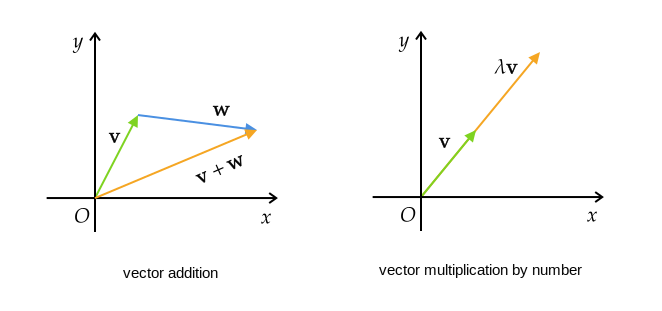
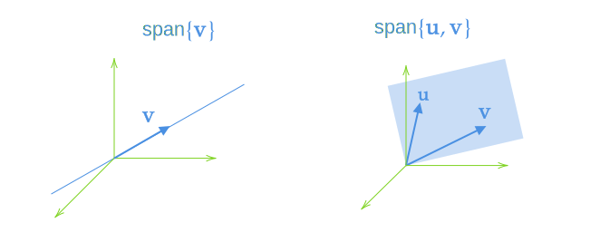
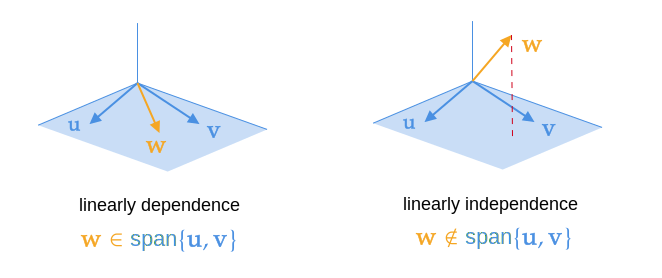
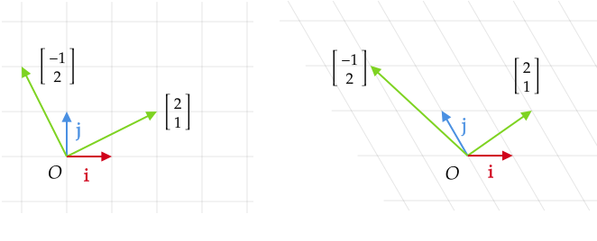
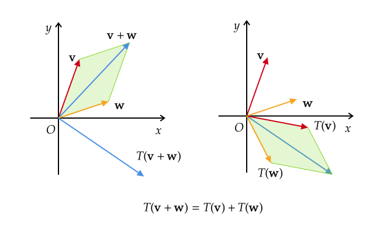
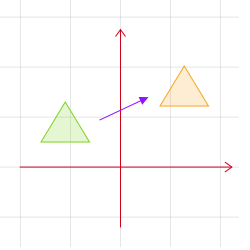
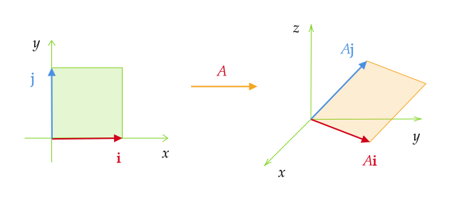
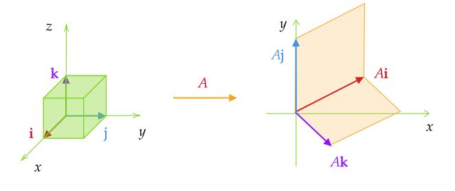
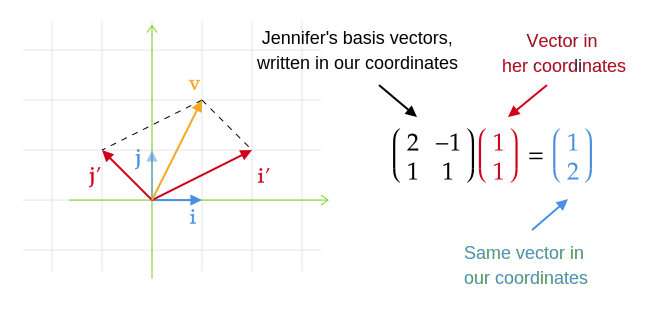

> [《线性代数的本质》 - 3blue1brown](https://www.bilibili.com/video/BV1ys411472E/)
> 高中数学A版选修4-2 矩阵与变换
> [《线性代数及其应用》(第五版)](https://www.bilibili.com/video/BV1nf4y1n7P1) 
> [《高等代数》(第二版) - 邱维声](https://www.bilibili.com/video/BV1jR4y1M78W/)
> 《高等代数简明教程》- 蓝以中

# 向量空间

> In the beginning Grant created the space. And Grant said, Let there be vector: and there was vector.

## 向量及其性质

三维几何空间中的一个有向线段称为**向量**(vector)。本文统一用 $a,b,c,k,\lambda$ 表示标量，小写黑体字母 $\mathbf u,\mathbf v,\mathbf w,\mathbf a,\mathbf b,\mathbf x$ 表示向量。

向量通常定义两种运算：加法和数乘。加法遵循三角形法则(平行四边形法则)，数乘被称为缩放(scaling)。运算法则如下图

：根据向量的几何性质可证明向量的加法和数乘满足以下八条性质：

1. 加法交换律：$\mathbf v+\mathbf w=\mathbf w+\mathbf v$
2. 加法结合律：$\mathbf u+(\mathbf v+\mathbf w)=(\mathbf u+\mathbf v)+\mathbf w$
3. 加法单位元：$\exists 0\in V,\ 0+\mathbf v=\mathbf v$
4. 加法逆元：$\exists (-\mathbf v)\in V,\ \mathbf v+(-\mathbf v)=0$
5. 数乘结合律：$a(b\mathbf v)=(ab)\mathbf v$
6. 数乘分配律：$a(\mathbf v+\mathbf w)=a\mathbf v+a\mathbf w$
7. 数乘分配律：$(a+b)\mathbf v=a\mathbf v+b\mathbf v$
8. 数乘单位元：$\exists 1\in\mathbb F,\ 1\mathbf v=\mathbf v$

向量空间是三维几何空间向高维空间的推广。线性代数中，每个向量都以坐标原点为起点，那么任何一个向量就由其终点唯一确定。从而，向量和空间中的点一一对应。因此，空间也可以看成由所有向量组成的集合，并且集合中的元素可以进行加法和数乘运算。于是，便有了向量空间的抽象定义。

 <kbd>向量空间</kbd>： 设 $V$ 为 $n$ 维向量的**非空集合**，$\mathbb F$ 是一个数域，若 $V$ 对于向量的加法和数乘两种运算封闭，那么称集合 $V$ 为数域 $F$ 上的**向量空间**(vector space)。所谓封闭是指

1. $\forall\mathbf v,\mathbf w\in V,\ \mathbf v+\mathbf w\in V$
2. $\forall\mathbf v\in V, c\in F,\ c\mathbf v\in V$

> 线性代数中的数域通常取全体实数，即 $\mathbb F=\R$。

例如：$n$维向量的全体生成实数域上的向量空间

$$
\R^n=\{\mathbf x=(x_1,x_2,\cdots,x_n)\mid x_1,x_2,\cdots,x_n\in\R\}
$$

<kbd>子空间</kbd>：设 $U$ 是向量空间 $V$ 的一个非空子集，如果$U$中的线性运算封闭，则 $U$ 也是向量空间，称为 $V$ 的**子空间**。

## 基与维数

仿照解析几何的基本方法，建立一个坐标系，实现空间内的点与有序实数对一一对应，从而空间内的向量与有序实数对也一一对应，这样就可以用代数方法来研究向量的性质。

为方便建立空间的坐标系，先定义几个概念。

<kbd>定义</kbd>：取向量空间 $V$ 内一个向量组 $\mathbf a_1,\mathbf a_2,\cdots,\mathbf a_r$ 

1. 向量 $x_1\mathbf a_1+x_2\mathbf a_2+\cdots+x_r\mathbf a_r$ 称为向量组的一个**线性组合**(linear combination)

2. 向量组的所有线性组合构成的向量集称为由该向量组张成的空间，记作
   $$
   \text{span}\set{\mathbf a_1,\cdots,\mathbf a_n}=\set{x_1\mathbf a_1+\cdots+x_n\mathbf a_n\mid x_1,\cdots,x_n\in\R}
   $$
   若 $\mathbf u,\mathbf v\in\R^3$ 不共线，则 $\text{span}\set{\mathbf a,\mathbf b}$ 是$\R^3$中包含 $\mathbf u,\mathbf v$ 和原点的平面，图示

   

3. 当且仅当系数 $x_1=x_2=\cdots=x_r=0$ 时，线性组合为零
   $$
   x_1\mathbf a_1+x_2\mathbf a_2+\cdots+x_r\mathbf a_r=0
   $$
   则称向量组**线性无关**(linearlyindependence)。反之，如果存在不全为零的数使上式成立，则称向量组**线性相关**(linearly dependence)。
   

<kbd>定理</kbd>：若向量 $\mathbf v$ 可由线性无关的向量组$\mathbf a_1,\mathbf a_2,\cdots,\mathbf a_r$ 线性表示，则表示系数是唯一的。

证明：设向量$\mathbf v$ 有两组表示系数
$$
\mathbf b=k_1\mathbf a_1+k_2\mathbf a_2+\cdots+k_r\mathbf a_r \\
\mathbf b=l_1\mathbf a_1+l_2\mathbf a_2+\cdots+l_r\mathbf a_r
$$
则有
$$
(k_1-l_1)\mathbf a_1+(k_1-l_2)\mathbf a_2+\cdots+(k_1-l_r)\mathbf a_r=0
$$
因为 $\mathbf a_1,\mathbf a_2,\cdots,\mathbf a_r$ 线性无关，故必有
$$
k_1-l_1=k_1-l_1=\cdots=k_1-l_1=0
$$
即表示系数是唯一的。

接下来，我们自然想用一组线性无关的向量来张成整个向量空间。

<kbd>向量空间的基</kbd>：张成向量空间$V$的一个线性无关的向量集合称为该空间的一组**基**(basis)。基向量组所含向量的个数，称为向量空间 $V$的**维数**(dimension)，记为 $\dim V$。

> 单由零向量组成的向量空间称为**零空间**。零空间的维数定义为零。

<kbd>定理</kbd>：$n$维向量空间中，任意 $n$ 个线性无关的向量组都是它的一组基，反之，它的任意一组基也一定恰好有 $n$ 个向量。

## 向量的坐标运算

向量空间选定了基向量后，空间中全体向量的集合与全体有序实数组的集合之间就建立了一一 对应的关系。

<kbd>坐标</kbd>：设向量组 $\mathbf a_1,\mathbf a_2,\cdots,\mathbf a_n$ 是线性空间 $V$ 的一组基，则空间内任一向量 $\mathbf v\in V$ 都可表示为基向量的唯一线性组合
$$
\mathbf v=x_1\mathbf a_1+x_2\mathbf a_2+\cdots+x_n\mathbf a_n
$$
有序数组 $x_1,x_2,\cdots,x_n$ 称为向量$\mathbf v$ 在基 $\mathbf a_1,\mathbf a_2,\cdots,\mathbf a_n$ 下的**坐标**，一般记作
$$
\begin{bmatrix}x_1\\x_2\\\vdots\\x_n\end{bmatrix}\quad \text{or}\quad
(x_1,x_2,\cdots,x_n)
$$
类似于三维几何空间，由$n$个有序数构成的向量称为$n$维向量。

建立了坐标之后，$V$中抽象的向量 $\mathbf v$ 和$\R^n$中具体的数组 $(x_1,x_2,\cdots,x_n)^T$ 实现了一一对应，并且向量的线性运算也可以表示为坐标的线性运算。

设 $\mathbf v,\mathbf w\in V$，有
$$
\mathbf v=v_1\mathbf a_1+v_2\mathbf a_2+\cdots+v_n\mathbf a_n\\
\mathbf w=w_1\mathbf a_1+w_2\mathbf a_2+\cdots+w_n\mathbf a_n
$$

向量加法运算
$$
\mathbf v+\mathbf w=(v_1+w_1)\mathbf a_1+(v_2+w_2)\mathbf a_2+\cdots+(v_n+w_n)\mathbf a_n 
$$
即对应的坐标运算为
$$
\begin{bmatrix}v_1\\ v_2\\ \vdots \\ v_n\end{bmatrix}+
\begin{bmatrix}w_1\\ w_2\\ \vdots \\ w_n\end{bmatrix}=
\begin{bmatrix}v_1+w_1\\ v_2+w_2\\ \vdots \\ v_n+w_n\end{bmatrix}
$$

向量数乘运算
$$
c\mathbf v=(cv_1)\mathbf a_1+(cv_2)\mathbf a_2+\cdots+(cv_n)\mathbf a_n
$$
即对应的坐标运算为
$$
c\begin{bmatrix}v_1\\ v_2\\ \vdots \\ v_n\end{bmatrix}=
\begin{bmatrix}cv_1\\ cv_2\\ \vdots \\ cv_n\end{bmatrix}
$$

总之，在$n$维向量空间 $V_n$ 中任取一组基，则 $V_n$ 中的向量与 $\R^n$ 中的数组之间就有一一对应的关系，且这个对应关系保持线性组合(线性运算)的一一对应。因此，**后续将对向量实体和坐标不做区分**。

向量的坐标取值依托于坐标系的基向量。选取的基向量不同，其所对应的坐标值就不同。接下来我们将默认使用 Grant 的坐标系：坐标原点为 $O$，基向量组为 $\mathbf e_1,\mathbf e_2,\cdots,\mathbf e_n$ 。

当然，基向量自身的坐标总是：
$$
\mathbf e_1=\begin{bmatrix}1\\0\\\vdots\\0\end{bmatrix},\quad
\mathbf e_2=\begin{bmatrix}0\\1\\\vdots\\0\end{bmatrix},\quad
\cdots,\quad
\mathbf e_n=\begin{bmatrix}0\\0\\\vdots\\1\end{bmatrix},\quad
$$
这种坐标形式通常称为**标准向量组**(或**单位坐标向量组**)。

# 线性变换与矩阵

## 线性变换与二阶方阵

本节从二维平面出发学习线性代数。通常选用平面坐标系 $Oxy$ ，基向量为 $\mathbf i,\ \mathbf j$，平面内的任意向量都可以写成基向量的线性组合
$$
\mathbf v=x\mathbf i+y\mathbf j
$$
这样，平面内的点和有序实数对 $(x,y)$ 一一对应。借助平面坐标系，我们可以从代数的角度来研究几何变换。

变换与函数类似，函数把数映射到数，变换把点(向量)映射到点(向量)。
$$
T:\quad \mathbf v\mapsto T(\mathbf v)
$$

例如，(1) 平面内任意一点 $P(x,y)$ 绕原点$O$ 逆时针方向旋转 $60\degree$ 角得到点 $P'(x',y')$，坐标变换公式为
$$
\begin{cases}
x'=\frac{1}{2}x-\frac{\sqrt 3}{2}y \\
y'=\frac{\sqrt 3}{2}x+\frac{1}{2}y
\end{cases}
$$
可写为向量形式
$$
\begin{bmatrix}x'\\y'\end{bmatrix}=
x\begin{bmatrix}\frac{1}{2}\\\frac{\sqrt 3}{2}\end{bmatrix}+
y\begin{bmatrix}-\frac{\sqrt 3}{2}\\\frac{1}{2}\end{bmatrix}
$$

(2) 平面内任意一点 $P(x,y)$ 关于 $y$ 轴的对称点 $P'(x',y')$的表达式为
$$
\begin{cases}
x'=-x \\
y'=y
\end{cases}
$$
可写为向量形式
$$
\begin{bmatrix}x'\\y'\end{bmatrix}=
x\begin{bmatrix}-1\\0\end{bmatrix}+
y\begin{bmatrix}0\\1\end{bmatrix}
$$

事实上，在平面坐标系 $Oxy$ 中，很多几何变换都具有如下坐标变换公式
$$
\begin{cases}
x'=ax+by \\
y'=cx+dy
\end{cases}
$$
向量形式为
$$
\begin{bmatrix}x'\\y'\end{bmatrix}=
x\begin{bmatrix}a\\c\end{bmatrix}+
y\begin{bmatrix}b\\d\end{bmatrix}
$$
其中 $(x',y')$为平面内任意一点 $(x,y)$ 变换后的点。我们把形如上式的几何变换叫做**平面线性变换**。

容易证明，线性变换满足下列两条性质

(1) 可加性：$T(\mathbf v+\mathbf w)=T(\mathbf v)+T(\mathbf w)$
(2) 伸缩性：$T(c\mathbf v)=cL(\mathbf v)$

事实上，这两条性质才是线性变换的严格定义。

为了进一步了解线性变换的本质，取任意向量 $\mathbf v=x\mathbf i+y\mathbf j$ ，在线性变换 $T$ 的作用下
$$
T(\mathbf v)=T(x\mathbf i+y\mathbf j)=xT(\mathbf i)+yT(\mathbf j)
$$
可知，==变换后的向量 $T(\mathbf v)$ 由变换后的基向量以同样的系数完全确定==。设变换后的基向量分别为
$$
T(\mathbf i)=a\mathbf i+c\mathbf j=\begin{bmatrix}a\\c\end{bmatrix},\quad 
T(\mathbf j)=b\mathbf i+d\mathbf j=\begin{bmatrix}b\\d\end{bmatrix}
$$

> 注意：本章线性变换中的坐标始终使用最初的 $Oxy$ 坐标系。

于是，线性变换 $T:\mathbf v\mapsto T(\mathbf v)$ 对应的坐标运算为
$$
\begin{bmatrix}x'\\y'\end{bmatrix}=
x\begin{bmatrix}a\\c\end{bmatrix}+
y\begin{bmatrix}b\\d\end{bmatrix}
$$
由于上述变换由变换后的基向量唯一确定，我们可以按顺序写为数表的形式

我们把这个数表称为二阶矩阵，一般用大写英文字母表示。变换后的向量则定义为矩阵与向量的乘积
$$
\begin{bmatrix}a & b\\c & d\end{bmatrix}\begin{bmatrix}x\\y\end{bmatrix}=
x\begin{bmatrix} a \\ c \end{bmatrix}+
y\begin{bmatrix} b \\ d \end{bmatrix}=
\begin{bmatrix} ax+by \\ cx+dy \end{bmatrix}
$$
可知，矩阵代表一个特定的线性变换，==我们完全可以把矩阵的列看作变换后的基向量，矩阵向量乘法就是将线性变换作用于给定向量==。

> Grant：矩阵最初的定义就来自线性变换。

至此，任何一个线性变换都可以写为矩阵与向量乘积的形式。反之，确定了坐标系后，任何一个矩阵都唯一确定了一个线性变换。矩阵和向量的乘积与线性变换实现了一一对应。

**一般地，直线在线性变换后仍然保持直线**。

证明：如图 $l$ 为向量 $\mathbf w_1,\mathbf w_2$ 终点所确定的直线，$\mathbf v$ 为终点在直线 $l$ 上的任意向量。
$$
\mathbf v=\mathbf w_1+\lambda(\mathbf w_2-\mathbf w_1)=(1-\lambda)\mathbf w_1+\lambda \mathbf w_2 \quad (\lambda\in\R)
$$
令 $\lambda_1+\lambda_2=1$ 则
$$
\mathbf v=\lambda_1 \mathbf w_1+\lambda_2 \mathbf w_2
$$
这就是由向量  $\mathbf w_1,\mathbf w_2$ 的终点所确定的直线的向量形式。由线性变换的基本性质可知，直线 $l$ 在线性变换 $A$ 的作用下变成
$$
\mathbf v'=A(\lambda_1 \mathbf w_1+\lambda_2 \mathbf w_2)=\lambda_1 A\mathbf w_1+\lambda_2 A\mathbf w_2
$$
(1) 如果 $A\mathbf w_1\neq A\mathbf w_2$，那么 $\mathbf v'$ 表示由向量 $A\mathbf w_1,A\mathbf w_2$ 的终点确定的直线。此时矩阵 $A$ 对应的线性变换把直线变成直线；
(2) 如果 $A\mathbf w_1 = A\mathbf w_2$，那么 $\lambda_1 A\mathbf w_1+\lambda_2 A\mathbf w_2=A\mathbf w_1$ 。由于向量 $A\mathbf w_1$ 的终点是一个确定的点，因而，矩阵 $A$ 所对应的线性变换把直线 $l$ 映射成了一个点 $A\mathbf w_1$ 。

## 常见的平面线性变换

> Grant：我们可以使用无限网格刻画二维空间所有点的变换。==线性变换是操作空间的一种手段，它能够保持网格线平行且等距，并保持原点不动==。

我们已经知道，在线性变换的作用下，直线仍然保持直线(或一个点)。为了方便，我们只考虑在平面直角坐标系内，单位正方形区域的线性变换。

根据向量加法的平行四边形法则，单位正方形区域可用向量形式表示为
$$
\begin{bmatrix}x_1\\x_2\end{bmatrix}=x_1\mathbf i+x_2\mathbf j  \quad(0\leqslant x_1,x_2\leqslant 1)
$$
由线性变换基本性质知，变换后的区域为
$$
A\begin{bmatrix}x_1\\x_2\end{bmatrix}=x_1(A\mathbf i)+x_2(A\mathbf j) \quad(0\leqslant x_1,x_2\leqslant 1)
$$

表示以 $A\mathbf i,A\mathbf j$ 为邻边的平行四边形区域。因此，我们只需考虑单位向量 $\mathbf i,\mathbf j$ 在线性变换作用下的结果，就能得到单位正方形区域在线性变换作用下所变成的图形。

**恒等变换**：把平面内任意一点 $P(x,y)$ 变成它本身，记为 $I$ 。对应的矩阵称为单位阵
$$
\begin{bmatrix}
1 & 0\\
0 & 1
\end{bmatrix}
$$

**旋转变换**：(rotations)平面内任意一点 $P(x,y)$ 绕原点$O$按逆时针方向旋转 $\theta$ 角，记为 $R_{\theta}$ 。对应的矩阵为
$$
\begin{bmatrix}
\cos\theta & -\sin\theta\\
\sin\theta & \cos\theta
\end{bmatrix}
$$

**切变变换**：(shears)平行于 $x$ 轴的切变变换对应的矩阵为
$$
\begin{bmatrix}
1 & k\\
0 & 1
\end{bmatrix}
$$
类似的，平行于 $y$ 轴的切变变换对应的矩阵为
$$
\begin{bmatrix}
1 & 0\\
k & 1
\end{bmatrix}
$$

**反射变换**：(reflection)一般的我们把平面内任意一点 $P(x,y)$ 关于直线 $l$ 对称的线性变换叫做关于直线 $l$ 的反射变换。

(1) 关于 $y$ 轴的反射变换对应的矩阵为
$$
\begin{bmatrix}
-1 & 0\\
0 & 1
\end{bmatrix}
$$
(2) 关于直线 $y=x$ 的反射变换对应的矩阵为
$$
\begin{bmatrix}
0 & 1\\
1 & 0
\end{bmatrix}
$$
(3) 关于直线 $y=kx$ 的反射变换对应的矩阵为
$$
\frac{1}{k^2+1}\begin{bmatrix}
1-k^2 & 2k\\
2k & k^2-1
\end{bmatrix}
$$

**伸缩变换**：(stretching)将每个点的横坐标变为原来的 $k_1$ 倍，纵坐标变为原来的 $k_2$ 倍，其中 $k_1,k_2\neq0$ 。对应的矩阵为
$$
\begin{bmatrix}
k_1 & 0\\
0 & k_2
\end{bmatrix}
$$

**投影变换**：(projection)平面内任意一点 $P(x,y)$ 在直线 $l$ 的投影称为关于直线 $l$ 的投影变换。

(1) 关于 $x$ 轴的投影变换对应的矩阵为
$$
\begin{bmatrix}
1 & 0\\
0 & 0
\end{bmatrix}
$$
(2) 关于 $y$ 轴的投影变换对应的矩阵为
$$
\begin{bmatrix}
0 & 0\\
0 & 1
\end{bmatrix}
$$
(3) 关于直线 $y=kx$ 的投影变换对应的矩阵为
$$
\frac{1}{\sqrt{k^2+1}}\begin{bmatrix}
1 & k\\
k & k^2
\end{bmatrix}
$$

**平移变换**：形如 $(x,y)\mapsto (x+h,y+k)$ 的平移变换并不是线性变换，我们无法直接使用矩阵向量乘法。对此可以引入**齐次坐标**：平面内的每个点 $(x,y)$ 都可以对应于空间中的点 $(x,y,1)$ 。平移变换可以用齐次坐标写成变换 $T:(x,y,1)\mapsto (x+h,y+k,1)$，对应的矩阵为
$$
\begin{bmatrix}
1 & 0 & h \\
0 & 1 & k \\
0 & 0 & 1
\end{bmatrix}
$$

## 复合变换与矩阵乘法

平面内任意一向量，依次做旋转变换

 $R_{\theta_1}:\begin{bmatrix}
\cos{\theta_1} & -\sin{\theta_1}\\
\sin{\theta_1} & \cos{\theta_1}
\end{bmatrix}$ 和 $R_{\theta_2}:\begin{bmatrix}
\cos{\theta_2} & -\sin{\theta_2}\\
\sin{\theta_2} & \cos{\theta_2}
\end{bmatrix}$

很显然最终作用的效果可以用一个变换 $R_{\theta_1+\theta_2}$ 来表示，对应的矩阵为
$$
\begin{bmatrix}
\cos{(\theta_1+\theta_2)} & -\sin{(\theta_1+\theta_2)}\\
\sin{(\theta_1+\theta_2)} & \cos{(\theta_1+\theta_2)}
\end{bmatrix}
$$
旋转变换 $R_{\theta_1+\theta_2}$仍然是线性变换。

一般地，设矩阵 $A=\begin{bmatrix}a_1 & b_1\\ c_1 & d_1\end{bmatrix},B=\begin{bmatrix}a_2 & b_2\\ c_2 & d_2\end{bmatrix}$，他们对应的线性变换分别为 $f$ 和 $g$ 。

平面上任意一个向量 $\mathbf v=\begin{bmatrix} x \\ y \end{bmatrix}$ 依次做变换 $g$ 和 $f$ ，其作用效果为
$$
f(g(\mathbf v))=A(B\mathbf v)
$$

> Grant：线性变换的本质主要在于追踪基向量变换后的位置。

接下来，我们追踪变换过程中基向量的位置。由矩阵向量乘法的定义知道，基向量 $\mathbf i,\mathbf j$ 经过矩阵 $B$ 变换后(第一次变换)的位置为
$$
B\mathbf i=\begin{bmatrix}a_2\\c_2\end{bmatrix},\quad 
B\mathbf j=\begin{bmatrix}b_2\\d_2\end{bmatrix}
$$
基向量 $B\mathbf i,B\mathbf j$ 又经过矩阵 $A$ 变换后的最终位置为
$$
\mathbf i':\begin{bmatrix}a_1 & b_1\\ c_1 & d_1\end{bmatrix}
\begin{bmatrix}a_2\\ c_2\end{bmatrix}=
a_2\begin{bmatrix}a_1\\ c_1\end{bmatrix}+
c_2\begin{bmatrix}b_1\\d_1\end{bmatrix}=
\begin{bmatrix}a_1a_2+b_1c_2 \\ c_1a_2+d_1c_2\end{bmatrix} \\
\mathbf j':\begin{bmatrix}a_1 & b_1\\ c_1 & d_1\end{bmatrix}
\begin{bmatrix}b_2\\ d_2\end{bmatrix}=
b_2\begin{bmatrix}a_1\\ c_1\end{bmatrix}+
d_2\begin{bmatrix}b_1\\d_1\end{bmatrix}=
\begin{bmatrix}a_1b_2+b_1d_2\\c_1b_2+d_1d_2\end{bmatrix}
$$
从而，对任意向量 $\mathbf v=\begin{bmatrix} x \\ y \end{bmatrix}$ 依次做变换 $B$ 和 $A$ ，其总体作用效果为
$$
A(B\mathbf v)=x\mathbf i'+y\mathbf j'=\begin{bmatrix}a_1a_2+b_1c_2 & a_1b_2+b_1d_2\\ c_1a_2+d_1c_2 & c_1b_2+d_1d_2\end{bmatrix}
\begin{bmatrix} x \\ y \end{bmatrix}
$$
这也是一个线性变换，我们称为**复合变换**(composite transformation)，记为 $f\circ g$ 。

在此，我们定义复合变换 $f\circ g$ 为矩阵$A,B$ 的乘积，记为
$$
AB=\begin{bmatrix}a_1 & b_1\\ c_1 & d_1\end{bmatrix}
\begin{bmatrix}a_2 & b_2\\ c_2 & d_2\end{bmatrix}=
\begin{bmatrix}a_1a_2+b_1c_2 & a_1b_2+b_1d_2\\ c_1a_2+d_1c_2 & c_1b_2+d_1d_2\end{bmatrix}
$$

> 注意：矩阵乘积的次序与复合变换相同，从右向左相继作用。

由定义易知，对任意向量 $\mathbf v$ 有
$$
(AB)\mathbf v=A(B\mathbf v)
$$

## 矩阵的定义

接下来，我们将矩阵的概念推广到高维空间。高维线性空间中的变换与二维空间中的变换类似。

<kbd>矩阵</kbd>: $m\times n$ 个数按一定次序排成的数表称为**矩阵**
$$
\begin{bmatrix}
a_{11}&a_{12}&\cdots&a_{1n} \\
a_{21}&a_{22}&\cdots&a_{2n} \\
\vdots&\vdots&\ddots&\vdots \\
a_{m1}&a_{m2}&\cdots&a_{mn} \\
\end{bmatrix}
$$
常用大写英文字母表示矩阵，如$A$或$A_{m× n}$。矩阵中的每个数 $a_{ij}$ 称为它的元素(entry)，有时矩阵也记作  $(a_{ij})$ 或 $(a_{ij})_{m× n}$ 。根据矩阵的元素所属的数域，可以将矩阵分为复矩阵和实矩阵。

**几种特殊的矩阵**：

1. 元素全为零的矩阵称为**零矩阵**(zero matrix)，记作$O$。
2. 只有一行的矩阵称为**行矩阵**(row matrix)或**行向量**；只有一列的矩阵称为**列矩阵**(column matrix)或**列向量**。行(列)矩阵通常用小写黑体字母表示，如 $\mathbf a,\mathbf x$。
3. 当行数和列数相等时的矩阵 $A_{n\times n}$ 称为**$n$ 阶方阵**(n-order square matrix)。
4. 不在主对角线上的元素全为零的方阵称为**对角阵**(diagonal matrix)，记作 $\mathrm{diag}(a_1,a_2,\cdots,a_n)$
5. 主对角线上的元素全为1的对角阵，称为**单位阵**(identity matrix)。记$n$ 阶单位阵记作$E_n$或$I_n$

**矩阵向量的乘法**： 矩阵与向量的乘法来源于线性变换，它有着直观的、深刻的几何背景。设$m\times n$ 维矩阵$A=(a_{ij})$ 与 $n$维向量 $\mathbf v=(x_1,x_2,\cdots,x_n)^T$ 的乘积
$$
\begin{bmatrix}
a_{11}&a_{12}&\cdots&a_{1n} \\
a_{21}&a_{22}&\cdots&a_{2n} \\
\vdots&\vdots&\ddots&\vdots \\
a_{m1}&a_{m2}&\cdots&a_{mn} \\
\end{bmatrix}
\begin{bmatrix}x_1\\x_2\\\vdots\\x_n\end{bmatrix}=
x_1\begin{bmatrix}a_{11}\\a_{21}\\\vdots\\a_{m1}\end{bmatrix}+\cdots+
x_n\begin{bmatrix}a_{1n}\\a_{2n}\\\vdots\\a_{mn}\end{bmatrix}=
\begin{bmatrix}\sum_{j=1}^na_{1j}x_j\\\sum_{j=1}^na_{2j}x_j\\\vdots\\\sum_{j=1}^na_{mj}x_j\end{bmatrix}
$$
一般地，$m\times n$ 维的矩阵，表示将 $n$ 维空间中的向量映射到 $m$ 维空间中。矩阵的第$j$列表示第 $j$ 个基向量变换后的坐标。

**矩阵乘法**：矩阵与矩阵乘法来源于复合线性变换。设矩阵$A=(a_{ij})_{m\times n}$与$B=(b_{ij})_{n\times p}$ 的乘积 $AB=(c_{ij})_{m× p}$。则乘积元素
$$
c_{ij}=\sum_{k=1}^{n}a_{ik}b_{kj}
$$
这里 $i=1,2,\cdots,m;j=1,2,\cdots,p$ 。矩阵 $A$的列数必须和$B$ 的行数相等，乘积才有意义 。之前定义的矩阵向量乘法是矩阵乘法的特例。

：易知

1. 矩阵乘法满足结合率：$A(BC)=(AB)C$
2. 矩阵乘法不满足交换率，即一般情况下 $AB\neq BA$
3. 矩阵乘法不满足消去率，即若 $AB=AC$，不能推出 $B=C$ ；同样由 $AB=O$，不能推出 $A=O$  或 $B=O$。

证明：(1) 可从矩阵乘法的定义证明满足结合率。从线性变换角度来看，对于复合变换 $A(BC)$ 和 $(AB)C$ 是同样的变换，且依次作用的顺序并不会发生改变，变换的最终结果自然不变。
$$
\mathbf v\xrightarrow{C}C\mathbf v\xrightarrow{B}BC\mathbf v\xrightarrow{A}ABC\mathbf v
$$
(2) 一般地，复合变换 $f\circ g\neq g\circ f$ ，自然 $AB\neq BA$，矩阵乘法不满足交换率。
(3) 可举例证明矩阵乘法不满足消去率

设矩阵
$$
A=\begin{bmatrix}0&1&0\\ 0&0&1\\ 0&0&1\end{bmatrix},\quad
B=\begin{bmatrix}0&0&1\\ 0&0&0\\ 0&0&0\end{bmatrix}
$$
则有
$$
AB=\begin{bmatrix}0&1&0\\ 0&0&1\\ 0&0&1\end{bmatrix}
\begin{bmatrix}0&0&1\\ 0&0&0\\ 0&0&0\end{bmatrix}=
\begin{bmatrix}0&0&0\\ 0&0&0\\ 0&0&0\end{bmatrix}=O \\
BA=\begin{bmatrix}0&0&1\\ 0&0&0\\ 0&0&0\end{bmatrix}
\begin{bmatrix}0&1&0\\ 0&0&1\\ 0&0&1\end{bmatrix}=
\begin{bmatrix}0&0&1\\ 0&0&0\\ 0&0&0\end{bmatrix}\neq O
$$

## 列空间与矩阵的秩

<kbd>值域</kbd>：线性变换 $T$ 的像集$T(V)$是一个线性空间，称为线性变换 $T$ 的**值域**，记作
$$
\text{range}(T)=\set{T(\mathbf v)\mid\mathbf v\in V}
$$
<kbd>列空间和秩</kbd>：在前面几节的分析中，我们始终将矩阵的列看成是向量。而这些列向量所张成的空间，称为**列空间**，若 $A=(\mathbf a_1,\mathbf a_2,\cdots,\mathbf a_n)$
$$
\text{col }A=\text{span}\set{\mathbf a_1,\mathbf a_2,\cdots,\mathbf a_n}
$$

而**矩阵的秩**就是列空间的维度，记作 $\text{rank }A=\dim(\text{col }A)$。

同样，矩阵 $A$ 的行向量所张成的空间，称为**行空间**，记作 $\text{row }A$ 。

我们已经知道，变换后的向量 $A\mathbf v$ 是变换后的基向量以同样的系数线性组合，而矩阵的列就是基向量变换之后的位置。因此，矩阵 $A$ 线性变换后的空间即是矩阵 $A$ 的列空间
$$
\text{range }A=\set{A\mathbf v\mid\mathbf v\in V}=\text{col }A
$$
前面介绍的都是方阵，表示向量空间到自身的映射。下面简单说下非方阵的映射关系。

一般地，$m\times n$ 维的矩阵，表示将 $n$ 维空间中的向量映射到 $m$ 维空间中。矩阵的第$j$列表示第 $j$ 个基向量变换后的坐标。例如：

$3\times 2$ 维矩阵是把二维空间映射到三维空间上，因为矩阵有两列，说明输入空间有两个基向量，三行表示每一个基向量在变换后用三个独立的坐标来描述。
$$
\begin{bmatrix}1&-1\\3&2\\0&3\end{bmatrix}
\begin{bmatrix}x\\y\end{bmatrix}=
\begin{bmatrix}1\\3\\0\end{bmatrix}x+
\begin{bmatrix}-1\\2\\3\end{bmatrix}y
$$

$2\times 3$ 维矩阵是把三维空间映射到二维空间上，因为矩阵有三列，说明输入空间有三个基向量，二行表示每一个基向量在变换后用二个独立的坐标来描述。
$$
\begin{bmatrix}2&2&1\\1&0&-1\end{bmatrix}
\begin{bmatrix}x\\y\\z\end{bmatrix}=
\begin{bmatrix}2\\1\end{bmatrix}x+
\begin{bmatrix}2\\0\end{bmatrix}y+
\begin{bmatrix}1\\-1\end{bmatrix}y
$$

若矩阵的秩等于列数，则称为**满秩矩阵**，零向量一定在列空间内，满秩变换中，唯一能落在原点的就是零向量自身。满秩矩阵的列即为列空间的基。

对于**非满秩矩阵**，意味着该线性变换会将空间压缩到一个更低维的空间，通俗来讲，就是会有一系列直线上不同方向的向量压缩为原点。

由此可得，**秩可以用来描述线性变换对空间的压缩程度**。

：

1. 矩阵的秩在初等变换下保持不变
2. 矩阵的列向量组的秩等于行向量组的秩
3. $\text{rank}(A+B)\leqslant \text{rank}(A)+\text{rank}(B)$
4. $\text{rank}(kA)=\text{rank}(A)$
5. $\text{rank}(AB)\leqslant \min\{\text{rank}(A),\text{rank}(B)\}$

## 逆变换与逆矩阵

我们已经知道了矩阵与线性变换中的对应关系，试想一下，将变换后的向量还原到初始状态。

<kbd>逆矩阵</kbd>：对于 $n$ 阶方阵  $A$ ，如果存在 $n$ 阶方阵 $B$ ，使得
$$
AB=BA=I
$$
则称矩阵 $A$ **可逆**(invertible)，$B$ 是 $A$ 的**逆矩阵**。不可逆矩阵有时称为奇异矩阵，而可逆矩阵也称为非奇异矩阵。

**唯一性**：如果矩阵 $A$ 可逆，则 $A$ 的逆矩阵是唯一的，记为 $A^{-1}$。

证明：设 $B,C$ 都是 $A$ 的逆矩阵，则
$$
B=(CA)B=C(AB)=C
$$

：逆矩阵满足下列性质

1. $(A^{-1})^{-1}=A$
2. $(kA)^{-1}=\dfrac{1}{k}A^{-1},\quad(k\neq0)$
3. $(AB)^{-1}=B^{-1}A^{-1}$
4. $(A^T)^{-1}=(A^{-1})^T$

证明：(性质3)若方阵 $A,B$ 都可逆，则有
$$
(AB)(B^{-1}A^{-1})=(B^{-1}A^{-1})(AB)=I
$$
因此 $(AB)^{-1}=B^{-1}A^{-1}$ 。

从变换的角度考虑，复合变换的逆 $(f\circ g)^{-1}=g^{-1}\circ f^{-1}$ ，很容易理解。

(性质4)
$$
I=(AA^{-1})^T=(A^{-1})^TA^T,\quad I=(A^{-1}A)^T=A^T(A^{-1})^T
$$
因此 $(A^T)^{-1}=(A^{-1})^T$ 。

# 线性方程组

## 高斯消元法

客观世界最简单的数量关系是均匀变化的关系。在均匀变化问题中，列出的方程组是一次方程组，我们称之为线性方程组(Linear system of equations)。$n$元线性方程组的一般形式为
$$
\begin{cases} 
a_{11}x_1+a_{12}x_2+\cdots+a_{1n}x_n=b_1 \\ 
a_{21}x_1+a_{22}x_2+\cdots+a_{2n}x_n=b_2 \\
\cdots\quad\cdots \\
a_{m1}x_1+a_{m2}x_2+\cdots+a_{mn}x_n=b_m
\end{cases}
$$
如果存在$n$个常数 $x_1=s_1,x_2=s_2,\cdots,x_n=s_n$ 满足线性方程组的所有方程，则称为线性方程组的一个**解**(solution)。方程组的所有解组成的集合称为这个方程组的**解集**。

解线性方程组的一般方法，是把方程组用一个更容易解的等价方程组 (即有相同解集的方程组)代替。用来化简线性方程组的三种基本变换是：

(1) 互换两个方程的位置；
(2) 把某一个方程的所有项乘以一个非零常数；
(3) 把某一个方程加上另一个方程的常数倍；

以上三种变换称为高斯消元法(Gaussian Elimination)。

例如，解方程组
$$
\begin{cases}
\begin{alignedat}{4} 
&\quad 2x_2&-\ \ x_3 &= 7 \\ 
x_1&+\ x_2&+2x_3& = 0 \\
x_1&+\ x_2&-\ \ x_3& = -6 \\
x_1&+3x_2&-2x_3&=1
\end{alignedat}
\end{cases}
$$
经过基本变换把线性方程组化成**阶梯形方程组**
$$
\begin{cases}
\begin{alignedat}{4} 
x_1&+x_2&-x_3& = -6 \\
&\quad 2x_2&-x_3 &= 7 \\ 
&\quad &\quad 3x_3& = 6 \\
&\quad &\quad 0& = 0
\end{alignedat}
\end{cases}
$$
 还可以进一步变换为**简化阶梯形方程组**
$$
\begin{cases} 
x_1 & & &=-9  \\ 
& x_2 & & = 5 \\
& & x_3& = 2 \\
& & 0& = 0
\end{cases}
$$
上面的简单例子代表了用消元法解线性方程组的一般方法和计算格式。

## 初等行变换

根据矩阵与向量的乘法定义，线性方程组可写为矩阵形式
$$
A\mathbf x=\mathbf b
$$
其中
$$
A=\begin{bmatrix}
a_{11}&a_{12}&\cdots&a_{1n} \\
a_{21}&a_{22}&\cdots&a_{2n} \\
\vdots&\vdots&\ddots&\vdots \\
a_{m1}&a_{m2}&\cdots&a_{mn} \\
\end{bmatrix},\quad
\mathbf x=\begin{bmatrix}
x_1\\x_2\\\vdots\\x_n
\end{bmatrix},\quad
\mathbf b=\begin{bmatrix}
b_1\\b_2\\\vdots\\b_n
\end{bmatrix}
$$
矩阵 $A$ 称为**系数矩阵**， $\mathbf x$ 为**未知数向量**，$\mathbf b$ 为**常数向量**。

从上节求解线性方程组的过程中，不难发现，只是对线性方程组的系数和常数项进行了运算。因此，线性方程组可以用它的系数和常数项来求解。

为求解方便，把常数向量添加到系数矩阵最后一列，构成的矩阵
$$
\bar A=[A\mid b]=\begin{bmatrix}\begin{array}{ccc:c}
a_{11}&\cdots&a_{1n}&b_1 \\
a_{21}&\cdots&a_{2n}&b_2 \\
\vdots&\vdots&\ddots&\vdots \\
a_{m1}&\cdots&a_{mn}&b_m \\
\end{array}\end{bmatrix}
$$
称为方程组的**增广矩阵**(augmented matrix)。

**初等行变换**：上节所讲的三种基本变换对应于矩阵的下列变换：

(1) 行互换变换：对调矩阵的第$i$行和第$j$行 ，记为 $r_i\lrarr r_j$
(2) 行倍乘变换：矩阵的第$i$行乘以非零常数$k$，记为 $kr_i$
(3) 行倍加变换：将第$j$行的元素倍加到第$i$行，记作 $r_i+kr_j$

称为矩阵的**初等行变换**(elementary row transformation)。

**矩阵消元法**：在解线性方程组时，把它的增广矩阵经过初等行变换化成行阶梯形矩阵，写出相应的阶梯形方程组 ，进行求解；或者一直化成简化行阶梯形矩阵，写出它表示的简化阶梯形方程组，从而立即得出解。

上节例子中，增广矩阵经过初等行变换可简化为
$$
\bar A=\begin{bmatrix}\begin{array}{ccc:c}
0 & 2 & -1 & 7 \\
1 & 1 & 2  & 0\\
1 & 1 & -1 & -6 \\
1 & 3 & -2 & 1
\end{array}\end{bmatrix}\to
\begin{bmatrix}\begin{array}{ccc:c}
1 & 1 & -1 & -6 \\
0 & 2 & -1  & 7\\
0 & 0 & 3 & 6 \\
0 & 0 & 0 & 0
\end{array}\end{bmatrix}=B_1
$$
称形如 $B_1$ 的矩阵为**行阶梯形矩阵**(Row Echelon Form，REF)。其特点是：

(1) 若有零行(元素全为零的行)，零行均在非零行的下方；
(2) 非零行第一个非零元素(称为主元，pivot)以下的元素全为零。

使用初等行变换对行阶梯形矩阵进一步化简
$$
B_1=\begin{bmatrix}\begin{array}{ccc:c}
1 & 1 & -1 & -6 \\
0 & 2 & -1  & 7\\
0 & 0 & 3 & 6 \\
0 & 0 & 0 & 0
\end{array}\end{bmatrix}\to\begin{bmatrix}\begin{array}{ccc:c}
1 & 0 & 0 & -9 \\
0 & 1 & 0  & 5\\
0 & 0 & 1 & 2 \\
0 & 0 & 0 & 0
\end{array}\end{bmatrix}=B_2
$$
称形如 $B_2$ 的矩阵为**简化行阶梯形矩阵**(Reduced Row Echelon Form，RREF)。其特点是：

(1) 每个非零行主元都是1；
(2) 主元所在列的其他元素都是零。

通过简化行阶梯形矩阵，我们可以直接写出解 $x_1=-9,x_2=5,x_3=2$。

使用矩阵消元法，我们可以知道**任何矩阵都可以经过有限次初等行变换化成行阶梯形矩阵，任何矩阵也可进一步化成简化行阶梯形矩阵**。

从最后的简化行阶梯形矩阵可以直接写出一般解，但注意把自由变量的系数变号移到等式右边。

## 线性方程组解的情况

无解，有唯一解，有无穷多解

把 $n$ 元线性方程组的增广矩阵化成行阶梯形矩阵后，若有 $r$ 个非零行，则行阶梯形矩阵有 $r$ 个主元。以主元为系数的末知量称为**主变量**，剩下的 $n-r$ 个未知量是**自由变量**，其值可任取。

**一般解**

<kbd>存在与唯一性定理</kbd>：

如果最后得出的行阶梯形方程组包含矛盾方程，则原方程组无解。

## 向量方程

应用向量加法和数乘运算，线性方程组 $A\mathbf x=\mathbf b$ 可以写成**向量方程**
$$
x_1\mathbf a_1+x_2\mathbf a_2+\cdots+x_n\mathbf a_n=\mathbf b
$$
其中 $\mathbf a_1,\mathbf a_2,\cdots,\mathbf a_n$ 为系数矩阵 $A$ 的列向量组，$\mathbf b$ 为常数向量。它的一组解 $\eta=(k_1,k_2,\cdots,k_n)^T$ 称为方程组的**解向量**。

上面的例子可以表述为：
$$
\begin{bmatrix}2\\4\end{bmatrix}x_1+
\begin{bmatrix}-1\\2\end{bmatrix}x_2+
\begin{bmatrix}1\\-1\end{bmatrix}x_3=
\begin{bmatrix}4\\-1\end{bmatrix}
$$
既然可表示为向量的形式，那么就可以从向量的角度分析，方程的解的判断就变成了已知向量能否由系数向量线性组合表述。

向量方程是否有解的问题等价于常数向量 $\mathbf b$ 能否由系数矩阵列向量组线性表示，即向量 $\mathbf b$ 是否属于系数矩阵的列空间 $\text{col }A=\text{span}\set{\mathbf a_1,\mathbf a_2,\cdots,\mathbf a_n}$。

<kbd>结论</kbd>：

(1) 由线性表示的定义可知，线性方程组有解等价于常数向量 $\mathbf b$ 能被系数向量组 $\mathbf a_1,\mathbf a_2,\cdots,\mathbf a_n$ 线性表示。
(2) 由线性相关的定义可知，齐次线性方程组($\mathbf b=0$)有非零解等价于系数向量组 $\mathbf a_1,\mathbf a_2,\cdots,\mathbf a_n$ 线性相关。

方程Ax=b有解当且仅当b是A的各列的线性组合。

以线性变换的角度理解，希望找出未知向量 $\mathbf x$ ，使得该向量在线性变换 $A$ 的作用下变成已知向量 $\mathbf b$。因此，我们可以从逆变换的角度获得未知向量。
显然，如果变换后维度压缩，方程不一定有解。即列空间的维度低于未知向量维度。

## 齐次线性方程组解的结构

常数项都为零的线性方程组 $A\mathbf{x}=0$ 称为**齐次线性方程组**。向量方程为
$$
x_1\mathbf a_1+x_2\mathbf a_2+\cdots+x_n\mathbf a_n=0
$$

齐次线性方程组显然有一组解
$$
x_1=x_2=\cdots=x_n=0
$$
这组解称为**零解**或**平凡解**。除此之外的其他解称为**非零解**或**非平凡解**。

齐次线性方程组有非零解等价于系数矩阵的列向量组线性相关，即 $\text{rank}(A)<n$

系数矩阵的列向量组线性无关，方程 $A\mathbf{x}=0$ 仅有平凡解。

判断齐次向量方程 $x_1\mathbf a_1+x_2\mathbf a_2+\cdots+x_n\mathbf a_n=0$ 是否有非零解，等价于判断向量组 $\mathbf a_1,\mathbf a_2,\cdots,\mathbf a_n$ 是否线性相关。

矩阵 $A_{m\times n}$ 列向量组线性相关的充要条件是 $\text{rank}(A)<n$。

齐次线性方程组的解有如下性质

1. 如果 $\eta_1,\eta_2$ 是齐次线性方程组的两个解向量，则 $\eta_1+\eta_2$ 也是方程组的解向量。
2. 如果 $\eta$ 是齐次线性方程组的解向量，则对任意常数$k$， $k\eta$ 也是方程组的解向量。

> 这两条性质只要直接代入向量方程进行验证就可以。 

显然，系数矩阵为 $A$ 的齐次线性方程组的解集 
$$
\ker A=\set{\mathbf x|A\mathbf{x}=0}
$$
满足向量空间的条件， 称为**零空间**(nullspace)或**核**(kernel)。解空间的一组基 $\eta_1,\eta_2,\cdots,\eta_{n-r}$ 称为该方程组的**基础解系**。

如果能找到基础解系，就能描述整个解空间。

定理：$n$ 元齐次线性方程组 $A\mathbf{x}=0$ 基础解系中解向量的个数等于 $n-\text{rank}(A)$。

定理：$n$ 元齐次线性方程组 $A\mathbf{x}=0$ 有非零解的充要条件是 $\text{rank}(A)<n$。

方程组的任意解向量都可线性表示为
$$
k_1\eta_1+k_2\eta_2+\cdots+k_{n-r}\eta_{n-r}
$$

<kbd>推论</kbd>：如果 $\eta_1,\eta_2,\cdots,\eta_r$ 是齐次线性方程组的一组解向量，则它们的任意线性组合 $k_1\eta_1+k_2\eta_2+\cdots+k_r\eta_r$ 仍为方程组的解向量。

可以用齐次线性方程系数矩阵的初等行变换求基础解系。

示例：求齐次线性方程组
$$
\begin{cases}
x_2-x_3+x_4-x_5=0 \\
x_1+x_3+2x_4-x_5=0 \\
x_1+x_2+3x_4-2x_5=0 \\
2x_1+2x_2+6x_4-3x_5=0 
\end{cases}
$$
的一个基础解系。

解：先做矩阵消元法获得阶梯形矩阵和简化阶梯形矩阵
$$
A=\begin{bmatrix}
0&1&-1&1&-1 \\
1&0&1&2&-1 \\
1&1&0&3&-2 \\
2&2&0&6&-3 
\end{bmatrix}\to
\begin{bmatrix}
1&0&1&2&-1 \\
0&1&-1&1&-1 \\
0&0&0&0&1 \\
0&0&0&0&0 
\end{bmatrix}\to
\begin{bmatrix}
1&0&1&2&0 \\
0&1&-1&1&0 \\
0&0&0&0&1 \\
0&0&0&0&0 
\end{bmatrix}
$$
可知 $\text{rank}(A)=3$，故基础解系中应包含 $n-r=2$ 个向量。由简化阶梯形矩阵可知
$$
\begin{cases}
x_1=-x_3-2x_4 \\
x_2=x_3-x_4 \\
x_5=0
\end{cases}
$$
可写为解向量的形式
$$
\begin{bmatrix}x_1 \\ x_2 \\ x_3 \\ x_4 \\ x_5\end{bmatrix}=
x_3\begin{bmatrix}-1 \\ 1 \\ 1 \\ 0 \\ 0\end{bmatrix}
+x_4\begin{bmatrix}-2\\-1\\0\\1\\0\end{bmatrix}
$$

## 非齐次线性方程组解的结构

判断向量方程 $x_1\mathbf a_1+x_2\mathbf a_2+\cdots+x_n\mathbf a_n=\mathbf b$ 是否有解，等价于判断常数向量 $\mathbf b$ 是否属于 $\text{span}\set{\mathbf a_1,\mathbf a_2,\cdots,\mathbf a_n}$。

判别定理：线性方程组有解的充要条件是其系数矩阵$A$与增广矩阵$\bar A$的秩相等 $\text{rank}(A)=\text{rank}(\bar A)$。

> 通俗理解就是，变换后的阶梯形方程组不存在 $0=b$ 的矛盾方程。

非齐次解平面平移

非齐次线性方程组 $A\mathbf x=\mathbf b$ 对应的齐次线性方程组 $A\mathbf x=0$ 称为**导出方程组**。解的关系：

1. 非齐次线性方程组的任意两个解向量之差是导出方程组的一个解向量；
2. 非齐次线性方程组通解是其任一解向量与其导出方程组通解之和。

解的结构：设 $n$ 元非齐次线性方程组 $\text{rank}(A)=\text{rank}(\bar A)$

(1) 若 $\text{rank}(A)=n$，方程组有唯一解；
(2) 若 $\text{rank}(A)<n$，方程组有无穷多解。

示例：求线性方程组

$$
\begin{cases}
x_2-x_3+x_4-x_5=0 \\
x_1+x_3+2x_4-x_5=0 \\
x_1+x_2+3x_4-2x_5=0 \\
2x_1+2x_2+6x_4-3x_5=0 
\end{cases}
$$
的全部解。

解：对方程组的增广矩阵做初等行变换获得阶梯形矩阵和简化阶梯形矩阵
$$
\bar A=\begin{bmatrix}\begin{array}{ccccc:c}
0&1&-1&1&-1&0 \\
1&0&1&2&-1&0 \\
1&1&0&3&-2&0 \\
2&2&0&6&-3&0 
\end{array}\end{bmatrix}\to
\begin{bmatrix}\begin{array}{ccccc:c}
1&0&1&2&-1&0 \\
0&1&-1&1&-1&0 \\
0&0&0&0&1&0 \\
0&0&0&0&0&0 
\end{array}\end{bmatrix}\to
\begin{bmatrix}\begin{array}{ccccc:c}
1&0&1&2&0&2 \\
0&1&-1&1&0&0 \\
0&0&0&0&1&1 \\
0&0&0&0&0&0
\end{array}\end{bmatrix}
$$
(1) 只要取 $x_4=x_5=0$ 即可获得一个特解 $(2,0,0,0,1)^T$

(2) 再求导出组的通解。由简化阶梯形矩阵可知
$$
\begin{bmatrix}x_1\\x_2\\x_3\\x_4\\x_5\end{bmatrix}
=x_3\begin{bmatrix}-1 \\ 1 \\ 1 \\ 0 \\ 0\end{bmatrix}
+x_4\begin{bmatrix}-2\\-1\\0\\1\\0\end{bmatrix}
$$
故原方程组的全部解为
$$
\begin{bmatrix}x_1\\x_2\\x_3\\x_4\\x_5\end{bmatrix}=
\begin{bmatrix}2\\0\\0\\0\\1\end{bmatrix}
+x_3\begin{bmatrix}-1 \\ 1 \\ 1 \\ 0 \\ 0\end{bmatrix}
+x_4\begin{bmatrix}-2\\-1\\0\\1\\0\end{bmatrix}
$$

# 行列式

## 二阶行列式

行列式引自对线性方程组的求解。考虑两个方程的二元线性方程组
$$
\begin{cases}
a_{11}x_1+a_{12}x_2=b_1 \\
a_{21}x_1+a_{22}x_2=b_2
\end{cases}
$$
可使用消元法，得
$$
(a_{11}a_{22}-a_{12}a_{21})x_1=b_1a_{22}-a_{12}b_2 \\
(a_{11}a_{22}-a_{12}a_{21})x_2=a_{11}b_2-b_1a_{21}
$$
当 $a_{11}a_{22}-a_{12}a_{21}\neq 0$ 时，得
$$
x_1=\frac{b_1a_{22}-a_{12}b_2}{a_{11}a_{22}-a_{12}a_{21}},\quad 
x_2=\frac{a_{11}b_2-b_1a_{21}}{a_{11}a_{22}-a_{12}a_{21}}
$$
从方程组解来看，分母 $a_{11}a_{22}-a_{12}a_{21}$ 是系数矩阵 $A=\begin{bmatrix} a_{11} & a_{12} \\ a_{21} & a_{22}\end{bmatrix}$ 的元素计算得到，称这个值为矩阵 $A$ 的**二阶行列式**(determinant)，记为 $\det A$ 或 $|A|$ ，或记为数表形式
$$
\begin{vmatrix} 
a_{11} & a_{12} \\ 
a_{21} & a_{22} 
\end{vmatrix}=a_{11}a_{22}-a_{12}a_{21}
$$
利用二阶行列式的概念，分子也可写为二阶行列式
$$
\det A_1=\begin{vmatrix} b_1 & a_{12} \\ b_2 & a_{22}\end{vmatrix}=b_1a_{22}-a_{12}b_2 \\
\det A_2=\begin{vmatrix} a_{11} & b_1 \\ a_{21} & b_2\end{vmatrix}=a_{11}b_2-b_1a_{21}
$$
从上面对比可以看出，$x_j$ 的矩阵 $A_j$ 是系数矩阵 $A$的第 $j$ 列用常数项代替后的矩阵。这样，方程组的解可表示为
$$
x_1=\frac{\det A_1}{\det A},\quad
x_2=\frac{\det A_2}{\det A}
$$

## $n$ 阶行列式

考虑三个方程的三元线性方程组，系数矩阵为
$$
A=\begin{bmatrix} a_{11} & a_{12} & a_{13} \\ a_{21} & a_{22} & a_{23} \\a_{31} & a_{32} & a_{33}\end{bmatrix}
$$
用消元法可知未知数的分母同样是系数矩阵$A$ 的元素运算得到，于是定义三阶行列式为
$$
\begin{vmatrix} a_{11} & a_{12} & a_{13} \\ a_{21} & a_{22} & a_{23} \\a_{31} & a_{32} & a_{33}\end{vmatrix} 
=a_{11}a_{22}a_{33}+a_{12}a_{23}a_{31}+a_{13}a_{21}a_{32} 
-a_{11}a_{23}a_{32}-a_{12}a_{21}a_{33}-a_{13}a_{22}a_{31}
$$
由二阶行列式的定义，上式可变为
$$
\begin{vmatrix} a_{11} & a_{12} & a_{13} \\ a_{21} & a_{22} & a_{23} \\a_{31} & a_{32} & a_{33}\end{vmatrix}=
a_{11}\begin{vmatrix}  a_{22} & a_{23} \\ a_{32} & a_{33}\end{vmatrix}-
a_{12}\begin{vmatrix}  a_{21} & a_{23} \\ a_{31} & a_{33}\end{vmatrix}+
a_{13}\begin{vmatrix}  a_{11} & a_{12} \\ a_{21} & a_{22}\end{vmatrix}
$$
进一步探索 $n$ 元线性方程组，可知高阶行列式定义。为书写方便，把元素 $a_{ij}$ 所在的行和列划掉后，剩下的元素组成的行列式称为 $a_{ij}$ 的**余子式**(cofactor)，记作 $M_{ij}$ ，并称
$$
A_{ij}=(-1)^{i+j}M_{ij}
$$
为 $a_{ij}$ 的**代数余子式**(algebraic cofactor)。

<kbd>定义</kbd>：方阵 $A$ 的行列式用第一行元素的代数余子式定义为
$$
\det A=\begin{vmatrix}
a_{11}&a_{12}&\cdots&a_{1n} \\
a_{21}&a_{22}&\cdots&a_{2n} \\
\vdots&\vdots&\ddots&\vdots \\
a_{n1}&a_{n2}&\cdots&a_{nn} \\
\end{vmatrix}=\sum_{j=1}^na_{1j}A_{1j}
$$
由定义易知，行列式可以按任意行(列)展开。
$$
\det A=\sum_{j=1}^na_{ij}A_{ij}, & \text{by row }i \\
\det A=\sum_{i=1}^na_{ij}A_{ij}, & \text{by col }j
$$

## 行列式的性质

：使用数学归纳法可知

1. 行列式与其转置行列式相等：$\det A^T=\det A$

2. 互换行列式两行(列)，行列式改变符号。
   $$
   \begin{vmatrix}a&b\\c&d\end{vmatrix}=-\begin{vmatrix}c&d\\a&b\end{vmatrix}
   $$

3. 行列式的某一行(列)所有元素同乘以数$k$，等于数$k$乘以该行列式。
   $$
   \begin{vmatrix}ka&b\\kc&d\end{vmatrix}=k\begin{vmatrix}a&b\\c&d\end{vmatrix}
   $$

4. 若行列式的某一行(列)的为两组数之和，则可表示为两行列式之和。
   $$
   \begin{vmatrix}a_1+a_2&b\\c_1+c_2&d\end{vmatrix}=\begin{vmatrix}a_1&b\\c_1&d\end{vmatrix}+\begin{vmatrix}a_2&b\\c_2&d\end{vmatrix}
   $$

5. 把行列式的某一行(列)所有元素同乘以数 $k$ 都加到另一行(列)对应的元素上去，行列式的值不变。
   $$
   \begin{vmatrix}a&b\\c&d\end{vmatrix}=\begin{vmatrix}a+kb&b\\c+kd&d\end{vmatrix}
   $$

6. 矩阵乘积的行列式等于行列式的乘积：$\det(AB)=(\det A)(\det B)=\det(BA)$ 

<kbd>推论</kbd>：

1. 行列式中若有两行(列)元素相同，该行列式的值为零。
2. 行列式中某一行(列)的公因子可以提取到行列式符号外面。
3. 行列式中若有两行(列)元素成比例，则此行列式等于零。
4. $\det(kA)=k^n\det A$

由上面的性质，我们很容易得到：

1. 出现零行和零列的行列式为零。
2. 对角阵 $A=\text{diag}(\lambda_1,\lambda_2,\cdots,\lambda_n)$ 的行列式 $\det A=\lambda_1\lambda_2\cdots\lambda_n$ 。
3. 如果 $A$ 是三角阵，行列式为主对角线元素的乘积。

**对于高阶行列式，一般利用行列式的性质，初等变换化为三角行列式求解。**

示例：可用数学归纳法证明**范德蒙行列式**(Vandermonde determinant)：
$$
\begin{vmatrix} 
1 & 1& \cdots &1 \\ 
 a_1 &a_2&\cdots  &a_n \\
 a_1^2 &a_2^2&\cdots  &a_n^2  \\
\vdots &\vdots&\vdots  &\vdots \\
  a_1^{n-1} &a_2^{n-1}&\cdots  &a_n^{n-1} 
\end{vmatrix}=\prod_{1⩽ i<j⩽n}(a_j-a_i)
$$

## 克拉默法则

这里只讨论方程个数和未知数相等的$n$元线性方程组
$$
A\mathbf x=\mathbf b
$$
若 $\det A\neq0$，那么它有唯一解
$$
x_j=\frac{\det(A_j)}{\det A},\quad(j=1,2,\cdots,n)
$$
其中$A_j$是把系数矩阵$A$中的第$j$列换成常数项 $\mathbf b$ 所得的矩阵。

## 行列式的直观理解

> Grant：行列式告诉你一个线性变换对区域的缩放比例。

我们已经知道，线性变换保持网格线平行且等距。为了方便，我们只考虑在平面直角坐标系内，单位正方形区域的线性变换。

根据向量加法的平行四边形法则，单位正方形区域可用向量形式表示为
$$
\begin{bmatrix}x_1\\x_2\end{bmatrix}=x_1\mathbf i+x_2\mathbf j  \quad(0\leqslant x_1,x_2\leqslant 1)
$$
由线性变换基本性质知，变换后的区域为
$$
A\begin{bmatrix}x_1\\x_2\end{bmatrix}=x_1(A\mathbf i)+x_2(A\mathbf j) \quad(0\leqslant x_1,x_2\leqslant 1)
$$

表示以 $A\mathbf i,A\mathbf j$ 为邻边的平行四边形区域。因此，我们只需考虑基向量 $\mathbf i,\mathbf j$ 在线性变换作用下的结果，就能得到单位正方形区域在线性变换作用下所变成的图形。

二维空间中行列式的值代表着面积的缩放比例，我们关注的是单位正方形进行线性变换后的体积变化，二阶行列式的值表示变换后有向平行四边形的面积。

(1) 行列式 $\det\begin{bmatrix}a & b\\0 & d\end{bmatrix}$ 表示底为 $a$，高为 $d$ 的平行四边形面积

(2) 矩阵 $\begin{bmatrix}a^2 & a\\a & 1\end{bmatrix}$ 表示将单位正方形压缩成线段，面积自然为0，行列式的值为0

(3) 更一般的情况，可以看出，行列式的值与面积有着紧密的联系。

单位正方形区域缩放的比例，就可以代表任意给定区域缩放的比例。这是因为，线性变换保持网格线平行且等距。对于空间中任意区域的面积，借助微积分的思想，我们可以采用足够的小方格来逼近区域的面积，对所有小方格等比例缩放，则整个区域也以同样的比例缩放。
$$
\text{volume }T(\Omega) = (\det T)(\text{volume }\Omega)
$$

通过行列式的几何意义，我们就建立了线性变换、矩阵、行列式之间的关系。不难得出

1. 复合线性变换缩放的比例相当于每次变换缩放比例的乘积，即
   $$
   \det AB=\det A\det B
   $$

2. 行列式的值为零，表示将空间压缩到更低的维度，矩阵的列向量线性相关

# 矩阵的运算

## 矩阵的基本运算

<kbd>定义</kbd>：设两个 $m\times n$ 维矩阵$A=(a_{ij})$ 与 $B=(b_{ij})$ 

1. 他们的对应元素完全相同 $a_{ij}=b_{ij}$，则称矩阵 $A$ 与 $B$ 相等，记作$A=B$；
2. 矩阵的加法定义为 $A+B=(a_{ij}+b_{ij})$ 
3. 矩阵的数乘定义为$kA=(ka_{ij})$

：矩阵基本运算满足以下性质

1. 加法交换律：$A+B=B+A$
2. 加法结合律：$A+(B+C)=(A+B)+C$
3. 零矩阵：$O+A=A$
4. 负矩阵：$A+(-A)=O$
5. 数乘结合律：$k(lA)=(kl)A$
6. 数乘分配律：$k(A+B)=kA+kB$
7. 数乘分配律：$(k+l)A=kA+lA$
8. 数乘单位元：$1A=A$
9. 乘法结合率：$A(BC)=(AB)C$
10. 左分配律：$A(B+C)=AB+AC$
11. 右分配律：$(B+C)A=BA+CA$
12. $k(AB)=(kA)B=A(kB)$

## 矩阵的转置

**转置**：矩阵$A$的行列互换得到的矩阵称为 $A$ 的转置(transpose)，记作 $A^T$。

：矩阵转置运算满足下列性质：

1. $(A+B)^T=A^T+B^T$
2. $(A^T)^T=A$
3. $(kA)^T=kA^T$
4. $(AB)^T=B^TA^T$
5. $(A^T)^{-1}=(A^{-1})^T$

## 方阵的运算

**三角矩阵**：(triangular matrix)主对角线的下方元素都是零的方阵，称为**上三角矩阵**。类似的，主对角线的上方元素都是零的方阵，称为**下三角矩阵**。
$$
\begin{bmatrix}
a_{11}&a_{12}&\cdots&a_{1n} \\
&a_{22}&\cdots&a_{2n} \\
&&\ddots&\vdots \\
&&&a_{nn} \\
\end{bmatrix},\quad
\begin{bmatrix}
a_{11}&&& \\
a_{21}&a_{22}&& \\
\vdots&\vdots&\ddots& \\
a_{n1}&a_{n2}&\cdots&a_{nn} \\
\end{bmatrix}
$$

上(下)三角阵的行列式为主对角线元素的乘积 $\det A=a_{11}a_{22}\cdots a_{nn}$

**对角阵**：不在主对角线上的元素全为零的矩阵称为**对角阵**(diagonal matrix)，记作
$$
\mathrm{diag}(a_1,a_2,\cdots,a_n)=\begin{bmatrix}
a_1 \\
&a_2 \\
&&\ddots \\
&&&a_n \\
\end{bmatrix}
$$
对角阵有良好的性质：

1. 两对角阵的乘积仍为对角阵
   $$
   \begin{bmatrix}a_1 \\&a_2 \\&&\ddots \\&&&a_n \end{bmatrix}
   \begin{bmatrix}b_1 \\&b_2 \\&&\ddots \\&&&b_n \end{bmatrix}=
   \begin{bmatrix}a_1b_1 \\&a_2b_2 \\&&\ddots \\&&&a_nb_n \end{bmatrix}
   $$

2. 对角阵的幂仍为对角阵
   $$
   \begin{bmatrix}a_1 \\&a_2 \\&&\ddots \\&&&a_n \end{bmatrix}^k=
   \begin{bmatrix}a_1^k \\&a_2^k \\&&\ddots \\&&&a_n^k \end{bmatrix}
   $$
   

**数量阵**：主对角线上的元素都相等的对角阵，称为**数量阵**(scalar matrix)。
$$
\mathrm{diag}(a,a,\cdots,a)=\begin{bmatrix}
a \\
&a \\
&&\ddots \\
&&&a \\
\end{bmatrix}
$$
数量阵得名于它的乘法。如二阶数量阵
$$
\begin{bmatrix}k&0 \\ 0&k \end{bmatrix}A=k\begin{bmatrix}1&0 \\ 0&1 \end{bmatrix}A=kA
$$

**单位阵**：主对角线上的元素全为1的对角阵，称为**单位阵**(identity matrix)。$n$ 阶单位阵记作$E_n$或$I_n$。任何矩阵与单位阵的乘积都等于自身。
$$
I_3=\begin{bmatrix}1&0&0 \\0&1&0 \\0&0&1 \\ \end{bmatrix}
$$
**对称阵**与**反对称阵**：设 $A=(a_{ij})$ 为 $n$阶方阵，若$A^T=A$ ，即$a_{ij}=a_{ji}$，则称为**对称阵**(symmetric matrix)；若$A^T=-A$ ，即 $a_{ij}=-a_{ji}$，则称为**反对称阵**(skew-symmetric matrix)。

对称阵构造：
$$
\left(\frac{A+A^T}{2}\right)^T=\frac{A+A^T}{2}
$$
反对称阵构造：
$$
\left(\frac{A-A^T}{2}\right)^T=-\left(\frac{A-A^T}{2}\right)
$$

**方阵的幂**：由于矩阵满足结合律，我们可以定义矩阵的幂运算
$$
A^0=I,\quad A^n=\overbrace{AA\cdots A}^n
$$
当矩阵 $A$ 可逆时，定义
$$
A^{-k}=(A^{-1})^k
$$
显然只有方阵的幂才有意义。幂运算满足如下性质：

1. $A^kA^l=A^{k+l}$
2. $(A^k)^l=A^{kl}$

注意：因为矩阵乘法无交换率，因此一般情况下 $(AB)^k\neq A^kB^k$

## 共轭矩阵

当 $A=(a_{ij})$ 为复矩阵时，即 $a_{ij}\in\C$ ，元素$a_{ij}$的的共轭记为 $\overline{a_{ij}}$ ，则称
$$
\overline A=(\overline{a_{ij}})
$$
为矩阵 $A$ 的共轭矩阵。

：共轭矩阵满足下列性质

1. $\overline{A+B}=\overline A+\overline B$
2. $\overline{kA}=\bar k \bar A$
3. $\overline{AB}=\bar A\bar B$

## 分块矩阵

> 分块矩阵是矩阵运算的一种技巧。

在矩阵的运算和理论研究中，有时对矩阵进行分块处理，常常会简化矩阵的运算，或者使原矩阵显得结构简单而清晰。
$$
\begin{bmatrix}
\begin{array}{cc:cc} 
1&0 & 0 & 0 \\ 
0&1 & 0 &0 \\ 
\hdashline 
0&0 & 1 & 5
\end{array}\end{bmatrix}
=\begin{bmatrix}
   I_2 & O \\
   O & A
\end{bmatrix}
$$
像这样，结合矩阵本身的特点，把一个矩阵用横线和竖线划分为若干个子块，并以所分的子块为元素的矩阵称为**分块矩阵**(Block matrix)。一个矩阵可用不同的方法分块。

分块矩阵的运算形式上和普通矩阵相同，把子块当成元素计算即可。

**加法**：设分块 $A,B$ 是同型矩阵，且对它们的分法相同，则 $A+B=(A_{ij}+B_{ij})$
$$
\begin{bmatrix}A_1 & B_1 \\C_1 & D_1 \end{bmatrix}+
\begin{bmatrix}A_2 & B_2 \\C_2 & D_2 \end{bmatrix}=\begin{bmatrix}A_1+A_2 & B_1+B_2 \\C_1+C_2 & D_1+D_2 \end{bmatrix}
$$
**数乘**：分块矩阵 $A$ ，数乘作用于每个子块。
$$
k\begin{bmatrix}A & B \\C & D \end{bmatrix}=\begin{bmatrix}kA & kB \\kC & kD \end{bmatrix}
$$
**乘法**：分块矩阵的乘法按矩阵乘法的形式计算。
$$
AB=A[\mathbf b_1,\mathbf b_2,\cdots,\mathbf b_p]=
[A\mathbf b_1,A\mathbf b_2,\cdots,A\mathbf b_p]
$$
**转置**：分块矩阵 $A=(A_{ij})$ 的转置等于各子块的转置 $A^T=(A_{ij}^T)$

由上面的特点易知，对角分块矩阵拥有良好的性质。

(1) 对角分块矩阵的和、积仍为对角分块矩阵
(2) 若对角分块矩阵的各个子块可逆，则该对角分块矩阵可逆
$$
\begin{bmatrix}A_1 \\&A_2 \\&&\ddots \\&&&A_s \end{bmatrix}^{-1}=
\begin{bmatrix}A_1^{-1} \\&A_2^{-1} \\&&\ddots \\&&&A_s^{-1} \end{bmatrix}
$$
(3) 对角分块矩阵的行列式为对角位置的行列式乘积
$$
\det\begin{bmatrix}A_1 \\&A_2 \\&&\ddots \\&&&A_s \end{bmatrix}
=\det A_1\det A_2\cdots\det A_s
$$

## 初等矩阵

**初等变换**：矩阵初等行变换的定义同样适用于列，相应的记法为 $c_i\lrarr c_j,kc_i,c_i+kc_j$ 。矩阵的初等行变换和初等列变换统称矩阵的**初等变换**。若矩阵 $A$ 经有限次初等变换变为$B$，则称$A$与$B$ **等价**(equivalent) 。

矩阵的初等变换是矩阵的一种最基本运算，其过程可以通过特殊矩阵的乘法来表示。

<kbd>初等矩阵</kbd>：由单位矩阵进行一次初等变换得到的矩阵称为**初等矩阵**(elementary matrix)。易知初等矩阵都是可逆的。

三种初等变换对应着三种初等矩阵。由矩阵的乘法运算可以验证：**对矩阵的初等行变换相当于左乘相应的初等矩阵；对矩阵的初等列变换相当于右乘相应的初等矩阵**。

1. 互换变换，如 $r_1\lrarr r_2$
   $$
   \begin{bmatrix}0&1&0 \\1&0&0\\0&0&1\end{bmatrix}
   \begin{bmatrix}a_1&b_1 \\a_2&b_2\\a_3&b_3\end{bmatrix}=
   \begin{bmatrix}a_2&b_2\\a_1&b_1 \\a_3&b_3\end{bmatrix}
   $$

2. 倍乘变换，如 $2r_1$
   $$
   \begin{bmatrix}2&0&0 \\0&1&0\\0&0&1\end{bmatrix}
   \begin{bmatrix}a_1&b_1 \\a_2&b_2\\a_3&b_3\end{bmatrix}=
   \begin{bmatrix}2a_1&b_1 \\a_2&b_2\\a_3&b_3\end{bmatrix}
   $$

3. 倍加变换，如 $r_1+2r_2$
   $$
   \begin{bmatrix}1&2&0 \\0&1&0\\0&0&1\end{bmatrix}
   \begin{bmatrix}a_1&b_1 \\a_2&b_2\\a_3&b_3\end{bmatrix}=
   \begin{bmatrix}a_1+2a_2&b_1+2b_2 \\a_2&b_2\\a_3&b_3\end{bmatrix}
   $$

<kbd>定理</kbd>：任意一个可逆矩阵都可以表示为有限个初等矩阵的乘积。

由于初等矩阵可逆，所以初等矩阵的乘积亦可逆。

所有矩阵都可通过初等变换化为**标准型**
$$
\begin{bmatrix}
\left.\begin{matrix}1&& \\ &\ddots&\\&&1\end{matrix}\right\}r &  \\
&\begin{matrix}0 \\ &\ddots&\\&&0\end{matrix}
\end{bmatrix}=
\begin{bmatrix}I_r&O \\O&O\end{bmatrix}
$$

## 逆矩阵

**利用伴随矩阵计算逆矩阵**：由行列式 $\det A$的各个元素 $a_{ij}$ 的代数余子式$A_{ij}$ 所构成的矩阵
$$
A^*=\begin{bmatrix}
A_{11}&A_{21}&\cdots&A_{n1} \\
A_{12}&A_{22}&\cdots&A_{n2} \\
\vdots&\vdots&\ddots&\vdots \\
A_{1n}&A_{2n}&\cdots&A_{nn} \\
\end{bmatrix}
$$
叫做矩阵$A$的**伴随矩阵**(Adjugate Matrix)。再由行列式的展开定理有
$$
AA^*=A^*A=\det AI_n
$$
<kbd>定理</kbd>：方阵 $A$ 可逆的充要条件是 $\det A=0$ ，且 $A^{-1}=\dfrac{1}{\det A}A^*$

证明：当  $A$ 可逆时，$\det A\det(A^{-1})=\det(AA^{-1})=1\neq 0$，即 $\det A\neq 0$

另一方面，当 $\det A\neq 0$，由伴随矩阵的性质可知 $A^{-1}=\dfrac{1}{\det A}A^*$

<kbd>推论</kbd>：若 $n$ 阶方阵  $A,B$ 满足 $AB=I$ 或 $BA=I$ ，则 $B=A^{-1}$ 。

有了这个推论，只需判断 $AB=I$ 或 $BA=I$ 中的一个条件就可判定逆矩阵，要比定义简单一些。

**利用初等变换计算逆矩阵**：写出增广矩阵 $(A\mid I)$， 用初等行变换把左边矩阵 $A$ 处化为单位矩阵 $I$ ，则右边出来的就是逆矩阵$A^{-1}$，示意如下：
$$
(A\mid I)\xrightarrow{}(I\mid A^{-1})
$$

同样，利用初等列变换计算逆矩阵的示意如下
$$
\begin{bmatrix}A\\I\end{bmatrix}\xrightarrow{}\begin{bmatrix}I\\A^{-1}\end{bmatrix}
$$

示例：解矩阵方程
$$
\begin{bmatrix}1&0&1\\-1&1&1\\2&-1&1\end{bmatrix}
\begin{bmatrix}x_1&y_1\\x_2&y_2\\x_3&y_3\\\end{bmatrix}=
\begin{bmatrix}1&1\\0&1\\-1&0\\\end{bmatrix}
$$
解：系数矩阵可逆的矩阵方程 $AX=B$ ，解为$X=A^{-1}B$ 。实际中，不必求逆矩阵，可使用一系列初等变换求解，即系数矩阵和常数项做同样的变换 $P=A^{-1}$。图示如下
$$
(A\mid B)\xrightarrow{}(I\mid X)
$$
本例计算过程如下
$$
\begin{bmatrix}
\begin{array}{ccc:cc}
1&0&1&1&1\\
-1&1&1&0&1\\
2&-1&1&-1&0
\end{array}
\end{bmatrix}\to
\begin{bmatrix}
\begin{array}{ccc:cc}
1&0&0&3&1\\
0&1&0&5&2\\
0&0&1&-2&0
\end{array}
\end{bmatrix}
$$
故
$$
\begin{bmatrix}x_1&y_1\\x_2&y_2\\x_3&y_3\\\end{bmatrix}=
\begin{bmatrix}3&1\\5&2\\-2&0\\\end{bmatrix}
$$

## 列空间与矩阵的秩

<kbd>定理</kbd>：初等变换不改变矩阵的秩。

设矩阵 $A$ 经有限次初等变换变为$B$，即 $P_s\cdots P_1AQ_1\cdots Q_t=B$ 。取 $P=P_s\cdots P_1,\ Q=Q_1\cdots Q_t$，则 $B=PAQ$ ，即 $B$ 的所有列向量可由 $A$ 的列向量线性表示，所以 $\text{col }B\sube \text{col }A$ 。由于 $P,Q$ 可逆，则 $A=P^{-1}BQ^{-1}$ ，同样 $A$ 的所有列向量可由 $B$ 的列向量线性表示，所以 $\text{col }A\sube \text{col }B$ 。于是，$\text{col }A=\text{col }B$ ，即**初等变换不改变矩阵列向量张成的空间**。

**利用初等变换计算矩阵的秩**：

# 线性空间

## 线性空间

> Grant: **普适的代价是抽象**。

仔细分析就会发现，关于向量空间的一切概念及有关定理都不依赖于向量的具体表现形式(有序数组)，也不依赖于向量加法、数乘的具体计算式，而只依赖于如下两点：

1. 向量的加法与数乘运算封闭；
2. 加法、数乘满足八条运算法则。

这一事实告诉我们：可以把向量的有序数组这一具体表达形式及加法、数乘的具体计算式这些非本质的东西拋弃 ，只把最根本的八条运算法则保留下来。这时它们就不能从理论上给予证明，而要当作公理加以承认。这样，我们就形成了本章的核心概念，也是线性代数这门学科的基本研究对象：数域上的抽象线性空间。

接下来，把向量空间的概念从理论上加以概括和抽象，就得到线性空间的一般性概念，它具有更大的普遍性，应用范围也更广。

<kbd>线性空间</kbd>：设 $V$ 是非空集合，$\mathbb F$ 是一个数域。对 $V$ 中的元素定义两种运算：加法 $\mathbf v+\mathbf w\quad (\mathbf v,\mathbf w\in V)$ 和数乘 $c\mathbf v\quad(c\in\mathbb F,\mathbf v\in V)$ 。若 $V$ 对于加法和数乘运算封闭：

1. $\forall\mathbf v,\mathbf w\in V,\ \mathbf v+\mathbf w\in V$ 
2. $\forall c\in\mathbb F,\mathbf v\in V,\ c\mathbf v\in V$

且  $\forall\mathbf u,\mathbf v,\mathbf w\in V$ and $\forall a,b\in\mathbb F$ 满足以下8条性质：

1. 加法交换律：$\mathbf v+\mathbf w=\mathbf w+\mathbf v$
2. 加法结合律：$\mathbf u+(\mathbf v+\mathbf w)=(\mathbf u+\mathbf v)+\mathbf w$
3. 加法单位元：$\exists 0\in V,\ 0+\mathbf v=\mathbf v$
4. 加法逆元：$\exists (-\mathbf v)\in V,\ \mathbf v+(-\mathbf v)=0$
5. 数乘结合律：$a(b\mathbf v)=(ab)\mathbf v$
6. 数乘分配律：$a(\mathbf v+\mathbf w)=a\mathbf v+a\mathbf w$
7. 数乘分配律：$(a+b)\mathbf v=a\mathbf v+b\mathbf v$
8. 数乘单位元：$\exists 1\in\mathbb F,\ 1\mathbf v=\mathbf v$

则称集合 $V$ 为数域 $\mathbb F$ 上的**线性空间**(或**向量空间**)。线性空间中的元素统称为向量，线性空间中的加法和数乘运算称为线性运算。

> **注意**：
>
> 1. 线性空间的概念是集合与运算二者的结合。同一个集合，若定义两种不同的线性运算，就构成不同的线性空间。
> 2. 线性空间中的向量不一定是有序数组。它已不再具有三维几何空间中向量的几何直观意义。
> 3. 线性运算不一定是有序数组的加法及数乘运算。

然后，之前向量空间的一切结论和性质都可同步到线性空间。

例 1：实数域上次数不大于 $n$ 的全体多项式构成线性空间，记为 $\R[x]_n$。
例 2：全体 $m×n$ 实矩阵构成线性空间，记为 $\R^{m\times n}$。
例 3：全体函数的集合构成线性空间，也称函数空间。

：

1. 零元素是唯一的；
2. 任一元素的负元素是唯一的；
3. 如果 $c\mathbf v=0$，则 $\mathbf v=0$ 或 $c=0$ ；

## 子空间

<kbd>子空间</kbd>：设 $U$ 是向量空间 $V$ 的一个非空子集，如果$U$中的线性运算封闭，则 $U$ 也是向量空间，称为 $V$ 的**子空间**。

<kbd>子空间的和</kbd>：设 $U_1,U_2$ 为线性空间 $V$ 的两个子空间，则
$$
U_1+U_2=\set{\mathbf u_1+\mathbf u_2\mid \mathbf u_1\in U_1,\mathbf u_2\in U_2}
$$
称为子空间 $U_1,U_2$ 的**和**(sum of subspaces) 。两个子空间的和是分别由两个子空间中各任取一个向量相加所组成的集合。注意 $U_1+U_2$ 和 $U_1\cup U_2$ 不同，后者只是把两个子空间的向量简单地聚拢在一起，成为一个新的集合而已，它们的向量之间并不相加，在一般情况下，$U_1\cup U_2\neq U_1+U_2$ 。

$U_1+U_2$ 是包含子空间 $U_1,U_2$ 的最小子空间。

**维数公式**：
$$
\dim(U_1+U_2)=\dim U_1+\dim U_2-\dim(U_1\cap U_2)
$$

<kbd>直和</kbd>：若任意向量 $\mathbf u\in U_1+U_2$  能唯一的表示成
$$
\mathbf u=\mathbf u_1+\mathbf u_1\quad (\mathbf u_1\in U_1,\mathbf u_2\in U_2)
$$
则称子空间 $U_1+U_2$ 为**直和**(direct sum)，记作 $U_1\oplus U_2$ 。

$U_1+U_2$ 是直和 $\iff$ $U_1\cap U_2=\set{O}$

## 坐标与同构

类似之前向量空间讨论过的，确定线性空间 $V$ 的一组基后，对于任一向量 $\mathbf v\in V$ 可唯一线性表示为
$$
\mathbf v=x_1\mathbf a_1+x_2\mathbf a_2+\cdots+x_n\mathbf a_n
$$
借助矩阵乘法的形式，可改写为
$$
\mathbf v=(\mathbf a_1,\mathbf a_2,\cdots,\mathbf a_n)\begin{bmatrix}x_1\\x_2\\\vdots\\x_n\end{bmatrix}
$$
向量的坐标为
$$
\begin{bmatrix}x_1\\x_2\\\vdots\\x_n\end{bmatrix}\quad \text{or}\quad
(x_1,x_2,\cdots,x_n)
$$

建立了坐标之后，$n$维线性空间 $V_n$ 中的抽象元素与 $n$ 维向量空间 $\R^n$ 中的具体数组之间就有一一对应的关系，并且保持了线性组合(线性运算)的一一对应。

设 $\mathbf v\lrarr (v_1,v_2,\cdots,v_n)^T,\quad \mathbf w\lrarr (w_1,w_2,\cdots,w_n)^T$，则

1. $\mathbf v+\mathbf w\lrarr (v_1,v_2,\cdots,v_n)^T+(w_1,w_2,\cdots,w_n)^T$
2. $c\mathbf v \lrarr c(v_1,v_2,\cdots,v_n)^T$

因此可以说 $V_n$ 与 $\R^n$ 有相同的结构。

一般地，设 $V$ 与 $U$ 是两个线性空间，如果在它们的元素之间有一一对应关系，且这个对应关系保持线性组合的对应，那么就说线性空间  $V$ 与 $U$ **同构**。

显然，任何实数域上的$n$维线性空间都与 $\R^n$ 同构，即维数相同的线性空间都同构，从而可知，**线性空间的结构完全被它的维数所决定**。

同构的概念除元素一一对应外，主要是保持线性运算的对应关系。因此， $V_n$ 中的抽象的线性运算就可转化为 $\R^n$ 中的线性运算，并且 $\R^n$ 中凡是涉及线性运算的性质就都适用于 $V_n$ 。 

## 线性变换与矩阵

变换是线性空间的一种映射
$$
T:\quad \mathbf v\mapsto T(\mathbf v)
$$
称 $T(\mathbf v)$ 为向量 $\mathbf v$ 在映射 $T$ 下的**像**，而称 $\mathbf v$ 为 $T(\mathbf v)$ 在映射 $T$ 下的**原像**。

满足下列两条性质的变换称为**线性变换**(linear transformation)

1. 可加性(additivity)：$T(\mathbf v+\mathbf w)=T(\mathbf v)+T(\mathbf w)$
2. 伸缩性(scaling)：$T(c\mathbf v)=cT(\mathbf v)$

设$V$ 是数域 $\R$ 上的$n$ 维线性空间，$\mathbf a_1,\mathbf a_2,\cdots,\mathbf a_n$ 是 $V$ 的一组基，对于任一向量 $\mathbf v\in V$ ，设
$$
\begin{aligned}
\mathbf v&=x_1\mathbf a_1+x_2\mathbf a_2+\cdots+x_n\mathbf a_n \\
&=(\mathbf a_1,\mathbf a_2,\cdots,\mathbf a_n)\mathbf x
\end{aligned}
$$
其中  $\mathbf x=(x_1,x_2,\cdots,x_n)^T$ 是向量 $\mathbf v$ 在这组基下的坐标。对于线性变换 $T$，有
$$
\begin{aligned}
T(\mathbf v)&=x_1T(\mathbf a_1)+x_2T(\mathbf a_2)+\cdots+x_nT(\mathbf a_n) \\
&=(T(\mathbf a_1),T(\mathbf a_2),\cdots,T(\mathbf a_n))\mathbf x \\
&=T(\mathbf a_1,\mathbf a_2,\cdots,\mathbf a_n)\mathbf x
\end{aligned}
$$
上式表明，只要知道了基向量的像，那么线性空间中的任意一个元素的像也就知道了。

> 基向量的像集 $T(\mathbf a_1),T(\mathbf a_2),\cdots,T(\mathbf a_n)$ 简记为 $T(\mathbf a_1,\mathbf a_2,\cdots,\mathbf a_n)$ 。

下面通过线性变换建立基向量的像。

 对于线性变换 $T$ ，设基向量 $\mathbf a_1,\mathbf a_2,\cdots,\mathbf a_n$的像在该组基下线性表示为
$$
\begin{cases}
T(\mathbf a_1)=a_{11}\mathbf a_1+a_{21}\mathbf a_2+\cdots+a_{n1}\mathbf a_n \\
T(\mathbf a_2)=a_{12}\mathbf a_1+a_{22}\mathbf a_2+\cdots+a_{n2}\mathbf a_n \\
\cdots  \\
T(\mathbf a_n)=a_{1n}\mathbf a_1+a_{2n}\mathbf a_2+\cdots+a_{nn}\mathbf a_n \\
\end{cases}
$$
上式用矩阵表示为
$$
T(\mathbf a_1,\mathbf a_2,\cdots,\mathbf a_n)=
(\mathbf a_1,\mathbf a_2,\cdots,\mathbf a_n)A
$$
其中矩阵
$$
A=\begin{bmatrix}
a_{11}&a_{12}&\cdots&a_{1n} \\
a_{21}&a_{22}&\cdots&a_{2n} \\
\vdots&\vdots&\ddots&\vdots \\
a_{n1}&a_{n2}&\cdots&a_{nn} 
\end{bmatrix}
$$
称为线性变换 $T$ 在基 $\mathbf a_1,\mathbf a_2,\cdots,\mathbf a_n$ 下的矩阵，其中 $A$ 的第 $j$ 列是 $T(\mathbf a_j)$ 在这组基下的坐标。==显然，矩阵 $A$ 由基的像唯一确定==。

如果有两个线性变换 $T_1,T_2$ ，它们在同一组基下的像相同，即 $T_1(\mathbf a_j)=T_2(\mathbf a_j)$ ，则对于 $V$ 中的任一元素 $\mathbf v$ 都有 $T_1(\mathbf v)=T_2(\mathbf v)$，那么 $T_1=T_2$，即**线性变换完全被它在一组基下的作用所决定**。

于是向量  $\mathbf v=(\mathbf a_1,\mathbf a_2,\cdots,\mathbf a_n)\mathbf x$ 的像
$$
T(\mathbf v)=T(\mathbf a_1,\mathbf a_2,\cdots,\mathbf a_n)
\mathbf x=
(\mathbf a_1,\mathbf a_2,\cdots,\mathbf a_n)A
\mathbf x
$$
即像 $T(\mathbf v)$ 在这组基下的坐标
$$
\mathbf y=A\mathbf x
$$
示例：函数是一种特殊的线性空间，定义一个映射：
$$
D=\frac{\mathrm d}{\mathrm dx}:\quad f(x)\mapsto f'(x)
$$
由导数的性质可知，$D$ 是函数空间中的一个线性变换，称为**微分变换**。

在多项式空间 $\R[x]_n$ 内，对任一多项式
$$
f(x)=a_0+a_1x_1+a_2x^2+\cdots+a_nx^n
$$
在基 $1,x,x^2,\cdots,x^n$ 下的坐标表达式为
$$
f(x)=(1,x,x^2,\cdots,x^n)\begin{bmatrix}a_0\\a_1\\a_2\\\vdots\\a_n\end{bmatrix}
$$

基向量 $1,x,x^2,\cdots,x^n$ 的线性变换
$$
\begin{aligned}&D1=0,\\&D x=1,\\&Dx^2=2x,\\&\cdots\\&Dx^n=nx^{n-1}\end{aligned}
$$
故 $D$ 在基 $1,x,x^2,\cdots,x^n$ 下的矩阵为
$$
D=\begin{bmatrix}
0&1&0&\cdots&0\\ 
0&0&2&\cdots&0\\
\vdots&\vdots&\vdots&\ddots&\vdots\\
0&0&0&\cdots&n\\ 
0&0&0&\cdots&0\end{bmatrix}
$$
 $Df(x)$ 在基 $1,x,x^2,\cdots,x^n$ 下的坐标为
$$
Df(x)=\begin{bmatrix}
0&1&0&\cdots&0\\ 
0&0&2&\cdots&0\\
\vdots&\vdots&\vdots&\ddots&\vdots\\
0&0&0&\cdots&n\\ 
0&0&0&\cdots&0\end{bmatrix}
\begin{bmatrix}a_0\\a_1\\a_2\\\vdots\\a_n\end{bmatrix}=
\begin{bmatrix}a_1\\2a_2\\3a_3\\\vdots\\0\end{bmatrix}
$$
即 $Df(x)=a_1+2a_2x+3a_3x^2+\cdots+na_nx^{n-1}$，和直接求导的形式一致。

## 基变换与坐标变换

> Grant：坐标系的建立基于所选的基向量

以二维空间为例，Grant 选用标准坐标系下的基向量，坐标值为
$$
\mathbf i=\begin{bmatrix} 1 \\ 0 \end{bmatrix},\quad
\mathbf j=\begin{bmatrix} 0 \\ 1 \end{bmatrix}
$$

而 Jennifer 使用另外一组基向量 $\mathbf i',\mathbf j'$，在 Grant 的坐标系下的坐标表示为
$$
\mathbf i'=\begin{bmatrix} a \\ c \end{bmatrix},\quad
\mathbf j'=\begin{bmatrix} b \\ d \end{bmatrix}
$$
实际上在各自的坐标系统，基向量均为 $(1,0),(0,1)$ 。特别的，两个坐标系**原点的定义**是一致的。

同一个向量在不同基向量下表示不同。在 Jennifer 的坐标系中，向量 $\mathbf v=\begin{bmatrix} x' \\ y' \end{bmatrix}$，可以写成基向量的线性组合形式

$$
\mathbf v=x'\mathbf i'+y'\mathbf j'
$$
在 Grant 坐标系下的表示
$$
\mathbf v=x'\begin{bmatrix} a \\ c \end{bmatrix}+y'\begin{bmatrix} b \\ d \end{bmatrix}
$$
进一步，因为是线性变换，所以将其转化为矩阵乘法
$$
\mathbf v=\begin{bmatrix} a&b \\ c&d \end{bmatrix}\begin{bmatrix} x' \\ y' \end{bmatrix}=\begin{bmatrix} x \\ y \end{bmatrix}
$$

$\begin{bmatrix} x \\ y \end{bmatrix}$ 和 $\begin{bmatrix} x' \\ y’ \end{bmatrix}$ 实际是同一个向量，只不过是在不同基下的坐标。特别的，这里的 $\begin{bmatrix} a&b \\ c&d \end{bmatrix}$ 称为基变换矩阵，意味着同一个向量从 Jennifer 的坐标到 Grant 的坐标的映射，即以我们的视角描述 Jennifer 的向量。

进一步，我们将用基向量 $\mathbf i',\mathbf j'$ 描述的空间称为 “Jennifer's grid”，用基向量 $\mathbf i,\mathbf j$ 描述的空间称为 “Grant‘s grid”。在几何上，基变换矩阵表示的是将 Jennifer's grid 在数值上用 Grant 的语言来描述。而逆变换则是将 Grant 的语言变成 Jennifer 的语言。
$$
\begin{bmatrix} x' \\ y' \end{bmatrix}=\begin{bmatrix} a&b \\ c&d \end{bmatrix}^{-1}\begin{bmatrix} x \\ y \end{bmatrix}
$$
现讨论 $n$维线性空间 $V_n$ 中的情形。任取 $n$ 个线性无关的向量都可以作为 $V_n$ 的一组基，对于不同的基，同一个向量的坐标是不同的。接下来，寻找同一个向量在不同基下的坐标之间的关系。

<kbd>基变换公式</kbd>：设 $\mathbf a_1,\mathbf a_2,\cdots,\mathbf a_n$ 与 $\mathbf b_1,\mathbf b_2,\cdots,\mathbf b_n$ 是$n$维线性空间 $V_n$ 的两组基，则它们可以互相线性表示。若
$$
\begin{cases}
\mathbf b_1=p_{11}\mathbf a_1+p_{21}\mathbf a_2+\cdots+p_{n1}\mathbf a_n \\
\mathbf b_2=p_{12}\mathbf a_1+p_{22}\mathbf a_2+\cdots+p_{n2}\mathbf a_n \\
\cdots  \\
\mathbf b_n=p_{1n}\mathbf a_1+p_{2n}\mathbf a_2+\cdots+p_{nn}\mathbf a_n \\
\end{cases}
$$
利用分块矩阵的乘法形式，可将上式记为
$$
(\mathbf b_1,\mathbf b_2,\cdots,\mathbf b_n)=(\mathbf a_1,\mathbf a_2,\cdots,\mathbf a_n)P
$$
称为**基变换公式**。其中，矩阵
$$
P=\begin{bmatrix}
p_{11}&p_{12}&\cdots&p_{1n} \\
p_{21}&p_{22}&\cdots&p_{2n} \\
\vdots&\vdots&\ddots&\vdots \\
p_{n1}&p_{2n}&\cdots&p_{nn} \\
\end{bmatrix}
$$
称为由基 $\mathbf a_1,\mathbf a_2,\cdots,\mathbf a_n$ 到 $\mathbf b_1,\mathbf b_2,\cdots,\mathbf b_n$ 的**过渡矩阵**。由于 $\mathbf b_1,\mathbf b_2,\cdots,\mathbf b_n$ 线性无关，故过渡矩阵 $P$ 可逆。利用过渡矩阵可逆这个性质，我们可以通过线性空间中的一组基构造另一组基。

<kbd>坐标变换公式</kbd>：设线性空间 $V$ 中的元素 $\mathbf v$ 在基 $\mathbf a_1,\mathbf a_2,\cdots,\mathbf a_n$ 下的坐标为 $(v_1,v_2,\cdots,v_n)^T$ ，在基 $\mathbf b_1,\mathbf b_2,\cdots,\mathbf b_n$ 下的坐标为 $(v_1',v_2',\cdots,v_n')^T$ ，则有
$$
\begin{bmatrix}v_1\\v_2\\\vdots\\v_n\end{bmatrix}=P\begin{bmatrix}v_1'\\v_2'\\\vdots\\v_n'\end{bmatrix}
$$
其中矩阵 $P$ 为由基 $\mathbf a_1,\mathbf a_2,\cdots,\mathbf a_n$ 到 $\mathbf b_1,\mathbf b_2,\cdots,\mathbf b_n$ 的过渡矩阵。

**计算过渡矩阵**：对于基变换公式 $B=AP$ ，可知过渡矩阵 $P=A^{-1}B$ 。写出增广矩阵 $(A\mid B) ，$用初等行变换把左边矩阵 $A$ 处化为单位矩阵 $I$ ，则右边出来的就是过渡矩阵$P$，示意如下：
$$
(A\mid B)\xrightarrow{}(I\mid A^{-1}B)
$$

## 相似矩阵

> Grant：线性变换对应的矩阵依赖于所选择的基。

一般情况下，同一个线性变换在不同基下的矩阵不同。仍然以平面线性变换为例，Grant 选用标准坐标系下的基向量 $\mathbf i,\mathbf j$ ，线性变换 $T$ 对应的矩阵为 $A$ ，而 Jennifer 使用另外一组基向量 $\mathbf i',\mathbf j'$ 。

我们已经知道矩阵 $A$ 是追踪基向量$\mathbf i,\mathbf j$ 变换后的位置得到的，同样的线性变换在$\mathbf i',\mathbf j'$ 下的表示，也需要追踪基向量 $\mathbf i',\mathbf j'$ 变换后的位置。具体过程如下：

对于 Jennifer 视角下的向量 $\mathbf v=\begin{bmatrix} x' \\ y' \end{bmatrix}$

1. 同样的向量，用 Grant 的坐标系表示的坐标为 $P\begin{bmatrix} x' \\ y' \end{bmatrix}$ ，其中$P$ 为基变换矩阵；
2. 用 Grant 的语言描述变换后的向量 $AP\begin{bmatrix} x' \\ y' \end{bmatrix}$
3. 将变换后的结果变回 Jennifer 的坐标系 $P^{-1}AP\begin{bmatrix} x' \\ y' \end{bmatrix}$

于是，我们得到同一个线性变换 $T$ 在 Jennifer 的坐标系下对应的矩阵为 $P^{-1}AP$ 。

这个结果暗示着数学上的转移作用，中间的矩阵 $A$ 代表 Grant 坐标系下所见到的变换，$P$ 和$P^{-1}$ 两个矩阵代表着转移作用(基变换矩阵)，也就是在不同坐标系之间进行转换，实际上也是视角上的转化。$P^{-1}AP$ 仍然代表同一个变换，只不过是从别的坐标系的角度来看。

下面给出严格的数学证明。在线性空间 $V$ 中取两组基，基变换公式为
$(\mathbf b_1,\mathbf b_2,\cdots,\mathbf b_n)=(\mathbf a_1,\mathbf a_2,\cdots,\mathbf a_n)P$ 。

设线性变换 $T$ 在这两组基下的矩阵分别为 $A$ 和 $B$ 。那么
$$
T(\mathbf a_1,\mathbf a_2,\cdots,\mathbf a_n)=(\mathbf a_1,\mathbf a_2,\cdots,\mathbf a_n)A \\
T(\mathbf b_1,\mathbf b_2,\cdots,\mathbf b_n)=(\mathbf b_1,\mathbf b_2,\cdots,\mathbf b_n)B
$$
取向量 $\mathbf v\in V$ ，在两组基下的坐标向量分别为 $\mathbf x,\mathbf x'$，根据坐标变换公式有 $\mathbf x=P\mathbf x'$
$$
\begin{aligned}
T(\mathbf v)&=(\mathbf b_1,\mathbf b_2,\cdots,\mathbf b_n)B\mathbf x'\\
&=(\mathbf a_1,\mathbf a_2,\cdots,\mathbf a_n)A\mathbf x \\
&=(\mathbf b_1,\mathbf b_2,\cdots,\mathbf b_n)P^{-1}AP\mathbf x'
\end{aligned}
$$
因为 $\mathbf b_1,\mathbf b_2,\cdots,\mathbf b_n$ 线性无关，所以
$$
B=P^{-1}AP
$$

因此， $A$ 和 $P^{-1}AP$ 表示同一种线性变换在不同基向量下的表示。

<kbd>相似矩阵</kbd>：设 $A,B$ 都是 $n$ 阶矩阵，若有 $n$ 阶可逆矩阵 $P$ ，使
$$
B=P^{-1}AP
$$
则称矩阵 $A$ 与 $B$ **相似**，记作 $A\sim B$。

# 特征值和特征向量

本章特征值和特征向量的概念只在方阵的范畴内探讨。

## 特征值与特征向量

> Grant：行列式告诉你一个变换对面积的缩放比例，特征向量则是在变换中保留在他所张成的空间中的向量，这两者都是暗含于空间中的性质，坐标系的选择并不会改变他们最根本的值。

我们已经知道，对角阵对于矩阵运算来说最为简单。若线性变换 $T$ 在一组基下的矩阵为 $A$，为便于应用，自然考虑是否存在对角阵 $\Lambda$ 和矩阵 $A$ 相似，从而使用这种最简单的形式计算线性变换。

假设有对角阵 $\Lambda\sim A$，即存在可逆矩阵 $P$ ，使得
$$
P^{-1}AP=\Lambda=\text{diag}(\lambda_1,\lambda_2,\cdots,\lambda_n)
$$
 将矩阵 $P$ 按列分块 $P=(\mathbf x_1,\mathbf x_2,\cdots,\mathbf x_n)$ ，则上式等价于
$$
A(\mathbf x_1,\mathbf x_2,\cdots,\mathbf x_n)=(\mathbf x_1,\mathbf x_2,\cdots,\mathbf x_n)\Lambda
$$
按分块矩阵的乘法，上式可写成
$$
A\mathbf x_1=\lambda_1\mathbf x_1\\
A\mathbf x_2=\lambda_1\mathbf x_2\\
\cdots\\
A\mathbf x_n=\lambda_n\mathbf x_n
$$
根据假定 $P$ 可逆，其列向量非零，因此我们希望找到符合条件的 $\lambda_j,\mathbf x_j$。

<kbd>定义</kbd>：对于矩阵 $A$ ，如果存在数 $\lambda$ 和非零向量 $\mathbf u$，使得
$$
A\mathbf u=\lambda\mathbf u
$$

则称$\lambda$ 是矩阵 $A$ 的一个**特征值**（eigenvalue），$\mathbf u$ 是特征值 $\lambda$ 的一个**特征向量**（eigenvector）。

> (1) 特征向量必须是非零向量；
> (2) 特征值和特征向量是相伴出现的。

事实上，对于任意非零常数$c$， $c\mathbf u$ 都是特征值 $\lambda$ 的特征向量，这是因为
$$
\text{if }A\mathbf u=\lambda\mathbf u,\text{ then }A(c\mathbf u)=\lambda (c\mathbf u)
$$
由于矩阵和线性变换是一一对应的，我们可以借助几何直观理解这个定义。

- 特征向量在变换过程中只受到拉伸或者压缩
- 特征值描述对应特征向量经过线性变换后的缩放程度

对于三维空间中的旋转，如果能够找到对应的特征向量，也即能够留在它所张成的空间中的向量，那么就意味着我们找到了旋转轴。特别地，这就意味着将一个三维旋转看成绕这个特征向量旋转一定角度，要比考虑相应的矩阵变换要直观。此时对应的特征值为1，因为旋转并不改变任何一个向量，所以向量的长度保持不变。

由定义知道，求解特征向量就是寻找非零向量 $\mathbf u$ 使得
$$
(A-\lambda I)\mathbf u=0
$$

显然，$\mathbf u=0$​ 时恒成立，但是我们要寻找的是非零解。 齐次矩阵方程有非零解的充分必要条件是系数矩阵的行列式为零，即
$$
\det(A-\lambda I)=0
$$
也就是系数矩阵所代表的线性变换将空间压缩到更低的维度。上式称为矩阵 $A$ 的**特征方程**(characteristic equation)。矩阵 $A$ 的特征值就是它的特征方程的根。

多项式
$$
f(\lambda)=\det(A-\lambda I)
$$
称为矩阵 $A$ 的**特征多项式**(characteristic polynomial)。

：

1. 相似矩阵(同样的线性变换)有相同的特征多项式，从而有相同的特征值和特征向量；
2. 矩阵 $A$ 与其转置矩阵 $A^T$ 有相同的特征值；
3. 属于矩阵不同特征值的特征向量不共线；
4. 矩阵的所有特征值之和等于其主对角线元素之和(矩阵的迹)；
5. 矩阵的所有特征值之积等于矩阵的行列式；
6. 对角阵的特征值是其主对角线元素；

证明：(性质1)设 $A\sim B$，即 $B=P^{-1}AP$ ，于是 
$$
\begin{aligned}
\det(B-\lambda I)&=\det(P^{-1}(A-\lambda I)P) \\
&=\det(P^{-1})\det(A-\lambda I)\det(P) \\
&=\det(A-\lambda I) \\
\end{aligned}
$$
故 $A$ 与 $B$ 有相同的特征多项式，从而有相同的特征值和特征向量

(性质4)设$n$阶矩阵$A$ 的特征值为 $\lambda_1,\lambda_2,\cdots,\lambda_n$。由于矩阵的特征值就是其特征方程的根，从而
$$
f(\lambda)=\det(A-\lambda I)=(\lambda_1-\lambda)(\lambda_2-\lambda)\cdots(\lambda_n-\lambda)
$$
上式取 $\lambda=0$ ，有 $f(0)=\det A=\lambda_1\lambda_2\cdots\lambda_n$

由上面的讨论可以得出求$n$阶矩阵$A$的特征值与特征向量的**简要步骤**：

1. 求出 $A$ 的特征多项式，即计算$n$阶行列式 $\det(A-\lambda I)$；
2. 求解特征方程 $\det(A-\lambda I)=0$ ，得到$n$个根，即为$A$的$n$ 个特征值；
3. 对求得的每个特征值 $\lambda_i$ 分别带入 $(A-\lambda I)\mathbf x=0$ 求其非零解，便是对应的特征向量。

示例：求矩阵 $A=\begin{bmatrix}1&2\\3&2\end{bmatrix}$ 的特征值和特征向量。

解： $A$ 的特征多项式为
$$
\begin{aligned}\det(A-\lambda I)&=\begin{vmatrix}1-\lambda&2\\3&2-\lambda\end{vmatrix} \\
&=\lambda^2-3\lambda-4=(\lambda-4)(\lambda+1)
\end{aligned}
$$
因此 $A$ 的特征值为 $\lambda_1=4,\lambda_2=-1$。

将  $\lambda_1=4$ 带入矩阵方程 $(A-\lambda I)\mathbf x=0$ ，有
$$
\begin{bmatrix}-3&2\\3&-2\end{bmatrix}\begin{bmatrix}x_1\\x_2\end{bmatrix}=0 \\
\begin{bmatrix}-3&2\\3&-2\end{bmatrix}\to\begin{bmatrix}3&-2\\0&0\end{bmatrix}
$$
求得特征值 $\lambda_1=4$ 对应的一个特征向量 $\mathbf v_1=c\begin{bmatrix}2\\3\end{bmatrix}$

将  $\lambda_1=-1$ 带入矩阵方程 $(A-\lambda I)\mathbf x=0$ ，有
$$
\begin{bmatrix}2&2\\3&3\end{bmatrix}\begin{bmatrix}x_1\\x_2\end{bmatrix}=0 \\
\begin{bmatrix}2&2\\3&3\end{bmatrix}\to\begin{bmatrix}1&1\\0&0\end{bmatrix}
$$
求得特征值 $\lambda_2=-1$ 对应的特征向量 $\mathbf v_2=c\begin{bmatrix}-1\\1\end{bmatrix}$

## 特征基与对角化

由上节知道，特征值和特征向量定义的初衷是为了线性变换的对角化，即
$$
P^{-1}AP=\Lambda
$$
由定义的推理知道，矩阵 $A$ 的每个特征向量就是 $P$ 的一个列向量，而 $P$ 是矩阵 $A$ 的基向量到对角阵 $\Lambda$ 基向量的过渡矩阵。过渡矩阵 $P$ 也可看作对角阵 $\Lambda$ 的基向量在矩阵 $A$ 基向量下的坐标，所以对基向量的限制条件也适用于特征向量组。

<kbd>定理</kbd>：矩阵 $A$ 可对角化(与对角阵相似)的充要条件是 $A$ 的所有特征向量线性无关，对角元素就是对应的特征值。

设矩阵$A$的特征值与特征向量对应关系 $A\mathbf u_1=\lambda_1\mathbf u_1,\quad A\mathbf u_2=\lambda_2\mathbf u_2$ ，令$P=[\mathbf u_1,\mathbf u_2]$ 
$$
AP=[\lambda_1\mathbf u_1,\lambda_2\mathbf u_2]=
[\mathbf u_1,\mathbf u_2]
\begin{bmatrix} \lambda_1&0 \\ 0&\lambda_2 \end{bmatrix}=
P\Lambda \\
$$

若 $P$ 可逆，即 $\mathbf u_1,\mathbf u_2$ 线性无关，则
$$
\Lambda=P^{-1}AP=\begin{bmatrix} \lambda_1&0 \\ 0&\lambda_2 \end{bmatrix}
$$

当特征向量的数量足够多时，这些特征向量就可以构成**特征基**(eigenbasis)。在特征基坐标系角度看，同一个线性变换只是伸缩变换(对角阵)。

> 特征基的坐标使用的是矩阵 $A$ 的基向量。

并非所有的矩阵都可对角化，例如

(1) 二维旋转变换 $R_{90\degree}$ 
$$
\begin{bmatrix}0 &-1\\1 &0\end{bmatrix}
$$
特征值 $\lambda=i$ 或 $\lambda=-i$ ，不存在特征向量。

与 $i$ 相乘在复平面中表示为90度旋转，这和 $i$ 是这个二维实向量旋转变换的特征值有所关联。值得注意的一点就是，特征值出现虚数的情况一般对应于变换中的某一种旋转。

(2) 水平剪切变换
$$
\begin{bmatrix}1 &1\\0 &1\end{bmatrix}
$$
只有一个特征值$\lambda=1$ ，特征向量不能张成整个平面。

(3) 等比例缩放线性变换
$$
\begin{bmatrix}2 &0\\0 &2\end{bmatrix}
$$
它仅存在唯一的特征值 2，但平面内任意一个向量都属于这个特征值的特征向量。

**实对称矩阵的对角化**：

1. 实对称矩阵对应于不同特征值的特征向量必正交。
2. 实对称矩阵 $A$ 必有正交矩阵 $P$ ，使 $A$ 与对角阵 $\Lambda=P^{-1}AP$ 相似。

证明：设实对称矩阵 $A$ 对应不同特征值 $\lambda_1,\lambda_2$ 的特征向量分别为 $\mathbf u_1,\mathbf u_2$ 。则
$$
A^T=A,\quad A\mathbf u_1=\lambda_1\mathbf u_1,\quad A\mathbf u_2=\lambda_2\mathbf u_2
$$
对 $A\mathbf u_1=\lambda_1\mathbf u_1$两边求转置，再右乘向量 $\mathbf u_2$，有 
$$
\mathbf u_1^TA\mathbf u_2=\lambda_1\mathbf u_1^T\mathbf u_2
$$
 对 $A\mathbf u_2=\lambda_2\mathbf u_2$两边左乘向量 $\mathbf u_1^T$，有 
$$
\mathbf u_1^TA\mathbf u_2=\lambda_2\mathbf u_1^T\mathbf u_2
$$
两式相减，得到
$$
(\lambda_1-\lambda_2)\mathbf u_1^T\mathbf u_2=0
$$
由于 $\lambda_1\neq \lambda_2$ ，所以 $\mathbf u_1^T\mathbf u_2=0$ ，即特征向量 $\mathbf u_1,\mathbf u_2$ 正交。

## 特征向量的应用

许多实际问题都可归结为研究矩阵的方幂 $A^n\quad (n\in\N^*)$ 乘以向量 $\mathbf v$ ，不难想象，当方幂很大时，直接用矩阵的乘法、矩阵与向量的乘法进行计算会非常麻烦。而矩阵的特征值和特征向量矩阵对幂运算十分友好，因此在数学和实际问题中有着广泛的应用。

：

1. 设矩阵 $A$ 特征值 $\lambda$ 的特征向量为 $\mathbf u$，则用数学归纳法可以得到
   $$
   A^n\mathbf u=\lambda^n\mathbf u
   $$

2. 设矩阵 $A$ 特征值 $\lambda_1,\lambda_2$ 的特征向量分别为 $\mathbf u_1,\mathbf u_2$。对于任意向量 $\mathbf v$ ，可以用特征向量线性表示 $\mathbf v=v_1\mathbf u_1+v_2\mathbf u_2$ 。那么，用数学归纳法可以得到
   $$
   A^n\mathbf v=v_1\lambda_1^n\mathbf u_1+v_2\lambda_2^n\mathbf u_2
   $$

证明：从线性变换的角度理解，性质1中矩阵 $A$ 只是对特征向量做伸缩变换，因此矩阵幂的效果等价于特征值(缩放比例)的幂。性质2中矩阵的幂变换等同于切换到特征基中做了同等次数的伸缩变换。

性质1用数学归纳法证明：
(1) 当 $n=1$ 时
$$
A\mathbf u=\lambda\mathbf u
$$
(2) 假设当 $n=k-1$ 时成立，即
$$
A^{k-1}\mathbf u=\lambda^{k-1}\mathbf u
$$
当 $n=k$ 时，因为
$$
A^k\mathbf u=A(A^{k-1}\mathbf u)=A(\lambda^{k-1}\mathbf u)=\lambda^{k-1}(A\mathbf u)=\lambda^k\mathbf u
$$

所以，对 $n=k$ 时成立。由数学归纳法可知，对所有的 $n\in\N^*$ 都成立。

**实例**：在扩散理论中的应用。设某物质能以气态和液态的混合状态存在，假定在任意一段很短的时间内 
(1) 液体的 $5\%$ 蒸发成气态；
(2) 气体的 $1\%$ 凝结成液态。
假定该物质的总量一直保持不变，那么最终的情况如何？

为了研究的方便，用 $g_0,l_0$ 分别表示现在的气体和液体的比例 $(g_0+l_0=1)$， $g_n,l_n$ 分别表示 $n$ 段时间后液体和气体的比例。记物质总量为 $M$ ，一直保持不变。

(1) 先求 $g_1,l_1$ 

可以看出，在很短时间后，气体由现在气体的 $99\%$ 加上现在液体的 $5\%$ 组成，即
$$
g_1M=0.99g_0M+0.05l_0M
$$
同理，在很短时间后的液体
$$
l_1M=0.01g_0M+0.95l_0M
$$
因此
$$
\begin{cases}
g_1=0.99g_0+0.05l_0 \\
l_1=0.01g_0+0.95l_0
\end{cases}
$$
矩阵形式为
$$
\begin{bmatrix} g_1\\l_1 \end{bmatrix}=
\begin{bmatrix} 0.99&0.05\\0.01&0.95 \end{bmatrix}
\begin{bmatrix} g_0\\l_0 \end{bmatrix}
$$
记矩阵$P=\begin{bmatrix} 0.99&0.05\\0.01&0.95 \end{bmatrix}$ 则上式写为
$$
\begin{bmatrix} g_1\\l_1 \end{bmatrix}=P\begin{bmatrix} g_0\\l_0 \end{bmatrix}
$$
矩阵 $P$ 记录了很短时间内气液的转变情况。

(2) 类似与 $g_1,l_1$ 的推导过程，可以得到
$$
\begin{aligned}
& \begin{bmatrix} g_1\\l_1 \end{bmatrix}=P\begin{bmatrix} g_0\\l_0 \end{bmatrix}; \\
& \begin{bmatrix} g_2\\l_2 \end{bmatrix}=P\begin{bmatrix} g_1\\l_1 \end{bmatrix}=P^2\begin{bmatrix} g_0\\l_0 \end{bmatrix}; \\
& \cdots\cdots \\
& \begin{bmatrix} g_n\\l_n \end{bmatrix}=P\begin{bmatrix} g_{n-1}\\l_{n-1} \end{bmatrix}=P^n\begin{bmatrix} g_0\\l_0 \end{bmatrix}
\end{aligned}
$$
由于该问题已转化为矩阵指数的形式，我们可以用矩阵特征值和特征向量的性质求解。

(3) 可以证明矩阵
$$
A=\begin{bmatrix}1-p & q\\ p &1-q\end{bmatrix}\quad (0<p,q<1)
$$
的特征值是 $\lambda_1=1,\ \lambda_2=1-p-q$，对应的特征向量分别是 $\mathbf u_1=\begin{bmatrix} q\\ p\end{bmatrix},\ \mathbf u_2=\begin{bmatrix} 1\\ -1\end{bmatrix}$。

从而得到矩阵 $P$ 的特征值是 $\lambda_1=1,\ \lambda_2=0.94$，对应的特征向量分别是  $\mathbf u_1=\begin{bmatrix} 0.05\\ 0.01\end{bmatrix},\ \mathbf u_2=\begin{bmatrix} 1\\ -1\end{bmatrix}$。再把初始向量 $\begin{bmatrix} g_0\\l_0 \end{bmatrix}$ 用特征向量表示，设
$$
\begin{bmatrix} g_0\\l_0 \end{bmatrix}=k_1\begin{bmatrix} 0.05\\ 0.01\end{bmatrix}+k_2\begin{bmatrix} 1\\ -1\end{bmatrix}\quad\text{where }g_0+l_0=1
$$
解得 $k_1=\frac{50}{3},k_2=g_0-\frac{5}{6}$ ，所以由性质2得，对于任意的自然数 $n$ 有
$$
\begin{bmatrix} g_n\\l_n \end{bmatrix}=P^n\begin{bmatrix} g_0\\l_0 \end{bmatrix}=k_1\times1^n\begin{bmatrix} 0.05\\ 0.01\end{bmatrix}+k_2\times0.94^n\begin{bmatrix} 1\\ -1\end{bmatrix}
$$
从而 $g_n=0.05k_1+0.94^nk_2,\ l_n=0.01k_1-0.94^nk_2$，所以
$$
g_{\infty}=\lim\limits_{n\to\infty}(0.05k_1+0.94^nk_2)=0.05k_1=\frac{5}{6} \\
l_{\infty}=\lim\limits_{n\to\infty}(0.01k_1-0.94^nk_2)=0.01k_1=\frac{1}{6}
$$
那么，我们可以得到，不管该物质最初的气液比率如何，最终将达到一个平衡状态，此时该物质的 $5/6$ 是气态的，$1/6$ 是液体的。

# 奇异值分解

矩阵的奇异值分解是指将$m\times n$实矩阵$A$表示为以下三个实矩阵乘积形式的运算
$$
A=U\mit\Sigma V^\mathrm T
$$

 中间有一句，可以假设正交矩阵$V$的列的排列使得对应的特征值形成降序排列。这句怎么理解？

列是轴，实际上不同列的排列，对应的是坐标轴的顺序，不同坐标系顺序的选择，和实际上拿到的最后的向量是没有关系的。

### 几何解释

$A_{m\times n}$表示了一个从$n$维空间$\mathbf{R}^n$到$m$维空间$\mathbf{R}^m$的一个**线性变换**
$$
T:x\rightarrow Ax\\
x\in\mathbf{R}^n\\
Ax\in \mathbf{R}^m
$$
线性变换可以分解为三个简单的变换：

1. 坐标系的旋转或反射变换，$V^\mathrm{T}$
1. 坐标轴的缩放变换，$\Sigma$
1. 坐标系的旋转或反射变换，$U$

# 内积空间

## 内积空间

三维几何空间是线性空间的一个重要例子，如果分析一下三维几何空间，我们就会发现它还具有一般线性空间不具备的重要性质：三维几何空间中向量有长度和夹角，这称为三维几何空间的度量性质。现在，我们在一般线性空间中引入度量有关的概念。

我们知道三维几何空间中向量的长度和夹角可由向量的内积来决定。内积就是一个函数，它把向量对$\mathbf u,\mathbf v$ 映射成一个数。在向量空间 $V$ 中，将内积运算记为 $\lang\mathbf u,\mathbf v\rang$，满足以下性质

1. $\lang\mathbf u,\mathbf v\rang=\lang\mathbf v,\mathbf u\rang$
2. $\lang\mathbf u,\mathbf v+\mathbf w\rang=\lang\mathbf u,\mathbf v\rang+\lang\mathbf u,\mathbf w\rang$
3. $c\lang\mathbf u,\mathbf v\rang=\lang c\mathbf u,\mathbf v\rang=\lang \mathbf u,c\mathbf v\rang$

定义了内积运算的向量空间称为**内积空间**或**欧几里得空间**。

对于向量空间 $V$ 中的任意两向量
$$
\mathbf u=u_1\mathbf e_1+\cdots+u_n\mathbf e_n \\
\mathbf v=v_1\mathbf e_1+\cdots+v_n\mathbf e_n
$$
由内积的基本性质知道，其内积
$$
\lang\mathbf u,\mathbf v\rang =\lang u_1\mathbf e_1+\cdots+u_n\mathbf e_n,\ v_1\mathbf e_1+\cdots+v_n\mathbf e_n\rang 
=\sum_{i,j}u_iv_j\lang\mathbf e_i,\mathbf e_j\rang
$$
可见，只要知道基向量之间的内积，就可以求出任意两个向量的内积。上式用矩阵乘法表示为
$$
\lang\mathbf u,\mathbf v\rang=\mathbf u^TM\mathbf v
$$
其中，矩阵 $M=(\delta_{ij})$ 称为坐标基的**度量矩阵**，包含了基向量两两之间的内积
$$
\delta_{ij}=\lang\mathbf e_i,\mathbf e_j\rang
$$
<kbd>定义</kbd>：三维几何空间的概念也推广到向量空间中

1. $\|\mathbf v\|=\sqrt{\lang\mathbf v,\mathbf v\rang}$ 称为向量的**长度**或**范数**；
2. 两向量的夹角余弦 $\cos\theta=\dfrac{\lang\mathbf u,\mathbf v\rang}{\|\mathbf u\|\cdot\|\mathbf v\|}$
3. 若 $\lang\mathbf u,\mathbf v\rang=0$ ，则称 $\mathbf u,\mathbf v$ **正交**；

<kbd>范数的基本性质</kbd>：

1. $\|\mathbf v\|\geqslant 0,\quad \|\mathbf v\|=0\text{ iff }\mathbf v=0$
2. $c\|\mathbf v\|=|c|\ \|\mathbf v\|$

长度为1的向量称为**单位向量**。

若向量组是一组两两正交的非零向量，则向量组线性无关。

如果向量空间的基向量都为单位向量，且两两正交，则称为**标准正交基**。

<kbd>勾股定理</kbd>：设 $\mathbf u,\mathbf v$ 是 $V$ 中的正交向量，则
$$
\|\mathbf u+\mathbf v\|^2=\|\mathbf u\|^2+\|\mathbf v\|^2
$$

<kbd>柯西-施瓦茨不等式</kbd>：

示例：现在若采用的是标准正交基，则有
$$
\delta_{ij}=\begin{cases}1, &i=j \\0, &i\neq j\end{cases}
$$
度量矩阵为单位阵，于是得到
$$
\lang\mathbf u,\mathbf v\rang=\mathbf u^T\mathbf v=u_1v_1+u_2v_2+\cdots+u_nv_n
$$

<kbd>定义</kbd>：若矩阵 $A$ 满足 $A^TA=I$，即 $A^{-1}=A^T$，则称 $A$ 为**正交矩阵**。

上式用 $A$ 的列向量表示，即 
$$
\begin{bmatrix}\mathbf a_1^T\\ \mathbf a_2^T\\ \vdots\\\mathbf a_n^T\end{bmatrix}
(\mathbf a_1,\mathbf a_2,\cdots,\mathbf a_n)=I_n
$$
 于是得到
$$
\mathbf a_i\mathbf a_j=\begin{cases}1, &i=j\\ 0, &i\neq j\end{cases}
$$
**这说明 $A$ 为正交矩阵的充要条件是$A$ 的列向量都是单位向量且两两正交。**

考虑到 $A^TA=I$ 与 $AA^T=I$ 等价，所以上述结论对 $A$ 的行向量亦成立。

## 施密特正交化

设 $\mathbf a_1,\mathbf a_2,\cdots,\mathbf a_r$ 是线性无关的向量组，它们未必两两正交，但可以由它们导出一组两两正交的单位向量 $\mathbf e_1,\mathbf e_2,\cdots,\mathbf e_r$  ，这一过程称为**施密特(Schmidt)正交化过程**。其方法如下：

取
$$
\begin{aligned}
&\mathbf b_1=\mathbf a_1 \\
&\mathbf b_2=\mathbf a_2-\frac{\mathbf b_1^T\mathbf a_2}{\mathbf b_1^T\mathbf b_1}\mathbf b_1 \\
&\mathbf b_3=\mathbf a_3-\frac{\mathbf b_1^T\mathbf a_3}{\mathbf b_1^T\mathbf b_1}\mathbf b_1-\frac{\mathbf b_2^T\mathbf a_3}{\mathbf b_2^T\mathbf b_2}\mathbf b_2 \\
&\cdots \\
&\mathbf b_r=\mathbf a_r-\frac{\mathbf b_1^T\mathbf a_r}{\mathbf b_1^T\mathbf b_1}\mathbf b_1-\frac{\mathbf b_2^T\mathbf a_r}{\mathbf b_2^T\mathbf b_2}\mathbf b_2-\cdots-\frac{\mathbf b_{r-1}^T\mathbf a_{r-1}}{\mathbf b_{r-1}^T\mathbf b_{r-1}}\mathbf b_{r-1} \\
\end{aligned}
$$
容易验证 $\mathbf b_1,\mathbf b_2,\cdots,\mathbf b_r$ 两两正交，且与 $\mathbf a_1,\mathbf a_2,\cdots,\mathbf a_r$ 可互相线性表示。

再把它们单位化，取
$$
\mathbf e_1=\frac{1}{\|\mathbf b_1\|}\mathbf b_1,\quad\mathbf e_2=\frac{1}{\|\mathbf b_2\|}\mathbf b_2,\quad\cdots,\quad\mathbf e_r=\frac{1}{\|\mathbf b_r\|}\mathbf b_r
$$
即得所求，这也称把向量组 $\mathbf a_1,\mathbf a_2,\cdots,\mathbf a_r$ **正交规范化**。

# 二次型

## 二次型与标准型

内积是一个二次型函数

二次型函数在基下的解析表达式。

<kbd>定义</kbd>：$n$ 元二次齐次多项式
$$
\begin{aligned}
f(x_1,\cdots,x_n)=&a_{11}x_1^2+2a_{12}x_1x_2+\cdots+2a_{1n}x_1x_n \\
&+a_{22}x_2^2+2a_{23}x_2x_3+\cdots+2a_{2n}x_2x_n \\
&+a_{nn}x_n^2
\end{aligned}
$$
称为**二次型**。利用矩阵乘法，二次型可简记为
$$
f=\begin{bmatrix}x_1&x_2&\cdots&x_n\end{bmatrix}
\begin{bmatrix}
a_{11}&a_{12}&\cdots&a_{1n} \\
a_{21}&a_{22}&\cdots&a_{2n} \\
\vdots&\vdots&\ddots&\vdots \\
a_{m1}&a_{m2}&\cdots&a_{mn} \\
\end{bmatrix}
\begin{bmatrix}x_1\\x_2\\\vdots\\x_n\end{bmatrix}
=\mathbf x^TA\mathbf x
$$
其中 $A$ 是对称阵，其主对角线元素是平方项的系数，其余元素 $a_{ij}=a_{ji}$ 是 $x_{ij}$ 系数 $2a_{ij}$ 的一半。显然，对称矩阵 $A$ 与二次型 $f$ 是相互唯一确定的。矩阵 $A$ 及其秩分别称为二次型的矩阵和**秩**。

对于二次型，我们讨论的主要问题是化简二次型，即寻求可逆的线性变换 $\mathbf x=C\mathbf y$，消去二次型非平方的二次项
$$
f=d_1y_1^2+d_2y_2^2+\cdots+d_ny_n^2
$$
这种只含平方项的二次型，称为二次型的**标准型**。显然，标准形的矩阵是对角阵。

$$
f=\mathbf x^TA\mathbf x\xlongequal{\mathbf x=C\mathbf y}\mathbf y^T(C^TAC)\mathbf y=\mathbf y^TB\mathbf y
$$
<kbd>合同</kbd>：设$A$和$B$是$n$阶矩阵，若有$n$阶可逆矩阵$C$，使
$$
B=C^TAC
$$
则称矩阵$A$和$B$**合同**，记为 $A\simeq B$ 。

这就是不同基下度量矩阵之间的关系。

：矩阵 $A\simeq B$，则

1. 若 $A$ 为对称阵，则 $B$ 也为对称阵；
2. 合同矩阵的秩相等 $\text{rank}(A)=\text{rank}(B)$；

要使二次型 $f=\mathbf x^TA\mathbf x$ 经可逆变换 $\mathbf x=C\mathbf y$ 变成标准型，则矩阵$B=C^TAC$是对角阵，即求矩阵 $A$ 合同于一个对角阵，这也称为对称矩阵的合同化简问题。

由对称矩阵对角化问题可知，任何对称阵$A$，总有正交阵 $P$，使 $P^{-1}AP=P^TAP=\Lambda$。把此结论应用于二次型，即有下列定理。

<kbd>定理</kbd>：任何二次型$f=\mathbf x^TA\mathbf x$ ，都存在正交变换 $\mathbf x=C\mathbf y$ ，使$f$ 化为标准型
$$
f=\mathbf y^T\Lambda\mathbf y
$$
其中，对角阵 $\Lambda=C^TAC=\text{diag}(\lambda_1,\lambda_1,\cdots,\lambda_1)$ 的主对角线元素是矩阵 $A$ 的特征值。

化二次型为标准型的三种方法：

1. 正交变换法，直接求矩阵的特征值

2. 使用多项式配方法化简

3. 使用初等变换法将上方的矩阵 $A$ 的位置变为对角阵(左乘为行变换，不影响下方单位阵变换)
   $$
   \begin{bmatrix}A\\I\end{bmatrix}\xrightarrow{}\begin{bmatrix}C^TAC\\C\end{bmatrix}
   $$

## 正定二次型

<kbd>定义</kbd>：设有二次型$f=\mathbf x^TA\mathbf x$ ，如果对于任何 $\mathbf x\neq 0$ 都有 $\mathbf x^TA\mathbf x>0$，则称 $f$ 为**正定二次型**，称 $A$ 为**正定矩阵**；如果对于任何 $\mathbf x\neq 0$ 都有 $\mathbf x^TA\mathbf x<0$，则称 $f$ 为**负定二次型**，称 $A$ 为**负定矩阵**。

从前面的示例可以看出二次型的标准型是不唯一的，但二次型的秩是唯一的，在化成标准型的过程中是不变的，即标准型中含有的非零平方项的个数是不变的。

<kbd>惯性定理</kbd>：二次型和标准型中系数为正的平方项的个数相同，称为**正惯性指数**；系数为负的平方项的个数也相同，称为**负惯性指数**；正负惯性指数之差称为**符号差**。

<kbd>定理</kbd>：$n$元二次型为正定的充要条件是它的正惯性指数为 $n$。

<kbd>推论</kbd>：对称阵$A$正定 $\iff$ 特征值全为正 $\iff$ 与单位阵合同 $A\simeq I$ 

如果对称阵 $A$ 为正定矩阵，则 $A^{-1}$ 也是正定矩阵。

# 附录

## 极大线性无关组

由以上的定义，容易得到以下结论：

(1) 向量组线性相关$\iff$向量组中存在向量能被其余向量线性表示。
(2) 向量组线性无关$\iff$向量组中任意一个向量都不能由其余向量线性表示。

<kbd>线性等价</kbd>：给定两个向量组
$$
\mathbf a_1,\mathbf a_2,\cdots,\mathbf a_r \\
\mathbf b_1,\mathbf b_2,\cdots,\mathbf b_s
$$
如果其中的每个向量都能被另一个向量组线性表示，则两个向量组**线性等价**。

例如，向量组 $\mathbf a,\mathbf b,\mathbf a+\mathbf b$ 与向量组 $\mathbf a,\mathbf b$ 线性等价。

<kbd>极大线性无关组</kbd>：从向量组 $A$ 中取$r$ 个向量组成部分向量组 $\mathbf a_1,\mathbf a_2,\cdots,\mathbf a_r$ ，若满足

(1) 部分向量组 $\mathbf a_1,\mathbf a_2,\cdots,\mathbf a_r$ 线性无关
(2) 从$A$ 中任取$r+1$个向量组成的向量组 都线性相关。

则称向量组 $\mathbf a_1,\mathbf a_2,\cdots,\mathbf a_r$ 为**极大线性无关组**(maximum linearly independent group)。极大线性无关组包含的向量个数为向量组的秩，记作 $\text{rank}(A)$。

：

(1) 一个向量组的极大线性无关组不一定是惟一的；
(2) 一个向量组与它的极大线性无关组是等价的；
(3) 一个向量组的任意两个极大线性无关组中包含的向量个数相同，称为向量组的**秩**(rank)。全由零向量组成的向量组的秩为零；
(4) 两个线性等价的向量组的秩相等；
(5) 两个等价的向量组生成的向量空间相同。

矩阵的秩等于它的列向量组的秩，也等于它的行向量组的秩。

一个向量组的任一极大线性无关组中包含向量的个数相同，称为该向量组的**秩**。

## 叉积

平面叉积
$$
\begin{bmatrix}v_1\\v_2\end{bmatrix}\times\begin{bmatrix}w_1\\w_2\end{bmatrix}=\det\begin{bmatrix}v_1 & w_1\\ v_2 & w_2 \end{bmatrix}
$$
大小等于 $v,w$ 围成的平行四边形的面积

三维叉积
$$
\begin{bmatrix}v_1\\v_2\\v_3\end{bmatrix}\times\begin{bmatrix}w_1\\w_2\\w_3\end{bmatrix}=\det\begin{bmatrix}\mathbf i & v_1 & w_1\\\mathbf j & v_2 & w_2 \\\mathbf k & v_3 & w_3 \end{bmatrix}
$$
大小等于 $v,w$ 围成的平行四边形的面积，方向遵循右手定则。

